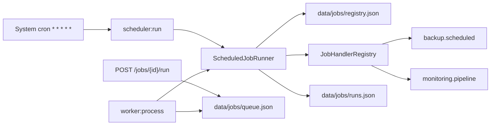

# Iteration 29 – Cron planner + Job Queue

**Release target:** 2.0.18  
**Status:** ✅ Implemented

## Goal

Unified flat-file job registry with CLI runner, optional manual queue, and admin UI **Plánovač** (`/scheduler`).

## Architecture



## Flat-file stores

| File | Purpose |
|------|---------|
| `data/jobs/registry.json` | Job definitions (cron, handler, enabled) |
| `data/jobs/runs.json` | Append-only run history |
| `data/jobs/queue.json` | Manual/forced runs (optional) |

**Seeded system jobs:** `backup-scheduled`, `monitoring-pipeline`

## Handlers

| Key | Delegates to |
|-----|----------------|
| `backup.scheduled` | `BackupInterface::runScheduledBackupIfDue()` |
| `monitoring.pipeline` | `MonitoringScheduler::runIfDue($forceReport)` |

## CLI

```bash
# Recommended unified cron (every minute)
* * * * * cd /path/to/paginiumcms && php backend/bin/console scheduler:run && php backend/bin/console worker:process
```

Legacy commands remain for backward compatibility:

- `backup:run-schedule`
- `monitoring:run-schedule`

## Admin API

| Method | Path | Description |
|--------|------|-------------|
| GET | `/api/admin/jobs` | Overview + handlers + recent runs |
| GET | `/api/admin/jobs/{id}` | Job detail + run history |
| POST | `/api/admin/jobs` | Create custom job |
| PUT | `/api/admin/jobs/{id}` | Update cron/enabled/name |
| DELETE | `/api/admin/jobs/{id}` | Delete non-system job |
| POST | `/api/admin/jobs/{id}/run` | Run now (`force_report` for monitoring) |
| POST | `/api/admin/jobs/run-due` | Simulate cron due check |
| POST | `/api/admin/jobs/queue/process` | Process manual queue |

## Settings

Group **`scheduler`** in SettingsSchema:

- `enabled` – master switch for `scheduler:run`
- `retainRuns` – cap for run history (50–500)

## Frontend

- Route: `/scheduler` (admin only in sidebar)
- Toggle jobs, edit CRON, run now, force monitoring report, simulate cron

## Also fixed

- `GET/POST /api/admin/backups/schedule` – wired for existing `backupApi.schedule()` / `getSchedule()` FE calls

## Tests

- `backend/tests/Core/Scheduler/Services/CronExpressionEvaluatorTest.php`
- `backend/tests/Core/Scheduler/Services/ScheduledJobRunnerTest.php`

## Out of scope (future)

- Trash auto-purge, content auto-publish handlers
- Redis queue backend → [It.45](ITERATION_45.md)
- Server metrics agent → [It.46](ITERATION_46.md) (was noted under It.7)
