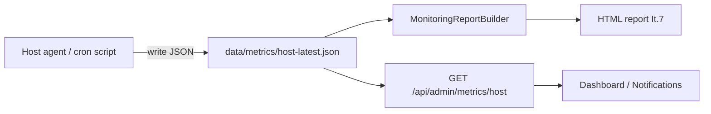

# Iteration 46 – Server metrics agent (host monitoring)

**Status:** ⏳ Planned  
**Version target:** TBD  
**Priority:** 🟡 — doplnok k It.7 monitoring reportom

## Kontext

[Iteration 7](ITERATION_7.md) reporty dnes pokrývajú **aplikáciu** (analytics, health checks, flat-file counts, log incidents).  
**Neobsahujú host metriky** z screenshotu server dashboardu: uptime, CPU, RAM, disk, Docker, load.

It.46 pridá **ľahký agent** na hostiteľovi, ktorý zberie OS metriky a CMS ich zobrazí v reporte + admin dashboarde.

## Architektúra



Agent **neběží v PHP requeste** — cron na hoste alebo sidecar kontajner (každých 1–5 min).

## Zber metrik (MVP)

| Metrika | Zdroj |
|---------|--------|
| Uptime | `/proc/uptime` |
| Load average | `/proc/loadavg` |
| CPU % | `/proc/stat` delta |
| RAM used/total | `/proc/meminfo` |
| Disk (`df -h`) | root + `storage/` mount |
| Docker containers | `docker ps --format json` (ak dostupné) |
| PHP-FPM / nginx | voliteľne cez existujúci HealthChecker |

**Fáza 2:** mail queue, SSH fail count, top processes (ako v pôvodnom mockupe It.7).

## Backend

| Komponent | Popis |
|-----------|--------|
| `Core/Monitoring/Services/HostMetricsStore.php` | Čítanie/zápis `data/metrics/host-latest.json` |
| `Core/Monitoring/Services/HostMetricsIngest.php` | Validácia payload z agenta (API key / HMAC) |
| `MonitoringReportBuilder` | Nová sekcia „Server“ v HTML/plain reporte |
| `GET /api/admin/metrics/host` | Posledný snapshot + timestamp |
| `POST /api/internal/metrics/ingest` | Príjem od agenta (IP allowlist + token) |

### Settings (`monitoring` group)

- `hostMetricsEnabled` — zapnúť sekciu v reporte
- `hostMetricsMaxAgeMinutes` — alert ak agent neposlal dáta (default 10)
- `hostMetricsIngestToken` — shared secret pre agent

## Agent (repozitár)

```
scripts/metrics-agent/
  collect.sh          # bash + jq, bez závislostí
  paginium-metrics-agent.php  # alternatíva v PHP CLI
```

Crontab príklad:

```bash
*/5 * * * * /path/to/paginiumcms/scripts/metrics-agent/collect.sh
```

## Frontend

- `/notifications` — karta „Host metriky“ (posledný ingest, stav agenta)
- Dashboard — mini widget CPU/RAM/disk (ak It.34 system overview)

## Bezpečnosť

- Ingest endpoint mimo verejného routingu alebo len z localhost / Docker network
- Token v `.env` / Settings, nie v git
- Agent neposiela secrets, len agregované čísla

## Testy

- PHPUnit: `HostMetricsStore`, report builder sekcia
- Fixture JSON pre HTML report snapshot

## Súvisiace

- [ITERATION_7.md](ITERATION_7.md) — scheduled reports (rozšírenie)
- [ITERATION_34.md](ITERATION_BACKLOG.md#iterácia-34--system-overview-php--fe-engine-) — system overview dashboard
- [ITERATION_45.md](ITERATION_45.md) — Redis (nezávislé)
