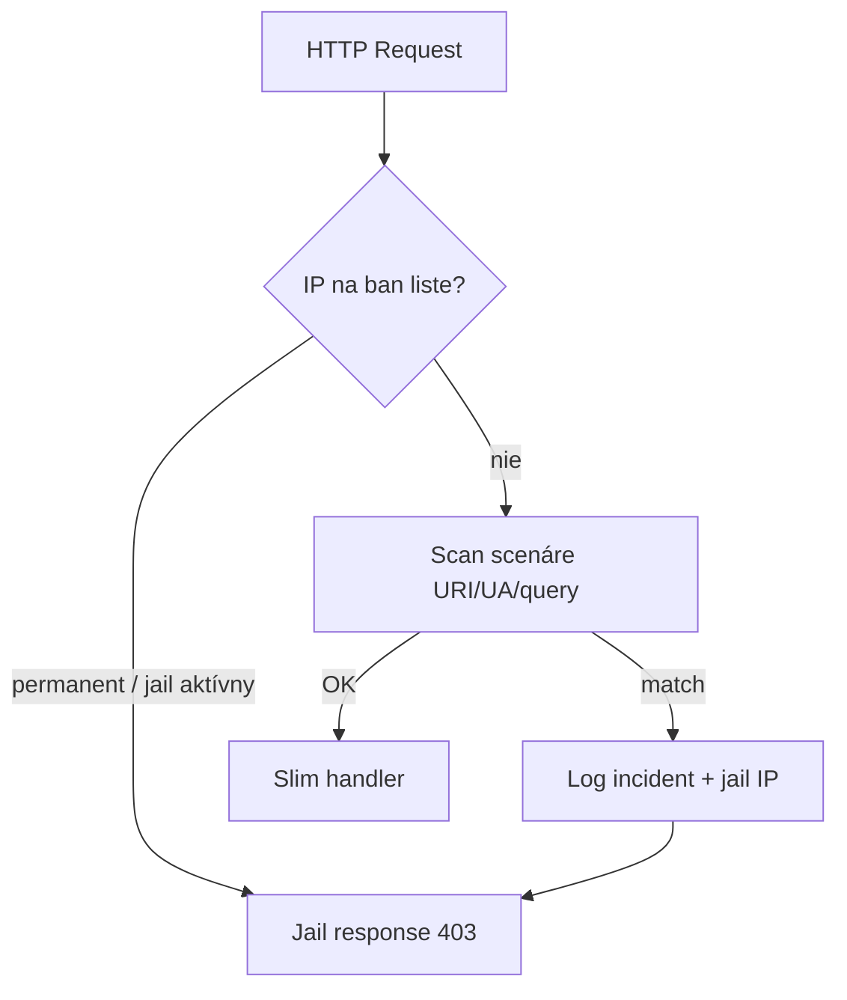

# Iteration 50 – In-App Micro Firewall (interný WAF)

**Status:** ✅ Complete  
**Version target:** 2.0.26  
**Priority:** 🔴 produkčná bezpečnosť (po It.20 Core hardening)

> Cieľ: ľahký WAF priamo v PHP — detekcia probe/SQLi/traversal, dočasný jail IP, eskalácia na trvalý ban, admin dashboard v Reacte.  
> **Nie** raw skript v `bootstrap.php` — rovnaký pattern ako `RateLimitMiddleware` + flat-file register (ako `LoginAttemptTracker`).

## Prečo áno (s fitom do PaginiumCMS)

| Už existuje | Čo WAF doplní |
|-------------|----------------|
| `RateLimitMiddleware` | globálny počet requestov/min — **nie** scenáre útokov |
| `LoginAttemptTracker` | lockout pri **login** — nie probe `wp-admin`, `.env` |
| `SecurityMiddleware` | CSP / HSTS hlavičky — **nie** blok IP |
| `FileValidator` | cesty pri zápise — **nie** URI scan botov |

WAF = vrstva **pred** Slim routingom: rýchly exit pre známe útočnícke IP a podozrivé URI.

## Architektúra (flat-file first)

### Vrstva 1 – Scenáre (OPcache)

Statický PHP súbor načítaný cez OPcache (žiadny I/O per request):

```
backend/config/firewall_scenarios.php   → return [ 'wp_probe' => [...], ... ]
```

Každý scenár: `id`, `label`, `targets` (`uri` | `user_agent` | `query`), `pattern` (regex), `severity`, `enabled`.

**Dôležité:** regex na `UNION|SELECT` **nesmie** bežať na tele článkov/markdownu — len na URI, query string a vybrané auth endpointy (`/api/auth/login`, …).

### Vrstva 2 – Register banov a incidentov (flat-file)

| Súbor | Obsah |
|-------|--------|
| `data/security/firewall/bans.json` | IP → `{ expires_at, permanent, score, reason, updated_at }` |
| `data/security/firewall/incidents.json` | ring buffer posledných N incidentov (audit) |

Zápis cez `flock(LOCK_EX)` — rovnaký princíp ako `settings.json`, `login_attempts.json`.

**SQLite:** voliteľná fáza 2 (`settings.firewall.storage = json|sqlite`) ak register narastie >10k záznamov. Default **json** (100 % kompatibilné s flat-file filozofiou).

### Vrstva 3 – Middleware (early exit)

```
bootstrap/app.php:
  FirewallMiddleware   ← pred RateLimitMiddleware
  RateLimitMiddleware
  SecurityMiddleware
  …
```

Tok requestu:



## Tri fázy obrany

### Fáza A – Detekcia

| Scenár | Príklad | Cieľ |
|--------|---------|------|
| `wp_probe` | `/wp-admin`, `/wp-login.php`, `/xmlrpc.php` | sken WordPressu |
| `env_probe` | `/.env`, `/config.php.bak` | únik secrets |
| `path_traversal` | `../`, `%2e%2e/` v URI | directory traversal |
| `sql_probe_uri` | `UNION SELECT` v **query/URI** | SQLi probe |
| `bad_bot_ua` | prázdna UA + hromada 404 | agresívny bot |

Konfigurovateľné cez Settings + dev override v `firewall_scenarios.php`.

### Fáza B – Jail (dočasný ban)

Pri porušení pravidla (alebo `max_retries`, default 3 v okne):

1. Zapíše incident do `incidents.json`
2. Nastaví `bans.json`: `expires_at = now + jail_minutes` (default 15, zo `settings.security`)
3. Ďalší request z IP → **okamžitý** 403 bez bootstrapu aplikácie

**Jail response mode** (`settings.firewall.jailMode`):

| Režim | Správanie |
|-------|-----------|
| `forbidden` | HTTP 403 + krátky text (default) |
| `empty` | HTTP 403 + prázdne telo |
| `tarpit` | `sleep(N)` pred 403 — **voliteľné**, default OFF (FPM worker!) |

### Fáza C – Permanentný lock

Pole `sin_score` na IP: každý expirovaný jail + nový incident zvyšuje skóre.  
Pri `sin_score >= permanent_threshold` (default 3) → `permanent: true`, `expires_at: null`.

Whitelist (`data/security/firewall/whitelist.json`) a admin **Unban** vždy prepíše automatiku.

## Backend – nové komponenty

| Cesta | Úloha |
|-------|--------|
| `Core/Security/Firewall/FirewallScenarioRegistry.php` | Načítanie scenárov + merge s Settings |
| `Core/Security/Firewall/FirewallScanner.php` | Match URI / UA / query |
| `Core/Security/Firewall/FirewallBanStore.php` | CRUD bans + flock |
| `Core/Security/Firewall/FirewallIncidentLogger.php` | Ring buffer incidentov |
| `Core/Security/Firewall/FirewallService.php` | Orchestrácia A→B→C |
| `Http/Middleware/FirewallMiddleware.php` | Early check + jail response |
| `Http/Controllers/Admin/FirewallController.php` | Admin API |
| `Http/Routes/firewall.php` | Auto-discovered routes |

### Admin API (návrh)

| Metóda | Endpoint | Popis |
|--------|----------|--------|
| GET | `/api/admin/firewall/incidents` | stránkovaný zoznam incidentov |
| GET | `/api/admin/firewall/bans` | aktívne + permanent bans |
| POST | `/api/admin/firewall/bans` | manuálny ban IP |
| DELETE | `/api/admin/firewall/bans/{ip}` | Unban |
| POST | `/api/admin/firewall/whitelist` | trvalá whitelist IP |
| GET | `/api/admin/firewall/stats` | počty jail/permanent/24h |

Role: **ADMIN+**, 2FA middleware ako ostatné admin moduly.

### Settings (`security` + nová skupina `firewall`)

| Kľúč | Default | Popis |
|------|---------|--------|
| `firewall.enabled` | `true` | master toggle |
| `firewall.jailMinutes` | `15` | dĺžka jail |
| `firewall.maxRetries` | `3` | incidenty pred jail |
| `firewall.permanentThreshold` | `3` | počet jailov → permanent |
| `firewall.jailMode` | `forbidden` | `forbidden` \| `empty` \| `tarpit` |
| `firewall.tarpitSeconds` | `0` | len ak `tarpit` |
| `firewall.logRetention` | `500` | max incidentov v súbore |

Verejný výrez: **len** `firewall.enabled` (bez IP/ban detailov).

## Frontend (React admin)

Nový modul **Bezpečnosť → Firewall** (`FirewallManager.tsx`):

- Tabuľka incidentov (IP, scenár, URI, čas, user-agent)
- Tabuľka banov + tlačidlá **Unban** / **Permanent ban**
- Formulár whitelist IP
- Prepínač **Firewall zapnutý** (sync s Settings)
- Badge v sidebari: počet aktívnych jailov (voliteľne cez `/api/admin/counts` → `firewall_jails`)

## Testy

| Súbor | Pokrytie |
|-------|----------|
| `FirewallScannerTest` | regex scenáre, false-positive guard |
| `FirewallBanStoreTest` | flock, expirácia, permanent eskalácia |
| `FirewallMiddlewareTest` | banned IP → 403, clean IP → pass |
| `FirewallControllerTest` | unban, admin-only |
| PHPUnit | `APP_ENV=testing` bypass (ako rate limit) |

## Riziká a mitigácia

| Riziko | Mitigácia |
|--------|-----------|
| False positive na legitímny obsah | scan **nie** na POST body editora (`/api/pages`, `/api/articles`, drafts, code-editor); len URI/auth/contact |
| Regex `SELECT` v URL článku | scenáre len na probe paths + query, nie `/api/pages/*` body |
| Tarpit blokuje FPM worker | default OFF; max 2 s ak zapnuté |
| Zdieľaná IP (NAT) | whitelist pre office IP; vyšší `maxRetries` |
| Proxy IP | reuse `trustedProxies` z `RateLimitMiddleware` |

## Odporúčané poradie implementácie

1. `FirewallBanStore` + `FirewallMiddleware` (permanent + jail check only)
2. `FirewallScanner` + scenáre + incident log
3. Admin API + Settings schema
4. React `FirewallManager`
5. (Voliteľne) SQLite backend, GeoIP country v incidente (reuse It.33)

## Súvisiace iterácie

- **It.20** – Core hardening (maintenance, RBAC) — WAF nadstavba
- **It.33** – GeoIP pre krajinu v incidente
- **It.34** – System overview widget „Firewall 24h“
- **It.49** – Redis shared ban store pri multi-worker (voliteľná náhrada json counters)

## Definition of Done

- [x] `FirewallMiddleware` v stacku, vypínateľný v Settings
- [x] Min. 5 built-in scenárov (wp, env, traversal, sql probe, bad UA)
- [x] Jail + permanent eskalácia s flat-file registerom
- [x] Admin API + React prehľad + Unban/Whitelist
- [x] PHPUnit + PHPStan L8
- [x] Dokumentácia `docs/user/FIREWALL.md`
