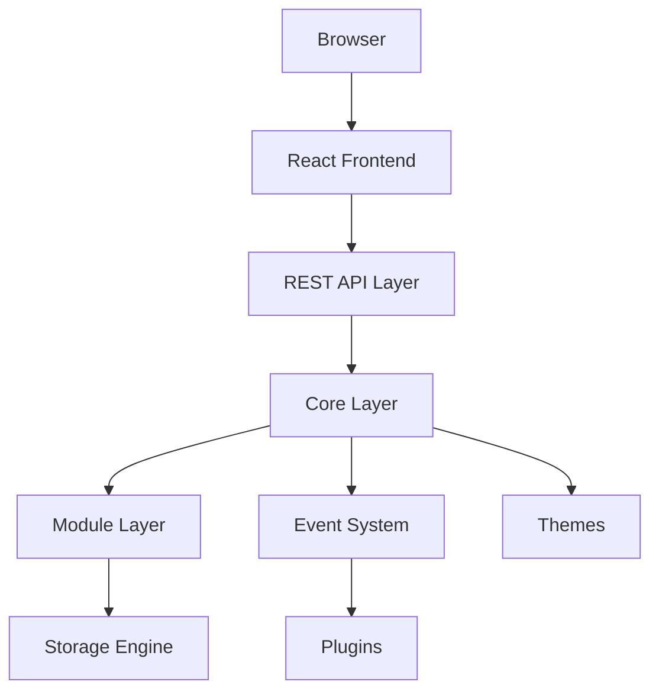

# 🏛️ PaginiumCMS

> **Version:** 2.0 (Draft)  
> **Last updated:** 13 July 2026  
> Modern, modular, Headless Flat-File Content Management System powered by Slim Framework (PHP) & React.

---

## 🎯 Vision & Philosophy

PaginiumCMS keeps the Core intentionally minimal, secure, and fast. It moves all standard features into standalone modules, putting developer experience and content ownership first.

* **Simplicity First:** Features must deliver high value without adding unnecessary complexity.
* **Flat-File First:** Content belongs to files (`.md`, `.json`). Databases are optional.
* **API First:** Every admin action is completely accessible via the REST API.
* **Security by Design:** Authentication, authorization, and validation are baked into the core.
* **Modular Design:** Core handles only infrastructure. Everything else is a Module, Plugin, or Theme.

---

## 📊 Current Project Status (July 2026)

| Area | Status | Notes |
|------|--------|-------|
| **Backend API** | ✅ Functional | Slim 4 + PHP-DI, `bootstrap/app.php` is the single source of truth |
| **Authentication** | ✅ Functional | Register, login, logout, 2FA (TOTP), password reset, CSRF |
| **Content API** | ✅ Functional | `/api/pages`, `/api/articles` via `ContentController` + versioning + cache |
| **Media API** | ✅ Functional | `/api/media/*` via `MediaController` + `MediaRepository` |
| **Admin tools** | ✅ Wired | Code editor (gated), versioning + live restore, audit, backups, Developer Mode API |
| **PHPUnit** | ✅ **317/317 passing** | 784 assertions, 18 skipped (integration placeholders) |
| **Frontend** | 🟡 Partial | React admin UI exists; some API bindings need alignment (step 3+) |
| **Production entry** | ✅ Fixed | `backend/public/index.php` loads real `bootstrap/app.php` |

### Tech stack

- **PHP** 8.4+ (tested on 8.5)
- **Backend:** Slim 4, PHP-DI, PSR-7/15, League CommonMark, OTPHP (2FA)
- **Frontend:** React, TypeScript, Vite, TailwindCSS
- **Storage:** Flat files under `backend/storage/app/content/`

---

## 🗺️ Architecture Overview



### System Layers
1. **Presentation Layer:** React, TypeScript, TailwindCSS (SPA Admin).
2. **API Layer:** Slim Framework (Routing, Auth, PSR-7, Response formatting).
3. **Core Layer:** Infrastructure only (DI Container, Cache, Events, Logging, FlatFile engine).
4. **Module Layer:** Encapsulated features (Security, Media, Audit, Content via HTTP controllers).
5. **Storage Layer:** Flat-file persistence (Markdown + JSON) under `storage/app/content/`.

---

## 🗂️ Project Directory Structure

```text
paginiumcms-architecture/
├── backend/
│   ├── app/
│   │   ├── Core/           # FlatFile, Cache, CodeEditor, Versioning, AuditTrail, Backup, …
│   │   ├── Http/           # Controllers, Middleware, Routes, Config/services.php (DI)
│   │   ├── Modules/        # Security, Media, Audit
│   │   └── Support/        # Lang helper
│   ├── bootstrap/          # app.php (main bootstrap), session.php, utf8.php
│   ├── lang/               # sk/en translation files for HTTP layer
│   ├── public/             # index.php → bootstrap/app.php
│   ├── storage/            # content, cache, logs, backups
│   └── tests/              # PHPUnit (317 tests)
├── frontend/               # React admin SPA
├── docs/                   # This documentation
├── vendor/                 # Composer dependencies (project root)
├── composer.json
└── phpunit.xml
```

---

## 🔌 API Overview (implemented)

| Group | Prefix | Auth |
|-------|--------|------|
| Auth | `/api/auth/*` | Mixed (login public, logout/me protected) |
| Content | `/api/pages`, `/api/articles` | GET public, write requires auth |
| Media | `/api/media/*` | Auth required |
| Admin backup | `/api/admin/backups/*` | Auth + ADMIN role |
| Code editor | `/api/admin/code-editor/*` | Auth + ADMIN + **unlocked Developer Mode** |
| Developer | `/api/admin/developer/*` | Auth + ADMIN (unlock via TOTP or offline token) |
| Versions | `/api/admin/versions/*` | Auth + ADMIN role |
| Audit | `/api/admin/audit/*` | Auth + ADMIN role |
| Health | `/api/health` | Public |

Routes in `backend/app/Http/Routes/*.php` are auto-discovered from `bootstrap/app.php`.

---

## 🔒 Security Principles

* **Session auth** with secure cookie settings (`bootstrap/session.php`)
* **Argon2id** password hashing via `PasswordPolicy`
* **RBAC:** `RoleMiddleware` on admin routes (ADMIN, SUPER_ADMIN)
* **2FA:** TOTP via `TwoFactorManager` + `spomky-labs/otphp`
* **CSRF:** Token endpoint + middleware validation
* **Rate limiting:** Global + login-specific (`RateLimitMiddleware`, `LoginRateLimitMiddleware`)
* **Path traversal defense:** `FileValidator` base path for all FlatFile I/O
* **Code editor allow/deny lists:** Blocks writes to `app/Core`, `bootstrap`, `vendor`

---

## 🚀 Getting Started

```bash
# Install dependencies (from project root)
composer install

# Run backend tests
./vendor/bin/phpunit --testdox

# Start PHP built-in server (example)
cd backend/public && php -S localhost:8080
```

Frontend (separate):

```bash
cd frontend && npm install && npm run dev
```

Default API URL in frontend: `http://localhost:8080` (see `frontend/src/api/client.ts`).

### Developer Mode unlock (admin)

```bash
# .env
DEVELOPER_MODE=true
DEV_UNLOCK_SECRET=long-random-secret   # GitHub Secret in CI

# Generate token offline (private repo / CI)
php backend/bin/dev-token.php generate --label=local --days=1
php backend/bin/dev-token-register.php pagdev_....

# Or unlock via API with admin TOTP (2FA required)
POST /api/admin/developer/unlock  { "totp_code": "123456" }
POST /api/admin/developer/unlock  { "token": "pagdev_...." }
```

---

## 📚 Documentation

* **Architecture deep dive + implementation status:** [`docs/architecture/ARCHITECTURE.md`](architecture/ARCHITECTURE.md)

---

## ⚠️ Known Limitations

* `backend/bootstrap/container.php` and `bootstrap/routes.php` are **legacy stubs** — not used by `public/index.php` anymore.
* `SimpleLogger` (`app/Infrastructure/Logging/`) has a recursive `log()` bug — file is not in active autoload path; prefer `Core/Logging`.
* GitHub sync tests skip real API calls; export/import degrade gracefully without network.
* Frontend step 3 (URL alignment, dead file cleanup) is still pending.

---

> **Documentation First:** When code and docs differ, update docs to reflect reality, then align code in the next change.
