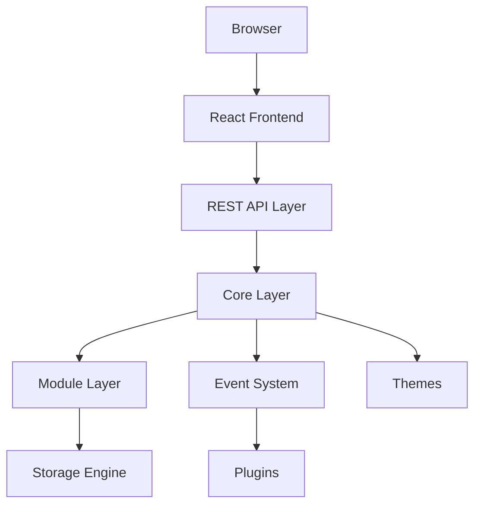

# 🏛️ PaginiumCMS

> **Version:** 2.0 (Draft)
> Modern, modular, Headless Flat-File Content Management System powered by Slim Framework (PHP) & React.

---

## 🎯 Vision & Philosophy

PaginiumCMS keeps the Core intentionally minimal, secure, and fast. It moves all standard features into standalone modules, putting developer experience and content ownership first.

* **Simplicity First:** Features must deliver high value without adding unnecessary complexity.
* **Flat-File First:** Content belongs to files (`.md`, `.json`). Databases are optional.
* **API First:** Every admin action is completely accessible via the REST API.
* **Security by Design:** Authentication, authorization, and validation are baked into the core.
* **Modular Design:** Core handles only infrastructure. Everything else is a Module, Plugin, or Theme.

---

## 🗺️ Architecture Overview



### System Layers
1. **Presentation Layer:** React, TypeScript, TailwindCSS (SPA Admin).
2. **API Layer:** Slim Framework (Routing, Auth, PSR-7, Response formatting).
3. **Core Layer:** Pure infrastructure only (DI Container, Cache, Events, Logging). No business logic.
4. **Module Layer:** Encapsulated features (Pages, Blog, Media, Users, Navigation).
5. **Storage Layer:** Flat-file persistence engine (Markdown + JSON) with future DB drivers support.

---

## 🗂️ Project Directory Structure

```text
PaginiumCMS/
├── backend/            # Slim Framework API (Controllers, Services, Repositories)
├── src/                # React Frontend (Feature-Driven Design Architecture)
├── content/            # Data Layer (Isolated .md pages, .json configs, and media)
├── storage/            # System cache, framework logs, and automated backups
├── docs/               # System documentation & blueprints portal
├── tests/              # Automated backend and frontend test suites
└── docker/             # Local development environment configuration
```

---

## 🔒 Security Principles

* **JWT & Session Auth:** Secure stateless or stateful API authentication.
* **RBAC:** Strict Role-Based Access Control verified at the API Middleware level.
* **Path Traversal Defense:** Strict input sanitization (`basename`) for all flat-file operations.
* **Data Isolation:** `content/` and `storage/` directories are completely hidden from public HTTP access.

---

## 🚀 Getting Started

Detailed documentation for installation, development, and extension creation is located in the `docs/` folder:

* **Architecture Deep Dive:** Check `docs/architecture/ARCHITECTURE.md`
* **Flat File Engine Specs:** Check `docs/architecture/STORAGE.md`
* **Developer Guidelines:** Check `docs/developer/DEVELOPMENT.md`

---

> **Documentation First:** Every architectural decision must be documented before implementation. If code and docs differ, update the docs first.
