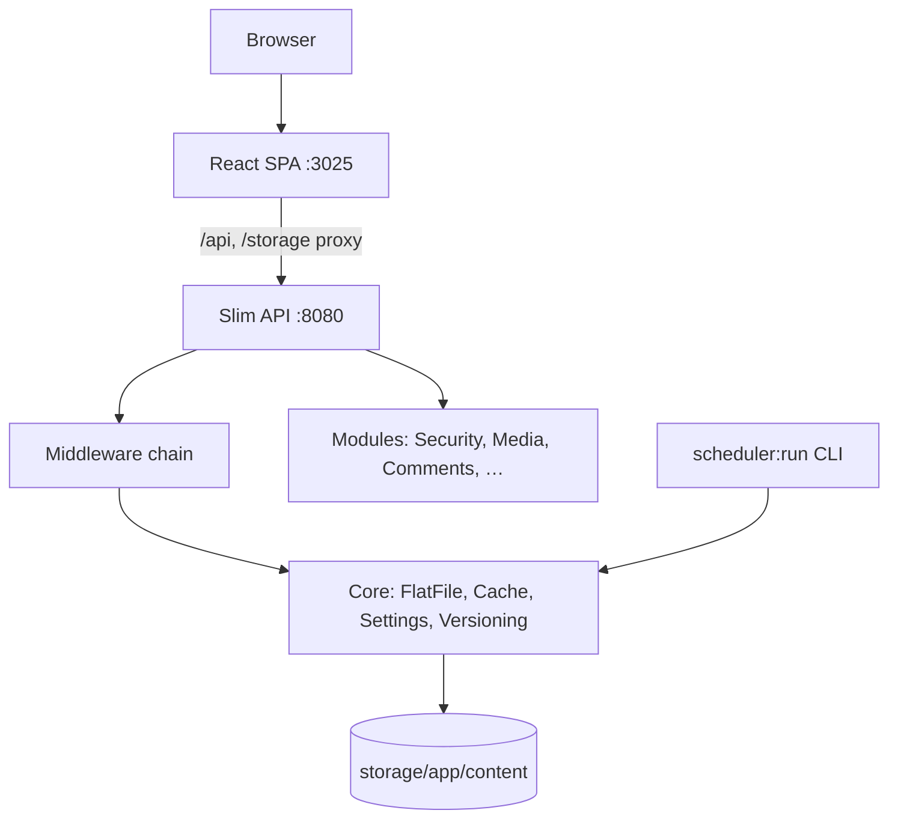

# 🏛️ PaginiumCMS

> **Version:** 2.1.0-beta.3 · **Last updated:** 24 July 2026  
> Modern, modular, Headless Flat-File Content Management System powered by Slim Framework (PHP) & React.

---

## 🎯 Vision & Philosophy

PaginiumCMS keeps the Core intentionally minimal, secure, and fast. It moves standard features into standalone modules, putting developer experience and content ownership first.

**Why it exists:** a small key into the world of full-stack web development — learn by reading and running real code, not by buying a black box. **Full open source, no fees, never sold as a paid product.** → [PHILOSOPHY.md](PHILOSOPHY.md) (canonical, SK)

* **Open & Free Forever:** 100 % open source; must not be offered as a paid solution or paywalled “Pro” edition.
* **Simplicity First:** Features must deliver high value without adding unnecessary complexity.
* **Flat-File First:** Content belongs to files (`.md`, `.json`). Databases are optional.
* **API First:** Every admin action is accessible via the REST API.
* **Security by Design:** Authentication, authorization, and validation are baked into the core.
* **Modular Design:** Core handles infrastructure. Features live in Modules + HTTP layer.
* **Demo = showcase only:** `demo.paginiumcms.com` is a test-drive (predvádzacie vozidlo), not part of the customer bundle — see [ITERATION_13.md](ITERATION_13.md).

---

## 📊 Current Project Status (July 2026)

| Area | Status | Notes |
|------|--------|-------|
| **Backend API** | ✅ Production-ready core | Slim 4 + PHP-DI, `bootstrap/app.php`, auto-discovery routes |
| **Authentication** | ✅ Functional | Register (toggle), login, logout, 2FA, password reset, CSRF, session regeneration |
| **Authorization (RBAC)** | ✅ It. 20 | `PermissionMiddleware` on content/media writes; `RoleMiddleware` on admin |
| **Content API** | ✅ It. 19–20 | Index, pagination, search, published filter, versioning |
| **Media API** | ✅ Functional | `/api/media/*` + public `GET /storage/...` |
| **Job scheduler** | ✅ It. 29 | Flat-file registry, `scheduler:run`, admin `/scheduler` |
| **Monitoring** | ✅ It. 7 | Scheduled reports, log incidents, HTML email, cron CLI |
| **API contract** | ✅ It. 21 | JsonResponder everywhere, MSW, Newman CI, RHF+Zod |
| **PHPUnit** | ✅ **838+ passing** (15 skipped) | PHPStan level 8 (0 errors) |
| **Frontend** | ✅ 2.0.51+ | i18n, branding, settings ACL panel |
| **Next focus** | ⏳ **It.44c** | Media/comments URL sync; backend filter facets |

### Planned (roadmap)

| It. | Feature |
|-----|---------|
| **44** | **Filters & sorting (admin + FE)** — blog pagination, prev/next, URL sync |
| **45** | **Redis (optional)** — shared cache/queue when scaling to multiple PHP workers |
| **46** | **Server metrics agent** — CPU/RAM/disk/Docker for monitoring reports (extends It.7) |

Recently shipped: **2.0.52** — [BRANDING.md](user/BRANDING.md), [ACCESS_CONTROL.md](user/ACCESS_CONTROL.md) · **2.0.51** — timezone, logy bulk · **It.43** — [ITERATION_43.md](ITERATION_43.md)

**It.10 (RSS/sitemap):** ✅ [ITERATION_10.md](ITERATION_10.md) — feeds, sitemap, robots.txt, cache, Postman smoke.

Full backlog: [ITERATION_BACKLOG.md](ITERATION_BACKLOG.md) · Main map: [ROADMAP.md](ROADMAP.md)

### Recent releases

| Version | Focus |
|---------|--------|
| **2.0.26** | It.50 — WAF, structured logging, admin Logy |
| **2.0.19** | Admin user management UI — username, account status, 2FA secret, system enforcement |
| **2.0.18** | It.29 — cron planner, job queue, `/scheduler`, unified CLI |
| **2.0.17** | It.7 — scheduled monitoring reports, HTML email, log incidents |
| **2.0.16** | It.28 — bulk actions platform |
| **2.0.15** | It.27 — admin view modes + SEO panel |
| **2.0.1** | It.6 — SMTP, notification connectors, analytics, auth UI |

### Tech stack

- **PHP** 8.5+ (strict types, PHPStan L8)
- **Backend:** Slim 4, PHP-DI, PSR-7/15, League CommonMark, OTPHP (2FA)
- **Frontend:** React, TypeScript, Vite 8, TailwindCSS
- **Storage:** Flat files under `backend/storage/app/content/`
- **Index:** `data/index/content.json` (flock-safe rebuild)

---

## 🗺️ Architecture Overview



### System layers

1. **Presentation:** React admin + public site (`frontend/src/`)
2. **API:** Slim routes in `backend/app/Http/Routes/*.php` (auto-discovered)
3. **Core:** FlatFile engine, cache, settings schema, backup, audit, job scheduler
4. **Modules:** Security (auth/RBAC), Media, Comments, Navigation, …
5. **Storage:** Markdown/JSON content, media, trash, settings, users

---

## 🗂️ Project Directory Structure

```text
paginiumcms-architecture/
├── backend/
│   ├── app/
│   │   ├── Core/           # FlatFile, Cache, Backup, Scheduler, Settings, …
│   │   ├── Http/           # Controllers, Middleware, Routes, Config/services.php
│   │   ├── Modules/        # Security, Media, Comments, Audit, …
│   │   └── Support/        # Lang, JsonHelper
│   ├── bootstrap/          # app.php (single bootstrap entry)
│   ├── bin/console         # audit:run, scheduler:run, worker:process, …
│   ├── lang/               # sk/en translations
│   ├── public/             # index.php → bootstrap/app.php
│   ├── storage/            # content, cache, logs, backups
│   └── tests/              # PHPUnit suite
├── frontend/               # React admin + public site
├── docs/                   # Architecture, roadmap, deploy guides
├── vendor/                 # Composer (project root)
├── composer.json
└── phpunit.xml
```

---

## 🔌 API Overview

| Group | Prefix | Access |
|-------|--------|--------|
| Auth | `/api/auth/*` | Mixed; register can be disabled via settings |
| Content | `/api/pages`, `/api/articles` | GET public (published filter); write = auth + permission |
| Search | `/api/search?q=&scope=admin\|public&types=` | Public published; admin palette (It.43 — [Unreleased](CHANGELOG.md#unreleased)) |
| SEO meta | `/api/seo/{type}/{slug}` | Public head tags (It.23 — [2.0.11](CHANGELOG.md#2011--2026-07-17)) |
| Media | `/api/media/*` | EDITOR+ role; FE `MediaManager` (It.8) + DAM folders (It.24) |
| Feeds | `/feed.xml`, `/sitemap.xml`, `/robots.txt` | Public RSS + sitemap + crawler rules (It.10) |
| Jobs | `/api/admin/jobs/*` | ADMIN — cron registry, run history |
| Static files | `/storage/{path}` | Public (path traversal blocked) |
| Settings | `/api/settings/public`, `/api/admin/settings/*` | Public slice / ADMIN |
| Trash | `/api/admin/trash/*` | EDITOR+ — list & restore soft-deleted content |
| Admin | `/api/admin/*` | Auth + role (+ 2FA where configured) |
| Health | `/api/health` | Public (allowed during maintenance) |

Routes in `backend/app/Http/Routes/*.php` are auto-loaded from `bootstrap/app.php`.

**Detailed contracts:**

- [Content API – pagination & search](architecture/CONTENT_API.md)
- [Core hardening – RBAC, maintenance, trash](architecture/CORE_HARDENING.md)

---

## 🔒 Security Principles

* **Session auth** with `session_regenerate_id()` on login (`SessionManager`)
* **Argon2id** passwords via `PasswordPolicy` + **password confirm** on register/admin users (2.0.56)
* **RBAC:** `RoleMiddleware` + `PermissionMiddleware` (`content:*`, `media:*`)
* **CSRF** synchronizer token on mutating API calls (`CsrfMiddleware` + FE `X-CSRF-TOKEN`)
* **Encryption at-rest** for TOTP seeds and settings secrets (`APP_KEY` + `EncryptionService`)
* **WAF** + structured logging + admin audit export (CSV sanitized — beta.2)
* **SSRF guard** on admin-configured outbound URLs (`OutboundUrlGuard`)
* **Path ACL** + storage allow-list for public media only
* **Plugin policy** + Zip-Slip checks on extension import
* **2FA:** TOTP via `TwoFactorManager`
* **Rate limiting:** global + login + OTP-specific
* **Maintenance mode:** blocks public API; staff session exempt
* **Registration toggle:** `general.allowRegistration`
* **Guest comments toggle:** `comments.allowGuestComments`

**External review:** [SECURITY_REVIEW.md](SECURITY_REVIEW.md) · [developer/SECURITY.md](developer/SECURITY.md) · [SECURITY.md](../SECURITY.md)

---

## 🚀 Getting Started

**Recommended (Docker + first admin):**

```bash
git clone <repo> paginiumcms && cd paginiumcms
chmod +x scripts/first-run.sh
./scripts/first-run.sh
docker compose up -d
curl -s http://localhost:8080/api/health
```

Default admin: `admin@localhost` / `Admin123!ChangeMe` (override with `FIRST_ADMIN_*` env — see [LOCAL_SETUP.md](developer/LOCAL_SETUP.md)).

**Classic two-terminal dev** (after `first-run`):

```bash
composer install
./vendor/bin/phpunit --testdox
./vendor/bin/phpstan analyse backend --level=8

# Backend
cd backend/public && php -S localhost:8080

# Frontend (separate terminal)
cd frontend && npm install && npm run dev
# → http://localhost:3025 (proxies /api and /storage to :8080)
```

See [developer/LOCAL_SETUP.md](developer/LOCAL_SETUP.md) for Docker profiles, env vars, and troubleshooting — or [deploy/DEV.md](deploy/DEV.md) for native-only flow.

### Cron (production)

```bash
# Unified scheduler — every minute
* * * * * cd /path/to/paginiumcms && php backend/bin/console scheduler:run && php backend/bin/console worker:process
```

Legacy: `backup:run-schedule`, `monitoring:run-schedule` (still supported).  
See [ITERATION_29.md](ITERATION_29.md) and [deploy/DEV.md](deploy/DEV.md).

### Developer Mode unlock (admin)

```bash
POST /api/admin/developer/unlock  { "totp_code": "123456" }
GET  /api/admin/developer/logs    # requires unlocked dev mode
```

See [user/DEVELOPER_MODE.md](user/DEVELOPER_MODE.md) and [user/CODE_EDITOR.md](user/CODE_EDITOR.md).

---

## 📚 Documentation Index

| Document | Purpose |
|----------|---------|
| **[PHILOSOPHY.md](PHILOSOPHY.md)** | **Prečo projekt existuje — open source, bez poplatkov, smerovanie** |
| [ROADMAP.md](ROADMAP.md) | Iterations 1–29+, priorities, implementation phases |
| [ITERATION_BACKLOG.md](ITERATION_BACKLOG.md) | It.30+ backlog (search, filters, OTP, …) |
| [CHANGELOG.md](../CHANGELOG.md) | Release notes |
| [architecture/ARCHITECTURE.md](architecture/ARCHITECTURE.md) | Deep architecture spec |
| [architecture/API_CONTRACT.md](architecture/API_CONTRACT.md) | JSON response envelopes (200/422/409/meta) |
| [architecture/CONTENT_API.md](architecture/CONTENT_API.md) | Pagination, search, published rules |
| [architecture/CORE_HARDENING.md](architecture/CORE_HARDENING.md) | RBAC, maintenance, trash, storage |
| [architecture/STORAGE.md](architecture/STORAGE.md) | Flat-file layout |
| [developer/TESTING.md](developer/TESTING.md) | PHPUnit, PHPStan, test layout |
| [developer/DEVELOPMENT.md](developer/DEVELOPMENT.md) | Contributor workflow |
| [developer/LOCAL_SETUP.md](developer/LOCAL_SETUP.md) | Docker Compose, first-run, native dev |
| [developer/BETA_INFRA.md](developer/BETA_INFRA.md) | Wave 6 — beta gate, cron, security baseline |
| [deploy/CRON.md](deploy/CRON.md) | Production scheduler + worker crontab |
| [deploy/DEV.md](deploy/DEV.md) | Local dev stack (Vite + PHP built-in server) |
| [deploy/NGINX_API.md](deploy/NGINX_API.md) | Production nginx |
| **[user/README.md](user/README.md)** | **Príručka používateľa — od inštalácie po admin (SK)** |
| **[PUBLIC_BETA1.md](PUBLIC_BETA1.md)** | **Public Beta 1 — scope, limitácie, feedback** |
| **[SECURITY_REVIEW.md](SECURITY_REVIEW.md)** | **External security review guide (beta testers / auditors)** |
| [developer/SECURITY.md](developer/SECURITY.md) | Security architecture reference |
| [SECURITY.md](../SECURITY.md) | Vulnerability reporting policy (GitHub) |
| [user/BETA_TESTER.md](user/BETA_TESTER.md) | Beta tester smoke checklist |
| [user/INSTALLATION.md](user/INSTALLATION.md) | Inštalácia + beta balík |
| [user/FIRST_STEPS.md](user/FIRST_STEPS.md) | Prihlásenie, 2FA, prvý obsah |
| [user/ADMIN_GUIDE.md](user/ADMIN_GUIDE.md) | Kompletná administrácia CMS |
| [user/BRANDING.md](user/BRANDING.md) | Logo a favicon |
| [user/ACCESS_CONTROL.md](user/ACCESS_CONTROL.md) | Oprávnenia rolí a Path ACL |
| [user/CODE_EDITOR.md](user/CODE_EDITOR.md) | Code Editor — unlock, lock, bezpečnosť, povolené adresáre |
| [user/CONTENT_EDITOR.md](user/CONTENT_EDITOR.md) | Editor podstránok/článkov — SEO, náhľad z médií, blog |
| [user/DEVELOPER_MODE.md](user/DEVELOPER_MODE.md) | Developer Mode gate, dev tokeny CLI |

### Iteration docs (`docs/ITERATION_*.md`)

| It. | Document | Status |
|-----|----------|--------|
| 1 | [ITERATION_1.md](ITERATION_1.md) | ✅ Locking |
| 2 | [ITERATION_2.md](ITERATION_2.md) | ✅ Drafts & versioning |
| 3 | [ITERATION_3.md](ITERATION_3.md) | ✅ Conflict resolution |
| 4 | [ITERATION_4.md](ITERATION_4.md) | ✅ Settings & validation |
| 5 | [ITERATION_5.md](ITERATION_5.md) | ✅ Users & auth |
| 6 | [ITERATION_6.md](ITERATION_6.md) | ✅ Notifications & analytics |
| 7 | [ITERATION_7.md](ITERATION_7.md) | ✅ Monitoring reports & log incidents |
| **8** | **[ITERATION_8.md](ITERATION_8.md)** | ✅ **Media manager FE** (upload, picker, WYSIWYG, 2.0.4) |
| 9 | [ITERATION_9.md](ITERATION_9.md) | ✅ Prototype port (nav, comments, contact) |
| 10 | [ITERATION_10.md](ITERATION_10.md) | ✅ **RSS/sitemap/robots** + cache |
| 11 | [ITERATION_11.md](ITERATION_11.md) | ✅ **SSO + ACL + security audit** (2.0.27) |
| 12 | [ITERATION_12.md](ITERATION_12.md) | ✅ **Blueprint engine** (Unreleased) |
| 13 | [ITERATION_13.md](ITERATION_13.md) | 🟡 **Demo sandbox** (iba demo.paginiumcms.com, nie zákaznícky balík) |
| 19–22 | [ITERATION_19.md](ITERATION_19.md) … [ITERATION_22.md](ITERATION_22.md) | ✅ Index, hardening, contract, ops + feeds ship |
| **23** | **[ITERATION_23.md](ITERATION_23.md)** | ✅ **SEO meta engine** (public `<head>` tags, 2.0.11) |
| 27 | [ITERATION_27.md](ITERATION_27.md) | ✅ Admin view modes + SEO panel |
| 28 | [ITERATION_28.md](ITERATION_28.md) | ✅ Bulk actions |
| 29 | [ITERATION_29.md](ITERATION_29.md) | ✅ Cron planner + job queue |
| **62** | **[ITERATION_62.md](ITERATION_62.md)** | ✅ **Scheduler prod hardening** (Docker, outcome UX, beta.9) |
| **43** | **[ITERATION_43.md](ITERATION_43.md)** | ✅ **Advanced search** (Unreleased) |
| 41–42, 47 | [ITERATION_41.md](ITERATION_41.md) … [ITERATION_47.md](ITERATION_47.md) | ✅ OTP / counts / connector auth (Unreleased) |
| 44–49 | [ITERATION_BACKLOG.md](ITERATION_BACKLOG.md) | ⏳ Filters, Redis, metrics, static web |

---

## ⚠️ Known Limitations

* **List filters/sort** — partial via API pagination; full admin + FE filter bar planned in It.44
* **Backup create tests** skipped under vfsStream (ZipArchive); schedule/cron logic tested on real temp dirs

---

> **Documentation First:** When code and docs differ, update docs to reflect reality, then align code in the next change.
