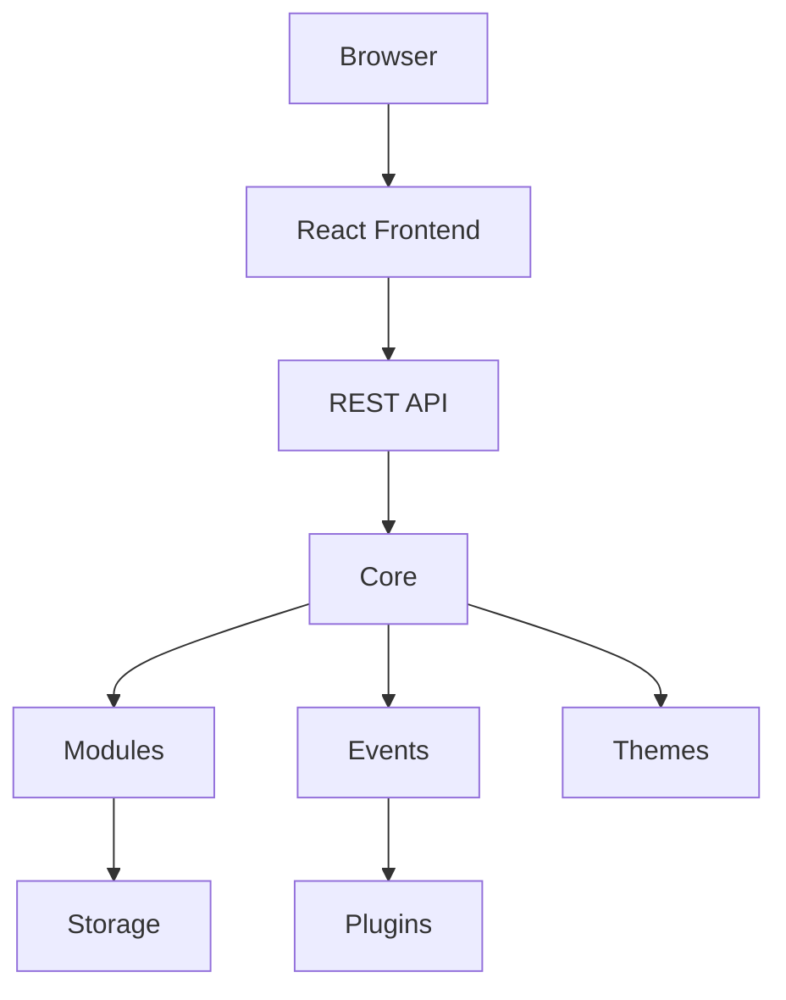

# 🏛️ PaginiumCMS Architecture

> **Version:** 2.0 (Draft)
>
> This document describes the target architecture of PaginiumCMS. It is the primary technical specification for developers and contributors.

---

# Introduction

PaginiumCMS is a modern, modular, Flat File Content Management System focused on simplicity, performance and extensibility.

Unlike traditional CMS platforms, PaginiumCMS keeps the Core intentionally small while providing powerful extension points through modules, themes and plugins.

The architecture described in this document represents the **target architecture** of PaginiumCMS and may differ from the current implementation.

---

# Vision

Our goal is not to build another CMS.

Our goal is to build a platform that allows users to create modern websites while keeping administration intuitive and developer experience enjoyable.

---

# Philosophy

PaginiumCMS follows several fundamental principles.

## Simplicity First

Every feature should simplify website creation.

If a feature increases complexity without delivering significant value, it should not become part of Core.

---

## Flat File First

Content belongs to files.

Databases are optional.

Users own their content.

---

## API First

Every action available in the administration interface should be available through the REST API.

---

## Security by Design

Security is never considered an optional feature.

Authentication, authorization and validation are integrated into the Core architecture.

---

## Modular Design

Everything that is not essential belongs into a Module.

Core should remain as small as possible.

---

## Community Driven

The architecture is designed to allow third-party developers to build modules, themes and plugins without modifying Core.

---

# Architecture Overview



---

# System Layers

PaginiumCMS consists of five logical layers.

## Presentation Layer

Responsible for user interaction.

Technologies

- React
- TypeScript
- TailwindCSS

---

## API Layer

Provides communication between frontend and backend.

Responsibilities

- Authentication
- Validation
- Authorization
- Routing
- Response Formatting

---

## Core Layer

Core contains only infrastructure.

Core is intentionally minimal.

Responsibilities include

- Router
- Authentication
- Authorization
- Configuration
- Events
- Cache
- Storage abstraction
- Dependency Injection
- Logging

Core MUST NOT contain

- Blog
- Pages
- Comments
- Search
- Media
- Themes
- Plugins

---

## Module Layer

Business logic belongs to modules.

Examples

- Pages
- Blog
- Comments
- Users
- Navigation
- Media
- Analytics
- Contact Forms
- Search

Modules communicate with Core through public interfaces only.

---

## Storage Layer

Storage is responsible for persistence.

Supported storage engines

- Flat Files
- JSON
- Markdown
- Media Files

Future

- SQLite
- PostgreSQL
- MySQL

---

# Directory Structure

Target project structure

```text
PaginiumCMS/

backend/
src/
docs/
storage/
plugins/
themes/
tests/
docker/
scripts/
```

---

# Backend Architecture

```text
backend/

bootstrap/

config/

core/

controllers/

middleware/

repositories/

services/

events/

listeners/

modules/

routes/

storage/

plugins/

themes/
```

---

# Frontend Architecture

```text
src/

app/

features/

layouts/

pages/

shared/

hooks/

services/

types/

assets/
```

---

# Module Architecture

Every module should be completely isolated.

Example

```text
Blog/

Controllers/

Services/

Repositories/

Models/

Routes/

Assets/

README.md
```

Each module owns

- API
- Business Logic
- Assets
- Configuration

---

# Plugin Architecture

Plugins extend existing functionality.

Plugins never modify Core.

Typical responsibilities

- Event listeners

- Custom widgets

- Integrations

- External APIs

---

# Theme Architecture

Themes control presentation only.

Themes never contain business logic.

Responsibilities

- Templates

- Layouts

- Assets

- Theme configuration

---

# Event System

Every important action generates an Event.

Examples

- UserRegistered

- UserLoggedIn

- ArticlePublished

- CommentAdded

- CommentApproved

- MediaUploaded

Plugins subscribe to events.

---

# Developer Workspace

Developer Mode provides

- Source editor

- API editor

- Module editor

- Theme editor

- Plugin editor

- File comparison

- Rollback

- Version history

Developer Mode never edits Core directly.

---

# Versioning

Every important object supports version history.

Supported

- Pages

- Articles

- Themes

- Plugins

- Navigation

- Configuration

Rollback is always available.

---

# Security

Security principles

- JWT Authentication

- Role Based Access Control

- CSRF Protection

- Input Validation

- Rate Limiting

- Secure File Upload

- Password Hashing

- Audit Logging

---

# Documentation First

Every architectural decision must be documented before implementation.

Documentation is considered part of the source code.

---

# Long Term Goals

- Stable Core

- Public REST API

- Plugin SDK

- Theme SDK

- Developer Workspace

- Package Repository

- Documentation Portal

- Community Contributions

---

# Non Goals

PaginiumCMS does not aim to become

- WordPress clone

- Enterprise CMS

- Low-code builder

- Database dependent platform

---

# Conclusion

Architecture is the foundation of the project.

Every future implementation should follow the principles described in this document.

If implementation and documentation differ, the documentation should be updated before introducing architectural changes.

---

> Last updated:
>
> Architecture Version 2.0 Draft
