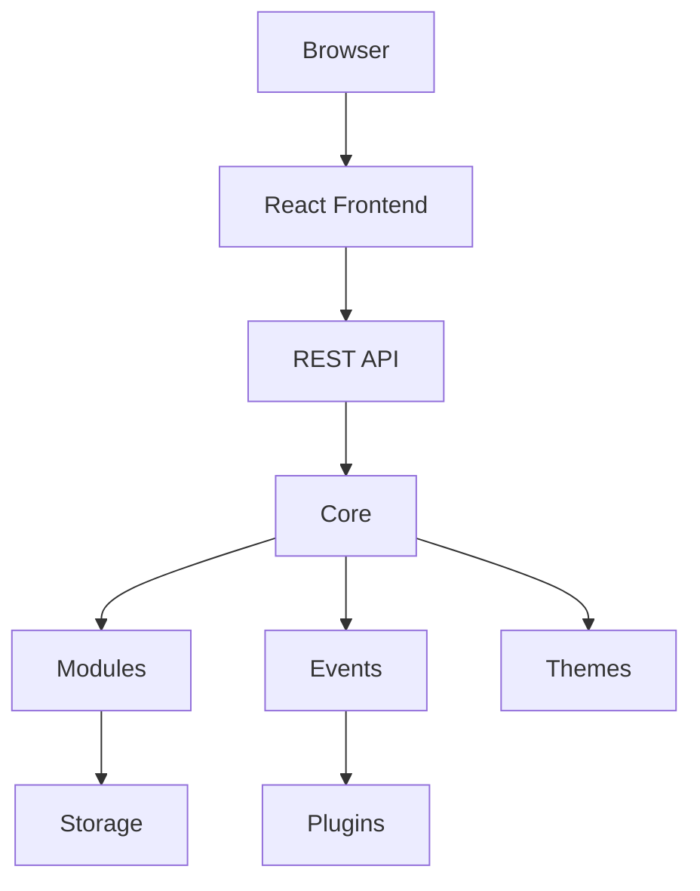

# 🏛️ PaginiumCMS Architecture

> **Version:** 2.0 (Draft)
>
> This document describes the target architecture of PaginiumCMS. It is the primary technical specification for developers and contributors.

---

# Introduction

PaginiumCMS is a modern, modular, Flat File Content Management System focused on simplicity, performance and extensibility.

Unlike traditional CMS platforms, PaginiumCMS keeps the Core intentionally small while providing powerful extension points through modules, themes and plugins.

The architecture described in this document represents the **target architecture** of PaginiumCMS and may differ from the current implementation.

---

# Vision

Our goal is not to build another CMS.

Our goal is to build a platform that allows users to create modern websites while keeping administration intuitive and developer experience enjoyable.

---

# Philosophy

PaginiumCMS follows several fundamental principles.

## Simplicity First

Every feature should simplify website creation.

If a feature increases complexity without delivering significant value, it should not become part of Core.

---

## Flat File First

Content belongs to files.

Databases are optional.

Users own their content.

---

## API First

Every action available in the administration interface should be available through the REST API.

---

## Security by Design

Security is never considered an optional feature.

Authentication, authorization and validation are integrated into the Core architecture.

---

## Modular Design

Everything that is not essential belongs into a Module.

Core should remain as small as possible.

---

## Community Driven

The architecture is designed to allow third-party developers to build modules, themes and plugins without modifying Core.

---

# Architecture Overview



---

# System Layers

PaginiumCMS consists of five logical layers.

## Presentation Layer

Responsible for user interaction.

Technologies

- React
- TypeScript
- TailwindCSS

---

## API Layer

Provides communication between frontend and backend.

Responsibilities

- Authentication
- Validation
- Authorization
- Routing
- Response Formatting

---

## Core Layer

Core contains only infrastructure.

Core is intentionally minimal.

Responsibilities include

- Router
- Authentication
- Authorization
- Configuration
- Events
- Cache
- Storage abstraction
- Dependency Injection
- Logging

Core MUST NOT contain

- Blog
- Pages
- Comments
- Search
- Media
- Themes
- Plugins

---

## Module Layer

Business logic belongs to modules.

Examples

- Pages
- Blog
- Comments
- Users
- Navigation
- Media
- Analytics
- Contact Forms
- Search

Modules communicate with Core through public interfaces only.

---

## Storage Layer

Storage is responsible for persistence.

Supported storage engines

- Flat Files
- JSON
- Markdown
- Media Files

Future

- SQLite
- PostgreSQL
- MySQL

---

# Directory Structure

Target project structure

```text
PaginiumCMS/

backend/
src/
docs/
storage/
plugins/
themes/
tests/
docker/
scripts/
```

---

# Backend Architecture

```text
backend/

bootstrap/

config/

core/

controllers/

middleware/

repositories/

services/

events/

listeners/

modules/

routes/

storage/

plugins/

themes/
```

---

# Frontend Architecture

```text
src/

app/

features/

layouts/

pages/

shared/

hooks/

services/

types/

assets/
```

---

# Module Architecture

Every module should be completely isolated.

Example

```text
Blog/

Controllers/

Services/

Repositories/

Models/

Routes/

Assets/

README.md
```

Each module owns

- API
- Business Logic
- Assets
- Configuration

---

# Plugin Architecture

Plugins extend existing functionality.

Plugins never modify Core.

Typical responsibilities

- Event listeners

- Custom widgets

- Integrations

- External APIs

---

# Theme Architecture

Themes control presentation only.

Themes never contain business logic.

Responsibilities

- Templates

- Layouts

- Assets

- Theme configuration

---

# Event System

Every important action generates an Event.

Examples

- UserRegistered

- UserLoggedIn

- ArticlePublished

- CommentAdded

- CommentApproved

- MediaUploaded

Plugins subscribe to events.

---

# Developer Workspace

Developer Mode provides

- Source editor

- API editor

- Module editor

- Theme editor

- Plugin editor

- File comparison

- Rollback

- Version history

**Gate (July 2026):** Developer Mode is **locked by default** even when `DEVELOPER_MODE=true` or `APP_DEBUG=true`. Unlock requires:

1. **TOTP** — admin with 2FA enabled (`POST /api/admin/developer/unlock` with `totp_code`)
2. **Offline token** — HMAC token generated outside CMS (`pagdev_…`), hash registered in `storage/dev/registered_tokens.json` (gitignored)

Runtime metrics and extended logging (`DeveloperLogger` → `storage/logs/developer/`) run **only while unlocked** (session TTL 8h). Code editor routes use `GatedCodeEditorController`.

CLI (private repo / CI, not on production server):

```bash
export DEV_UNLOCK_SECRET="…"   # GitHub Secret
php backend/bin/dev-token.php generate --label=ci --days=7
php backend/bin/dev-token-register.php pagdev_….
```

Developer Mode never edits Core directly.

---

# Versioning

Every important object supports version history.

Supported

- Pages

- Articles

- Themes

- Plugins

- Navigation

- Configuration

Rollback is always available.

**Content API integration (July 2026):** `ContentVersioningService` records a version on every create/update/status/delete via `ContentController`. Restore (`POST /api/admin/versions/restore`) writes the selected snapshot back to live flat-file content via `VersionController` and invalidates content cache.

---

# Security

Security principles

- JWT Authentication

- Role Based Access Control

- CSRF Protection

- Input Validation

- Rate Limiting

- Secure File Upload

- Password Hashing

- Audit Logging

---

# Documentation First

Every architectural decision must be documented before implementation.

Documentation is considered part of the source code.

---

# Long Term Goals

- Stable Core

- Public REST API

- Plugin SDK

- Theme SDK

- Developer Workspace

- Package Repository

- Documentation Portal

- Community Contributions

---

# Non Goals

PaginiumCMS does not aim to become

- WordPress clone

- Enterprise CMS

- Low-code builder

- Database dependent platform

---

# Conclusion

Architecture is the foundation of the project.

Every future implementation should follow the principles described in this document.

If implementation and documentation differ, the documentation should be updated before introducing architectural changes.

---

# Current Implementation Status

> **Snapshot date:** 13 July 2026  
> This section describes **what is actually implemented today**, as opposed to the target architecture above.

---

## Summary

The backend is **functional and test-stable**. All **317 PHPUnit tests pass** (784 assertions). The HTTP entry point loads the real application stack via `backend/bootstrap/app.php`.

The frontend admin UI exists but is not fully integrated with every backend endpoint.

---

## Backend Bootstrap Flow

```text
backend/public/index.php
    └── vendor/autoload.php
    └── bootstrap/app.php
            ├── DI Container (Core + Security + Http/Config/services.php)
            ├── Global middleware (CORS, Security, RateLimit)
            ├── Auth routes (inline in app.php)
            └── Auto-discovery: app/Http/Routes/*.php
```

**Critical fix (July 2026):** `public/index.php` previously booted a separate mock Slim app with fake auth. It now delegates entirely to `bootstrap/app.php`.

**DI fix:** `Http/Config/services.php` and `Core/Logging/Config/services.php` use `require` (not `require_once`) so PHPUnit can rebuild the container on every `TestCase::setUp()`.

---

## Implemented Core Components

| Component | Path | Status |
|-----------|------|--------|
| FlatFile engine | `Core/FlatFile/` | ✅ CRUD for pages/articles (Markdown + YAML front matter) |
| FileValidator | `Core/FlatFile/Services/FileValidator.php` | ✅ Absolute base path (`storage/app/content`) |
| Cache | `Core/Cache/` | ✅ Chained driver (Memory → File), `ContentCacheService`, rate limiting |
| Code editor | `Core/CodeEditor/` | ✅ Allow/deny paths, backups; gated by Developer Mode unlock |
| Versioning | `Core/Versioning/` | ✅ `EnhancedVersionManager` + `ContentVersioningService` (CRUD + restore) |
| Developer Mode | `Core/Developer/` | ✅ Gate (TOTP/token), `DeveloperLogger`, offline `DevTokenGenerator` |
| Audit trail | `Core/AuditTrail/` | ✅ `AuditTrailService` |
| Backup | `Core/Backup/` | ✅ Admin backup controller |
| GitHub sync | `Core/GitHub/` | 🟡 Service exists; API calls optional |
| Logging | `Core/Logging/` | ✅ File-based log writers |

---

## Implemented Modules

| Module | Responsibility | Key classes |
|--------|----------------|-------------|
| **Security** | Auth, 2FA, sessions, users | `AuthenticationManager`, `UserRepository`, `TwoFactorManager` |
| **Media** | Upload & metadata registry | `MediaRepository`, `MediaController` |
| **Audit** | Security audit reports | `SecurityAuditor`, models in `Modules/Audit/` |

Content (pages/articles) lives in **Core/FlatFile** with HTTP exposure via `ContentController` — not yet a standalone `Modules/Content` package (acceptable for current phase).

---

## HTTP Layer

### DI configuration

`backend/app/Http/Config/services.php` registers:

- `ContentRepositoryInterface` → `ContentRepository`
- `MarkdownParserInterface` and dependencies
- `MediaRepositoryInterface` → `MediaRepository`
- `ContentController`, `MediaController`
- `ContentCacheService`, `ContentVersioningService`
- Developer Mode: `DeveloperModeGate`, `DevTokenGenerator`, `DeveloperLogger`, `DeveloperController`
- Admin wiring: `CodeEditorManager`, `EnhancedVersionManager`, `AuditTrailService`, related controllers

### Controllers

```text
Http/Controllers/
├── Auth/           AuthController, TwoFactorController
├── Content/        ContentController
├── Media/          MediaController
└── Admin/          BackupController, CodeEditorController (gated),
                    VersionController, AuditTrailController,
                    DeveloperController, HealthController
```

### Route files (auto-discovered)

| File | Endpoints |
|------|-----------|
| `content.php` | `/api/pages`, `/api/articles`, `/api/test` |
| `media.php` | `/api/media`, `/api/media/upload` |
| `codeeditor.php` | `/api/admin/code-editor/*` (requires unlocked Developer Mode) |
| `developer.php` | `/api/admin/developer/*` (status, unlock, lock, logs) |
| `versions.php` | `/api/admin/versions/*` |
| `audittrail.php` | `/api/admin/audit/*` |

Auth routes remain in `bootstrap/app.php` (not in a route file).

**Removed dead files:** `bootstrap/routing.php`, `Http/Routes/auth.php` (broken duplicate).

---

## API Contract (frontend alignment)

Frontend components call these URLs (no `/content/` prefix):

- `GET/POST/PUT/DELETE /api/pages`, `/api/pages/{slug}`
- `GET/POST/PUT/DELETE /api/articles`, `/api/articles/{slug}`
- `PATCH /api/pages/{slug}/status`, `/api/articles/{slug}/status`
- `/api/media/*` (admin media manager)

Response shape: `{ "success": true, "data": … }` or `{ "success": false, "error": "…" }`.

---

## Security Implementation

| Feature | Implementation |
|---------|------------------|
| Password hashing | Argon2id via `PasswordPolicy` |
| Session | `SessionManager` + optional `SecureSessionManager` wrapper |
| 2FA | TOTP (`TwoFactorManager`, OTPHP) |
| CSRF | `CsrfProtectionManager` |
| Rate limit | Global 60 req/min; login 5 req/5 min (relaxed in `APP_ENV=testing`) |
| RBAC | `RoleMiddleware` on admin route groups |
| Security headers | `SecurityMiddleware` (HSTS, CSP, X-Frame-Options, …) |

---

## Test Suite

```bash
./vendor/bin/phpunit --testdox   # from project root
```

| Metric | Value |
|--------|-------|
| Total tests | 317 |
| Assertions | 784 |
| Skipped | 18 (GitHub import, some versioning stubs) |
| Warnings | 14 (session ini in CLI) |
| Deprecations | 18 (`ReflectionProperty::setAccessible` on PHP 8.5) |

HTTP tests use `backend/tests/Http/TestCase.php` which clears rate-limit cache before each test.

---

## Storage Layout

```text
backend/storage/
├── app/content/          # Flat-file content root (FileValidator base)
│   ├── pages/*.md
│   ├── blog/*.md
│   ├── media/            # Uploaded files + registry.json
│   └── data/users/*.json # User accounts
├── cache/                # Chained cache (memory + file), locks/
├── dev/                  # Dev token registry (gitignored JSON)
├── logs/
│   └── developer/        # Extended Developer Mode logs (when unlocked)
└── backups/
```

---

## Remaining Gaps (honest assessment)

1. **Frontend integration** — partial; dead `api/*.ts` files flagged for removal in frontend audit.
2. **Modules/Content** — not extracted; content logic split between Core and Http layer.
3. **Legacy bootstrap files** — `bootstrap/container.php`, `bootstrap/routes.php` still present but unused.
4. **Dual security layers** — `Core/Security` vs `Modules/Security` coexist; migration not decided.
5. **SimpleLogger** — `app/Infrastructure/Logging/SimpleLogger.php` has a recursive `log()` method; not autoloaded by PSR-4 (`PaginiumCMS\` maps to `backend/app/` only for `PaginiumCMS\` namespace — actually Infrastructure uses `App\` namespace).
6. **Production deployment** — Docker/nginx config referenced in docs but not verified in this snapshot.

---

## Recent Backend Fixes (July 2026)

Audit remediation and stabilization work included:

1. `UserRepository.php` — methods moved back inside class (reset token support)
2. `Http/Config/services.php` — DI for Content/Media/Admin HTTP layer
3. `ContentController` + `MediaController` — replaced mock routes
4. `RateLimitMiddleware` — removed `final`, trusted proxy support, test-mode limits
5. `TwoFactorManager` — restored full `TwoFactorInterface` implementation
6. `DeveloperMode.php` — fixed corrupted `stopTimer()` method
7. `versions.php` — static routes before `{contentId}` parameter routes
8. `GitHubService` — safe handling when cURL returns `false`
9. `public/index.php` — loads real app (removed mock auth)
10. PHPUnit — `APP_ENV=testing`, cache clear in HTTP `TestCase`
11. **Cache** — `MemoryDriver` + `ChainedDriver`, `ContentCacheService` with O(1) list invalidation
12. **Content versioning** — `ContentVersioningService` wired to CRUD + live restore
13. **Developer Mode gate** — TOTP/token unlock, `DeveloperLogger`, CLI token tools

### Cache architecture (summary)

```text
Request → ContentCacheService → CacheManager → ChainedDriver
                                              ├── MemoryDriver (per worker, zero disk I/O)
                                              └── FileDriver (persistent, TTL)
```

- `rememberLocked()` prevents cache stampede on cold lists
- List keys include a generation counter; `invalidatePage()` / `invalidateArticle()` bump gen in O(1)

---

> **Last updated:** 13 July 2026 — Architecture Version 2.0 Draft (implementation snapshot appended)
