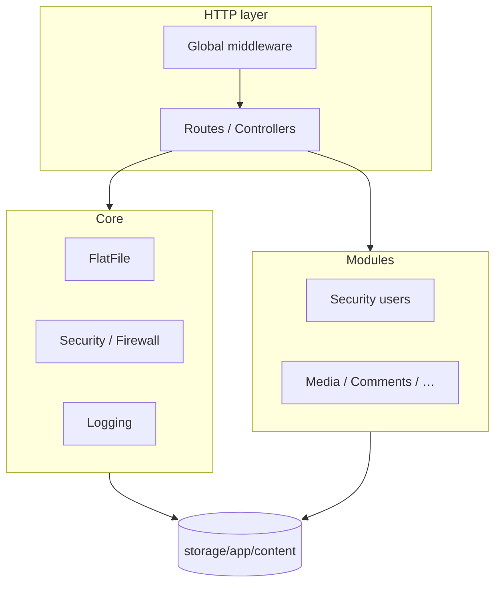

# PaginiumCMS – Backend Architecture

> **Version:** 2.0.26 · **Runtime:** PHP 8.4+ · **Framework:** Slim 4 · **Analysis:** PHPStan level 8

Backend je objektovo orientovaná PHP aplikácia: REST API pre React admin SPA, flat-file úložisko, DI kontajner a auto-discovery rout.

---

## Vrstvy



| Vrstva | Cesta | Úloha |
|--------|-------|--------|
| Bootstrap | `backend/bootstrap/app.php` | DI, middleware, auth routes, route loader |
| HTTP | `backend/app/Http/` | Controllers, Middleware, Routes |
| Core | `backend/app/Core/` | Doménová logika bez HTTP |
| Modules | `backend/app/Modules/` | Feature moduly (Users, Media, Audit, …) |
| Storage | `backend/storage/` | Obsah, logy, cache, WAF store |
| Tests | `backend/tests/` | PHPUnit (599 testov) |

---

## Bootstrap (`backend/bootstrap/app.php`)

1. Načítanie `.env`, session hardening, UTF-8
2. **DI kontajner** (`ServiceContainer` + `Config/services.php` per modul)
3. Slim `App` + **CORS** (`Tuupola\CorsMiddleware`)
4. **Globálne middleware** (poradie od vonkajšieho k vnútornému):
   - `SecurityMiddleware` — hlavičky, CSP
   - `MaintenanceModeMiddleware` — 503 pre verejné API
   - `LocaleMiddleware`
   - `FirewallMiddleware` — WAF (It.50), pred rate limitom
   - `RateLimitMiddleware` — vypnuté pri `APP_ENV=testing`
   - `AnalyticsMiddleware`
5. **Auth routes** — inline skupina `/api/auth/*` (register, login, 2FA, CSRF)
6. **Auto-discovery rout** — `glob(app/Http/Routes/*.php)` (30 súborov)
7. **RequestLoggingMiddleware** — HTTP access logy (2.0.26)
8. Error handler → JSON cez `ApiErrorHandler`

Auth routy **nie** v `Routes/auth.php` (súbor zmazaný); duplicita by spôsobila double-register.

---

## Routovanie

Každý súbor v `backend/app/Http/Routes/*.php` exportuje:

```php
return function (App $app): void {
    // $app->group('/api/...', ...)
};
```

| Súbor | Prefix | Poznámka |
|-------|--------|----------|
| `content.php` | `/api/pages`, `/api/articles`, search | CRUD + publish |
| `media.php` | `/api/media` | DAM, stock import |
| `settings.php` | `/api/admin/settings` | Schéma-driven |
| `firewall.php` | `/api/admin/firewall` | WAF admin (It.50) |
| `logs.php` | `/api/admin/logs` | Aggregated logy (2.0.26) |
| `trash.php` | `/api/admin/trash` | Soft-delete kôš |
| `jobs.php` | `/api/admin/jobs` | Scheduler |
| `workflows.php` | `/api/workflows/otp` | OTP schvaľovanie |
| `counts.php` | `/api/admin/counts` | Sidebar badges |
| … | … | Pozri [API.md](./API.md) |

Per-route middleware: `AuthMiddleware`, `RoleMiddleware`, `PermissionMiddleware`, `TwoFactorMiddleware`, `DeveloperModeMiddleware` (code editor).

---

## Dependency injection

- Kontajner: `PaginiumCMS\Core\Container\ServiceContainer`
- Bindings: `backend/app/Core/*/Config/services.php`, `backend/app/Modules/*/Config/services.php`, `backend/app/Http/Config/services.php`
- Controllery dostávajú služby cez konštruktor (napr. `JsonResponder`, `ContentRepository`, `FirewallService`)

---

## Flat-file storage

- Obsah: `storage/app/content/` — `.md` / `.json`, index `data/index/content.json`
- Používatelia: `data/users/*.json`
- Nastavenia: `data/settings.json` + schéma `SettingsSchema`
- WAF: `storage/firewall/` — bans, whitelist, incidents
- Logy: `storage/logs/{app,audit,event,user}/`

Žiadna SQL databáza v Core — pozri [STORAGE.md](./STORAGE.md).

---

## Bezpečnosť (prehľad)

| Mechanizmus | Implementácia |
|-------------|----------------|
| Session auth | `SessionManager`, cookie + CSRF |
| RBAC | `AuthorizationManager`, `PermissionMiddleware`; mapovanie rolí v `settings.accessControl` (SUPER_ADMIN only) |
| Path ACL | `PathAclService`, `ContentPathAclGuard`; pravidlá v Nastaveniach → Oprávnenia rolí → sync `data/security/acl.json` |
| 2FA | `TwoFactorMiddleware` na `/api/admin/*` |
| WAF | `FirewallMiddleware` + `FirewallService` |
| Rate limit | `RateLimitMiddleware`, login limiter |
| Maintenance | `MaintenanceModeMiddleware` |
| OTP workflow | Citlivé mutácie (publish, komentáre) |

Detail: [CORE_HARDENING.md](./CORE_HARDENING.md), [user/FIREWALL.md](../user/FIREWALL.md), [user/ACCESS_CONTROL.md](../user/ACCESS_CONTROL.md), [user/BRANDING.md](../user/BRANDING.md).

---

## Logovanie

| Typ | Služba | Výstup |
|-----|--------|--------|
| HTTP access | `RequestLoggingMiddleware` → `AccessLogService` | `storage/logs/app/` |
| App / audit / event / user | `Logger`, `AuditLogger`, … | flat JSON files |
| Admin prehliadka | `ApplicationLogReader` + `LogController` | `GET /api/admin/logs` |

Detail: [user/LOGGING.md](../user/LOGGING.md).

---

## Prostredie

| Premenná | Účel |
|----------|------|
| `APP_ENV` | `production` \| `development` \| `testing` |
| `APP_DEBUG` | Stack trace v JSON chybách |
| `TRUSTED_PROXIES` | IP za nginx — WAF, access log, rate limit |
| `SESSION_*` | Cookie parametre |

Pri deploy za nginx vždy nastav `TRUSTED_PROXIES` (aj pri prístupe cez IP, nie len doménu).

---

## Testovanie a CI

```bash
./vendor/bin/phpstan analyse backend --level=8
./vendor/bin/phpunit
```

CI: `.github/workflows/ci.yml` — PHPStan, PHPUnit, frontend lint/test/build.  
Incidenty: [ISSUES.md](../ISSUES.md) ISS-015–022.

---

## Súvisiace dokumenty

- [API.md](./API.md) — endpointy
- [API_CONTRACT.md](./API_CONTRACT.md) — JSON tvary
- [CORE.md](./CORE.md) — mapa Core balíkov
- [ARCHITECTURE.md](./ARCHITECTURE.md) — cieľová architektúra
