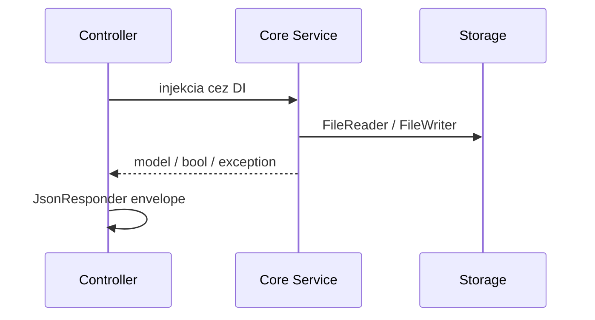

# PaginiumCMS – Core Layer

> **Version:** 2.0.26 · **Namespace:** `PaginiumCMS\Core\`

Core je doménová vrstva backendu: flat-file, cache, bezpečnosť, logovanie, verziovanie. **Neobsahuje** HTTP controllery — tie sú v `app/Http/`. Feature moduly v `app/Modules/` rozširujú Core cez DI a eventy.

---

## Mapa balíkov

| Balík | Cesta | Zodpovednosť |
|-------|-------|--------------|
| **FlatFile** | `Core/FlatFile/` | Čítanie/zápis `.md`/`.json`, front matter, index, trash sidecar |
| **Settings** | `Core/Settings/` | `SettingsRepository`, `SettingsSchema`, merge overrides |
| **Security** | `Core/Security/` | Login tracker, security logger, **Firewall** (It.50) |
| **Logging** | `Core/Logging/` | `Logger`, `AccessLogService`, `ApplicationLogReader` |
| **Cache** | `Core/Cache/` | `CacheManager`, File/Memory/Chained drivers |
| **Versioning** | `Core/Versioning/` | História obsahu, diff, restore |
| **Locking** | `Core/Locking/` | `LockManager` — concurrent edit |
| **Conflict** | `Core/Conflict/` | 3-way merge log, `ContentConflictException` |
| **Drafts** | `Core/Drafts/` | Auto-save drafty |
| **Backup** | `Core/Backup/` | Export/import, scheduler |
| **Analytics** | `Core/Analytics/` | Page views, realtime tracker |
| **Notification** | `Core/Notification/` | SMTP, ntfy, Telegram adaptéry |
| **Scheduler** | `Core/Scheduler/` | Job queue, registry, worker |
| **Monitoring** | `Core/Monitoring/` | Health report builder, scheduler state |
| **Health** | `Core/Health/` | Checkers (storage, cache, backup, GitHub, …) |
| **Workflow** | `Core/Workflow/` | OTP challenge store, publish/comment approval |
| **CodeEditor** | `Core/CodeEditor/` | File backup, syntax check, diff |
| **CodePolicy** | `Core/CodePolicy/` | PHP security scan pred save |
| **Developer** | `Core/Developer/` | Dev token registry, developer logger |
| **Validation** | `Core/Validation/` | Shared `Validator` |
| **Config** | `Core/Config/` | `ConfigManager` |
| **Event** | `Core/Event/` | `EventDispatcher` |
| **Hook** | `Core/Hook/` | `HookManager` — extension points |
| **GitHub** | `Core/GitHub/` | Sync export/import |
| **Seo** | `Core/Seo/` | `SeoMetaBuilder` |
| **Feeds** | `Core/Feeds/` | RSS/Atom generovanie |
| **AuditTrail** | `Core/AuditTrail/` | Audit záznamy do flat logov |

Moduly mimo Core (ale v rovnakom repozitári): `Modules/Security` (users, auth), `Modules/Media`, `Modules/Comments`, `Modules/Messages`, `Modules/Navigation`, `Modules/Audit`.

---

## Ako Core komunikuje s HTTP

Controllery **nepíšu priamo na disk** — vždy cez repository/službu v Core alebo Module.

---

## Kľúčové kontrakty (interfaces)

| Interface | Implementácia | Použitie |
|-----------|---------------|----------|
| `ContentRepositoryInterface` | `ContentRepository` | Pages/articles CRUD |
| `FileReaderInterface` / `FileWriterInterface` | FlatFile services | Všetky JSON/MD operácie |
| `SettingsRepositoryInterface` | `SettingsRepository` | Admin settings API |
| `LockManagerInterface` | `LockManager` | `/api/locks` |
| `BackupInterface` | `BackupManager` | Admin backups |
| `LoggerInterface` | `Logger` | Structured logging |

PHPUnit testuje Core izolovane (`tests/Core/`) aj cez HTTP (`tests/Http/`).

---

## Eventy a hooky

- **Events:** `EventDispatcher` — moduly môžu počúvať (backup completed, content saved, …)
- **Hooks:** `HookManager` — plánované rozšírenie pre pluginy ([PLUGINS.md](./PLUGINS.md))

---

## Bezpečnosť a hardening v Core

| It. | Funkcia | Core súčasti |
|-----|---------|--------------|
| 20 | RBAC, maintenance, trash | Settings + FlatFile `FileWriter` |
| 47 | Notification auth | `NotificationFactory`, adaptéry |
| 50 | WAF | `Core/Security/Firewall/*`, `FirewallMiddleware` |
| 2.0.26 | HTTP + app logging | `RequestLoggingMiddleware`, `ApplicationLogReader` |

Detail: [CORE_HARDENING.md](./CORE_HARDENING.md).

---

## Čo do Core nepatrí

- React frontend
- Slim route definície
- User entity persistence logika (Modules/Security)
- PHPUnit / CI konfigurácia

Pravidlo: ak feature nie je nutná pre každú inštanciu CMS, patrí do **Module**, nie Core.

---

## Súvisiace dokumenty

- [BACKEND.md](./BACKEND.md) — bootstrap, middleware, routes
- [STORAGE.md](./STORAGE.md) — cesty na disku
- [SETTINGS.md](./SETTINGS.md) — schéma nastavení
- [VERSIONING.md](./VERSIONING.md) — história obsahu
