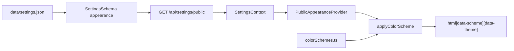

# Themes & color schemes (It.58b)

PaginiumCMS uses **semantic CSS variables** for public appearance. Hex values live in the frontend catalog only — PHP settings store scheme **IDs**, not colors.

## Architecture

| Layer | Responsibility |
|-------|----------------|
| Backend | Validate `colorScheme` against allowlist; expose `appearance` in public API |
| `colorSchemes.ts` | SSOT for token hex values (5 presets × light/dark) |
| `applyColorScheme.ts` | Sets `data-scheme`, `data-theme`, `--color-*` vars, Tailwind `dark` class |
| `tailwind.config.js` | `theme-*` Tailwind farby mapované na `var(--color-*)` |
| `publicUiClasses.ts` | Zdieľané triedy (`BTN_PRIMARY`, `PUBLIC_CARD`, …) |
| Admin | `AppearanceSettingsPanel` — swatches + wireframe preview |
| Public UI | Navbar, Footer, blog, login, maintenance — všetko cez `theme-*` |

## Settings keys

| Key | Default | Notes |
|-----|---------|-------|
| `appearance.colorScheme` | `indigo-classic` | One of 5 catalog IDs |
| `appearance.mode` | `system` | `light` \| `dark` \| `system` |
| `appearance.allowUserToggle` | `true` | Navbar sun/moon control |
| `appearance.previewTemplate` | `hero-content` | Admin wireframe (future layout editor) |

## CSS token model

Applied on `document.documentElement` (public routes) or preview wrapper:

| Token | Usage |
|-------|--------|
| `--color-primary` | Buttons, header bar, accents |
| `--color-primary-foreground` | Text on primary surfaces |
| `--color-secondary` | Secondary chrome, footer |
| `--color-surface` | Page background |
| `--color-surface-elevated` | Cards, elevated panels |
| `--color-text` | Body text |
| `--color-text-muted` | Secondary text |
| `--color-accent` | CTA, highlights |
| `--color-border` | Borders |

## Preset catalog

### indigo-classic (default)

| Token | Light | Dark |
|-------|-------|------|
| primary | `#4f46e5` | `#818cf8` |
| secondary | `#64748b` | `#94a3b8` |
| surface | `#f8fafc` | `#0f172a` |
| text | `#0f172a` | `#f1f5f9` |
| accent | `#7c3aed` | `#a78bfa` |

### ocean-slate

| Token | Light | Dark |
|-------|-------|------|
| primary | `#0d9488` | `#2dd4bf` |
| secondary | `#64748b` | `#94a3b8` |
| surface | `#f8fafc` | `#0f172a` |
| text | `#0f172a` | `#ecfeff` |
| accent | `#14b8a6` | `#5eead4` |

### forest-sage

| Token | Light | Dark |
|-------|-------|------|
| primary | `#059669` | `#34d399` |
| secondary | `#78716c` | `#a8a29e` |
| surface | `#fafaf9` | `#1c1917` |
| text | `#1c1917` | `#fafaf9` |
| accent | `#84cc16` | `#a3e635` |

### sunset-rose

| Token | Light | Dark |
|-------|-------|------|
| primary | `#e11d48` | `#fb7185` |
| secondary | `#a8a29e` | `#a8a29e` |
| surface | `#fffbeb` | `#1c1917` |
| text | `#292524` | `#fff1f2` |
| accent | `#fb7185` | `#fda4af` |

### mono-zinc

| Token | Light | Dark |
|-------|-------|------|
| primary | `#18181b` | `#fafafa` |
| secondary | `#71717a` | `#a1a1aa` |
| surface | `#fafafa` | `#09090b` |
| text | `#18181b` | `#fafafa` |
| accent | `#52525b` | `#d4d4d8` |

## Admin vs public theme

- **Admin shell** (`/dashboard`, `/settings`, …): existing `ThemeContext` + localStorage key `theme`.
- **Public site** (/, `/blog`, `/login`, …): `PublicAppearanceProvider` + settings `appearance.mode` + visitor override key `paginium-public-theme`.

The two systems do not share localStorage keys.

## Related files

- `frontend/src/theme/colorSchemes.ts`
- `frontend/src/theme/applyColorScheme.ts`
- `frontend/src/hooks/usePublicAppearance.ts`
- `frontend/src/components/admin/AppearanceSettingsPanel.tsx`
- `backend/app/Core/Settings/SettingsSchema.php` — `appearance` group
- [ITERATION_58.md](../ITERATION_58.md) — full layout builder spec (58a + 58b)
