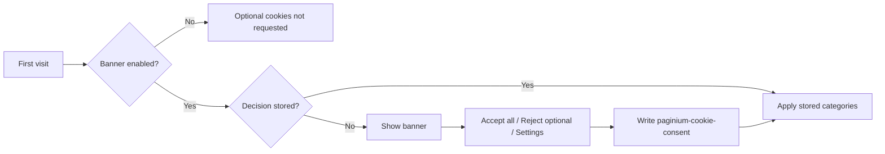

# Cookies & GDPR — PaginiumCMS operator guide

> **Scope:** Public Beta · cookie consent, built-in policy page, and admin data-subject tooling (It.80e).  
> **Not covered:** Full DPA product, Records of Processing Activities (RoPA), visitor self-service export, server-side consent ledger.  
> **Related:** [developer/SECURITY.md](developer/SECURITY.md) (retention limits), [ITERATION_80.md](ITERATION_80.md) (80e spec).

---

## 1. What PaginiumCMS provides

PaginiumCMS ships a **technical GDPR baseline** suitable for EU-facing sites that collect comments, newsletter e-mails, and CMS user accounts. It is **not** legal advice and **not** a substitute for operator-specific privacy policies drafted with counsel.

| Capability | Audience | Status |
|---|---|---|
| Cookie consent banner with categories | Public visitors | ✅ Settings-driven |
| Built-in cookie policy page (`/cookies`) | Public visitors | ✅ i18n SK/EN |
| Preference management (accept / reject / granular) | Public visitors | ✅ Browser `localStorage` |
| Analytics gated by consent | Public visitors | ✅ SPA pageview beacon |
| Newsletter consent checkbox (optional) | Public visitors | ✅ Settings-driven |
| Company / controller details on contact page | Public visitors | ✅ Settings → Company |
| Admin GDPR export (JSON/ZIP) | Operators (ADMIN+) | ✅ It.80e |
| Admin GDPR anonymize (irreversible PII redaction) | Operators (ADMIN+) | ✅ It.80e |
| Editable cookie-policy page body in admin | Operators | ✅ Settings → Privacy & cookies |

---

## 2. Public cookie consent

### 2.1 Flow

1. Visitor opens the public site.
2. If **Show cookie banner** is enabled and no decision exists in `localStorage`, the bottom banner appears.
3. Visitor chooses **Accept all**, **Reject optional** (if enabled), or opens **Settings** for per-category toggles.
4. Decision is stored locally; functional/analytics features respect the choice on subsequent navigation.

### 2.2 Cookie categories

| Category | Default | Controlled by visitor | Used for |
|---|---|---|---|
| **Necessary** | Always on | No | Session (admin), CSRF token, consent record when banner enabled |
| **Functional** | Off until consent | Yes | Public light/dark theme (`paginium-public-theme`) |
| **Analytics** | Off until consent | Yes | Anonymous SPA pageview POST to `/api/analytics/pageview` |

Rejecting optional categories does **not** block core site operation or admin login.

### 2.3 Browser storage inventory

| Name | Type | Category | Notes |
|---|---|---|---|
| Session cookie | HttpOnly cookie | Necessary | Admin authentication; not readable from JavaScript |
| `csrf_token` | `localStorage` | Necessary (admin) | Synchronizer token for mutating API calls after login |
| `paginium-cookie-consent` | `localStorage` | Necessary when banner on | JSON: `{ necessary, functional, analytics, decidedAt }` |
| `paginium-public-theme` | `localStorage` | Functional | Cleared when functional cookies denied |
| Analytics beacon | Network | Analytics | Only when analytics category accepted |

Consent is stored **client-side only**. PaginiumCMS does not write a server-side consent audit log for anonymous visitors in Public Beta.

### 2.4 Built-in policy page

- **URL:** `/cookies` (default when **Cookie / privacy policy URL** is empty)
- **Content:** Category table, storage inventory, rights summary, inline preference controls
- **Languages:** Follows site locale (`sk` / `en`) via frontend i18n (`public.cookies.policy.*`)
- **Maintenance mode:** `/cookies` remains reachable (same as newsletter confirm/manage routes)
- **Analytics:** Pageviews on `/cookies` are not tracked (privacy-sensitive path)

Override the built-in page by setting **Cookie / privacy policy URL** to:

- a relative path (e.g. `/privacy`) — internal React route or CMS page slug, or
- an external HTTPS URL — opens in a new tab from the banner

Implementation: `frontend/src/components/frontend/CookiePolicyPage.tsx`, `frontend/src/utils/cookiePolicyUrl.ts`.

---

## 3. Admin configuration

**Path:** Administration → **Settings** → category **Site** → group **Privacy & cookies** (`privacy`).

The privacy group uses a dedicated **Cookies & GDPR page editor** (`PrivacyCookieSettingsPanel`) with five areas:

1. **Cookie banner** — enable, text, reject button, policy URL  
2. **Policy page header** — custom title and intro for `/cookies`  
3. **Custom GDPR blocks** — add/reorder/remove title + body sections (plain text, max 20 blocks)  
4. **GDPR contact** — controller name, e-mail, phone, address (falls back to **Company** settings when empty)  
5. **Built-in page sections** — toggles for categories table, storage inventory, “Your choices”, and consent panel  

| Setting key | Type | Purpose |
|---|---|---|
| `cookieBannerEnabled` | bool | Show GDPR cookie bar on first public visit |
| `cookieBannerText` | text (max 1000) | Custom banner copy; empty falls back to i18n default |
| `cookiePolicyUrl` | url/path (max 500) | Policy link target; **empty = `/cookies`** |
| `cookieShowRejectButton` | bool | Show “Reject optional” on banner (recommended for EU) |
| `cookiePolicyPageTitle` | string (max 200) | Override `/cookies` H1; empty = i18n default |
| `cookiePolicyIntro` | text (max 5000) | Custom intro paragraph; empty = i18n default |
| `cookiePolicySectionsJson` | JSON text (max 30000) | Array of `{ id, title, body }` blocks — visual editor in admin |
| `privacyContactName` | string (max 200) | Controller / DPO label; empty → Company legal/name |
| `privacyContactEmail` | email | Privacy contact e-mail; empty → Company e-mail |
| `privacyContactPhone` | string (max 64) | Phone; empty → Company phone |
| `privacyContactAddress` | text (max 2000) | Address; empty → Company address |
| `cookiePolicyShowCategoriesTable` | bool | Show built-in cookie categories table |
| `cookiePolicyShowStorageInventory` | bool | Show technical storage inventory list |
| `cookiePolicyShowDefaultRights` | bool | Show default “Your choices” paragraph |
| `cookiePolicyShowManagePanel` | bool | Show inline consent management controls |

Settings schema: `backend/app/Core/Settings/SettingsSchema.php` (`privacy` group).  
Public exposure (banner fields only): `GET /api/settings/public` via `SettingsController::publicPrivacySettings()`.

### 3.1 Recommended production setup

1. Enable **cookie banner**.
2. Write banner text in the site’s primary language (or rely on i18n default).
3. Leave **policy URL** empty to use `/cookies`, **or** create a CMS page with extended legal text and point the URL there.
4. Keep **Reject optional** enabled unless counsel advises otherwise.
5. Fill **Settings → Company** (legal name, address, contact e-mail) for controller identification on the contact page.
6. For newsletter: enable **Require consent checkbox** when collecting EU subscribers.
7. Add **Custom GDPR blocks** for legal basis, retention, subprocessors, etc.
8. Use **Preview policy page** in the privacy settings panel to verify `/cookies`.

### 3.2 External policy page

Operators who need fully custom layout can still publish a CMS **Page** and set `cookiePolicyUrl` to that slug instead of `/cookies`.

---

## 4. Admin GDPR data-subject tools (It.80e)

For **registered CMS users** (accounts in `data/users/`), not anonymous commenters acting alone.

**Path:** Administration → **Users** → edit user → **GDPR tools** panel.

| Action | Method | Endpoint |
|---|---|---|
| Export JSON | `GET` | `/api/admin/users/{id}/gdpr/export` |
| Export ZIP | `GET` | `/api/admin/users/{id}/gdpr/export?format=zip` |
| Anonymize | `POST` | `/api/admin/users/{id}/gdpr/anonymize` body `{ "confirm": true }` |

**Authorization:** `ADMIN` or `SUPER_ADMIN`, authenticated session, 2FA when enforced.

**Export includes:** user profile (no password hash), comments matched by e-mail or display name, newsletter row if present, contact messages by e-mail.

**Anonymize replaces PII with** stable pseudonym `anon_<sha256-prefix>` and e-mail `{pseudonym}@anonymized.invalid` in:

- user account (deactivated, 2FA cleared, avatar removed, role reset to `USER`),
- matching comments (author + e-mail),
- contact messages (name, e-mail, IP → `redacted`),
- newsletter subscriber row (e-mail).

**Guards:**

- Cannot anonymize your own account.
- Cannot anonymize the last `SUPER_ADMIN`.
- Already-anonymized accounts return `409`.

**Audit events** (`data/security/audit_events.json`):

- `gdpr_export` — INFO, includes target user id and format
- `gdpr_anonymize` — WARNING, includes pseudonym and row counts

See [developer/SECURITY.md §18](developer/SECURITY.md) for retention limits **not** erased by anonymize (backups, access logs, audit trail, webhook delivery logs, cold storage).

Backend: `backend/app/Core/Gdpr/`, `backend/app/Http/Controllers/Admin/GdprController.php`.

---

## 5. Related privacy surfaces

| Surface | Settings / location | GDPR relevance |
|---|---|---|
| Contact form messages | `data/messages/*.json` | PII at rest; included in user-linked export/anonymize when e-mail matches |
| Comments | `data/comments.json` | Author name + e-mail; spam quarantine (It.80c) |
| Newsletter | `data/newsletter/subscribers.json` | Consent timestamp; double opt-in optional |
| Analytics | `data/metrics/` (aggregated) | Masked IP in admin UI (`AnalyticsIpMasker`, It.33) |
| Access / security logs | `logs/`, audit JSON | Historical identifiers until rotation |

---

## 6. Operator responsibilities (outside the CMS)

PaginiumCMS Public Beta **does not** automatically:

- erase PII from backup ZIPs or trash exports created before anonymization,
- propagate erasure to external SaaS (webhooks, e-mail providers, CDN analytics),
- provide visitor-facing “download my data” without admin action,
- maintain a consent register with server timestamps for each visitor,
- generate RoPA, DPIA, or processor agreements.

Document your own **retention schedule**, **backup restore procedure**, and **sub-processor list** in operator-run policies.

---

## 7. Verification checklist

### Public site

- [ ] Cookie banner appears on first visit when enabled.
- [ ] **Reject optional** works; site remains usable.
- [ ] `/cookies` loads; preferences can be changed inline.
- [ ] Footer links: **Cookie settings** (after decision) and **Cookie policy**.
- [ ] Analytics requests absent until analytics consent granted (network tab).
- [ ] Theme preference not persisted when functional cookies denied.

### Administration

- [ ] Privacy settings save and reflect in `/api/settings/public`.
- [ ] GDPR ZIP export downloads for a test user.
- [ ] Anonymize redacts user + linked rows; audit events appear in Security audit.
- [ ] Company block visible on public contact page when configured.

### Regression tests

- `backend/tests/Core/Gdpr/*`
- `backend/tests/Http/Controllers/Admin/GdprControllerTest.php`
- `frontend/src/utils/cookiePolicyUrl.test.ts`

Run full gate: `./scripts/iteration-gate.sh` from repository root.

---

## 8. Future improvements (not shipped)

| Item | Notes |
|---|---|
| Server-side consent log | Optional audit trail for banner decisions |
| Visitor self-service data export | Would require auth or verified e-mail flow |
| Rich-text / Markdown blocks on `/cookies` | Currently plain text only (XSS-safe) |

Track large iterations in [ITERATION_BACKLOG.md](ITERATION_BACKLOG.md).

---

## 9. Source reference

| Area | Path |
|---|---|
| Cookie banner UI | `frontend/src/components/frontend/CookieConsentBanner.tsx` |
| Cookie policy page | `frontend/src/components/frontend/CookiePolicyPage.tsx` |
| Privacy admin panel | `frontend/src/components/backend/PrivacyCookieSettingsPanel.tsx` |
| GDPR block JSON helpers | `frontend/src/utils/cookiePolicySections.ts` |
| Consent state | `frontend/src/context/CookieConsentContext.tsx`, `frontend/src/utils/cookieConsent.ts` |
| Policy URL resolver | `frontend/src/utils/cookiePolicyUrl.ts` |
| Public route | `frontend/src/App.tsx` → `path="cookies"` |
| Settings schema | `backend/app/Core/Settings/SettingsSchema.php` → `privacy` |
| GDPR export/anonymize | `backend/app/Core/Gdpr/Services/` |
| GDPR HTTP | `backend/app/Http/Routes/users.php`, `GdprController.php` |
| i18n (public) | `frontend/src/i18n/modules/public/{en,sk}.ts` → `cookies`, `cookies.policy` |
| i18n (settings labels) | `frontend/src/i18n/modules/settings/{en,sk}.ts` → `fields.privacy` |

**Release:** It.80e + built-in `/cookies` page — `v2.1.0-beta.37` ([CHANGELOG.md](../../CHANGELOG.md)).
