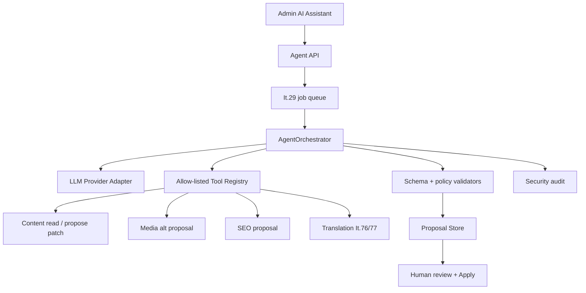

# Iteration 75 — CMS-aware AI agent

> **Status:** ⏳ planned; after It.73/76/77 stabilization  
> **Priority:** 🔵 · optional enterprise capability  
> **Wave:** [Hybrid Engine HE-6](ITERATION_WAVE_HYBRID_ENGINE.md)  
> **Depends on:** [It.68](ITERATION_68.md), [It.73](ITERATION_73.md), a stable tool/provider contract; uses It.29 queue and It.66 write gates

## Goal

Add a **CMS-aware assistant** that proposes cross-module changes through strictly defined tool calls. The agent never publishes autonomously and never bypasses the invoking user's permissions. Its primary output is a validated, editable proposal.

It.75 is broader than translation. Translation tools delegate to It.76/77 rather than creating a third translation stack.

---

## Allowed and prohibited boundaries

| MVP scope | Outside MVP |
|-----------|-------------|
| propose title/body/SEO patches | autonomous save or publish without confirmation |
| propose media alt text | arbitrary shell, filesystem, or network access |
| summarize comments for a moderator | replacing RBAC with an “AI admin” role |
| draft newsletter subject/snippet | training/fine-tuning on customer data |
| suggest tags/categories | executing model-generated plugin code |
| delegate translation | unrestricted reading of the entire repository |

---

## Architecture



Long calls are asynchronous. The HTTP request returns a job ID; a worker executes the provider/tool loop with a bounded number of steps.

---

## Untrusted boundaries and prompt injection

Content, comments, plugin text, translations, and provider output are **untrusted data**, not higher-priority instructions. Protection cannot rely on a system prompt alone.

Mandatory controls:

1. the model sees only a minimal authorized context slice,
2. the tool registry is an allow-list and every argument has JSON Schema,
3. each tool performs its own RBAC/domain validation; model-supplied scope grants nothing,
4. read tools never return secrets, internal paths, tokens, or complete logs,
5. write tools only create proposals/JSON Patch; they do not save,
6. tool steps, token budget, and execution time are bounded,
7. provider URL/driver passes outbound policy,
8. generated HTML/JSON/shortcode passes existing sanitizers and It.66/67 policy,
9. Apply rechecks revision, permission, and schema outside the agent job.

---

## Backend

| Component | Responsibility |
|-----------|----------------|
| `LlmProviderInterface` | typed completion/tool request, usage, and health |
| provider adapters | local/Ollama-compatible and explicitly configured API adapters |
| `AgentOrchestrator` | bounded loop, state machine, cancellation, immutable actor context |
| `AgentToolRegistry` | allow-listed tools and argument/result schemas |
| `AgentContextBuilder` | minimal redacted context by resource and permission |
| `AgentProposalStore` | TTL, actor/resource/revision binding, encrypted fields when required |
| `AgentBudgetStore` | daily token/run budget as bounded flat-file operational state |
| `agent.run` job | async execution; retry only for safe provider failures |
| Apply service | explicit session/Bearer authorization, OCC, and audit |

---

## MVP tool registry

| Tool | Required permission | Effect |
|------|---------------------|--------|
| `content.read` | `content:read` | returns an allow-listed resource slice |
| `content.propose_patch` | `content:write` | stores a patch proposal; does not change content |
| `seo.suggest_meta` | `content:write` | schema-bound title/description/keyword proposal |
| `media.suggest_alt` | `media:write` | alt-text proposal bound to media ID |
| `comments.summarize` | `comments:moderate` | summary without moderation action |
| `translation.translate` | delegated It.76/77 permissions | creates a translation proposal |

Every tool has maximum input/output size and an audit event. There is no arbitrary URL fetch, shell, raw database, or generic filesystem tool.

---

## Settings

```yaml
agent:
  enabled: false
  provider: none
  model: null
  maxTokensPerRun: 4000
  maxToolSteps: 6
  dailyTokenLimit: 0
  allowedTools: []
  proposalTtlMinutes: 60
```

Credentials are encrypted. A local provider URL on a LAN requires explicit outbound allow-list policy, like It.76. `allowedTools` is empty by default; enabling the agent with no tools grants no implicit capabilities.

---

## Frontend

- **AI Assistant** panel in the content editor and later an optional global entry point,
- clear provider/model, expected scope, and selected-tool display,
- Run → progress → proposal diff → Apply selected / Discard,
- no “publish automatically” action,
- proposal identifies model-generated fields and provider usage,
- audit trail is visible to authorized administrators,
- users can cancel a job; cancellation never applies a partial proposal.

---

## Privacy, audit, and cost

- the agent sends minimal context and the user can see what will be processed,
- prompts/content/responses are not logged by default,
- audit stores actor, resource ID, provider/model, tools, token count, result, and proposal ID,
- cloud usage has budgets/limits; documentation does not promise stable pricing,
- a local provider is an optional privacy-first path, not a performance guarantee,
- proposal TTL cleanup is idempotent and preserves the audit record of applied proposals.

---

## Failure scenarios

- provider timeout → failed/retryable job without proposal Apply,
- invalid tool call → schema rejection and bounded correction or stop,
- attempt to use a prohibited tool → hard deny + security audit,
- permission change during a job → Apply reauthorizes and may deny,
- source revision changed → `409`,
- budget exceeded → `429`/clear status,
- agent disabled → capability error and zero outbound traffic,
- partial provider text without a valid schema result → unusable proposal, never a raw write.

---

## Out of scope

- autonomous publishing,
- permanent “AI superuser,”
- generic web browsing or shell tools,
- automatic plugin/theme installation,
- fine-tuning/training pipeline,
- storing chain-of-thought or internal reasoning tokens,
- replacing editors, validators, or human accountability.

---

## Tests

- mocked LLM → valid tool call → proposal JSON,
- prompt injection in content cannot activate a prohibited tool,
- malformed arguments are schema-rejected,
- invoking user without permission → deny before tool and during Apply,
- revision conflict and role revoked during job,
- maxToolSteps/token/time budget,
- disabled/empty allow-list → no action/outbound,
- generated patch passes It.66/67 validators,
- provider secrets/content are absent from logs,
- 30s+ mocked latency runs through the worker without HTTP timeout,
- cancellation and duplicate-job idempotency.

---

## Definition of Done

- [ ] “Suggest SEO for this article” creates an editable proposal without writing.
- [ ] Apply is a separate authorized mutation with OCC/schema/audit.
- [ ] The agent uses only allow-listed schema-bound tools.
- [ ] Prompt-injection tests do not escalate tools or expose secrets.
- [ ] Default `enabled=false`, `allowedTools=[]` means zero outbound traffic.
- [ ] The async worker handles a long provider call without blocking HTTP.
- [ ] The translation tool reuses It.76/77 rather than a duplicate provider stack.
- [ ] SK/EN user, security, privacy, and operations documentation is updated.

## Related

[It.76](ITERATION_76.md) · [It.77](ITERATION_77.md) · [It.29](ITERATION_29.md) · [It.66](ITERATION_66.md) · [It.67](ITERATION_67.md)
