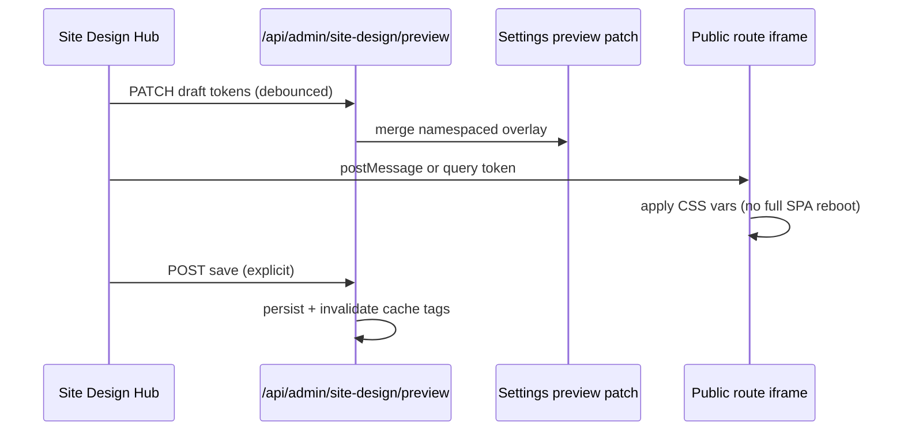

# Iteration — Site Design (paid extension)

> **Status:** ⏳ planned — product specification; **not** part of free Core  
> **Priority:** 🟡 **P1 commercial** · complements free It.58 appearance/layout  
> **Delivery model:** isolated **paid add-on** (ZIP / licensed package), not a Core merge  
> **Depends on:** [It.58](ITERATION_58.md) tokens & layout AST · [It.89](ITERATION_89.md) capability broker · [PLUGINS.md](architecture/PLUGINS.md) · [PHILOSOPHY.md](PHILOSOPHY.md)  
> **Explicitly not:** Theme Studio HTML themes ([It.88](ITERATION_88.md)), Elementor-style arbitrary page DOM, or paywalling existing Core appearance

---

## Goal

Offer a **visual site design tuner** for non-developers:

- preset **colors**, **radii**, **shadows**, **density**, and **block variants**;
- **per-component effect** toggles from an allow-list (CSS-only);
- **live preview** on real routes (`/`, `/blog`, sample page) without full page reload;
- **no runtime paralysis** of the CMS when the add-on is disabled.

The official open-source Core keeps working **unchanged** without the add-on installed.

---

## License and philosophy compliance (audit)

This section records an engineering/legal **compatibility review** against repository `LICENSE` (MIT) and [PHILOSOPHY.md](PHILOSOPHY.md). It is not legal advice; commercial terms of the add-on belong in the **add-on’s own license**.

| Check | Result | Notes |
|-------|--------|-------|
| Core license (MIT) | ✅ Compatible | MIT allows proprietary separate works that **use** the CMS via public APIs/hooks. The add-on does not need to be MIT if it is distributed separately and does not incorporate Core code into a single combined work against license terms. |
| “Official project remains free” | ✅ Compatible | Site Design is **not** shipped inside the official Core repo as a paywall. Free Core retains It.58 **color schemes**, **layout templates**, **outline/shortcodes**, **blog layout settings**, and **branding**. |
| “No paid Pro edition of Core” | ✅ Compatible | Monetization is an **optional extension package**, same pattern as third-party plugins — not a forked “PaginiumCMS Pro” binary. |
| “Thin Core and modules” | ✅ Aligned | Visual tuning logic lives in `Http/Extensions/site-design/` (working name), not in `Core/`. |
| No-SQL / files as SSOT | ✅ Aligned | Add-on settings stored under a **namespaced** flat-file key (e.g. `data/settings.overrides` or plugin-owned JSON under documented extension storage), not a new SQL store. |
| Security by design | ✅ Required | Add-on routes use AuthN + `PermissionMiddleware`; mutating API uses CSRF; no arbitrary CSS/HTML from users — **enum presets only**. |
| API First | ✅ Required | Every Studio action has a REST contract; admin UI is not the only surface. |

**Potential conflict (must avoid):**

- ❌ Moving existing **Settings → Appearance** or **blog list** controls behind the paywall.
- ❌ Patching Core files in the commercial ZIP (“drop-in Core hack”).
- ❌ Disabling public site if license check fails (fail-open to Core tokens; add-on effects simply absent).

**Conclusion:** A **paid, isolated Site Design extension** is consistent with project philosophy **provided** Core essentials stay free and integration uses the extension architecture.

---

## Product boundary: free Core vs paid add-on

| Capability | Free Core (stays) | Site Design add-on (paid) |
|------------|-------------------|---------------------------|
| Color scheme presets (5) | ✅ | Optional **premium preset packs** |
| Light / dark / system | ✅ | Fine-tuning sliders mapped to tokens |
| Layout templates & builder modes | ✅ | Visual **Design hub** UI wrapping same AST (no second storage model) |
| Blog sidebar / columns (settings) | ✅ | **Visual cards** + preview on `/blog` |
| Page outline / shortcode blocks | ✅ | **Block variant** panel (allow-listed `pg-*` classes) |
| Theme packages / Theme Studio | ✅ maintainer path | **Out of scope** for Site Design |
| Live preview while editing settings | partial (`settingsPreview`) | **Full-route iframe** preview debounced |
| Per-block hover / motion presets | basic CSS utilities | **Catalog of effects** (reduced-motion safe) |

---

## Isolation architecture

```text
backend/app/Http/Extensions/site-design/     # proprietary package (not in OSS Core tree)
├── plugin.json                              # manifest, minCmsVersion, capabilities
├── src/
│   ├── SiteDesignSettingsRepository.php     # namespaced settings read/write
│   ├── SiteDesignTokenService.php           # maps presets → CSS variables
│   └── Http/Controllers/...                 # /api/admin/site-design/*
├── routes.php                               # extension routes only
└── assets/                                  # optional static admin assets

frontend/src/extensions/site-design/         # built into admin SPA at deploy (see PLUGINS.md)
├── SiteDesignHub.tsx                        # visual tuner UI
├── previewBridge.ts                           # applies patch to preview iframe
└── registerAdminRoute.ts                    # lazy admin route

data/plugins.json                            # enabled flag + license metadata (operator)
data/site-design/                              # optional plugin data dir (documented contract)
```

**Integration with Core (read-only + hooks):**

1. **Read** public appearance/layout/content settings via existing services — never duplicate SSOT.
2. **Emit** compiled token overrides as a single `<link>` or inline `:root` block on public HTML via a **new allow-listed hook** (Core slice **SD-0**, free, stable): e.g. `public.head.assets` or `appearance.extra_stylesheets`.
3. **Admin route** registered through extension loader (`/admin/site-design`).
4. **Disable** = hook not registered, zero extra CSS/JS on public site, zero extra admin bundle chunk loaded.

Core changes for SD-0 must remain **minimal, documented, and free** — extension points only, not Site Design UI in Core.

---

## Design contract (fail-closed)

| Rule | Rationale |
|------|-----------|
| Presets are **enums**, not free-form CSS | XSS/CSP safety; predictable performance |
| Effects are **CSS-only** (`@media (prefers-reduced-motion: reduce)` respected) | No theme JS creep |
| Block variants reference existing **shortcode / outline** types | One layout AST ([It.58](ITERATION_58.md)) |
| Preview uses **debounced** patch (150–300 ms) | Avoid admin/API storms |
| Save = one settings write + **tag cache invalidation** | Same as appearance changes ([It.69](ITERATION_69.md)) |
| No Sandpack/Monaco in Site Design hub | Different audience than [It.95](ITERATION_95.md) |

Example add-on settings shape (illustrative):

```json
{
  "manifestVersion": 1,
  "global": {
    "radius": "md",
    "cardStyle": "elevated",
    "accentStrength": "normal"
  },
  "regions": {
    "blog": { "cardHover": "subtle-lift", "metaStyle": "uppercase" }
  },
  "blocks": {}
}
```

Public runtime applies only **`data-sd-*` attributes** and CSS variables — no new React tree on the public site.

---

## Live preview flow



Preview must work on **representative routes** configured in add-on settings (default: `/`, `/blog`, one CMS page slug).

---

## Performance: do not paralyze the CMS

| Concern | Mitigation |
|---------|------------|
| Public JS bloat | Add-on ships **no** public JS in v1; CSS variables only |
| Admin bundle | Lazy-load extension chunk when opening Site Design |
| API load | Debounce preview; save on explicit action |
| Cache | Invalidate only appearance/layout-related tags |
| Disabled plugin | No hooks, no CSS, no admin menu — **O(0)** overhead |
| Editor outline | Variant metadata stored in existing page AST fields, not parallel DB |

---

## Implementation slices (add-on + minimal Core SD-0)

| ID | Owner | Work |
|----|-------|------|
| **SD-0** | **Core (free)** | Stable hook for optional public stylesheet / `:root` token injection; extension capability registration; docs |
| **SD-1** | Add-on | `plugin.json`, settings repository, license gate (admin only), enable/disable |
| **SD-2** | Add-on | Global tuner: radius, card style, accent strength → token map |
| **SD-3** | Add-on | Region tuner: blog cards + sidebar density (reads/writes **existing** `content.*` keys where possible) |
| **SD-4** | Add-on | Live preview iframe + debounced draft API |
| **SD-5** | Add-on | Block variant panel in page editor (hook `admin.page_editor.sidebar` or extension UI embed — TBD in SD-0 catalog) |
| **SD-6** | Add-on | Premium preset packs (JSON), import via extension ZIP |
| **SD-7** | Ops | Commercial distribution: license key file, update channel, separate git repo |

Recommended order: **SD-0 → SD-1 → SD-2 → SD-4 → SD-3 → SD-5 → SD-6**.

---

## Non-goals

- Import arbitrary HTML themes or BloggyPress ZIP as Site Design.
- Replace It.58 outline canvas or duplicate layout AST.
- Runtime React component marketplace on the public site.
- npm install on production server for preset packs.
- Locking Core admin if add-on license expires (graceful degrade only).

---

## Verification

- With add-on **disabled**: public site identical to pre-install baseline (visual diff test).
- With add-on **enabled**: token changes visible in preview and after save; `prefers-reduced-motion` disables motion presets.
- PHPUnit: settings validation, permission middleware, no write to Core paths.
- FE: Vitest for token map; E2E smoke: open hub, move slider, save, reload public `/blog`.
- Security: no user-controlled CSS strings in API; PHPStan L8 on add-on package.

---

## Related documents

- [PHILOSOPHY.md](PHILOSOPHY.md) — free Core, modular extensions  
- [architecture/PLUGINS.md](architecture/PLUGINS.md) — extension placement and lifecycle  
- [ITERATION_58.md](ITERATION_58.md) — layout AST and appearance baseline  
- [architecture/THEMES.md](architecture/THEMES.md) — theme packages (de-emphasized for this product)  
- [ITERATION_89.md](ITERATION_89.md) — capability broker  
- [developer/EXTENSION_CODE_POLICY.md](developer/EXTENSION_CODE_POLICY.md) — write-time policy  

---

## Backlog registration

Track as **Site Design paid extension** in [ITERATION_BACKLOG.md](ITERATION_BACKLOG.md) (commercial track, separate from Theme Studio / It.83).
