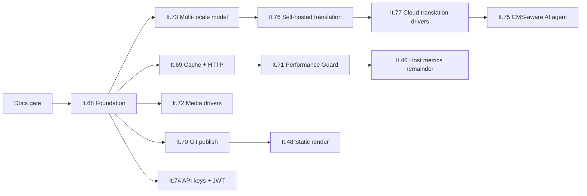

# Hybrid Engine — implementation wave It.68–77

> **Status:** Documentation Phase 0 · implementation paused until the SK/EN documentation pass is complete  
> **Checkpoint:** `v2.1.0-beta.23` · August 2, 2026  
> **Architecture baseline:** [Hybrid Engine](architecture/HYBRID_ENGINE.md) · [No-SQL mandate](architecture/NOSQL_MANDATE.md) · [deployment modes](architecture/DEPLOYMENT_MODES.md)

This wave turns the new PaginiumCMS direction into an implementable plan. The project is growing from an advanced flat-file CMS into a **Hybrid Headless Content Engine**, without changing its data foundation: content and configuration remain in files; the index, cache, Git, queues, and external services are derived, distribution, or optional layers.

---

## 1. Invariant wave contract

Every It.68–77 iteration must preserve these rules:

1. **Classic mode is the default and regression baseline.** Missing `engine.*` settings mean compatible local behavior.
2. **No SQL authority.** Neither a relational nor a document database may become the only source of content, settings, keys, or operational state required for recovery.
3. **Primary write before derived layers.** A document is stored safely before the index, cache, Git publish, or AI/translation workflow is updated.
4. **Derived layers are disposable and recoverable.** The index and cache provide rebuilds; publish queues, metrics, and quotas provide diagnostics and repair.
5. **Security parity.** A new driver, Bearer client, or agent must not bypass validation, RBAC, audit, rate limits, or path controls.
6. **An optional service is not a hidden dependency.** Redis, a Git remote, S3, a translation provider, or an LLM must not be required to run the Classic profile.
7. **Human confirmation for generated content.** Translations and AI output are working proposals; autonomous publishing is outside this wave.
8. **Bilingual documentation is part of Definition of Done.** The SK and EN contracts change in the same release.

---

## 2. Phases and dependencies



The iteration number does not define delivery order. **It.75 is delivered after It.76/77**, because the agent relies on a stable localization model and provider layer.

### Canonical phases

| Phase | Iterations | Outcome |
|-------|------------|---------|
| **Phase 0** | documentation | aligned SK/EN contract and locked invariants |
| **HE-1 Foundation** | **It.68** | storage abstraction, schema registry, engine settings |
| **HE-2 Read performance** | **It.69** | unified cache, Redis fallback, HTTP validators |
| **HE-3 Distribution** | **It.70** + It.48 coordination | immediate/queued Git publish and later static build |
| **HE-4 Observability** | **It.71** + It.46 remainder | PHP APM, budgets, incidents, and host metrics |
| **HE-5 Integrations** | **It.72**, **It.74** | media drivers and additive headless authentication |
| **HE-6 Localized workflows** | **It.73 → 76 → 77 → 75** | localized documents, translation, and a safe AI agent |

This document canonically assigns It.73 to **HE-6**. The earlier draft inconsistently labelled it HE-5.

---

## 3. Iteration overview

| It. | Title | Priority | Status | Required dependency | Absorbs / coordinates |
|-----|-------|----------|--------|---------------------|------------------------|
| **68** | [Hybrid Engine foundation](ITERATION_68.md) | 🔴 | ⏸️ docs gate | Phase 0 | foundation for every later layer |
| **69** | [Cache + HTTP conditional requests](ITERATION_69.md) | 🔴 | ⏳ | It.68 | absorbs It.45 and It.49 |
| **70** | [Git publish modes](ITERATION_70.md) | 🟡 | ⏳ | It.68 | extends `GitHubService`, coordinates It.48 |
| **71** | [Performance Guard](ITERATION_71.md) | 🟡 | ⏳ | It.69 | complements It.7 and It.46 remainder |
| **72** | [Media storage drivers](ITERATION_72.md) | 🟡 | ⏳ | It.68 | follows DAM It.24 |
| **73** | [Multi-locale content document](ITERATION_73.md) | 🟡 | ⏳ | It.68 | foundation for It.76/77/75 |
| **74** | [API keys and JWT](ITERATION_74.md) | 🟡 | ⏳ | It.68; cached lookup from It.69 recommended | session auth remains |
| **76** | [Self-hosted translation](ITERATION_76.md) | 🔵 | ⏳ | It.73 | creates the provider contract |
| **77** | [Cloud translation](ITERATION_77.md) | 🔵 | ⏳ | It.76 | adds cloud drivers without a second UI |
| **75** | [CMS-aware AI agent](ITERATION_75.md) | 🔵 | ⏳ | It.73 + stable provider/tool layer | uses It.29 queue and It.66 gates |

---

## 4. Parallel and external streams

| Item | Relationship to this wave | Rule |
|------|---------------------------|------|
| **It.67** untrusted surfaces | security gate | complete before expanding generated/imported code surfaces |
| **It.58d** layout remainder | parallel product stream | must not create a second content model or publish pipeline |
| **It.48** static render | continuation of It.70 | a build trigger is a separate step after successful Git publish |
| **It.46** host metrics remainder | complement to It.71 | host agent and in-request PHP APM remain separate layers |
| **It.25** setup/update UX | pre-Final | the wizard must label optional services as optional |
| Community beta | continuous gate | clean install, upgrade, rollback, and non-maintainer UX |

---

## 5. Shared transaction model

A successful mutation follows this order:

```text
authentication → authorization → schema/input validation
→ revision/lock check → atomic SSOT write
→ index update → cache invalidation
→ audit/event → optional publish/translation/agent job
```

When a derived layer fails after a successful write:

- the primary document is not rolled back merely because Redis or Git failed,
- the response distinguishes **stored** from **distributed**,
- the system records an incident and retry state,
- diagnostics expose rebuild/retry actions,
- an idempotent job must not create a duplicate commit or apply a patch twice.

---

## 6. Shared quality gate

After every iteration:

- `./scripts/iteration-gate.sh` is green,
- PHPUnit and PHPStan level 8 pass,
- TypeScript, ESLint, and Vitest pass for the affected frontend,
- the Classic smoke test runs without Redis, Git, S3, a translator, or an LLM,
- a new feature flag is disabled by default or has a safe default,
- migration dry-run and rollback are documented,
- security tests cover permissions, paths, SSRF, secrets, and logging as applicable,
- SK/EN documentation, changelog, and incident records change together with the code.

---

## 7. Release strategy

The recommended approach is to ship vertical slices rather than one large merge:

1. **It.68** with the local driver only and one migrated vertical slice.
2. **It.69** with file/memory parity first, optional Redis second, and HTTP validators last.
3. **It.70** with a local Git fixture, queued workflow, and then remote push.
4. **It.71–74** as separate, disable-able capabilities.
5. **It.73** with a dry-run migration and an extended beta window.
6. **It.76/77** with one shared UI and provider registry.
7. **It.75** only after tool contracts stabilize and pass a security review.

Final 1.0 does not have to wait for all of It.68–77. A separate release decision defines GA scope; the Classic profile must remain supported throughout the wave.

---

## 8. Documentation status

Phase 0 for this wave is ready when:

- all 11 documents exist as structurally matching SK/EN editions,
- priorities, phases, and dependencies match,
- It.73 is HE-6 everywhere,
- additive It.74 authentication does not change the admin session flow,
- AI and translation remain proposal workflows requiring explicit confirmation,
- no planned capability is presented as implemented.

**Next implementation:** It.68 only after the complete bilingual documentation gate and an explicit maintainer decision.
