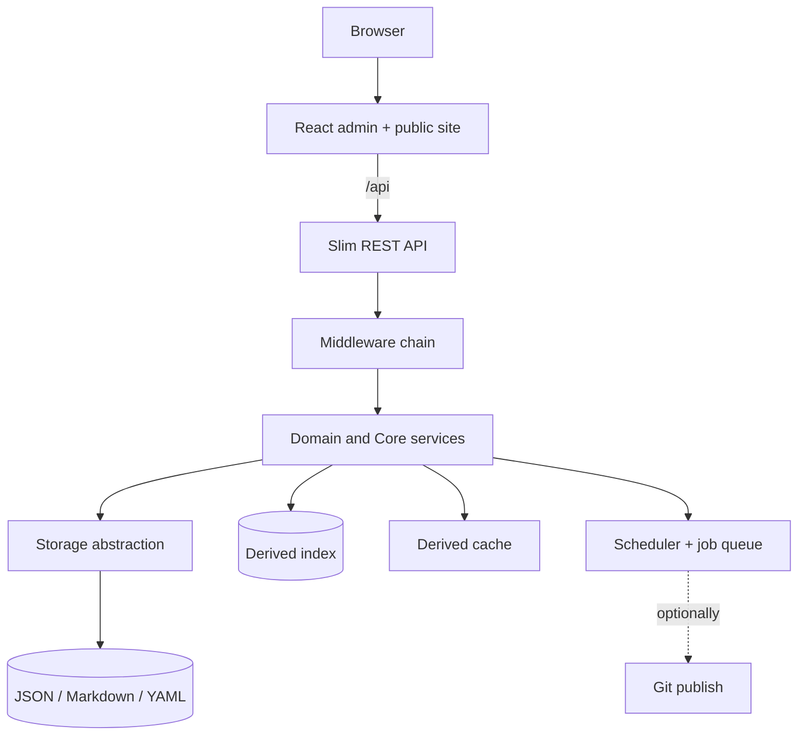

# 🏛️ PaginiumCMS

> **Final consolidation:** the complete index is in [NAVIGATION.md](NAVIGATION.md). Status claims distinguish implemented, transitional, and planned capabilities.

> **Version:** 2.1.0-beta.23 · **Last updated:** August 2026  
> **Hybrid Headless Content Engine** — No-SQL file source of truth, API-first administration, and a public React site.

---

## 🎯 Vision and philosophy

PaginiumCMS keeps its Core intentionally narrow, secure, and readable. Primary content, configuration, and operational state **must remain in files**. This rule is defined by [architecture/NOSQL_MANDATE.md](architecture/NOSQL_MANDATE.md).

The project is evolving into a **Hybrid Engine**: above the file source of truth it adds indexing, caching, storage abstractions, Git distribution, a multilingual document model, and future AI-assisted workflows. The target design is documented in [architecture/HYBRID_ENGINE.md](architecture/HYBRID_ENGINE.md).

**Why the project exists:** to make a modern full stack understandable through real, open, documented code — from the file model through the Slim API to React administration. The canonical mission is described in [PHILOSOPHY.md](PHILOSOPHY.md).

### Core principles

- **Mandatory No-SQL source of truth:** JSON, Markdown, and YAML on disk; no MySQL, PostgreSQL, or MongoDB as the CMS authority.
- **API First:** important administration operations have a defined REST contract.
- **Security by Design:** authentication, authorization, validation, encryption, and audit belong in the Core.
- **Thin Core:** features grow through modules, drivers, and extensions.
- **Derived layers:** indexes, caches, and Git distribution must not replace source documents.
- **Documentation First:** design, limitations, and actual status are documented before broad implementation changes.
- **Demo is showcase only:** `demo.paginiumcms.com` is neither production storage nor a separate paid edition.

---

## 🌍 Documentation language editions

Documentation is maintained in two separate, equivalent trees:

```text
SK/    # Slovak edition
EN/    # English edition
```

Bilingual documentation rules:

1. one file contains one language only,
2. both editions use the same relative structure and filenames,
3. code, class names, endpoints, paths, and configuration keys are not translated,
4. feature status (`✅`, `🟡`, `⏳`, `⏸️`) must match in both editions,
5. meaning is reviewed semantically rather than through mechanical sentence translation,
6. architecture changes update both language editions in the same documentation change.

---

## 📊 Current project status — August 2026

| Area | Status | Notes |
|------|--------|-------|
| **Architecture pivot** | ✅ Phase 0 | Hybrid Engine and the No-SQL mandate are defined |
| **Backend API** | ✅ Stable beta Core | Slim 4, PHP-DI, route auto-discovery |
| **No-SQL SSOT** | ✅ Enforced | files, safe writes, index, and diagnostics |
| **Administration authentication** | ✅ Functional | session + CSRF + RBAC + 2FA |
| **Content index and OCC** | ✅ Shipped | `content.json`, 409 conflicts, versioning |
| **Cache** | 🟡 Partial | file/memory; unified Redis layer → It.69 |
| **Git distribution** | 🟡 Partial | GitHub API sync; full publishing workflow → It.70 |
| **Public and admin frontend** | ✅ Shipped | React, TypeScript, Vite 8, SK/EN i18n |
| **Automated tests** | ✅ 1000+ PHPUnit | PHPStan L8; frontend gate in `developer/TESTING.md` |
| **Latest documented release** | ✅ `v2.1.0-beta.23` | It.58c Layout Switch |
| **Hybrid Engine foundation (It.68)** | ✅ `[Unreleased]` | storage abstraction, schema registry, engine settings |
| **Next code work** | ⏳ It.69 | unified cache, optional Redis, HTTP validators |

### Planned Hybrid Engine wave

| Iteration | Feature |
|-----------|---------|
| **68** | Storage abstraction, schema registry, and engine settings | ✅ `[Unreleased]` |
| **69** | Unified cache, Redis, `ETag`, and `Last-Modified` |
| **70** | Immediate and queued Git publish |
| **71** | Performance Guard — APM middleware |
| **72** | Flysystem media drivers, S3/CDN |
| **73** | Multiple locales in one content document |
| **74** | Additive API keys and JWT for headless clients |
| **75** | Cross-module CMS AI agent |
| **76** | Assisted translation through self-hosted LibreTranslate |
| **77** | Assisted translation through cloud providers |

Wave map: [ITERATION_WAVE_HYBRID_ENGINE.md](ITERATION_WAVE_HYBRID_ENGINE.md) · Full backlog: [ITERATION_BACKLOG.md](ITERATION_BACKLOG.md)

---

## 🧱 Technology stack

- **PHP:** 8.5+, strict types, PHPStan level 8
- **Backend:** Slim 4, PHP-DI, PSR-7/15, League CommonMark, OTPHP
- **Frontend:** React, TypeScript, Vite 8, TailwindCSS
- **Primary storage:** JSON / Markdown / YAML files
- **Index:** `data/index/content.json`, safe rebuild and concurrent writes
- **Cache:** file and memory; Redis is a planned derived layer
- **Operations:** Docker Compose or classic PHP/nginx deployment
- **Testing:** PHPUnit, PHPStan, TypeScript type-check, ESLint, Vitest

---

## 🗺️ Architecture overview



### System layers

1. **Presentation:** React administration, public SPA, and future static output.
2. **API:** Slim routes, middleware, authentication, and a consistent JSON contract.
3. **Domain and Core:** content, settings, versioning, locks, scheduler, and events.
4. **Abstractions:** storage, cache, media, and publisher interfaces.
5. **Derived layers:** indexes, caches, metrics, and distribution pipelines.
6. **SSOT:** physical files — the mandatory No-SQL foundation.

Details: [architecture/HYBRID_ENGINE.md](architecture/HYBRID_ENGINE.md).

---

## 🗂️ Project structure

```text
paginiumcms-architecture/
├── backend/
│   ├── app/
│   │   ├── Core/           # FlatFile, Cache, Backup, Scheduler, Settings, …
│   │   ├── Http/           # Controllers, Middleware, Routes, Config/services.php
│   │   ├── Modules/        # Security, Media, Comments, Audit, …
│   │   └── Support/        # Lang, JsonHelper
│   ├── bootstrap/          # app.php — single bootstrap entry
│   ├── bin/console         # audit:run, scheduler:run, worker:process, …
│   ├── lang/               # application SK/EN translations
│   ├── public/             # index.php → bootstrap/app.php
│   ├── storage/            # content, cache, logs, and backups
│   └── tests/              # PHPUnit tests
├── frontend/               # React administration and public site
├── docs/                   # architecture, guides, roadmaps, and iterations
├── vendor/                 # Composer dependencies at project root
├── composer.json
└── phpunit.xml
```

---

## 🔌 API overview

| Group | Prefix | Access |
|-------|--------|--------|
| Authentication | `/api/auth/*` | mixed; registration can be disabled |
| Content | `/api/pages`, `/api/articles` | public GET for published content; writes require permission |
| Search | `/api/search?q=&scope=admin\|public&types=` | public published results or administration palette |
| SEO | `/api/seo/{type}/{slug}` | public metadata |
| Media | `/api/media/*` | EDITOR+ role and relevant permissions |
| Feeds | `/feed.xml`, `/sitemap.xml`, `/robots.txt` | public |
| Jobs | `/api/admin/jobs/*` | ADMIN |
| Static media | `/storage/{path}` | public allow-list with path protection |
| Settings | `/api/settings/public`, `/api/admin/settings/*` | public slice / ADMIN |
| Trash | `/api/admin/trash/*` | EDITOR+ |
| Administration | `/api/admin/*` | authentication + role + optional 2FA rules |
| Health | `/api/health` | public; available during maintenance |

Routes in `backend/app/Http/Routes/*.php` are loaded automatically through `bootstrap/app.php`.

Detailed contracts:

- [architecture/API.md](architecture/API.md)
- [architecture/API_CONTRACT.md](architecture/API_CONTRACT.md)
- [architecture/CONTENT_API.md](architecture/CONTENT_API.md)
- [architecture/CORE_HARDENING.md](architecture/CORE_HARDENING.md)

---

## 🔒 Security principles

- session authentication with session ID regeneration after login,
- Argon2id passwords and a central password policy,
- RBAC and permission middleware,
- synchronizer CSRF token for mutating API requests,
- encryption of TOTP seeds and sensitive settings through `APP_KEY`,
- WAF, rate limiting, and sanitized structured logging,
- SSRF protection for outbound URLs,
- Path ACL and a public-storage allow-list,
- extension policy, Zip-Slip protection, and untrusted-code validation,
- audit events and safe CSV export,
- controlled maintenance and demo-mode behavior.

References: [SECURITY_REVIEW.md](SECURITY_REVIEW.md) · [developer/SECURITY.md](developer/SECURITY.md) · [../SECURITY.md](../../SECURITY.md)

---

## 🚀 Getting started

### Recommended — Docker and the first administrator

```bash
git clone <repo> paginiumcms && cd paginiumcms
chmod +x scripts/first-run.sh
./scripts/first-run.sh
docker compose up -d
curl -s http://localhost:8080/api/health
```

Default account: `admin@localhost` / `Admin123!ChangeMe`. Override it before first run through the `FIRST_ADMIN_*` variables.

### Classic two-terminal development

```bash
composer install
./vendor/bin/phpunit --testdox
./vendor/bin/phpstan analyse backend --level=8

# Backend
cd backend/public && php -S localhost:8080

# Frontend — separate terminal
cd frontend && npm install && npm run dev
# → http://localhost:3025
```

Local environment: [developer/LOCAL_SETUP.md](developer/LOCAL_SETUP.md) · Native development: [deploy/DEV.md](deploy/DEV.md)

### Production cron

```bash
* * * * * cd /path/to/paginiumcms && php backend/bin/console scheduler:run && php backend/bin/console worker:process
```

Details: [deploy/CRON.md](deploy/CRON.md).

### Developer Mode unlock

```http
POST /api/admin/developer/unlock  { "totp_code": "123456" }
GET  /api/admin/developer/logs
```

Details: [user/DEVELOPER_MODE.md](user/DEVELOPER_MODE.md) · [user/CODE_EDITOR.md](user/CODE_EDITOR.md)

---

## 📚 Documentation index

### Foundation and direction

| Document | Purpose |
|----------|---------|
| **[PHILOSOPHY.md](PHILOSOPHY.md)** | Project mission and immutable principles |
| **[architecture/NOSQL_MANDATE.md](architecture/NOSQL_MANDATE.md)** | Mandatory file source of truth |
| **[architecture/HYBRID_ENGINE.md](architecture/HYBRID_ENGINE.md)** | Hybrid Engine target architecture |
| **[architecture/DEPLOYMENT_MODES.md](architecture/DEPLOYMENT_MODES.md)** | Classic, Hybrid, and Git-headless profiles |
| [ROADMAP.md](ROADMAP.md) | Overall direction and iteration order |
| [CONTINUATION.md](CONTINUATION.md) | Project continuation context |
| [FEATURE_OVERVIEW.md](FEATURE_OVERVIEW.md) | Shipped and planned features |
| [ITERATION_BACKLOG.md](ITERATION_BACKLOG.md) | Consolidated backlog |
| [../CHANGELOG.md](../../CHANGELOG.md) | Release history |

### Architecture

| Document | Purpose |
|----------|---------|
| [architecture/ARCHITECTURE.md](architecture/ARCHITECTURE.md) | Deep system architecture |
| [architecture/API.md](architecture/API.md) | API reference |
| [architecture/API_CONTRACT.md](architecture/API_CONTRACT.md) | JSON envelopes, errors, and metadata |
| [architecture/CONTENT_API.md](architecture/CONTENT_API.md) | Pagination, search, and publishing rules |
| [architecture/CORE.md](architecture/CORE.md) | Core-layer responsibilities |
| [architecture/CORE_HARDENING.md](architecture/CORE_HARDENING.md) | RBAC, maintenance, trash, and hardening |
| [architecture/STORAGE.md](architecture/STORAGE.md) | File layout and write rules |
| [architecture/VERSIONING.md](architecture/VERSIONING.md) | Revisions and conflicts |
| [architecture/PLUGINS.md](architecture/PLUGINS.md) | Extensions and runtime |
| [architecture/THEMES.md](architecture/THEMES.md) | Themes and color schemes |

### User and administrator

| Document | Purpose |
|----------|---------|
| **[user/README.md](user/README.md)** | User documentation entry point |
| [user/INSTALLATION.md](user/INSTALLATION.md) | Installation |
| [user/FIRST_STEPS.md](user/FIRST_STEPS.md) | First login, 2FA, and first content |
| [user/ADMIN_GUIDE.md](user/ADMIN_GUIDE.md) | Complete CMS administration |
| [user/BETA_TESTER.md](user/BETA_TESTER.md) | Beta tester smoke test |
| [user/CONTENT_EDITOR.md](user/CONTENT_EDITOR.md) | Page and article editor |
| [user/ACCESS_CONTROL.md](user/ACCESS_CONTROL.md) | Roles, permissions, and Path ACL |
| [user/FIREWALL.md](user/FIREWALL.md) | WAF and firewall administration |
| [user/LOGGING.md](user/LOGGING.md) | Operational and security logs |
| [user/CODE_EDITOR.md](user/CODE_EDITOR.md) | Safe Code Editor |
| [user/DEVELOPER_MODE.md](user/DEVELOPER_MODE.md) | Developer Mode and tokens |

### Development, testing, and deployment

| Document | Purpose |
|----------|---------|
| [developer/CONTRIBUTING.md](developer/CONTRIBUTING.md) | Contribution rules |
| [developer/LOCAL_SETUP.md](developer/LOCAL_SETUP.md) | Docker and local environment |
| [developer/CODING_STANDARDS.md](developer/CODING_STANDARDS.md) | Coding standards |
| [developer/TESTING.md](developer/TESTING.md) | Test strategy and quality gate |
| [developer/SECURITY.md](developer/SECURITY.md) | Security architecture |
| [developer/RELEASE.md](developer/RELEASE.md) | Release and deployment checklist |
| [developer/BETA_INFRA.md](developer/BETA_INFRA.md) | Beta infrastructure gate |
| [deploy/DEPLOY.md](deploy/DEPLOY.md) | Production and demo deployment |
| [deploy/DEMO_DEPLOY.md](deploy/DEMO_DEPLOY.md) | Demo instance |
| [deploy/DEV.md](deploy/DEV.md) | Native development |
| [deploy/NGINX_API.md](deploy/NGINX_API.md) | Nginx and API proxy |
| [deploy/CRON.md](deploy/CRON.md) | Scheduler and worker |

### Beta and security review

| Document | Purpose |
|----------|---------|
| [PUBLIC_BETA1.md](PUBLIC_BETA1.md) | Public Beta 1 scope and feedback |
| [SECURITY_REVIEW.md](SECURITY_REVIEW.md) | External security review guide |
| [ISSUES.md](ISSUES.md) | Known incidents, root causes, and fixes |
| [CHECKLIST.md](CHECKLIST.md) | API, frontend, and feature inventory |
| [../AUDIT_REPORT.md](../../AUDIT_REPORT.md) | Project audit |
| [../SECURITY.md](../../SECURITY.md) | Vulnerability reporting |

---

## 🧭 Iteration documentation

The `ITERATION_*.md` files record design, implementation, tests, and status for individual features. Historical iterations remain intact; the new direction does not erase them, but groups their capabilities into Hybrid Engine layers.

| Range | Scope |
|-------|-------|
| It.1–5 | locks, autosave, conflicts, settings, and authentication |
| It.6–18 | notifications, monitoring, media, feeds, SSO, blueprints, demo, plugins, and i18n |
| It.19–29 | index, API contract, hardening, SEO, DAM, view modes, bulk actions, and scheduler |
| It.30–67 | administration UX, Redis design, WAF, editor, newsletter, updates, gallery, and security packs |
| **It.68–77** | **Hybrid Engine, cache, Git, APM, media drivers, locale model, API auth, and AI workflows** |

New wave map: [ITERATION_WAVE_HYBRID_ENGINE.md](ITERATION_WAVE_HYBRID_ENGINE.md).

---

## ⚠️ Known documentation and product limitations

- Not every historical document in the source package used one language consistently; a separate SK/EN pass is in progress.
- `architecture/EVENTS.md`, `architecture/FRONTEND.md`, `architecture/MODULES.md`, `developer/DEVELOPMENT.md`, `user/PLUGINS.md`, and `user/THEMES.md` are empty in the source package and require authored content, not translation only.
- Some older overview documents contain stale versions or iteration status; the bilingual review will align them with the changelog and code.
- Hybrid Engine It.68 foundation is shipped in `[Unreleased]`; It.69–77 remain planned.
- The legal scope of open-source and commercial use must match the repository's current `LICENSE` file.

---

> **Documentation First:** when code and documentation diverge, documentation must first describe the actual state precisely, and the next code change must deliberately close the gap.
