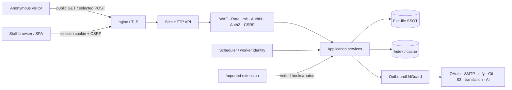

# Security Review Guide

> **Target documentation snapshot:** `v2.1.0-beta.23`  
> **Audience:** external auditors, beta testers, and maintainers.  
> Always verify an exact tag or commit. Do not test planned It.68–77 capabilities as implemented until a concrete release marks them as delivered.

## 1. Preparing an isolated lab

```bash
git clone https://github.com/techberode/paginiumcms-architecture.git
cd paginiumcms-architecture
git checkout --detach v2.1.0-beta.23
git rev-parse HEAD

export FIRST_ADMIN_EMAIL='auditor@localhost'
export FIRST_ADMIN_PASSWORD='use-a-unique-lab-password'
export FIRST_ADMIN_NAME='Security Auditor'

chmod +x scripts/first-run.sh
./scripts/first-run.sh
docker compose up -d
curl -fsS http://localhost:8080/api/health
```

- Do not use a documentation password on a network-accessible instance.
- The lab must not contain production `.env`, `APP_KEY`, user JSON, or media.
- Record commit, lockfile hashes, PHP/Node versions, and Docker Compose config before testing.
- Destroy lab secrets and test data after the review.

Quality-gate and release rules are defined in [TESTING.md](developer/TESTING.md) and [RELEASE.md](developer/RELEASE.md).

## 2. Architecture and trust boundaries



Critical boundaries:

1. internet → nginx,
2. browser → session/CSRF API,
3. HTTP route → backend authorization,
4. user path/archive → filesystem,
5. extension → Core API,
6. CMS → outbound provider,
7. scheduler/worker → privileged operation,
8. authoritative SSOT → index/cache/Git remote,
9. CI/release → production artifact.

## 3. Review workflow

1. **Identify the baseline:** tag, SHA, profile, runtime, lockfiles.
2. **Read the threat model:** [developer/SECURITY.md](developer/SECURITY.md).
3. **Run the quality gate:** retain the raw local log outside the repository.
4. **Review anomalies manually:** warnings, skips, dependency advisories, network errors, and secrets in logs.
5. **Map the route inventory:** every mutation needs authn/authz/CSRF or an explicit anonymous exception.
6. **Test the trust boundary:** not only the happy-path controller.
7. **Create a minimal PoC:** without production data or persistence.
8. **Propose a regression test:** a finding without a test is easy to reintroduce.
9. **Report privately:** follow the root [SECURITY.md](../../SECURITY.md).

## 4. Authentication, session, and 2FA

Verify:

- Argon2id and password policy,
- `session_regenerate_id()` after login/privilege changes,
- cookie flags appropriate for the HTTPS profile,
- generic login/reset responses against enumeration,
- login lockout and OTP rate limits,
- TOTP seed encrypted at rest,
- no `debug_code`, seed, QR, or provisioning URI in production responses/logs,
- reset-token hash, expiry, single use, and timing-safe comparison,
- logout and session invalidation.

Negative tests:

| Test | Expected |
|---|---|
| 20 invalid logins | lockout or `429` according to policy |
| reuse a reset token | rejected |
| OTP resend over limit | rejected without resetting attempts |
| test log after 2FA flow | no seed/QR/OTP |

## 5. Authorization, RBAC, and Path ACL

A frontend route guard is not evidence of authorization. Verify backend middleware and service-level invariants for every mutation.

- `USER` cannot mutate content/media,
- `EDITOR` needs explicit permissions,
- `ADMIN` does not automatically gain `SUPER_ADMIN` capabilities,
- privileged jobs/deployment need a separate policy,
- Path ACL applies after logical-path canonicalization,
- workers/API keys/AI tools do not inherit full interactive-admin rights.

Also test bulk, restore, draft, lock, trash, and import endpoints; side routes often bypass the main guard.

## 6. CSRF, CORS, and proxy identity

- a mutating browser request without `X-CSRF-TOKEN` → `403 csrf_invalid`,
- an exempt prefix uses a path boundary rather than only `starts_with`,
- login/register/contact/comments exceptions have their own rate-limit and abuse controls,
- production CORS does not use a development wildcard with credentials,
- `TRUSTED_PROXIES` contains only proxy hops, not ordinary LAN clients,
- `X-Forwarded-For` from an untrusted client is ignored.

Test middleware order with a real HTTP integration test; Slim LIFO can change expected execution.

## 7. Flat-file storage, uploads, and media

Mandatory scenarios:

- traversal and encoded traversal,
- absolute path and Windows separator,
- symlink/hardlink in an imported archive,
- race/OCC conflict,
- disk-full or write failure before rename,
- corrupt JSON/Markdown and index rebuild,
- public attempts to access `data/`, `logs/`, `backups/`,
- SVG/HTML/XML upload and response headers,
- ZIP-bomb limits: count, size, compression ratio,
- private-media/Path ACL delivery.

Critical invariant:

```text
public storage route → allow-listed media only
```

## 8. Extensions, themes, and Code Editor

Review:

- manifest schema and compatibility,
- safe ZIP entry before extraction,
- quarantine/staging before activation,
- bypasses for `include`, `require`, `eval`, `unserialize`, dynamic calls, and obfuscation,
- Code Editor allowed roots,
- Developer Mode TOTP/token unlock and TTL,
- explicit activation/deactivation/rollback,
- the fact that a Vite frontend extension is build-time, not a magical runtime import.

Code Policy is not a sandbox. When assessing a finding, include process access to secrets, filesystem, and network.

## 9. Outbound communication and SSRF

For every admin-configured URL/provider, verify:

- allowed schemes,
- parsing of userinfo/port/IPv6,
- DNS resolution and rebinding risk,
- private, loopback, link-local, and metadata IPs,
- redirect revalidation,
- timeout, response-size, and content-type limits,
- proxy policy,
- log redaction of URL query and headers.

A fixed allow-listed provider host is lower risk but should still use a centralized client and safe timeouts.

## 10. WAF, logging, audit, and exports

- WAF body scanning is bounded and does not read an unbounded stream,
- multipart and Code Editor use an explicit policy rather than a silent bypass,
- CR/LF/ANSI are sanitized before logging,
- CSV exports prevent formula injection,
- secrets and authorization headers are redacted,
- access logs distinguish expected `401/404` from server `5xx`,
- request/job IDs allow correlation without personal data,
- log delete/archive operations require authorization and audit.

GitHub CI should display only a sanitized log; raw CI output remains in `$RUNNER_TEMP` and must not be uploaded.

## 11. Secrets and encryption at rest

- production requires a non-placeholder `APP_KEY`,
- encrypted fields use one format/prefix and fail closed on decrypt,
- backups include recovery of `APP_KEY`, but not in the same openly accessible archive,
- a secret is not displayed again after create/save,
- rotation has a migration or re-encryption procedure,
- the public settings endpoint cannot return a secret or an offline-attackable hash.

Test missing, incorrect, and rotated keys on isolated data.

## 12. Scheduler, jobs, and privileged operations

A worker is not `SUPER_ADMIN` merely because it runs through CLI.

Verify:

- actor/service identity,
- handler allowlist,
- payload schema and immutable privileged fields,
- idempotency key,
- overlap lock,
- retries and dead-letter/failure state,
- audit of initiator and executor,
- prohibition on automatic deployment jobs without policy.

## 13. Deployment, nginx, and supply chain

- docroot is only `backend/public` plus the static frontend,
- `/storage/` is not directly aliased to the entire backend storage,
- security headers cover static and API responses,
- `expose_php=Off`,
- immutable tag/commit and lockfiles,
- `composer install`/`npm ci`, not update on the server,
- artifact checksum,
- GitHub CI belongs to the deployed SHA,
- backup before deployment,
- health + auth + public-content smoke,
- rollback protects newer SSOT.

## 14. Conditional Hybrid Engine review

Use only for an actually implemented capability:

| Capability | Main review focus |
|---|---|
| Redis/cache | key namespace, poisoning, stale auth data, fallback |
| Git publish | credential scope, branch/ref injection, conflict, retry |
| S3 media | bucket policy, presigned URL, metadata/MIME, orphaning |
| API keys/JWT | secret display, scope, expiry, revocation, replay |
| Translation | provider data exposure, locale mapping, draft-only apply |
| AI agent | prompt injection, tool schema, permission recheck, publish ban |

If the feature does not exist in the tag, the result is `NOT_APPLICABLE`, not `PASS`.

## 15. Public and anonymous surface

Rather than relying on an old documentation list, enumerate routes in the concrete tag. Pay special attention to:

- login/register/reset/OTP,
- contact/comments/newsletter,
- public settings and demo info,
- pages/articles/media/feed/SEO,
- maintenance and debug endpoints,
- `/.well-known/security.txt`,
- storage media delivery.

Every anonymous POST needs input validation, rate limiting, abuse/spam policy, and a response that does not enable enumeration.

## 16. Suggested test checklist

| # | Test | Expected result |
|---:|---|---|
| 1 | `GET /storage/.../data/users/...` | `404` |
| 2 | traversal in storage/media/code editor | rejected |
| 3 | USER `POST /api/pages` | `403` |
| 4 | draft/lock without `content:edit` | `403` |
| 5 | mutation without CSRF | `403 csrf_invalid` |
| 6 | similar but non-exempt prefix | CSRF still required |
| 7 | spoofed XFF outside trusted proxy | ignored |
| 8 | repeated invalid login | lockout/`429` |
| 9 | OTP resend/verify brute force | limited |
| 10 | test log after 2FA | no secrets |
| 11 | plugin ZIP with `../` or symlink | rejected |
| 12 | plugin with forbidden construct | rejected |
| 13 | OAuth redirect mismatch | authentication failure |
| 14 | URL to metadata/private IP | blocked |
| 15 | outbound redirect to private IP | blocked |
| 16 | CSV containing `=cmd` and CRLF | safely escaped/sanitized |
| 17 | corrupt index | rebuilt from SSOT |
| 18 | concurrent edits | `409`/merge flow |
| 19 | restore without the correct APP_KEY | fail closed, no silent reset |
| 20 | deployment rollback | application works, newer SSOT preserved |

## 17. Finding report template

```markdown
## SEC-YYYY-NNN — short title

- Affected tag/SHA:
- Severity and rationale:
- Preconditions:
- Reproduction:
- Actual result:
- Expected invariant:
- Impact:
- Evidence after redaction:
- Suggested regression test:
- Suggested remediation:
- Disclosure constraints:
```

Do not submit a complete `.env`, user JSON, TOTP seed, cookie, or production dump.

## 18. Reporting

Follow the root [SECURITY.md](../../SECURITY.md). After a fix is released, the public record is linked from [ISSUES.md](ISSUES.md) with cause, resolution, test, and release where available.
