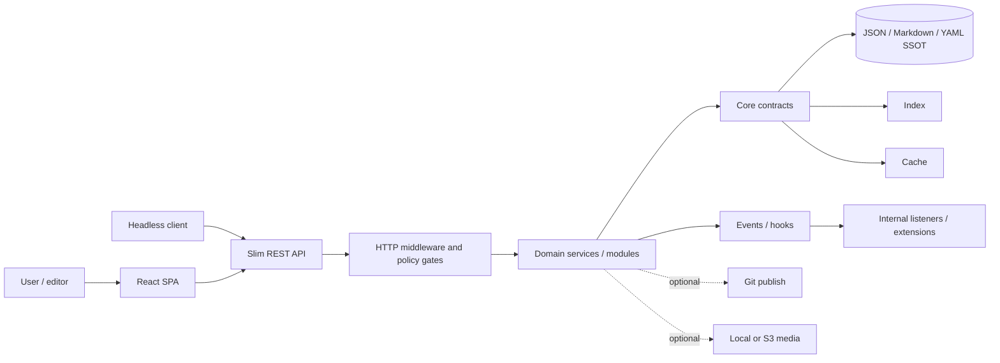

# 🏛️ PaginiumCMS Architecture

> **Architecture status:** Public Beta · documentation checkpoint `v2.1.0-beta.23` · August 2, 2026  
> **Identity:** Hybrid Headless Content Engine  
> **Immutable rule:** [No-SQL mandate](./NOSQL_MANDATE.md)

This document is the primary technical overview of the system. It defines layer boundaries, data ownership, dependency direction, and the difference between the **currently implemented state** and the **target architecture**. Detailed contracts live in [CORE.md](./CORE.md), [STORAGE.md](./STORAGE.md), [MODULES.md](./MODULES.md), [EVENTS.md](./EVENTS.md), and [HYBRID_ENGINE.md](./HYBRID_ENGINE.md).

---

## 1. Architecture identity

PaginiumCMS is an **API-first Hybrid Headless Content Engine** with a mandatory file-based source of truth. Content, settings, and recoverable operational state remain in JSON, Markdown, or YAML files. The index, cache, Git distribution, queues, APM, external translation, and AI are add-on layers; they must never become the only place where primary content exists.

This places the project between two extremes:

- it is not a primitive “blog that scans a directory on every request,”
- it is not a database-dependent monolith that cannot recover content without an external cluster.

The goal is a professional content engine with a readable data contract, sensible defaults, and a growth path from a single server to headless/Jamstack distribution.

---

## 2. Core principles

1. **Files are authoritative.** SQL or an external document database is not permitted as the CMS source of truth.
2. **The Classic profile is the baseline.** The system must work without Redis, a Git remote, S3, an LLM, or cloud translation.
3. **API-first does not mean API-only.** The React administration uses the same domain services as external clients and cannot bypass policy.
4. **Security is cross-cutting.** Authentication, authorization, validation, audit, path protection, and rate limiting precede domain writes.
5. **Core provides platform contracts.** Optional product functionality belongs in modules or extensions.
6. **Derived layers are recoverable.** Index and cache need rebuild operations; queue and publishing state need retry and diagnostics.
7. **Documentation is part of the change.** Architecture contracts are updated with code in both SK and EN.
8. **Extensions cannot bypass boundaries.** A driver, module, plugin, or AI tool may not write outside validated services.

---

## 3. System context



### Trust boundaries

| Zone | Trust | Required controls |
|------|-------|-------------------|
| Browser and external client | untrusted | auth, CSRF by client type, RBAC/scopes, validation, rate limits |
| HTTP layer | enforcement boundary | request normalization, middleware, unified errors |
| Domain layer | partially trusted | invariants, permission checks, revision/lock checks |
| Storage and drivers | privileged | allow-listed paths, atomic writes, audit, safe permissions |
| Plugin/import/AI content | untrusted code or data | code policy, manifest, schema, human Apply, no autonomous publishing |

---

## 4. Logical layers

| Layer | Responsibility | Must not |
|-------|----------------|----------|
| **Presentation** | React, forms, editor, public UI | be the only place enforcing authorization |
| **HTTP/API** | routes, request/response mapping, middleware, error envelope | write directly to files |
| **Application/Modules** | use cases, workflows, domain-specific rules | depend on another module's internal classes |
| **Core** | storage, cache, settings, events, logging, security primitives, queue | contain UI or Slim routes |
| **Drivers/Infrastructure** | local disk, cache driver, Git, media driver | change a document's domain meaning |
| **SSOT** | authoritative documents and recoverable state | be replaced by cache or index |

Dependencies point inward:

```text
Presentation → HTTP → Module/Application → Core contracts → drivers → files
```

Core must not depend on React, Slim controllers, or a specific optional module. A module may depend on public Core contracts. Cross-module communication should use an explicit service, contract, or event rather than importing another module's private repository.

---

## 5. Read and write paths

### Read path

```text
request → auth/policy → domain query service
→ cache lookup → index/repository → SSOT document
→ serializer → HTTP validators → response
```

A cache miss is not an error. A damaged index must not silently behave as “content does not exist” without diagnostics or a source-file fallback.

### Write path

```text
authentication → authorization → input/schema validation
→ revision + lock check → atomic SSOT write
→ version/audit → index update → cache invalidation
→ event → optional publish/translation/AI job
```

The primary document is stored before derived layers are updated. If Redis or Git push fails after the write, the response and audit must distinguish **stored** from **distributed**. A derived-layer failure must not silently revert the document to an older state.

---

## 6. Data ownership

| Data type | Authority | Notes |
|-----------|-----------|-------|
| Pages and articles | Markdown + front matter | locales under It.73 belong to the canonical document or an unambiguously owned sidecar |
| Settings | schema defaults + JSON overrides | secrets are encrypted; the public slice contains no credentials |
| Users and ACL | JSON files | access only through Security services |
| Versions, drafts, locks, conflicts | JSON | editing-protection state; backup handling follows policy |
| Index | JSON | derived and fully rebuildable |
| Cache | memory/file/optional Redis | disposable |
| Media metadata | flat-file registry | the binary object may be local or use the planned It.72 driver |
| Logs, audit, metrics | append/rotated files | not content authority, but security-significant |
| Git remote | distribution copy | not mandatory authority for the local instance |

---

## 7. Current state and target

| Capability | Checkpoint state | Target direction |
|------------|------------------|------------------|
| Slim 4 REST API + React SPA | ✅ implemented | stabilize contracts and headless use |
| Flat-file content and settings | ✅ implemented | unify behind `StorageInterface` in It.68 |
| Index, memory/file cache | ✅ implemented | unified cache + optional Redis in It.69 |
| Session, CSRF, RBAC, TOTP | ✅ implemented | retain as the admin model |
| API keys/JWT | ⏳ It.74 | additive scopes for integrations, not a session replacement |
| Locks, OCC, drafts, versions | ✅ implemented | consolidate lifecycle and locale-aware versions |
| HookManager + content hook emitters | ✅ foundation implemented | separate internal events from plugin hooks |
| Internal modules | 🟡 mixed state | clear ownership boundaries and a dedicated Content module |
| GitHub sync | 🟡 partial | immediate/queued publishing in It.70 |
| S3 media driver, APM, AI/translation | ⏳ planned | optional capabilities with safe fallback |

Exact test counts and historical release metrics are not architecture contracts and therefore do not belong here. Current figures belong in release reports or CI output.

---

## 8. Deployment modes

The architecture supports three profiles sharing the same data meaning:

- **Classic:** local disk, local index/cache, no mandatory external services.
- **Hybrid:** local SSOT plus performance and distribution layers such as Redis or immediate Git publishing.
- **Git-headless:** local writes remain safe; Git and a static build distribute output to external clients.

The full capability and fallback contract is defined in [DEPLOYMENT_MODES.md](./DEPLOYMENT_MODES.md).

---

## 9. Extensibility

PaginiumCMS distinguishes:

1. **Core services** — mandatory platform primitives.
2. **Internal modules** — trusted domain packages shipped with the project.
3. **Extensions/plugins** — optional manifest-registered code outside Core.
4. **Themes** — presentation without domain-logic ownership.
5. **Drivers/providers** — replaceable implementations of narrow contracts.

A plugin hook is not a replacement for the internal event model, and a driver is not a module. Detailed rules are in [MODULES.md](./MODULES.md), [EVENTS.md](./EVENTS.md), [PLUGINS.md](./PLUGINS.md), and [THEMES.md](./THEMES.md).

---

## 10. Security architecture

The minimum request gate consists of security headers, maintenance/locale policy, WAF, rate limiting, authentication, authorization, and domain validation. Middleware order must be explicitly tested; [CORE_HARDENING.md](./CORE_HARDENING.md) is the source for security invariants.

New capabilities from It.68–77 must preserve:

- equivalent RBAC/scopes across every driver,
- SSRF protection for outbound URLs,
- credential encryption through application key management,
- secret redaction in logs,
- path validation before every local write,
- proposal/Apply/publish separation for AI and translation.

---

## 11. Architecture debt

At this checkpoint, the main open issues are:

- content logic is still split between `Core/FlatFile` and the HTTP layer instead of a dedicated module,
- `Core/Security` and `Modules/Security` overlap,
- not all older services use unified storage/settings/event contracts,
- internal events and public plugin hooks need more precise typed boundaries,
- runtime installation of external modules is not the same as the existing plugin system and must not be documented as completed.

These are migration themes, not justification for a single large rewrite. Each change should be a vertical slice with rollback and a Classic regression test.

---

## 12. Decision test for new functionality

Before adding a package, ask:

1. Does every instance need it to read or write safely? → Core candidate.
2. Does it represent a specific business/domain capability? → Module.
3. Is it a replaceable technical implementation? → Driver/provider.
4. Is it an optional third-party extension? → Extension/plugin.
5. Does it only change presentation? → Theme/presentation.
6. Does it create the only copy of data outside files? → The proposal violates the No-SQL mandate.

---

## 13. Architecture change Definition of Done

- responsibility and ownership are explicit,
- dependencies point in the correct direction,
- the Classic profile works without optional services,
- the write path is atomic and audited,
- derived layers provide rebuild/retry,
- security and rollback tests pass,
- SK/EN documentation and changelog are updated,
- implemented and planned states are not mixed.

---

## Related documents

- [HYBRID_ENGINE.md](./HYBRID_ENGINE.md) — target layered model
- [NOSQL_MANDATE.md](./NOSQL_MANDATE.md) — immutable data principle
- [CORE.md](./CORE.md) — platform Core
- [STORAGE.md](./STORAGE.md) — physical and logical storage contract
- [MODULES.md](./MODULES.md) — internal domain packages
- [EVENTS.md](./EVENTS.md) — events, hooks, and failure policy
- [CORE_HARDENING.md](./CORE_HARDENING.md) — security invariants
