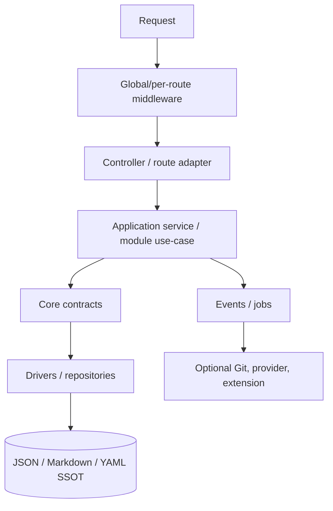

# ⚙️ Backend Architecture

> **Runtime:** PHP 8.4+ · Slim 4 · Composer  
> **Status:** Public Beta checkpoint `v2.1.0-beta.23`  
> **Data principle:** file SSOT, derived index/cache, no SQL database in Core

The backend is the API application for the React administration, public site, and future headless integrations. The current tree is functional, but some content logic is still split between `Core/FlatFile`, HTTP controllers, and route closures. The goal is not a large rewrite; it is an incremental move of use-case logic behind stable application contracts without changing the file SSOT.

---

## 1. Layers and dependency direction



```text
HTTP → application/module → Core contracts → driver → files
```

Prohibited directions:

- Core imports a Slim controller or React concept,
- a route closure owns storage layout or cryptography,
- a driver decides RBAC/publishing policy,
- an extension writes through a generic filesystem outside a validated contract,
- a background job runs as an unrestricted superuser without actor/service scope.

---

## 2. Indicative tree

| Area | Typical path | Ownership |
|------|--------------|-----------|
| bootstrap | `backend/bootstrap/app.php` | environment, container, Slim app, middleware/route registration |
| HTTP | `backend/app/Http/` | controllers, middleware, routes, responder/error mapping |
| Core | `backend/app/Core/` | platform primitives: storage, settings, cache, logging, security primitives, events |
| Modules | `backend/app/Modules/` | domain use cases: users, media, comments, messages, navigation, audit, demo… |
| extensions | `backend/app/Http/Extensions/` | restricted manifest-driven code; transitional location |
| storage | `backend/storage/`, `data/`, configured content root | SSOT, logs, cache/index, and operational state |
| tests | `backend/tests/` | unit, integration, HTTP/contract/security tests |

The exact number of route files, tests, or classes is not an architectural invariant. It belongs in CI/release reporting.

---

## 3. Bootstrap lifecycle

Recommended bootstrap order:

1. load environment without logging secrets,
2. validate required paths, permissions, and key material,
3. apply production-safe PHP/session defaults,
4. build the DI container and schema/config registry,
5. create the Slim app,
6. register routes and middleware deterministically,
7. attach the unified error handler,
8. run capability probes without auto-enabling optional services,
9. emit a safe startup log with version/capabilities, not credentials.

Bootstrap must not scan or mutate the entire storage tree on every request. Schema migration should be explicit, idempotent, and rollback-aware.

---

## 4. Middleware pipeline

Conceptual request gate:

```text
trusted proxy / request identity
→ security headers + CORS
→ maintenance + locale
→ WAF / abuse gate
→ rate limit
→ authentication resolver
→ CSRF according to auth type
→ authorization / path ACL / 2FA
→ route handler
→ unified error mapping + request log
```

Actual Slim LIFO order must be covered by tests; a list in documentation is not enough.

Important invariants:

- WAF may reject before routing and return non-JSON 403,
- session mutations require CSRF,
- a Bearer request does not use cookie session as fallback,
- CORS is not opened automatically because API keys exist,
- rate-limit identity is session/user/IP or future API key ID, never the secret,
- maintenance exceptions are an explicit allow-list.

---

## 5. Routes and controllers

The route layer:

- declares method + path,
- assigns middleware/policy,
- parses a normalized request DTO,
- invokes one application use case,
- maps a typed result/error through `JsonResponder`.

It must not:

- open content files with `file_get_contents`,
- assemble ACL from raw settings,
- generate hashes or encrypt credentials ad hoc,
- contain a long save → version → index → Git workflow,
- return a custom incompatible JSON shape.

Auth routes may currently be registered separately; the same route must not be registered both inline and through auto-discovery.

---

## 6. Application services and modules

An application service owns a use case such as:

```text
UpdateArticle
PublishContent
RestoreVersion
UploadMedia
ModerateComment
RotateApiKey
```

Input contains a validated DTO + actor context. Output is a typed result with resource/revision/follow-up state. HTTP status and localized wording are mapped at the boundary.

A module owns domain rules and may use Core contracts. Cross-module communication uses an explicit service or typed event, not a direct import of another module's internal repository.

---

## 7. Dependency injection

DI registration should be separated by ownership and must not depend on accidental glob order.

Rules:

- interface → driver binding is explicit,
- production/test binding is selected by configuration rather than scattered `if` statements,
- a secret is injected as a redacted/value object or credential provider,
- service locator usage in domain logic is an anti-pattern,
- controller dependencies are constructor-injected and testable,
- an optional capability has `CapabilityUnavailable`/safe fallback instead of nullable chaos.

It.68 ships a unified `StorageInterface` (local driver on settings reads and JSON content writes); It.69 adds a cache contract; It.70 a publisher; It.72 a media driver.

---

## 8. Storage and write orchestration

```text
validate canonical key/path
→ acquire lock/journal as required
→ verify base revision
→ write temp file + fsync/rename according to platform policy
→ create version/audit
→ update rebuildable index
→ invalidate cache
→ emit after-save event
→ enqueue optional follow-up
```

If index/cache update fails after a successful SSOT write, the system must not claim that save failed. It records degraded/rebuild state and separates primary result from follow-up in the response.

A multi-file operation requires a transaction journal or an explicit partial-success model. Calling something a “transaction” without a recovery protocol is marketing, not architecture.

---

## 9. Identity and authorization

`ActorContext` should represent:

- anonymous,
- session user,
- planned API key principal,
- planned delegated JWT principal,
- background service/job identity.

Each use case receives the actor and explicitly checks permission/scope plus path/resource policy. HTTP middleware may perform a coarse gate, but the domain service protects invariants for CLI, queue, restore, and extension calls too.

The admin session flow remains separate from the It.74 Bearer resolver. An invalid Bearer token must not fall through to session flow.

---

## 10. Validation and DTOs

- request body has a size limit before decoding,
- JSON parse failure is 400,
- schema/domain validation failure is 422,
- slug/path/locale/URL/enums are allow-listed and canonicalized,
- MIME is verified from content, not only filename,
- SSRF-sensitive Git/webhook/provider/stock-media URLs pass a central outbound validator,
- unknown write fields are rejected or explicitly ignored according to contract,
- server-owned fields are never accepted from clients.

Frontend validation is a UX optimization; backend schema is authoritative.

---

## 11. Error handling and response mapping

Domain errors use stable categories:

| Category | HTTP mapping |
|----------|--------------|
| authentication | 401 |
| authorization/scope | 403 |
| not found/masked | 404 |
| revision/lock | 409 |
| validation | 422 |
| rate limit | 429 |
| capability unavailable | 503 only when no safe fallback exists |
| unexpected | 500 + request ID in logs |

Exceptions must not contain an HTML response or raw secret. `ApiErrorHandler`/responder is the only HTTP serialization boundary. Debug detail is environment-gated and disabled in production.

---

## 12. Events, hooks, and queue

An internal event is a typed fact after a use case. A public plugin hook is a stabilized and sanitized extension contract. They are not the same thing.

Slow operations—Git push, build hook, provider translation, AI, reports—belong in the queue/job model. A job payload carries canonical ID/revision and credential references, not raw secrets/session data.

Every job has:

- actor/service scope,
- idempotency key,
- maximum attempts/backoff,
- timeout,
- poison/dead-letter/incident state,
- auditable result.

---

## 13. Cache, index, and performance

- the index is rebuildable from the file SSOT,
- a cache miss is not an error,
- Redis is an optional driver after a capability test,
- cache keys include locale, scope, and permission-relevant variant,
- private responses never enter public cache,
- invalidation follows successful writes,
- It.71 Performance Guard measures but does not change a production driver without an explicit decision.

Redis fallback to file/memory cache must be safe and observable, not a silent permanent downgrade.

---

## 14. Configuration and secrets

Precedence and classification belong to the settings engine. Backend code distinguishes public, admin, restricted, and secret values.

- `.env`/deployment secrets are never returned by settings APIs,
- encrypted-at-rest values are decrypted only immediately before use,
- a redacted placeholder is never saved as a credential,
- trusted proxies, cookie flags, and key material are validated at startup,
- enabling a capability requires complete valid configuration,
- config export/backup redacts secrets.

---

## 15. Logging, audit, and observability

HTTP access logs include at least request ID, method, route template, status, duration, and redacted client context. They must not contain raw Authorization, Cookie, CSRF, password, API key, provider token, or full content payload.

Audit records security-relevant domain actions: actor, target, action, before/after summary or revision, result, and timestamp. Audit does not replace debug logs and should not store entire sensitive documents without a retention policy.

It.71 may add APM, but health/APM endpoints remain admin-only and the Classic profile works without an external collector.

---

## 16. Environment and deployment boundaries

Typical environment classes:

| Class | Examples |
|-------|----------|
| runtime | `APP_ENV`, `APP_DEBUG`, timezone |
| HTTP/security | trusted proxies, session cookie policy, CORS origins |
| crypto | app/encryption/API JWT keys |
| optional drivers | Redis, S3, Git remote, translation/AI providers |
| limits | upload/body/timeouts/rate limits |

Production behind nginx must configure proxy trust, HTTPS detection, request size, and static/storage deny rules correctly. The backend must not trust `X-Forwarded-*` from arbitrary clients.

---

## 17. Test pyramid

1. unit tests for value objects, validators, policies, and serializers,
2. repository/driver tests on a temporary filesystem,
3. application service tests with fake contracts,
4. HTTP integration and response contract tests,
5. security/race/failure-injection tests,
6. smoke tests through a real web server/proxy,
7. Classic profile gate without external services.

Exact test count is not a documentation invariant. The important gate is PHPStan level 8, PHPUnit, audits, route/contract parity, and rollback testing for the affected capability.

---

## 18. Incremental refactor

Recommended Content vertical slice:

1. freeze the existing API contract with tests,
2. introduce a `ContentRepository`/application interface above current flat-file code,
3. move one use case out of a controller,
4. preserve route and response shape,
5. add revision/lock/audit failure tests,
6. repeat for the next use case,
7. only then change namespaces or route registration.

A large rewrite that changes storage, API, frontend, and auth simultaneously would destroy the ability to isolate regressions.

---

## 19. Related documents

- [ARCHITECTURE.md](./ARCHITECTURE.md) — system layers and ownership
- [CORE.md](./CORE.md) — Core contracts
- [MODULES.md](./MODULES.md) — internal modules and lifecycle
- [API.md](./API.md) — route inventory
- [API_CONTRACT.md](./API_CONTRACT.md) — JSON/error boundary
- [CORE_HARDENING.md](./CORE_HARDENING.md) — security invariants
- [EVENTS.md](./EVENTS.md) — events/hooks/jobs
