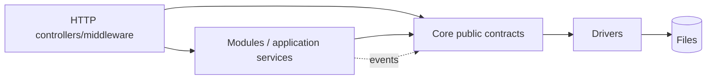
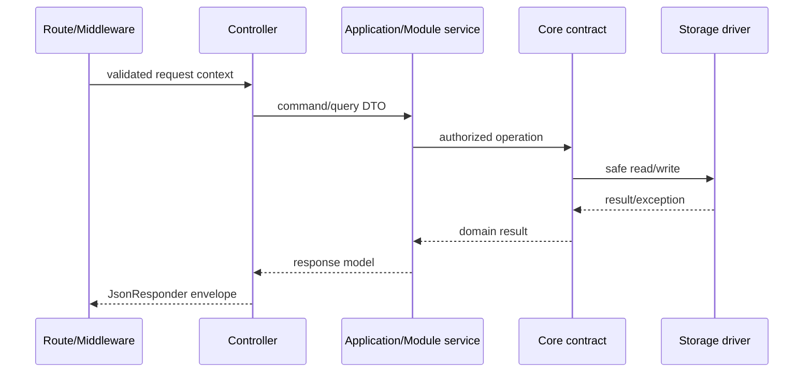

# PaginiumCMS Core Layer

> **Checkpoint:** `v2.1.0-beta.23` · August 2, 2026  
> **Namespace:** `PaginiumCMS\Core\`  
> **Principle:** Core is a platform kernel, not a warehouse for every feature.

Core provides stable primitives through which the HTTP layer, internal modules, and extensions safely work with files, cache, settings, events, logs, and workflows. It does not contain React components or Slim routes.

---

## 1. Target Core scope

Core should own capabilities required by nearly every instance:

- safe file I/O and storage abstraction,
- configuration and settings schema,
- cache and index primitives,
- event dispatcher and hook bridge,
- logging, audit primitives, and health contracts,
- validation, encryption, and security utilities,
- locks, revision primitives, and atomic operations,
- scheduler/queue contracts,
- dependency injection and base error types.

Core should not own a specific blog, comments, gallery, contact messages, navigation menu, or provider-specific product UI.

---

## 2. Current package map

| Package | Responsibility | Architecture classification |
|---------|----------------|-----------------------------|
| `FlatFile` | Markdown/JSON read-write, front matter, index, trash | Core; It.68 should separate the contract from the local driver |
| `Settings` | schema, defaults, overrides | Core |
| `Cache` | memory/file/chained cache | Core; Redis is an optional It.69 driver |
| `Event` | internal dispatcher | Core |
| `Hook` | extension hook registry/emitter | Core bridge, not a domain module |
| `Validation`, `Config` | shared rules and configuration | Core |
| `Logging`, `AuditTrail` | technical logging and audit primitives | Core/cross-cutting; a specific audit view may be a module |
| `Locking`, `Conflict`, `Drafts`, `Versioning` | editing protection and history | platform capability, while content-specific orchestration belongs in a Content module |
| `Security` | firewall and login/security logging primitives | transitional boundary; user/auth domain is in `Modules/Security` |
| `Scheduler`, `Monitoring`, `Health` | jobs and operational checks | Core primitives |
| `Backup` | export/import/scheduling | cross-cutting platform service |
| `Notification`, `Analytics`, `Seo`, `Feeds` | product services | candidates for clearer modular ownership; not a one-shot rewrite |
| `CodeEditor`, `CodePolicy`, `Developer` | protected developer workspace | privileged platform capability, locked by default |
| `GitHub` | existing sync service | integration service; target publisher contract belongs to It.70 |
| `Workflow` | OTP approval primitives | Core workflow primitives; each concrete workflow is module-owned |

The table describes both reality and direction. “Candidate for a module” does not mean a package should be moved immediately without tests and a migration plan.

---

## 3. Allowed dependencies



Rules:

- `Core` must not import `Http` or internal classes from a specific module.
- A controller may call an application/module service; it may not use `file_put_contents()` for domain data.
- A module may depend on a public Core interface, not private implementation details.
- A driver implements a narrow contract and does not decide RBAC or publishing policy.
- Cross-module collaboration uses an explicit interface, application orchestrator, or event.

---

## 4. Communication with the HTTP layer



A controller is an adapter. It must not contain storage layout, cryptography, or business workflow. A unified error is mapped at the HTTP boundary; a Core exception must not carry an HTML response.

---

## 5. Key contracts

| Contract | Current / target use |
|----------|----------------------|
| `FileReaderInterface`, `FileWriterInterface` | current validated local I/O |
| `ContentRepositoryInterface` | pages/articles CRUD; later an application-facing repository |
| `SettingsRepositoryInterface` | effective settings and overrides |
| `LockManagerInterface` | pessimistic locks |
| `LoggerInterface` | structured logging |
| `BackupInterface` | export/import orchestration |
| `StorageInterface` | planned It.68 unified document-storage contract |
| `CacheInterface` / driver contract | planned It.69 unified cache semantics |
| `PublisherInterface` | planned It.70 Git/distribution pipeline |
| `MediaStorageDriverInterface` | planned It.72 binary media; metadata remains flat-file |

A new interface should not be added merely to wrap one class. It should stabilize a boundary, enable a test double, or support multiple safe implementations.

---

## 6. Core write invariant

Every mutation using Core preserves:

```text
validate path + input → permission/domain gate → lock/revision check
→ write temp file → flush/close → atomic replace
→ version/audit → index/cache maintenance → event
```

Multi-file writes require an explicit journal or idempotent recovery operation. A partially completed state must not be hidden behind a successful response.

---

## 7. Events and hooks

- **EventDispatcher** carries internal facts between trusted components.
- **HookManager/HookEmitter** provides controlled extension points.
- Event payloads should be immutable or change only through an explicit result contract.
- A `before_*` hook may reject an operation with a validated exception, but cannot bypass authorization or write to arbitrary paths.
- An `after_*` failure after a successful SSOT write is logged and retried according to policy; it must not pretend a rollback occurred.

See [EVENTS.md](./EVENTS.md).

---

## 8. Security in Core

Core provides mechanisms, but the authorization context must come from an authenticated HTTP/CLI boundary. Critical rules:

- path validation before every disk operation,
- encryption of sensitive settings fields,
- constant-time token comparison where relevant,
- no credentials in log payloads,
- WAF/rate limiting do not replace domain validation,
- developer/code-editor services are deny-by-default and require unlock,
- testing uses isolated settings/cache/stores.

---

## 9. Error and result model

Recommended categories:

| Category | Example | HTTP mapping at the edge |
|----------|---------|--------------------------|
| Validation | invalid schema or slug | 422 |
| Authorization | missing permission/scope | 403 |
| Not found | document does not exist | 404 |
| Conflict | revision or lock mismatch | 409 |
| Capability unavailable | Redis/Git/S3 unavailable | 503 or degraded success by operation |
| Integrity/storage | damaged document or write failure | 500 + incident ID |

Core should not return an unstructured `false` when callers need to distinguish unavailability, conflict, and integrity failure. It.68 must settle a typed result/exception contract.

---

## 10. Service registration

DI bindings are divided by owner, for example `Core/*/Config/services.php`, `Modules/*/Config/services.php`, and `Http/Config/services.php`. Registration must be deterministic and repeatable in tests; a constructor must not perform an irreversible write or outbound request.

An optional capability is registered only after configuration/capability validation. Missing Redis or Git configuration must not break the Classic profile bootstrap.

---

## 11. Testing strategy

- unit tests for the contract and every implementation,
- contract tests for storage/cache drivers,
- HTTP integration tests through the real bootstrap,
- fault injection for disk full, invalid JSON, stale revision, and unavailable drivers,
- Classic smoke test without optional services,
- tests proving a module or extension cannot bypass path/RBAC rules,
- PHPStan L8 and frontend gates for the affected vertical slice.

---

## 12. Migration direction

1. It.68 introduces storage abstraction without a big-bang migration of all repositories.
2. The first vertical slice moves through the new contract and is compared with current behavior.
3. Content orchestration gradually moves from `Core/FlatFile` into an application/module layer.
4. The `Core/Security` and `Modules/Security` overlap is resolved through an ownership map, not class duplication.
5. Old entry points are removed only after tests, a deprecation window, and a rollback option.

---

## Related documents

- [ARCHITECTURE.md](./ARCHITECTURE.md)
- [STORAGE.md](./STORAGE.md)
- [SETTINGS.md](./SETTINGS.md)
- [VERSIONING.md](./VERSIONING.md)
- [CORE_HARDENING.md](./CORE_HARDENING.md)
- [MODULES.md](./MODULES.md)
- [EVENTS.md](./EVENTS.md)
