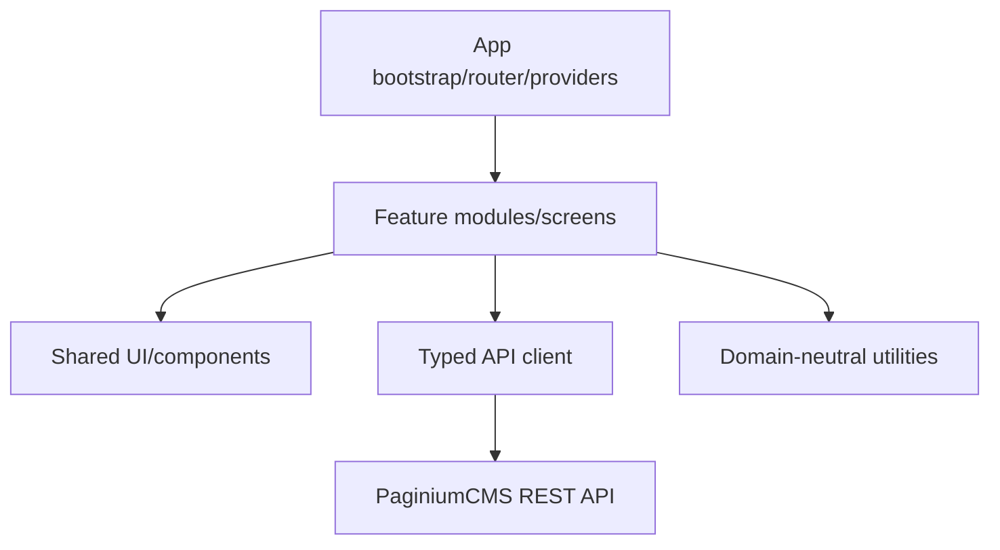

# 🖥️ Frontend Architecture

> **Stack:** React + TypeScript + Vite + Tailwind CSS + TipTap  
> **Role:** administrative SPA and public presentation components as deployment requires  
> **Security rule:** the frontend improves UX but is not authoritative for permission, validation, or storage

The original `FRONTEND.md` was empty. This document therefore defines the target contract while respecting the existing client foundation: centralized API modules, React routing, MSW fixtures, editor, admin managers, and deep-link helpers.

---

## 1. Frontend responsibility

The frontend may:

- render UI based on server-returned capabilities,
- validate forms for immediate feedback,
- manage query/cache/form/navigation state,
- coordinate lock, autosave, conflict, OTP, and publishing UX,
- safely display Markdown/rendered output,
- produce stable admin URLs.

The frontend must not:

- treat a hidden button as authorization,
- write directly to storage,
- store a long-lived admin Bearer token in `localStorage`,
- trust route `adminPath` without backend permission,
- report success merely because a modal closed,
- render untrusted HTML without sanitization.

---

## 2. Logical layers



Recommended import direction:

```text
app → feature/screen → shared UI + typed API + utilities
```

A shared component must not import a specific page manager. The API client must not import a React component. A feature may compose shared primitives and its own domain components.

---

## 3. Indicative tree

| Area | Typical path | Role |
|------|--------------|------|
| bootstrap | `frontend/src/main.tsx`, app root | providers, router, global error boundary |
| routes/layout | router config, backend/public layouts | route ownership and guards |
| API | `frontend/src/api/` | HTTP client, typed domain clients, error normalization |
| features/screens | components/pages/features | managers, editor, settings, security, media… |
| shared UI | reusable components | buttons, forms, modal, table, toast, accessibility primitives |
| hooks | autosave, locks, query sync | lifecycle and reusable orchestration |
| utils | deep links, formatting, sanitization helpers | no domain ownership |
| mocks | `frontend/src/mocks/` | MSW development/test contract |
| tests | colocated or test directories | unit/component/integration |

Specific import paths may change during refactoring; ownership and dependency rules matter more than today's folder name.

---

## 4. App bootstrap and providers

Bootstrap should assemble, deterministically:

1. global error boundary,
2. router,
3. session/auth provider,
4. API/query layer,
5. theme/locale/settings provider,
6. toast/notification and modal root,
7. development-only MSW behind explicit `VITE_MSW=true`.

Development mocks must never be enabled accidentally in a production build. Missing environment values should have safe defaults.

---

## 5. Routing and guards

A route guard is a UX and navigation gate. The backend still decides access.

- anonymous routes must not bootstrap-fetch admin secret slices,
- auth loading state must not become an unauthenticated redirect loop,
- 401 leads to safe session recovery/login flow,
- 403 shows insufficient permission without logging the user out,
- 2FA/developer unlock is a separate capability state,
- after login, a deep link may be restored only through a validated internal `returnTo` path.

Open redirects through absolute URLs or `//host` in `returnTo` are prohibited.

---

## 6. Centralized API client

The API client owns:

- same-origin credentials/session cookies,
- CSRF token fetch/cache/retry policy,
- JSON/content-type parsing,
- normalization of the legacy auth envelope,
- typed success/error/validation/conflict models,
- request cancellation and timeout,
- safe telemetry redaction,
- download/blob responses.

It must not automatically retry non-idempotent writes. CSRF refresh retry is allowed only in a controlled one-time path when it is clear that the original request did not reach domain persistence.

Planned It.74 API keys/JWT are for server integrations; the admin SPA remains session-based.

---

## 7. State categories

| State | Recommended owner |
|-------|-------------------|
| server/resource data | query/API cache or feature state |
| form and dirty fields | form/editor state |
| session/capabilities | auth provider |
| modal/toast | UI provider/local state |
| URL filters/page/tab | router search params |
| ephemeral lock heartbeat | feature hook |
| unsaved local draft | editor + explicit persistence policy |

Do not create one global store for everything. The URL is source of truth for shareable filters/tabs; the server is source of truth for content/revision; the local editor is temporary working state.

---

## 8. Auth, CSRF, and 2FA UX

Login flow:

```text
submit credentials → session response
→ optional 2FA challenge → refresh /api/auth/me
→ load capability-safe admin shell
```

Rules:

- password and OTP are not persisted in browser storage,
- logout clears sensitive client cache,
- session expiry during a read may show login; during a dirty write, preserve local draft and explain state first,
- 403 is not automatically “session expired,”
- CSRF token is never sent to another origin,
- API errors or analytics events contain no cookie/token/form secret.

---

## 9. Content editor lifecycle

```text
open resource → receive revision
→ acquire lock → edit
→ debounced draft autosave
→ explicit save/publish
→ handle OTP/conflict
→ update revision and version state
→ show optional Git publish state
```

The UI must display separately:

- local dirty state,
- autosave pending/saved/failed,
- server save pending/success,
- lock owner/expiry,
- revision conflict,
- OTP pending,
- local storage state,
- distribution/publish state.

One green “saved” toast for all these phases would be misleading.

---

## 10. Autosave, locks, and conflicts

- autosave uses debounce and `AbortController`/sequence guards,
- an older response must not overwrite newer editor state,
- heartbeat stops on unmount/logout and tolerates short outages,
- lock loss preserves local text but blocks blind save,
- 409 opens conflict resolution with Mine/Theirs/Both/manual,
- merged save uses the server revision from the conflict response,
- force overwrite is a visible privileged operation.

Crash recovery may persist content locally but never auth secrets. The user must know whether they are restoring a local draft or a server draft.

---

## 11. Editor formats and safe rendering

Supported API formats: `markdown`, `html`, `tiptap_json`.

- format conversion must not silently drop unsupported nodes,
- Tiptap JSON is validated before rendering,
- Markdown preview uses a safe renderer,
- raw HTML is disabled by default or sanitized with an allow-list,
- links use safe protocol allow-lists and appropriate `rel` for external targets,
- upload inserts only URLs/metadata returned by the backend.

`dangerouslySetInnerHTML` is allowed only in an isolated audited component with sanitized input.

---

## 12. Lists, filters, and URL sync

Pages, articles, media, comments, and logs store shareable state in query parameters:

```text
/pages?q=foo&page=2&status=draft
/media?folder=hero&type=image
/logs?severity=critical
/settings?category=security&group=accessControl
```

The parser:

- validates enums and bounds,
- ignores unknown parameters without crashing,
- uses replace when correcting invalid values to avoid history spam,
- preserves browser back/forward,
- never places secrets, tokens, or full content in the URL.

The detailed contract is in [ADMIN_DEEP_LINKS.md](./ADMIN_DEEP_LINKS.md).

---

## 13. Settings UI

The settings UI is schema-driven, while backend schema remains authoritative. The frontend:

- renders fields by type/label/help/validation/capability,
- distinguishes public/restricted/secret,
- shows a secret as “configured,” never plaintext,
- never sends a redacted placeholder as a new value,
- explains missing configuration for capability dependencies,
- reloads effective value/restart requirement after save,
- does not enable a SUPER_ADMIN-only group based only on a role string in local storage.

---

## 14. Media UX

Upload flow displays size/type/progress and safely handles:

- 413/415,
- duplicate or rename policy,
- request cancellation,
- private/public state,
- local versus planned S3 driver without changing resource semantics,
- broken thumbnail/fallback,
- bulk partial failure.

A client filename is display metadata, not a trusted storage path.

---

## 15. Admin command palette and navigation

Ctrl+K search returns pages/articles/media/routes according to permissions. `adminPath` is navigated through a central helper and must be an internal canonical path. A palette result is not a permission grant; the target screen loads backend data and may receive 403.

Sidebar, route catalog, dashboard cards, and deep-link helpers should use one route registry or parity test to prevent drift.

---

## 16. Locale, translation, and AI — planned

It.73–77 add:

- requested/effective/fallback locale indicators,
- locale switching without losing dirty changes,
- translation proposal → diff → Apply,
- provider quota/error without secret leakage,
- AI proposals through allow-listed tools,
- explicit Apply confirmation,
- no autonomous publishing.

Prompt/provider output is untrusted content. It is rendered as text/diff, not executable HTML. Changing locale during pending save must be blocked or safely serialized.

---

## 17. Error UX

| State | UX |
|-------|----|
| 400/422 | form/global error with field mapping |
| 401 | session recovery/login; preserve dirty draft |
| 403 | explain permission; do not discard local work |
| 404 | not found or resource changed/deleted |
| 409 | conflict/lock resolver |
| 413/415 | upload-specific guidance |
| 429 | retry-after without aggressive loop |
| 500 | safe message + request ID when available |
| 503 | maintenance/capability state |
| non-JSON WAF | generic blocked response without JSON-parser stack |

A toast is useful for a short result, not as the only carrier of a critical conflict or validation detail.

---

## 18. Accessibility and UX minimum

- keyboard navigation and visible focus,
- modal focus trap and restoration,
- correct labels/errors/ARIA live for async state,
- command palette available by keyboard and menu,
- color is not the only status signal,
- reduced motion respected,
- tables have mobile/overflow fallback,
- editor toolbar has accessible names and shortcut hints.

Accessibility regressions belong in component tests and the manual release checklist.

---

## 19. Performance

- route-level lazy loading for large admin modules,
- virtualization only when measured and without breaking accessibility,
- debounced search/autosave,
- cancel stale requests,
- images with dimensions/lazy loading,
- bundle analysis in the release gate,
- server pagination instead of loading all content,
- cache must not show previous-user data after logout/login.

It.71 Performance Guard provides metrics; the frontend must not switch backend drivers on its own after one slow response.

---

## 20. Testing

| Layer | Examples |
|-------|----------|
| unit | deep-link parser, formatters, permission-safe helpers |
| component | forms, modals, tables, error states, accessibility |
| hook | autosave ordering, lock heartbeat, abort/retry |
| MSW integration | auth, CSRF, 409, 422, non-JSON WAF, OTP |
| route | guard, returnTo, query sync, browser back |
| editor | format round-trip, sanitization, dirty/conflict |
| build | TypeScript, ESLint, Vitest, production build, API barrel parity |

Fixtures should derive from the API contract rather than creating an optimistic parallel backend that never returns errors.

---

## 21. Environment and build

Vite variables are public in the browser bundle. Secrets must never be placed in `VITE_*`. Allowed values include base URL, display-only feature flags, or build metadata without credentials.

A production build should:

- disable dev mocks/debug UI,
- have explicit API origin/CSP policy,
- generate deterministic assets,
- support cache busting,
- retain source maps according to security/deployment policy,
- pass dependency audit and license review.

---

## 22. Definition of Done for a frontend use case

- [ ] route/deep link is stable and tested,
- [ ] API success and all relevant failures have UX,
- [ ] backend permission is not inferred from UI,
- [ ] loading/empty/error/partial/degraded states are visible,
- [ ] keyboard/accessibility minimum is met,
- [ ] secrets/PII do not enter URLs, local storage, or telemetry,
- [ ] MSW fixture matches the server contract test,
- [ ] Classic profile works without the planned provider.

---

## 23. Related documents

- [API.md](./API.md) — endpoints and auth matrix
- [API_CONTRACT.md](./API_CONTRACT.md) — parser and error shapes
- [CONTENT_API.md](./CONTENT_API.md) — editor lifecycle
- [ADMIN_DEEP_LINKS.md](./ADMIN_DEEP_LINKS.md) — URL contract
- [SETTINGS.md](./SETTINGS.md) — schema-driven settings
- [CORE_HARDENING.md](./CORE_HARDENING.md) — browser/API security
