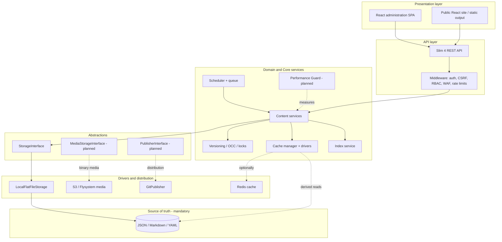

# Hybrid Headless Content Engine — target architecture

> **Status:** documentation Phase 0  
> **Effective:** August 2026 direction pivot — from Public Beta toward an enterprise-ready hybrid engine  
> **Immutable baseline:** [NOSQL_MANDATE.md](./NOSQL_MANDATE.md)

---

## Definition

PaginiumCMS is evolving from an advanced flat-file CMS into a **Hybrid Headless Content Engine**:

> API-first content management with **No-SQL file storage as the only source of truth**, optional **index and cache layers** for performance, and switchable **deployment modes** ranging from direct disk writes to Git/Jamstack distribution.

The short label used in documentation and UI is **Hybrid Engine**.

This pivot does not change the foundational data principle. It changes how the system is described and where it is heading:

- from “a CMS that uses files” to a **content engine whose contract is files**,
- from one deployment pattern to **configurable profiles**,
- from direct local reads and writes to a **layered architecture**,
- from administration of one website to **headless and integration scenarios**,
- from basic logging to **measurable operations and performance protection**.

---

## What we are and what we are not

| Area | Hybrid Engine | Legacy “blog in a file” model |
|------|---------------|---------------------------------|
| Public traffic | React SPA + REST API; optional static output later | Directly read the same file for every request |
| Concurrency | `flock`, editing locks, OCC, HTTP 409, versioning | A single editor is assumed |
| Performance | JSON index, read-through cache, HTTP cache headers | Scan directories for every listing |
| Distribution | Optional immediate or queued Git publish | Manual FTP copy |
| Integrations | REST API, webhooks, later API keys and JWT | UI as the only entry point |
| Observability | APM middleware, monitoring reports, metrics | Basic application logs |
| Source of truth | JSON / Markdown / YAML files | Files without layers or explicit contracts |

PaginiumCMS **keeps data ownership and the No-SQL SSOT**. It adds professional layers around files; it does not replace them with a database.

---

## Layered model

### Layer responsibilities

| Layer | Role | Source of truth? |
|-------|------|------------------|
| **Documents** | Authoritative content, settings, and file-based operational state | ✅ Yes |
| **Storage abstraction** | Read, validated write, atomic operations, locks, and path handling | No; it mediates the SSOT |
| **Index** | Aggregated metadata for listings, filters, and search | ❌ Derived |
| **Cache** | Hot reads, short-lived results, and HTTP conditional responses | ❌ Derived |
| **Domain services** | Content rules, workflows, conflicts, versioning, and events | No |
| **API** | Authentication, authorization, validation, responses, and HTTP contract | No |
| **Distribution** | Git commit/push, build hook, and static output | Pipeline |
| **Observability** | Latency, memory, I/O, errors, and alerts | Logs and metrics |

---

## Core invariants

Every implementation wave must preserve these rules:

1. **Files are authoritative.** Neither an index, cache, nor external service may hold the only copy of primary content.
2. **Writes are atomic.** A source document is committed safely before derived layers are updated.
3. **Cache is disposable.** Losing it must not lose content or configuration.
4. **Indexes are rebuildable.** Diagnostics and a complete rebuild path must exist.
5. **Deployment mode does not change the data contract.** A document has the same meaning in Classic, Hybrid, and Git-headless modes.
6. **Drivers cannot bypass security gates.** Storage and publish drivers use the same validation, ACL, and audit rules.
7. **New API authentication is additive.** Administration sessions and CSRF remain; API keys and JWT are added for headless clients.
8. **Optional-layer failure has a safe fallback.** Without Redis or a Git remote, the system must fail predictably or continue in a supported local mode.

---

## Deployment modes

The full matrix is defined in [DEPLOYMENT_MODES.md](./DEPLOYMENT_MODES.md).

| Mode | Write path | Read path | Git | Cache |
|------|------------|-----------|-----|-------|
| **Classic** | Direct to disk through the local storage driver | Index + optional file/APCu cache | Off | File / APCu |
| **Hybrid** | Disk + index and cache update | Index + cache | Optional immediate push | APCu / Redis |
| **Git-headless** | Disk + immediate or queued publish | API or static build | On | Redis recommended |

Target settings:

- `engine.deploymentMode`
- `engine.cache.driver`
- `engine.git.enabled`
- `engine.git.publishStrategy`
- `site.renderMode`
- `engine.performanceGuard.enabled`

When keys are absent, the system must preserve compatible **Classic** behavior.

---

## Mapping the target plan to the current codebase

| Capability | Status | Current location / iteration |
|------------|--------|------------------------------|
| No-SQL SSOT (JSON / Markdown) | ✅ Shipped | `ContentRepository`, `STORAGE.md` |
| Safe writes with `flock` | ✅ Shipped | settings, index, locks, newsletter, and other stores |
| Content index `content.json` | ✅ Shipped | `ContentIndexService` |
| File and memory cache | ✅ Shipped | `ChainedDriver`, `ContentCacheService` |
| Unified Redis cache | ⏳ Planned | It.49 absorbed into **It.69** |
| OCC and HTTP 409 conflicts | ✅ Shipped | `ContentRevision`, `ContentConflictException` |
| Pessimistic editing locks | ✅ Shipped | It.1 `LockManager` |
| Sensitive-field encryption | ✅ Shipped | `EncryptionService` |
| GitHub content sync through API | 🟡 Partial | `GitHubService`; not yet a complete local Git workflow |
| Git commit and queued publish | ⏳ Planned | **It.70** |
| Static / Jamstack output | ⏳ Planned | It.48 |
| HTTP `ETag` and `Last-Modified` | ⏳ Planned | **It.69** |
| `StorageInterface` and drivers | ⏳ Planned | **It.68** |
| Performance Guard APM | ⏳ Planned | **It.71** |
| Flysystem media / S3 / CDN | ⏳ Planned | **It.72** |
| Multiple locales in one document | ⏳ Planned | **It.73** |
| API keys and JWT | ⏳ Planned | **It.74**; the administration session remains |
| Enterprise CMS AI agent | ⏳ Planned | **It.75** |
| Assisted translation through LibreTranslate | ⏳ Planned | **It.76** |
| Assisted translation through cloud providers | ⏳ Planned | **It.77** |
| JSON Schema for every Monaco save | ⏳ Planned | schema registry in **It.68** |

---

## Security model

### Current Public Beta state

- PHP session for administration,
- synchronizer CSRF token,
- RBAC and permission middleware,
- TOTP 2FA,
- encryption of sensitive fields with `APP_KEY`,
- WAF and rate limiting,
- path validation, Zip-Slip protection, and SSRF guard,
- audit trail and sanitized logging.

### Target state

Session authentication and CSRF remain the primary model for the administration SPA. **Optional API keys and JWT** are added for headless integrations with constrained scopes, rotation, audit, and revocation.

New mechanisms must not become a shortcut around existing permissions. Every client must pass through the same domain rules and validation.

---

## Write consistency

Recommended order for a successful mutation:

1. authentication and authorization,
2. input and schema validation,
3. revision / lock check,
4. atomic source-document write,
5. index update,
6. cache invalidation or population,
7. audit record,
8. event emission,
9. optional Git publish job enqueue.

When a derived layer fails after the source document was written successfully, the system must:

- preserve the primary document,
- record an incident,
- mark the index or cache as stale,
- provide a retry or rebuild path,
- avoid telling the user that distribution completed when it did not.

---

## Implementation waves

| Wave | Iterations | Focus |
|------|------------|-------|
| **Phase 0** | — | Bilingual documentation and terminology alignment |
| **HE-1** | It.68 | Storage abstraction, schema registry, and engine settings |
| **HE-2** | It.69 + It.49 | Unified cache, Redis, `ETag`, and `Last-Modified` |
| **HE-3** | It.70 + It.48 | Git publish and static output |
| **HE-4** | It.71 + It.46 | APM and host metrics |
| **HE-5** | It.72 + It.74 | Media drivers and additive API authentication |
| **HE-6** | It.73 + It.75–77 | Multilingual document model, AI agent, and both translation paths |

Details: [../ITERATION_WAVE_HYBRID_ENGINE.md](../ITERATION_WAVE_HYBRID_ENGINE.md).

---

## Pivot acceptance criteria

The new direction is ready for implementation when:

- Slovak and English documentation use the same concepts,
- the `README`, philosophy, roadmap, and architecture do not contradict one another,
- Classic mode is explicitly preserved as the default fallback,
- the No-SQL mandate accompanies every new storage and cache proposal,
- It.68–77 define dependencies, security gates, and a definition of done,
- documentation clearly separates shipped functionality from target design,
- a migration path exists without SQL migration and without content loss.

---

## Related documents

- [NOSQL_MANDATE.md](./NOSQL_MANDATE.md) — immutable source-of-truth rule
- [DEPLOYMENT_MODES.md](./DEPLOYMENT_MODES.md) — deployment profiles
- [ARCHITECTURE.md](./ARCHITECTURE.md) — deep architecture specification being aligned with the pivot
- [STORAGE.md](./STORAGE.md) — physical data layout
- [../PHILOSOPHY.md](../PHILOSOPHY.md) — project mission
- [../ROADMAP.md](../ROADMAP.md) — iteration map
