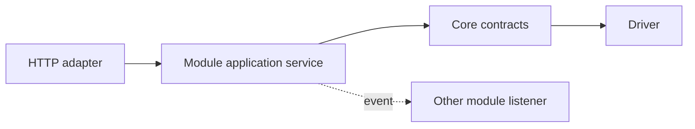

# PaginiumCMS Module Architecture

> **Internal modules:** trusted packages shipped with the CMS in `backend/app/Modules/`  
> **Not the same as:** external plugins/extensions in `backend/app/Http/Extensions/`

A module owns a specific domain capability and its rules. Core provides the platform, the HTTP layer adapts the protocol, and the module executes the use case. The original document was empty, so this contract also names the current transitional state and target without pretending that runtime installation of external modules is already complete.

---

## 1. When to create a module

Functionality belongs in a module when it:

- represents an independent domain or product capability,
- does not need to be active in every instance,
- has its own repository/service/policy/use cases,
- needs its own permissions, settings, events, or UI,
- can be tested through a public contract without knowing another module's internals.

Examples include Security users/auth, Media, Comments, Messages, Navigation, Audit, Demo, and Gallery. Content/pages/articles currently remain partly in `Core/FlatFile` and the HTTP layer; the target is an explicit Content application/module owner.

---

## 2. Extensibility types

| Type | Trust | Location | Purpose |
|------|-------|----------|---------|
| Core service | high | `backend/app/Core/` | platform primitives |
| Internal module | high | `backend/app/Modules/{Name}/` | domain functionality shipped with the CMS |
| HTTP adapter | high | `backend/app/Http/` | routes/controllers/middleware |
| Extension/plugin | limited | `backend/app/Http/Extensions/{id}/` | optional manifest-controlled code |
| Theme | presentation | resources/frontend theme root | appearance without domain ownership |
| Driver/provider | narrow contract | owner package/Infrastructure | technical storage/cache/provider implementation |

An external plugin does not become an internal module merely because it contains many files. An internal module may use full project DI and CI trust; an extension is constrained by its manifest and code policy.

---

## 3. Recommended structure

```text
backend/app/Modules/Comments/
├── Contracts/
├── Models/
├── Repositories/
├── Services/
├── Policies/
├── Events/
├── Config/services.php
├── Resources/
├── Tests/              # or mirror under backend/tests/Modules/
└── README.md
```

HTTP routes/controllers may remain in the central `Http/` layer when ownership and dependency direction are clear. Alternatively, a module exports a route-registrar contract. The important rule is that domain logic does not live in a route closure.

The frontend mirrors feature ownership under `frontend/src/features/` or `modules/`, but cannot duplicate permission logic as the sole source of truth.

---

## 4. Module obligations

Every module declares:

- purpose and boundaries,
- public contracts/services,
- owned document types and storage keys,
- permissions/scopes,
- settings groups/fields,
- events emitted or consumed,
- routes/API contract,
- migration/versioning rules,
- failure and rollback behavior,
- tests and owner.

A module must not “own” the entire `data/` directory. It owns logical keys and uses Core storage services.

---

## 5. Dependencies



Rules:

- modules import public Core interfaces,
- Module A does not import `ModuleB\Repositories\InternalRepository`,
- synchronous collaboration uses an explicit public contract in a neutral/owning layer,
- loose collaboration uses an event,
- a shared model is not moved into Core automatically; first prove it is genuinely a platform concept,
- circular dependencies are forbidden.

---

## 6. Currently documented modules

| Module | Responsibility | Status/note |
|--------|----------------|-------------|
| `Security` | users, session/auth, 2FA, OAuth, authorization/path ACL | implemented; boundary with `Core/Security` needs consolidation |
| `Media` | upload, registry, DAM/stock integration | implemented; It.72 extends binary storage |
| `Comments` | comment repository and moderation/policy | implemented according to content workflow docs |
| `Messages` | contact messages | foundation implemented |
| `Navigation` | menu tree/repository | foundation implemented |
| `Audit` | audit/security report views | exists; separate from Core audit primitives |
| `Demo` | demo fixtures/reset/scheduler | implemented deployment-specific capability |
| `Gallery` | gallery repository/validation/public serialization | delivered in a later wave according to iteration docs |
| `Content` | pages/articles workflow | **not yet extracted as a standalone module**; transitional ownership |

This is a documentation snapshot, not an automatically generated inventory. Final QA should compare it with the actual repository tree.

---

## 7. Module lifecycle

An internal module shipped with the application has this lifecycle:

1. code discovery/autoload,
2. deterministic DI registration,
3. route/application-adapter registration,
4. settings/event catalog registration,
5. runtime use,
6. tested release upgrade.

Runtime enable/disable is safe only when dependencies, public routes, data ownership, and fallback are defined. Not every internal module needs to be toggleable.

**External runtime module installation is a planned architecture topic**, distinct from the existing plugin import/enable flow. Documentation must not mark it as complete.

---

## 8. Storage ownership

Example logical ownership:

```text
content/pages/{id}
content/articles/{id}
comments/{contentId}/{commentId}
media/registry/{assetId}
security/users/{userId}
navigation/menus/{menuId}
```

The physical path is a storage-driver detail. A module works with a typed repository/document key. Rename/move/delete handles references through an application workflow, not a regex replacement across the entire storage root.

Module data is included in the backup/export contract or explicitly classified as rebuildable.

---

## 9. Settings and permissions

A module registers its own schema group or namespaced fields. The permission catalog is aggregated centrally, but the owner defines meaning. Renaming a permission is a breaking security change and requires migration of role mappings.

The module's public settings slice is an explicit allow-list. Disabling a module must not leave active routes, listeners, or public secret metadata.

---

## 10. Events

A module emits a fact after successful domain state, for example `CommentApproved` or `MediaUploaded`. Event payloads use ID/revision and minimal metadata. Direct cross-module side effects move into listeners only when failure policy preserves consistency.

Plugin hooks are emitted through centralized `HookEmitter`, not directly from an arbitrary repository. See [EVENTS.md](./EVENTS.md).

---

## 11. HTTP and API

A controller:

- obtains authenticated actor/request context,
- maps input to a command/query,
- calls a module service,
- maps typed result/error to the API envelope.

A module service:

- enforces domain permissions/invariants,
- uses repository/Core contracts,
- creates versions/audit/events,
- knows nothing about React components or a specific JSON responder.

API route ownership is documented in `API.md`, and contract tests protect frontend/headless clients.

---

## 12. Security

- deny-by-default permissions,
- server-side validation,
- paths/storage only through Core,
- outbound calls through SSRF policy,
- secrets through Settings/EncryptionService,
- imports/uploads through size/MIME/schema policy,
- background jobs with actor/service scope,
- no generic shell or container access,
- module developer docs identify the threat surface.

The Security module is not solely responsible for security. Every module owns the security of its use cases; Core supplies primitives and the HTTP layer supplies identity/gates.

---

## 13. Testing contract

Every module needs:

- unit tests for services/policies,
- repository contract tests,
- permission matrix,
- API integration tests,
- invalid/corrupt storage fixtures,
- event payload/failure tests,
- migration/rollback tests for schema changes,
- disabled/unavailable behavior when toggleable,
- frontend tests for critical workflows.

Tests must not depend on production settings or real outbound providers.

---

## 14. Extracting a Content module

Recommended incremental path:

1. name application use cases for pages/articles,
2. preserve the existing API contract,
3. wrap `ContentRepositoryInterface` with a module-facing service,
4. move status/publish/version orchestration out of controllers,
5. add event and permission contract tests,
6. only then move namespaces/files,
7. keep an adapter/deprecation layer through the next checkpoint.

The goal is not cosmetic folder movement but clear ownership and a testable boundary.

---

## 15. Module Definition of Done

- README/owner/boundary are explicit,
- no imports of another module's internals,
- storage/settings/permissions are namespaced and documented,
- routes call a module service,
- events define payload and failure policy,
- backup/migration/rollback are defined,
- security and contract tests pass,
- SK/EN documentation is in parity.

---

## Related documents

- [ARCHITECTURE.md](./ARCHITECTURE.md)
- [CORE.md](./CORE.md)
- [EVENTS.md](./EVENTS.md)
- [PLUGINS.md](./PLUGINS.md)
- [SETTINGS.md](./SETTINGS.md)
- [../developer/EXTENSION_CODE_POLICY.md](../developer/EXTENSION_CODE_POLICY.md)
