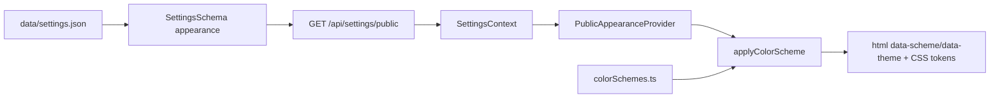

# Theme and Public Appearance Architecture

> **Implemented:** semantic CSS tokens, five color schemes, light/dark/system mode, admin preview, and logo/favicon branding.  
> **Planned:** importable theme packages with a manifest, layout slots, and their own lifecycle.

Older documentation used the word “theme” for three different concepts. This document separates them so that a color scheme is not mistaken for a full PHP/React package.

---

## 1. Three separate layers

| Layer | Responsibility | Status |
|-------|----------------|--------|
| **Admin shell theme** | personal light/dark administration appearance | ✅ implemented |
| **Public appearance** | site-wide tokens, color scheme, mode, and visitor toggle | ✅ implemented in It.58b |
| **Theme package** | installable layout/component/asset package | ⏳ target contract |

The admin shell and public site do not use the same localStorage key. Changing the public scheme must not silently change an administrator's working environment.

---

## 2. Implemented public appearance flow



| Layer | Responsibility |
|-------|----------------|
| backend schema | validates the scheme ID and `light|dark|system` |
| public settings API | exposes only the safe appearance slice |
| `colorSchemes.ts` | source of truth for preset tokens |
| `applyColorScheme.ts` | applies attributes, CSS variables, and Tailwind `dark` class |
| `publicUiClasses.ts` | shared semantic UI classes |
| admin panel | swatches and an isolated preview frame |
| public UI | uses tokens rather than hard-coded colors |

PHP settings store the **scheme ID**, not preset hex values.

---

## 3. Settings

| Key | Default | Meaning |
|-----|---------|---------|
| `appearance.colorScheme` | `indigo-classic` | ID from the allow-listed catalog |
| `appearance.mode` | `system` | `light`, `dark`, or `system` |
| `appearance.allowUserToggle` | `true` | visitor may switch mode |
| `appearance.previewTemplate` | `hero-content` | admin preview profile; not the final layout engine |

An unknown scheme is rejected or safely falls back to the default according to schema policy. The client must not accept arbitrary CSS variable names from the server.

---

## 4. Semantic tokens

Minimum contract:

```css
--color-primary
--color-primary-foreground
--color-secondary
--color-surface
--color-surface-elevated
--color-text
--color-text-muted
--color-accent
--color-border
```

A component uses token meaning, not a specific preset:

```tsx
<button className="bg-theme-primary text-theme-primary-foreground">
  Save
</button>
```

A new token is added compatibly: schema/catalog → defaults for every preset → Tailwind mapping → components → visual and contrast tests.

---

## 5. Implemented preset catalog

| ID | Character |
|----|-----------|
| `indigo-classic` | default indigo scheme |
| `ocean-slate` | teal and slate |
| `forest-sage` | green and natural neutrals |
| `sunset-rose` | rose/warm accent scheme |
| `mono-zinc` | minimalist monochrome scheme |

Canonical hex values remain in `frontend/src/theme/colorSchemes.ts`. Documentation may show examples, but it must not become a second runtime source of truth.

---

## 6. Branding is not a theme package

Logo, favicon, and site name are site identity settings. A theme consumes them through components/slots but does not own them. Branding must survive a scheme or future theme switch.

Also separate are:

- login background,
- default Open Graph image,
- content media,
- admin avatar,
- theme preview screenshot.

See [BRANDING.md](../user/BRANDING.md).

---

## 7. Layout and theme packages

The It.58c+ Layout Builder and a theme package are related but not identical:

- **layout AST/template ID** defines the structure of an individual page,
- **theme package** defines renderer, slots, components, token defaults, and assets,
- **color scheme** changes token values,
- **branding** supplies site identity assets.

A theme must not rewrite authoritative content or create a second content storage model.

---

## 8. Target theme package contract

Recommended structure:

```text
backend/resources/views/themes/{theme-id}/
├── theme.json
├── templates/
├── partials/
├── assets/
├── README.md
└── screenshot.webp

frontend/src/themes/{theme-id}/        # only under a supported build model
data/themes.json                       # planned registry
```

Example manifest:

```json
{
  "manifestVersion": 1,
  "id": "clean-journal",
  "name": "Clean Journal",
  "version": "1.0.0",
  "minCmsVersion": "2.1.0",
  "slots": ["header", "main", "sidebar", "footer"],
  "templates": ["default", "article", "landing-page"],
  "supports": ["appearance-tokens", "branding", "navigation"]
}
```

A theme manifest must not contain secrets or arbitrary remote script URLs.

**Planned (It.87 Track C):** opt-in allow-list for static `.js` under `assets/` only — declared in `theme.json`, served with **SRI** and **CSP script hashes**; site setting `appearance.themeScriptsEnabled` default **false**. See [ITERATION_87.md](../ITERATION_87.md#track-c--theme-static-js-allow-list-87k87m). This does **not** enable inline scripts, content `<script>`, or CDN URLs.

---

## 9. Theme security policy

A future theme import uses the same fail-closed foundation as plugins but with a narrower authority profile:

- canonical path and Zip-Slip checks,
- allowed asset types and limits,
- template syntax checks,
- no `eval`, raw PHP, or unrestricted include paths in an untrusted theme,
- HTML sanitization rules for editable templates,
- CSP-compatible assets,
- no secrets or admin-only data in public rendering,
- preview in an isolated context that cannot mutate content.

If PHP templates are permitted, the theme is no longer “appearance only” and requires the same trust review as a plugin. A safer target is a declarative template/AST layer with allow-listed helpers.

---

## 10. Theme lifecycle

Recommended model:

```text
imported_disabled → previewable → active
active → previous_active|disabled
```

Activation must be atomic from the perspective of site settings. Before switching:

1. verify compatibility and required slots,
2. render a preview with test fixtures,
3. check branding/navigation/content fallbacks,
4. store the previous theme ID,
5. switch the active theme,
6. invalidate derived HTML/cache output,
7. run a public smoke test,
8. roll back on critical failure.

Theme uninstall must not remove the active package before switching safely to a fallback.

---

## 11. Accessibility and quality

Every scheme/theme must verify:

- text and interactive-element contrast,
- keyboard focus and skip links,
- reduced motion,
- readability at 200% zoom,
- images with alt text or decorative marking,
- correct heading hierarchy,
- responsive layout without horizontal overflow,
- dark-mode forms, modals, and error states.

A color swatch is not sufficient QA. Representative pages and automated axe/visual smoke tests are required.

---

## 12. Cache, Git, and Headless mode

Changing appearance, branding, layout, or active theme invalidates the relevant render cache/index. In Git-headless mode, settings/theme manifest and approved assets are published through the same explicit publish workflow as other authoritative files; a failed push must not undo the local save.

A headless client must not be forced to use PaginiumCMS React components. It should receive stable theme/appearance metadata or provide its own renderer over the content API.

---

## 13. Outside the current state

The following are not declared complete:

- ZIP import and registry for theme packages,
- a theme marketplace,
- runtime loading of arbitrary React theme bundles,
- a secure custom PHP theme sandbox,
- automatic layout AST migration between incompatible themes,
- a pixel-perfect visual builder.

The current color-scheme UI must therefore not be presented in user documentation as a theme installer.

---

## 14. Planned reference theme (It.83)

The first shipped theme package after the stabilization phase is **`terminal-breach`** (“Terminal Breach”): a cyber-security / hacking aesthetic implemented as a professional dark SOC-terminal shell — monospace typography, green secure accent, red alert accent, CSP-safe CSS effects only.

It will be switchable from **Extensions → Themes** once [ITERATION_83.md](../ITERATION_83.md) lands. Until then, admins use **Settings → Appearance** color schemes only; optional stabilization prep may add a matching **`terminal-breach` color scheme** without activating a full theme package.

---

## Related documents

- [Theme user guide](../user/THEMES.md)
- [Branding](../user/BRANDING.md)
- [Plugins](./PLUGINS.md)
- [Frontend](./FRONTEND.md)
- [Settings](./SETTINGS.md)
- [Extension Code Policy](../developer/EXTENSION_CODE_POLICY.md)
- [Iteration 83 — Theme runtime](../ITERATION_83.md)
