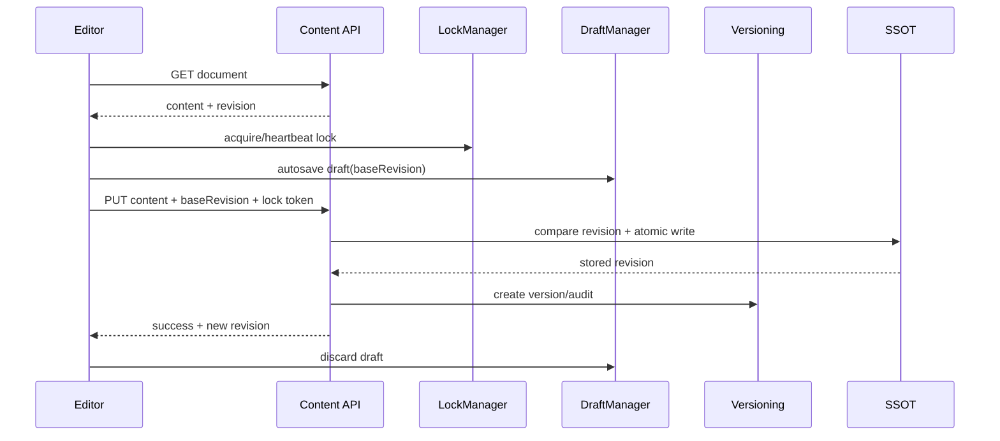

# Versioning, Drafts, and Conflict Resolution

> **Model:** database-free flat-file storage  
> **Scope:** content lifecycle from opening the editor through restore and publishing

PaginiumCMS uses multiple protection layers because no single technique solves concurrency, browser crashes, human error, and distribution. Locks reduce the chance of concurrent editing, revisions detect it safely, drafts protect work in progress, versions enable rollback, and 3-way merge preserves both branches of change.

---

## 1. Canonical terms

| Term | Meaning |
|------|---------|
| **Revision** | deterministic fingerprint of the current document for optimistic concurrency |
| **Base revision** | revision from which the editor started |
| **Lock** | temporary lease on a resource with owner, token, and heartbeat |
| **Draft** | separate autosaved work-in-progress content |
| **Version** | immutable historical snapshot and change metadata |
| **Conflict** | server document no longer matches the base revision |
| **Merge** | combination of base, mine, and theirs |
| **Restore** | creation of a new live change from an older snapshot; history is not erased |
| **Publish state** | distribution state; distinct from document storage state |

---

## 2. Editing lifecycle



A lock is a UX and coordination layer. The server still checks the revision with a valid lock because a lock can expire, heartbeat can be lost, or an older client may not use locks.

---

## 3. Optimistic concurrency

The current `ContentRevision` canonicalizes front matter and computes a fingerprint from content and metadata. The client submits `baseRevision`; a mismatch raises an HTTP 409 conflict with the current server version.

```text
GET /api/pages/about-us
→ content + revision: "3f1c…"

PUT /api/pages/about-us
→ baseRevision: "3f1c…"
→ 200 when the revision matches
→ 409 when the server document changed
```

Important points:

- SHA-1 in the current implementation is only a stable concurrency fingerprint.
- It is not a signature, backup checksum, or protection against intentional tampering.
- A missing `baseRevision` is a legacy compatibility mode; modern clients should receive a warning/deprecation rather than use it as the recommended flow.
- It.73 must calculate revision over the canonical localized document so a change in one locale does not lose changes in another.

---

## 4. Pessimistic locks

A lock resource uses an ID such as `page:about-us`, owner ID, display name, secret token, `acquiredAt`, `lastHeartbeat`, and `expiresAt`.

Rules:

- registry read-modify-write runs under `flock`,
- expired locks are removed on access,
- only the owner receives the token at acquire; it is not listed to others,
- force unlock is an audited admin action,
- lock TTL comes from settings and has safe bounds,
- a lock never grants authorization; RBAC is checked separately.

---

## 5. Autosave drafts

A draft lives at `data/drafts/{type}/{slug}.json` and contains at least type, slug, working content, `baseRevision`, owner, and timestamp. It is separate from the live/published file.

Lifecycle:

1. the editor loads the live document and any owned draft,
2. it saves the draft at the configured interval when content changes,
3. reopen offers restore/diff rather than a blind overwrite,
4. a successful live save discards the draft,
5. conflict or save failure retains the draft,
6. retention removes old drafts according to policy and audit.

Another user's draft must not be exposed merely because a caller knows the slug.

---

## 6. Version history

History is stored in flat-file `data/versions/`. A relevant mutation creates a snapshot with object identity, action type, actor, timestamp, revision, and optional message.

Recommended actions:

- create,
- update,
- status/publish change,
- delete/restore,
- locale Apply,
- AI/translation Apply,
- manual restore.

Opening an editor or autosaving a draft should not flood live version history. Drafts may gain a separate bounded history later.

---

## 7. Diff and 3-way merge

A conflict has three inputs:

- **base** — originally loaded document,
- **mine** — user's local changes,
- **theirs** — current server document.

```text
if mine == base → use theirs
if theirs == base → use mine
if mine == theirs → use either result
otherwise → manual conflict block
```

The frontend `ConflictResolver` may offer Mine, Theirs, Both, or manual editing. After merging, the result is saved against the **serverRevision**, not the old base revision. If the server changes again, a new 409 occurs; the client may not force-overwrite without an explicit privileged operation.

YAML/front matter should not use only line-based merge where the schema knows field types. The target is field-aware metadata merge and line/block-aware Markdown-body merge.

---

## 8. Restore

Restore does not rewrite history. Process:

1. user selects an older snapshot,
2. system displays a diff against the live document,
3. permission, lock, and current revision are checked,
4. a new live write is created from the selected snapshot,
5. a new `restore` version, audit record, and event are created,
6. index/cache are invalidated,
7. optional publishing happens separately.

This makes restoration itself reversible and keeps a complete audit trail.

---

## 9. Delete and trash

Soft delete creates a version/audit before moving the document to trash. Trash restore handles target-slug collision and cannot overwrite a new document without a conflict flow. Permanent purge requires higher permission, confirmation, and a policy for related versions/media references.

---

## 10. Localization, translation, and AI

It.73–77 add these rules:

- translation/AI output is a **proposal**, not a live version,
- Apply creates a normal content version with provider/tool metadata but no secrets,
- changing one locale preserves other locales and checks the revision of the whole canonical document,
- fallback locale is not stored as falsely translated content,
- automatic publish after Apply is outside the base flow,
- full prompts/provider responses are not stored in audit when they contain sensitive data.

---

## 11. Git publishing and versioning

Content versions and Git commits are separate axes:

- a content version is created by the local SSOT write,
- Git commit/push may happen immediately or later in a queue,
- failed push does not change the successful local revision,
- the publish job carries an idempotency key and the revision it distributes,
- UI distinguishes `stored`, `pending_publish`, `committed`, `pushed`, and `publish_failed`.

Git history does not replace the internal versioning API, especially for drafts, user ACL, and instances without Git.

---

## 12. Retention and integrity

Retention is configured by type and regulation. Minimum rules:

- never remove the last known-good version during a failed migration,
- purge under a lock and audit the number of removed snapshots,
- validate a version file before display or restore,
- do not silently ignore a damaged snapshot,
- backup includes versions according to declared policy,
- secrets in snapshot metadata are redacted or encrypted.

---

## 13. Tests

Required scenarios:

- deterministic revision and change on relevant content,
- stale `baseRevision` → 409,
- lock acquire/heartbeat/expiry/force unlock,
- draft ownership and recovery after a crash,
- automatic merge of non-overlapping changes,
- manual conflict and repeated server conflict,
- restore creates a new version,
- index/cache invalidation,
- locale-aware change without loss of another locale,
- failed Git publish does not cancel the local save.

---

## Related documents

- [STORAGE.md](./STORAGE.md)
- [CONTENT_API.md](./CONTENT_API.md)
- [CORE_HARDENING.md](./CORE_HARDENING.md)
- [ITERATION_73](../ITERATION_73.md)
- [ITERATION_70](../ITERATION_70.md)
