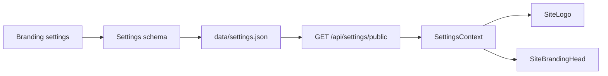

# Logo, Favicon, and Site Identity

> **Route:** **Settings → Site → Logo and favicon**  
> Deep link: `/settings?category=site&group=branding`

Branding identifies a PaginiumCMS instance. It is not owned by a particular color scheme or future theme package, so it should survive appearance, layout, and deployment-mode changes.

---

## 1. Fields and usage

| Field | Key | Usage |
|-------|-----|-------|
| Site logo | `branding.logoUrl` | public Navbar, admin sidebar, and maintenance shell |
| Favicon | `branding.faviconUrl` | browser `<link rel="icon">` |
| Site name | `general.siteName` | text identity and fallback beside/below the logo |

Related but separate settings:

| Asset | Key | Note |
|-------|-----|------|
| Login background | `login.backgroundImageUrl` | authentication screen background |
| Default OG image | `seo.defaultImage` | social and link preview image |
| Content media | media registry | page/article images, not branding |

---

## 2. Recommended asset source

Preferred order:

1. asset selected from the PaginiumCMS Media Library,
2. local public path managed by deployment,
3. HTTPS URL from a trusted CDN/domain.

An external URL introduces dependency on third-party availability, CSP, CORS/referrer behavior, and privacy. An `http://` asset on an HTTPS site may be blocked as mixed content.

Do not place `file://`, `data:text/html`, `javascript:`, or an internal admin URL containing a token into branding. The URL helper must allow-list safe schemes and normalize local `media/…` or `/storage/…` paths.

---

## 3. Recommended formats

| Asset | Format | Recommendation |
|-------|--------|----------------|
| Logo | SVG, WebP, PNG | transparent background; typically up to 512–1024 px wide |
| Favicon | SVG, PNG, ICO | at least 32×32; consider 180×180 for a future apple-touch profile |

SVG is sharp and compact, but it must pass the secure media sanitization/serving flow. Unknown SVG can contain active elements or external references; do not bypass upload validation through manual copying.

A very large original wastes bandwidth on every page. Optimize the logo, strip metadata, preserve aspect ratio, and verify transparency.

---

## 4. Configure through administration

1. Open **Settings → Site → Logo and favicon**.
2. For each field choose:
   - **Select from media**,
   - **Upload from disk**,
   - or enter a safe URL.
3. Inspect the preview.
4. Save changes.
5. Verify public site, administration, login, and maintenance screens.
6. Check favicon in a new private window as well.

The media picker/upload must use the existing media API and its MIME/size/magic-byte rules. A branding field must not create a second unvalidated upload path.

---

## 5. Technical flow

| Layer | Responsibility |
|-------|----------------|
| `SettingsSchema` branding group | type, length, and URL/path validation |
| `SettingsController::publicSettings()` | safe public slice without secrets |
| `BrandingImagePicker.tsx` | media picker/upload UI |
| `brandingUrl.ts` | supported-path normalization |
| `SiteLogo.tsx` | logo and text fallback |
| `SiteBrandingHead.tsx` | runtime favicon update |

A fallback in `frontend/index.html` supplies an icon during first paint. The runtime component replaces it after settings load.

---

## 6. Fallback behavior

When an asset is unset or fails to load:

- logo uses the default mark/icon and `general.siteName`,
- favicon remains on the safe bundled fallback,
- the page must not crash or render a broken-image layout,
- alt/accessibility text comes from the site name, not the filename.

A theme or plugin must not remove the fallback merely because it expects a custom asset.

---

## 7. Light/dark compatibility

One transparent logo may not work on both surfaces. Verify:

- a light logo on both dark and light headers,
- a dark logo in dark mode,
- a monochrome variant,
- small height in mobile Navbar,
- focus/hover contrast around a clickable logo.

The current simple contract uses one `logoUrl`. Separate `logoLightUrl`/`logoDarkUrl` fields are a possible future schema extension, not a guaranteed current feature.

---

## 8. Cache and favicon

Browsers cache favicons aggressively. After a change:

1. open a new private tab,
2. try a hard refresh,
3. inspect the response URL in DevTools Network,
4. check whether CDN/proxy returns an old asset,
5. when reusing a filename, use a versioned media URL or new asset ID,
6. in static/Git publish mode, run the required invalidation or publish.

A stale favicon after one minute is not automatically a backend bug—sometimes the browser clings to its icon like a sysadmin to good old `vi` 😄.

---

## 9. Security and privacy

- an external image may disclose visitor IP/referrer to a third party,
- SVG and MIME are validated server-side,
- settings API exposes a URL, never a private local storage path,
- URLs must not contain access tokens or query secrets,
- admin preview must not fetch RFC1918/localhost URLs through a backend proxy,
- outbound image import uses SSRF policy,
- upload and settings changes are audited according to admin policy.

---

## 10. Troubleshooting

| Symptom | Check |
|---------|-------|
| logo does not appear | URL, 404/403, CSP, mixed content, media permission |
| logo works in admin, not public | public settings slice and public asset route |
| favicon remains old | browser/CDN cache, reused URL, `SiteBrandingHead` mount |
| relative path is wrong | `media/…` vs `/storage/…`, base URL, reverse-proxy prefix |
| logo is distorted | aspect ratio, fixed width/height in theme/plugin component |
| SVG was rejected | security validation; use sanitized SVG or WebP/PNG |
| change causes HTTP 500 | inspect settings JSON validity and backend log; do not continue manual edits without a backup |

---

## Related documents

- [Appearance and color schemes](THEMES.md)
- [Theme architecture](../architecture/THEMES.md)
- [Settings architecture](../architecture/SETTINGS.md)
- [Media and administration](ADMIN_GUIDE.md)
- [First steps](FIRST_STEPS.md)
