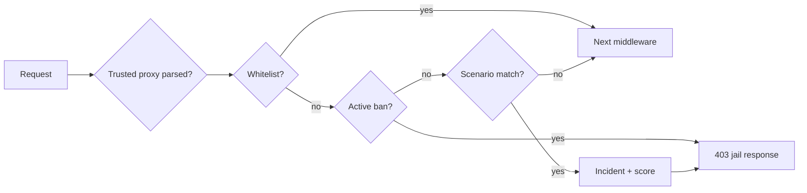

# Firewall (WAF) — administrator guide

> The internal PHP WAF is an additional application safeguard. It does not replace an updated reverse proxy, TLS, rate limits, secure uploads, host firewall, or monitoring.

## 1. Scope

The WAF typically runs before routing and may:

- allow a trusted whitelisted IP,
- reject an active jail or permanent ban,
- recognize a defined probe in URI/query/User-Agent,
- record an incident and escalate a score,
- return 403 before an API JSON handler runs.

The frontend must therefore not assume that every 403 response is JSON.

## 2. Request order



Verify exact middleware order with integration tests because Slim/LIFO registration can be misleading when reading configuration.

## 3. Scenarios

Typical built-in scenarios:

| ID | Example |
|---|---|
| `wp_probe` | `/wp-admin`, `/wp-login.php`, `/xmlrpc.php` |
| `env_probe` | `/.env`, `/.git/`, backup config names |
| `path_traversal` | `../` or encoded variants in URL |
| `sql_probe_uri` | obvious SQL probe in URI/query |
| `bad_bot_ua` | empty or denied User-Agent according to policy |

A scenario is not a universal attack detector. Running regex over editor POST bodies could block a legitimate article containing a security example, so scope must be explicit.

## 4. Jail and escalation

| Setting | Purpose |
|---|---|
| `jailMinutes` | temporary jail duration |
| `maxRetries` | incidents before jail in a defined window |
| `permanentThreshold` | jail cycles before permanent ban |
| `jailMode` | `forbidden`, `empty`, or constrained `tarpit` |
| `tarpitSeconds` | short delay that consumes a PHP/FPM worker |
| `logRetention` | incident ring-buffer limit |

Prefer a fast 403 over PHP tarpit in production. A tarpit can let a cheap bot occupy expensive workers — a terrible trade.

## 5. Whitelist

Whitelist bypasses scenarios and bans, therefore:

- add only stable trusted addresses,
- document owner and reason,
- track expiry externally when UI has no expiry,
- regularly remove old VPN/office IPs,
- do not whitelist an entire CDN because of one false positive.

For a dynamic home address, adjust the narrow scenario or use an admin VPN rather than a broad range.

## 6. Reverse proxy and client IP

`TRUSTED_PROXIES` must include only proxies that genuinely set client IP. Trusting arbitrary `X-Forwarded-For` lets an attacker choose an address or bypass bans. Failing to trust your proxy may cause the WAF to ban the proxy and block every visitor.

After deployment verify one request across access log, WAF incident, and application context.

**Docker production:** PHP often sees a single hop IP (e.g. `192.168.16.x`) for all traffic. Add that hop to `TRUSTED_PROXIES` so bans target real clients from `X-Forwarded-For`, not the proxy. Banning the hop blocks the entire site ([ISS-147](../ISSUES.md#iss-147)).

## 7. Storage paths (Classic layout)

Ban and whitelist stores (production, non-demo):

```text
backend/storage/app/content/data/security/firewall/bans.json
backend/storage/app/content/data/security/firewall/whitelist.json
```

Not `backend/data/…` ([ISS-148](../ISSUES.md#iss-148)).

## 8. Editor body-scan exemptions

Routes that POST full article/markdown bodies are exempt from WAF body scanning (false positives on `../`, SQL examples, etc.):

- `/api/pages`, `/api/articles`, `/api/drafts`, `/api/admin/code-editor`
- `/api/admin/content/` (`suggest-meta`, `render-preview`) — added after [ISS-147](../ISSUES.md#iss-147)

## 9. Storage and concurrency

Flat-file bans/incidents/whitelist require locks and atomic writes. Corrupt JSON must not silently fail open without an alert. Recovery should preserve the original file, create a valid new state, and emit audit/event records.

These files must not be web-accessible or included in a public support ZIP.

## 10. Administrator workflow

Typical screens:

- `/firewall` — incidents, active/permanent bans, whitelist,
- Settings → Firewall — master switch and thresholds.

Mutations require a privileged role, 2FA according to policy, and CSRF for session authentication. Manual ban/unban/whitelist actions must be audited.

## 11. API contract

A concrete release may expose stats, incidents, bans, and whitelist endpoints. The client should support:

- pagination and total,
- 404 for an already absent ban,
- 409 for concurrent change when contracted,
- plain-text or empty WAF 403,
- IP/CIDR validation.

Verify exact endpoints in [API documentation](../architecture/API.md).

## 12. Relationship to other layers

| Layer | Handles |
|---|---|
| WAF | known application probe scenarios and IP jail |
| Rate limit | request frequency by route/identity/IP |
| Login lockout | repeated authentication failures |
| Host firewall | network ports and source networks |
| Reverse proxy | TLS, limits, headers, static paths |
| Security middleware | CSP/HSTS and response policy |
| Audit/logging | evidence and diagnostics |

Never disable one layer because “we already have WAF”.

## 13. False positives

When a legitimate request is blocked:

1. preserve incident ID, time, IP, and scenario ID,
2. verify the real client IP,
3. unban only the specific address,
4. reproduce on staging,
5. adjust the narrowest scenario or threshold,
6. add a regression test,
7. use whitelist only as a justified last resort.

## 14. Emergency unlock

When an administrator is banned:

- prefer server/VPN access through a second trusted path,
- enable maintenance when editing files manually,
- back up bans/whitelist JSON,
- change only the specific record and validate JSON,
- restart/reload runtime when needed,
- sign in, restore policy, and inspect audit.

Do not disable the firewall permanently and never expose a storage file through the web as “temporary diagnostics”.

## 15. Testing

Safe smoke test on your own instance:

```bash
curl -i https://cms.example.test/wp-login.php
```

Expected behavior depends on thresholds: an immediate incident or 403/jail. Then verify that ordinary `/api/health` and editor save remain functional from a non-banned address.

## 16. Related documents

- [Logging](LOGGING.md)
- [Core hardening](../architecture/CORE_HARDENING.md)
- [API contract](../architecture/API_CONTRACT.md)
- [Installation](INSTALLATION.md)
