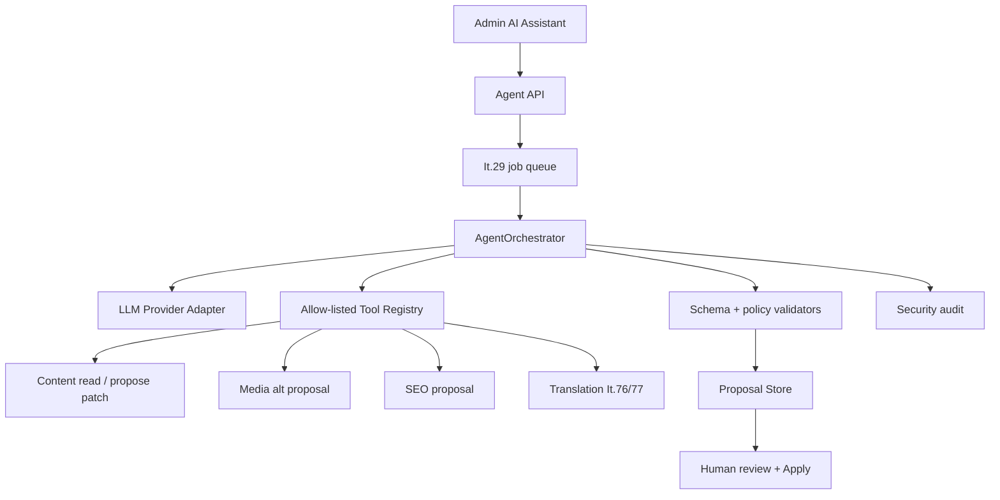

# Iterácia 75 — CMS-aware AI agent

> **Stav:** ⏳ plánované; po stabilizácii It.73/76/77  
> **Priorita:** 🔵 · voliteľná enterprise capability  
> **Vlna:** [Hybrid Engine HE-6](ITERATION_WAVE_HYBRID_ENGINE.md)  
> **Závisí od:** [It.68](ITERATION_68.md), [It.73](ITERATION_73.md), stabilný tool/provider kontrakt; používa It.29 queue a It.66 write gates

## Cieľ

Pridať **CMS-aware asistenta**, ktorý navrhuje zmeny naprieč modulmi cez striktne definované tool cally. Agent nevykonáva autonómny publish a neobchádza oprávnenia používateľa. Jeho primárnym výstupom je validovaný, editovateľný návrh.

It.75 je širší než preklad. Prekladové tooly deleguje na It.76/77; nevytvára tretí translation stack.

---

## Povolené a zakázané hranice

| V rozsahu MVP | Mimo rozsahu MVP |
|---------------|------------------|
| návrh title/body/SEO patchu | autonómny save alebo publish bez potvrdenia |
| návrh media alt textu | arbitrary shell, filesystem alebo sieťový prístup |
| sumarizácia komentárov pre moderátora | nahradenie RBAC rolou „AI admin“ |
| návrh newsletter subject/snippetu | tréning/fine-tuning na customer dátach |
| tag/category suggestion | spúšťanie plugin kódu vygenerovaného modelom |
| delegovanie prekladu | neobmedzené čítanie celého repository |

---

## Architektúra



Dlhé volania sú async. HTTP request vráti job ID; worker vykoná provider/tool loop v ohraničenom počte krokov.

---

## Nedôveryhodné hranice a prompt injection

Content, komentáre, plugin text, preklad a provider output sú **nedôveryhodné dáta**, nie inštrukcie s vyššou prioritou. Ochrana nesmie stáť iba na systémovom prompte.

Povinné kontroly:

1. model vidí iba minimálny autorizovaný context slice,
2. tool registry je allow-list a každý argument má JSON Schema,
3. tool vykonáva vlastnú RBAC/domain validáciu; modelovo uvedený scope nič neudeľuje,
4. read tool nevracia secrets, interné cesty, tokeny ani celé logy,
5. write tool iba vytvorí proposal/JSON Patch; nevykoná save,
6. počet tool krokov, token budget a čas sú ohraničené,
7. provider URL/driver prechádza outbound policy,
8. generated HTML/JSON/shortcode prejde existujúcimi sanitizérmi a It.66/67 policy,
9. Apply znovu overí revision, permission a schema mimo agent jobu.

---

## Backend

| Komponent | Zodpovednosť |
|-----------|--------------|
| `LlmProviderInterface` | typed completion/tool request, usage a health |
| provider adapters | local/Ollama-compatible a explicitne nakonfigurované API adapters |
| `AgentOrchestrator` | bounded loop, state machine, cancellation, immutable actor context |
| `AgentToolRegistry` | allow-list toolov a schema args/results |
| `AgentContextBuilder` | minimálny redigovaný context podľa resource a permission |
| `AgentProposalStore` | TTL, actor/resource/revision binding, encrypted fields ak treba |
| `AgentBudgetStore` | denný token/run budget ako bounded flat-file prevádzkový stav |
| job `agent.run` | async execution, retry iba pri bezpečných provider chybách |
| Apply service | explicitná session/Bearer autorizácia, OCC a audit |

---

## MVP tool registry

| Tool | Potrebné oprávnenie | Efekt |
|------|---------------------|-------|
| `content.read` | `content:read` | vráti allow-listovaný resource slice |
| `content.propose_patch` | `content:write` | uloží návrh patchu; content nemení |
| `seo.suggest_meta` | `content:write` | návrh title/description/keywords podľa schémy |
| `media.suggest_alt` | `media:write` | návrh alt textu viazaný na media ID |
| `comments.summarize` | `comments:moderate` | sumarizácia bez moderation action |
| `translation.translate` | delegované It.76/77 permissions | vytvorí translation proposal |

Každý tool má maximálnu veľkosť vstupu/výstupu a audit event. Arbitrary URL fetch, shell, raw database alebo generic filesystem tool neexistuje.

---

## Nastavenia

```yaml
agent:
  enabled: false
  provider: none
  model: null
  maxTokensPerRun: 4000
  maxToolSteps: 6
  dailyTokenLimit: 0
  allowedTools: []
  proposalTtlMinutes: 60
```

Credentialy sú šifrované. Local provider URL v LAN vyžaduje explicitnú outbound allow-list policy podobne ako It.76. `allowedTools` je prázdny default; enable bez toolov nevytvorí implicitné práva.

---

## Frontend

- panel **AI Assistant** v content editore a neskôr voliteľný globálny entry point,
- jasné zobrazenie provider/modelu, odhadovaného scope a vybraných toolov,
- Run → progress → proposal diff → Apply selected / Discard,
- žiadne tlačidlo „publish automatically“,
- proposal označí polia vytvorené modelom a provider usage,
- audit trail je dostupný oprávnenému adminovi,
- používateľ môže job zrušiť; zrušenie nesmie aplikovať partial proposal.

---

## Privacy, audit a náklady

- agent odosiela iba minimálny context; používateľ vidí, čo bude spracované,
- prompt/content/response sa defaultne nelogujú,
- audit ukladá actor, resource ID, provider/model, tools, token count, výsledok a proposal ID,
- cloud provider používanie má budget a limit; dokumentácia nesľubuje stabilnú cenu,
- local provider je voliteľná privacy-first cesta, nie garantovaný výkon,
- proposal TTL cleanup je idempotentný a neodstráni aplikovaný audit record.

---

## Chybové scenáre

- provider timeout → job failed/retryable bez proposal Apply,
- neplatný tool call → schema reject a bounded correction alebo stop,
- pokus o nepovolený tool → hard deny + security audit,
- zmena oprávnenia počas jobu → Apply znovu autorizuje a môže odmietnuť,
- source revision changed → `409`,
- budget exceeded → `429`/clear status,
- agent disabled → capability error a nulový outbound traffic,
- partial provider text bez validného schema result → nepoužiteľný návrh, nie raw write.

---

## Mimo rozsahu

- autonómny publish,
- permanentný „AI superuser“,
- generic web browsing alebo shell tool,
- automatická inštalácia pluginov/tém,
- fine-tuning/training pipeline,
- ukladanie chain-of-thought alebo interných reasoning tokenov,
- nahradenie editorov, validátorov alebo ľudskej zodpovednosti.

---

## Testy

- mocked LLM → validný tool call → proposal JSON,
- prompt injection v content body nedokáže aktivovať nepovolený tool,
- malformed args sú schema rejected,
- invoking user bez permission → deny pred toolom aj pri Apply,
- revision conflict a role revoked during job,
- maxToolSteps/token/time budget,
- disabled/empty allow-list → žiadna akcia/outbound,
- generated patch prejde It.66/67 validators,
- provider secrets/content nie sú v logoch,
- 30s+ mock latency prejde cez worker bez HTTP timeoutu,
- cancellation a duplicate job idempotency.

---

## Definition of Done

- [ ] „Navrhni SEO pre článok“ vytvorí editovateľný proposal bez zápisu.
- [ ] Apply je samostatná autorizovaná mutácia s OCC/schema/audit.
- [ ] Agent používa iba allow-listované schémované tooly.
- [ ] Prompt injection testy nevedú k escalácii toolov alebo čítaniu secretov.
- [ ] Default `enabled=false`, `allowedTools=[]` znamená nulový outbound traffic.
- [ ] Async worker zvládne dlhé provider volanie bez blokovania HTTP.
- [ ] Translation tool znovu používa It.76/77, nie duplicitný provider stack.
- [ ] SK/EN user, security, privacy a operations dokumentácia je aktualizovaná.

## Súvisiace

[It.76](ITERATION_76.md) · [It.77](ITERATION_77.md) · [It.29](ITERATION_29.md) · [It.66](ITERATION_66.md) · [It.67](ITERATION_67.md)
