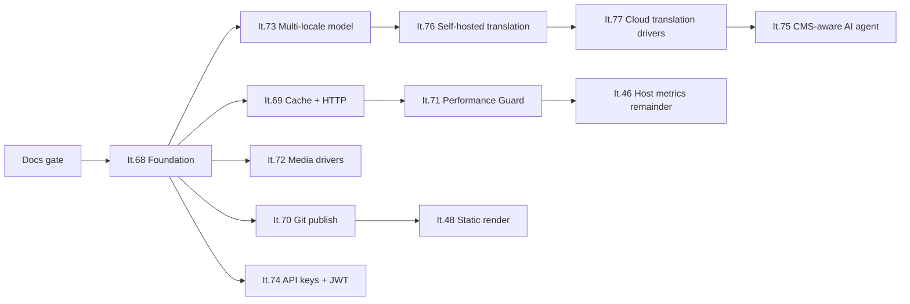

# Hybrid Engine — implementačná vlna It.68–77

> **Stav:** It.68–71 + UX v **`v2.1.0-beta.28`** · It.72 MVP + **It.73 hotové** v **`[Unreleased]`**  
> **Checkpoint:** `v2.1.0-beta.28` · 6. august 2026  
> **Architektonický základ:** [Hybrid Engine](architecture/HYBRID_ENGINE.md) · [No-SQL mandát](architecture/NOSQL_MANDATE.md) · [režimy nasadenia](architecture/DEPLOYMENT_MODES.md)

Táto vlna premieňa nový smer PaginiumCMS na implementovateľný plán. Projekt rastie z pokročilého flat-file CMS na **Hybrid Headless Content Engine**, ale nemení svoj dátový základ: obsah a konfigurácia zostávajú v súboroch; index, cache, Git, fronty a externé služby sú odvodené, distribučné alebo voliteľné vrstvy.

---

## 1. Nemenný kontrakt vlny

Každá iterácia It.68–77 musí zachovať tieto pravidlá:

1. **Classic režim je default a regresný baseline.** Chýbajúce `engine.*` nastavenia znamenajú kompatibilné lokálne správanie.
2. **Žiadna SQL autorita.** Relačná ani dokumentová databáza nesmie byť jediným zdrojom obsahu, nastavení, kľúčov alebo prevádzkového stavu potrebného na obnovu.
3. **Primárny zápis pred odvodenými vrstvami.** Dokument sa bezpečne uloží skôr, než sa aktualizuje index, cache, Git publish alebo AI/translation workflow.
4. **Odvodené vrstvy sú zahoditeľné a obnoviteľné.** Index a cache majú rebuild; publish queue, metriky a kvóty majú diagnostiku a opravu.
5. **Bezpečnostná parita.** Nový driver, Bearer klient alebo agent nesmie obísť validáciu, RBAC, audit, rate limit a ochranu ciest.
6. **Voliteľná služba nie je skrytá závislosť.** Redis, Git remote, S3, prekladový provider ani LLM nesmú byť potrebné na spustenie Classic profilu.
7. **Ľudské potvrdenie pri generovanom obsahu.** Preklady a AI návrhy sú pracovné návrhy; automatický publish je mimo rozsahu tejto vlny.
8. **Dvojjazyčná dokumentácia je súčasť Definition of Done.** SK a EN kontrakt sa menia v rovnakom release.

---

## 2. Fázy a závislosti



Číslo iterácie neurčuje poradie dodania. **It.75 sa realizuje po It.76/77**, pretože agent využíva stabilný lokalizačný model a provider vrstvu.

### Kanonické fázy

| Fáza | Iterácie | Výsledok |
|------|----------|----------|
| **Fáza 0** | dokumentácia | jednotný SK/EN kontrakt a uzamknuté invarianty |
| **HE-1 Foundation** | **It.68** | ✅ dodané |
| **HE-2 Read performance** | **It.69** | ✅ dodané |
| **HE-3 Distribution** | **It.70** | ✅ dodané |
| **HE-4 Observability** | **It.71** | ✅ **beta.28** |
| **HE-5 Integrations** | **It.72**, **It.74** | It.72 **MVP** v `[Unreleased]` |
| **HE-6 Localized workflows** | **It.73 → 76 → 77 → 75** | It.73 **hotové** (read/write/publish/migrate/docs) v `[Unreleased]` |

It.73 je týmto dokumentom kanonicky zaradená do **HE-6**. V staršom návrhu bola nejednotne označená ako HE-5.

---

## 3. Prehľad iterácií

| It. | Názov | Priorita | Stav | Povinná závislosť | Absorbuje / koordinuje |
|-----|-------|----------|------|--------------------|------------------------|
| **68** | [Hybrid Engine foundation](ITERATION_68.md) | 🔴 | ✅ dodané | Fáza 0 | základ pre všetky ďalšie vrstvy |
| **69** | [Cache + HTTP conditional requests](ITERATION_69.md) | 🔴 | ✅ dodané | It.68 | absorbuje It.45 a It.49 |
| **70** | [Git publish modes](ITERATION_70.md) | 🟡 | ✅ dodané | It.68 | rozširuje `GitHubService` |
| **71** | [Performance Guard](ITERATION_71.md) | 🟡 | ✅ **beta.28** | It.69 | dopĺňa It.7 a remainder It.46 |
| **72** | [Media storage drivers](ITERATION_72.md) | 🟡 | ✅ MVP `[Unreleased]` | It.68 | local driver + probe; S3 neskôr |
| **73** | [Multi-locale content document](ITERATION_73.md) | 🟡 | ✅ **`[Unreleased]`** | It.68 | read/write/publish/migrate + API docs |
| **74** | [API keys a JWT](ITERATION_74.md) | 🟡 | ✅ hotové `[Unreleased]` | It.68; cache lookup z It.69 odporúčaný | session auth zostáva |
| **76** | [Self-hosted translation](ITERATION_76.md) | 🔵 | ⏳ | It.73 | vytvára provider kontrakt |
| **77** | [Cloud translation](ITERATION_77.md) | 🔵 | ⏳ | It.76 | pridáva cloud drivers bez druhého UI |
| **75** | [CMS-aware AI agent](ITERATION_75.md) | 🔵 | ⏳ | It.73 + stabilná provider/tool vrstva | používa It.29 queue a It.66 gates |

---

## 4. Paralelné a externé prúdy

| Položka | Vzťah k vlne | Pravidlo |
|---------|---------------|----------|
| **It.78** unified upload security | bezpečnostný gate | pred It.79 a novými MIME |
| **It.79** DAM video | paralelne po It.72 MVP | vyžaduje It.78 |
| **It.67** untrusted surfaces | bezpečnostný gate | dokončiť pred rozšírením generovaného/importovaného kódu |
| **It.58d** layout remainder | paralelný produktový prúd | nesmie vytvoriť druhý content model alebo druhú publish pipeline |
| **It.48** static render | pokračovanie It.70 | build trigger je samostatný krok po úspešnom Git publish |
| **It.46** host metrics remainder | doplnok It.71 | host agent a in-request PHP APM ostávajú oddelené vrstvy |
| **It.25** setup/update UX | pre-Final | voliteľné služby musia byť v sprievodcovi označené ako voliteľné |
| Komunitná beta | priebežný gate | clean install, upgrade, rollback a non-maintainer UX |

---

## 5. Spoločný transakčný model

Úspešná mutácia používa toto poradie:

```text
authentication → authorization → schema/input validation
→ revision/lock check → atomic SSOT write
→ index update → cache invalidation
→ audit/event → optional publish/translation/agent job
```

Ak po úspešnom zápise zlyhá odvodená vrstva:

- primárny dokument sa nevracia do starého stavu iba preto, že zlyhal Redis alebo Git,
- odpoveď rozlíši **uložené** od **distribuované**,
- systém uloží incident a retry stav,
- diagnostika ponúkne rebuild/retry,
- idempotentná úloha nesmie vytvoriť duplicitný commit alebo duplicitnú aplikáciu patchu.

---

## 6. Spoločný quality gate

Po každej iterácii:

- `./scripts/iteration-gate.sh` je zelený,
- PHPUnit a PHPStan L8 prejdú,
- TypeScript, ESLint a Vitest prejdú pre dotknutý frontend,
- Classic smoke test prebehne bez Redis, Git, S3, translatora a LLM,
- nový feature flag je defaultne vypnutý alebo bezpečne nastavený,
- migration dry-run a rollback sú zdokumentované,
- security testy pokrývajú oprávnenia, cesty, SSRF, tajomstvá a logovanie podľa rozsahu,
- SK/EN dokumentácia, changelog a incident register sú aktualizované spolu s kódom.

---

## 7. Release stratégia

Odporúčanie je dodávať vlnu po vertikálnych rezoch, nie ako jeden veľký merge:

1. **It.68** iba s lokálnym driverom a jedným migrovaným vertical slice.
2. **It.69** najprv file/memory parity, potom voliteľný Redis a nakoniec HTTP validators.
3. **It.70** lokálny Git fixture, queued workflow, potom remote push.
4. **It.71–74** ako samostatné, vypínateľné schopnosti.
5. **It.73** s dry-run migráciou a dlhším beta oknom.
6. **It.76/77** so spoločným UI a provider registry.
7. **It.75** až po stabilizácii tool kontraktov a bezpečnostnej revízii.

Final 1.0 nemusí čakať na všetky It.68–77. Rozsah GA určuje samostatné release rozhodnutie; Classic profil však musí zostať podporovaný počas celej vlny.

---

## 8. Dokumentačný stav

Fáza 0 pre túto vlnu je pripravená, keď:

- všetkých 11 dokumentov existuje v štruktúrne zhodnej SK/EN verzii,
- priority, fázy a závislosti sú rovnaké,
- It.73 je všade HE-6,
- aditívna autentifikácia It.74 nemení admin session flow,
- AI/preklady sú návrhové workflow s explicitným potvrdením,
- žiadna plánovaná schopnosť nie je označená ako implementovaná.

**Nasledujúca implementácia:** It.72 S3 + migrácia · It.73 editor/write path · [It.78](ITERATION_78.md) upload policy · [It.79](ITERATION_79.md) video.
