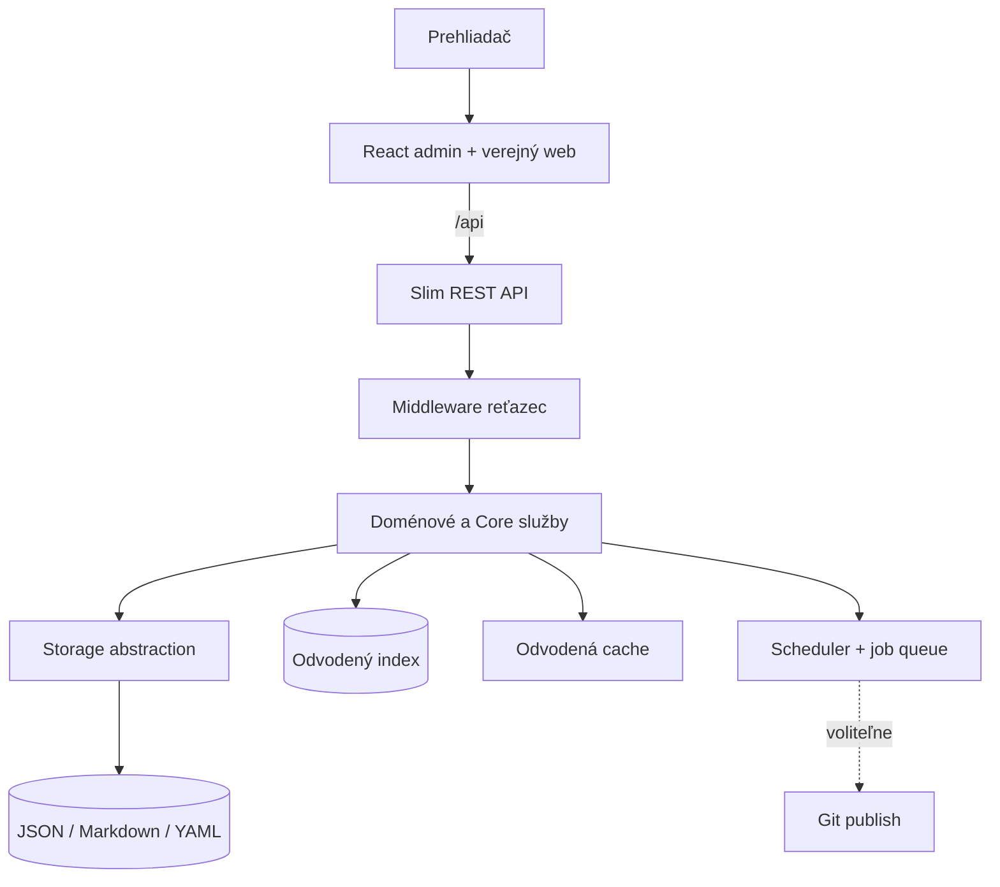

# 🏛️ PaginiumCMS

> **Finálna konsolidácia:** úplný index je v [NAVIGATION.md](NAVIGATION.md). Stavové tvrdenia rozlišujú implementované, prechodné a plánované schopnosti.

> **Verzia:** 2.1.0-beta.23 · **Posledná aktualizácia:** august 2026  
> **Hybrid Headless Content Engine** — No-SQL súborový zdroj pravdy, API-first administrácia a verejný React web.

---

## 🎯 Vízia a filozofia

PaginiumCMS zachováva jadro zámerne úzke, bezpečné a čitateľné. Primárny obsah, konfigurácia a prevádzkový stav **musia zostať v súboroch**. Toto pravidlo definuje [architecture/NOSQL_MANDATE.md](architecture/NOSQL_MANDATE.md).

Projekt sa rozvíja na **Hybrid Engine**: nad súborovým zdrojom pravdy pridáva index, cache, abstrakcie úložiska, Git distribúciu, viacjazyčný dokumentový model a budúce AI asistované workflow. Cieľový návrh je v [architecture/HYBRID_ENGINE.md](architecture/HYBRID_ENGINE.md).

**Dôvod existencie projektu:** umožniť študovať moderný full-stack na reálnom, otvorenom a zdokumentovanom kóde — od súborového modelu cez Slim API až po React administráciu. Kanonické poslanie opisuje [PHILOSOPHY.md](PHILOSOPHY.md).

### Základné zásady

- **Povinný No-SQL zdroj pravdy:** JSON, Markdown a YAML na disku; žiadny MySQL, PostgreSQL ani MongoDB ako autorita CMS.
- **API First:** dôležité administrátorské operácie majú definovaný REST kontrakt.
- **Security by Design:** autentifikácia, autorizácia, validácia, šifrovanie a audit sú súčasťou Core.
- **Tenké jadro:** funkcie rastú v moduloch, ovládačoch a rozšíreniach.
- **Odvodené vrstvy:** index, cache a Git distribúcia nesmú nahradiť zdrojové dokumenty.
- **Documentation First:** návrh, obmedzenia a skutočný stav sa dokumentujú pred veľkou implementačnou zmenou.
- **Demo je iba ukážka:** `demo.paginiumcms.com` nie je produkčné úložisko ani samostatná platená edícia.

---

## 🌍 Jazykové vydania dokumentácie

Dokumentácia je spravovaná v dvoch samostatných, obsahovo rovnocenných stromoch:

```text
SK/    # slovenské vydanie
EN/    # anglické vydanie
```

Pravidlá dvojjazyčnej dokumentácie:

1. jeden súbor obsahuje iba jeden jazyk,
2. obe vydania používajú rovnakú relatívnu štruktúru a názvy súborov,
3. kód, názvy tried, endpointy, cesty a konfiguračné kľúče sa neprekladajú,
4. stav funkcie (`✅`, `🟡`, `⏳`, `⏸️`) musí byť v oboch jazykoch rovnaký,
5. význam sa kontroluje podľa obsahu, nie mechanickým prekladom viet,
6. pri zmene architektúry sa aktualizujú obe jazykové verzie v tej istej dokumentačnej zmene.

---

## 📊 Aktuálny stav projektu — august 2026

| Oblasť | Stav | Poznámka |
|--------|------|----------|
| **Architektonický pivot** | ✅ Fáza 0 | Hybrid Engine a No-SQL mandát sú definované |
| **Backend API** | ✅ Stabilné beta jadro | Slim 4, PHP-DI, automatické načítanie trás |
| **No-SQL SSOT** | ✅ Vynútené | súbory, bezpečné zápisy, index a diagnostika |
| **Autentifikácia administrácie** | ✅ Funkčná | session + CSRF + RBAC + 2FA |
| **Obsahový index a OCC** | ✅ Dodané | `content.json`, konflikty 409, verzovanie |
| **Cache** | 🟡 Čiastočná | súbor/pamäť; zjednotená Redis vrstva → It.69 |
| **Git distribúcia** | 🟡 Čiastočná | GitHub API sync; plný publish workflow → It.70 |
| **Verejný a admin frontend** | ✅ Dodané | React, TypeScript, Vite 8, SK/EN i18n |
| **Automatické testy** | ✅ 838+ PHPUnit | PHPStan L8; frontend gate podľa `developer/TESTING.md` |
| **Najnovšie zdokumentované vydanie** | ✅ `v2.1.0-beta.23` | It.58c Layout Switch |
| **Nasledujúci kód** | ⏸️ Pozastavený | pokračuje po dokončení dvojjazyčnej dokumentácie |
| **Prvá Hybrid Engine implementácia** | ⏳ It.68 | storage abstraction + schema registry + engine settings |

### Plánovaná vlna Hybrid Engine

| Iterácia | Funkcia |
|----------|---------|
| **68** | Abstrakcia úložiska, registry schém a nastavenia enginu |
| **69** | Jednotná cache, Redis, `ETag` a `Last-Modified` |
| **70** | Okamžitý a dávkový Git publish |
| **71** | Performance Guard — APM middleware |
| **72** | Ovládače médií cez Flysystem, S3/CDN |
| **73** | Viac jazykov v jednom obsahovom dokumente |
| **74** | Aditívne API kľúče a JWT pre headless klientov |
| **75** | AI agent naprieč modulmi CMS |
| **76** | Asistovaný preklad cez self-hosted LibreTranslate |
| **77** | Asistovaný preklad cez cloud providerov |

Mapa vlny: [ITERATION_WAVE_HYBRID_ENGINE.md](ITERATION_WAVE_HYBRID_ENGINE.md) · Celkový backlog: [ITERATION_BACKLOG.md](ITERATION_BACKLOG.md)

---

## 🧱 Technologický stack

- **PHP:** 8.5+, strict types, PHPStan level 8
- **Backend:** Slim 4, PHP-DI, PSR-7/15, League CommonMark, OTPHP
- **Frontend:** React, TypeScript, Vite 8, TailwindCSS
- **Primárne úložisko:** JSON / Markdown / YAML súbory
- **Index:** `data/index/content.json`, bezpečný rebuild a súbežné zápisy
- **Cache:** súborová a pamäťová; Redis je plánovaná odvodená vrstva
- **Prevádzka:** Docker Compose alebo klasický PHP/nginx režim
- **Testovanie:** PHPUnit, PHPStan, TypeScript type-check, ESLint, Vitest

---

## 🗺️ Prehľad architektúry



### Systémové vrstvy

1. **Prezentácia:** React administrácia, verejná SPA a budúci statický výstup.
2. **API:** Slim trasy, middleware, autentifikácia a jednotný JSON kontrakt.
3. **Doména a Core:** obsah, nastavenia, verzovanie, zámky, scheduler a udalosti.
4. **Abstrakcie:** storage, cache, media a publisher rozhrania.
5. **Odvodené vrstvy:** index, cache, metriky a distribučné pipeline.
6. **SSOT:** fyzické súbory — povinný No-SQL základ.

Podrobnosti: [architecture/HYBRID_ENGINE.md](architecture/HYBRID_ENGINE.md).

---

## 🗂️ Štruktúra projektu

```text
paginiumcms-architecture/
├── backend/
│   ├── app/
│   │   ├── Core/           # FlatFile, Cache, Backup, Scheduler, Settings, …
│   │   ├── Http/           # Controllers, Middleware, Routes, Config/services.php
│   │   ├── Modules/        # Security, Media, Comments, Audit, …
│   │   └── Support/        # Lang, JsonHelper
│   ├── bootstrap/          # app.php — jediný bootstrap vstup
│   ├── bin/console         # audit:run, scheduler:run, worker:process, …
│   ├── lang/               # aplikačné SK/EN preklady
│   ├── public/             # index.php → bootstrap/app.php
│   ├── storage/            # obsah, cache, logy a zálohy
│   └── tests/              # PHPUnit testy
├── frontend/               # React administrácia a verejný web
├── docs/                   # architektúra, návody, roadmapy a iterácie
├── vendor/                 # Composer závislosti v koreňovom adresári
├── composer.json
└── phpunit.xml
```

---

## 🔌 Prehľad API

| Skupina | Prefix | Prístup |
|---------|--------|---------|
| Autentifikácia | `/api/auth/*` | zmiešaný; registráciu možno vypnúť |
| Obsah | `/api/pages`, `/api/articles` | verejné GET pre publikované; zápis vyžaduje oprávnenie |
| Vyhľadávanie | `/api/search?q=&scope=admin\|public&types=` | verejné publikované výsledky alebo admin paleta |
| SEO | `/api/seo/{type}/{slug}` | verejné meta údaje |
| Médiá | `/api/media/*` | rola EDITOR+ a príslušné oprávnenia |
| Feedy | `/feed.xml`, `/sitemap.xml`, `/robots.txt` | verejné |
| Úlohy | `/api/admin/jobs/*` | ADMIN |
| Statické médiá | `/storage/{path}` | verejný allow-list, ochrana ciest |
| Nastavenia | `/api/settings/public`, `/api/admin/settings/*` | verejný výrez / ADMIN |
| Kôš | `/api/admin/trash/*` | EDITOR+ |
| Administrácia | `/api/admin/*` | autentifikácia + rola + prípadné 2FA pravidlá |
| Health | `/api/health` | verejné; dostupné aj počas maintenance režimu |

Trasy v `backend/app/Http/Routes/*.php` sa automaticky načítavajú cez `bootstrap/app.php`.

Podrobné kontrakty:

- [architecture/API.md](architecture/API.md)
- [architecture/API_CONTRACT.md](architecture/API_CONTRACT.md)
- [architecture/CONTENT_API.md](architecture/CONTENT_API.md)
- [architecture/CORE_HARDENING.md](architecture/CORE_HARDENING.md)

---

## 🔒 Bezpečnostné zásady

- session autentifikácia s regeneráciou session ID po prihlásení,
- Argon2id heslá a centrálna password policy,
- RBAC a permission middleware,
- synchronizačný CSRF token pre meniace API požiadavky,
- šifrovanie TOTP seedov a citlivých nastavení cez `APP_KEY`,
- WAF, rate limiting a sanitizované štruktúrované logovanie,
- ochrana proti SSRF pri odchádzajúcich URL,
- Path ACL a allow-list verejného storage,
- politika rozšírení, Zip-Slip ochrana a kontrola nedôveryhodného kódu,
- auditné udalosti a bezpečný CSV export,
- kontrolované správanie maintenance a demo režimu.

Referencie: [SECURITY_REVIEW.md](SECURITY_REVIEW.md) · [developer/SECURITY.md](developer/SECURITY.md) · [../SECURITY.md](../SECURITY.md)

---

## 🚀 Začíname

### Odporúčané — Docker a prvý administrátor

```bash
git clone <repo> paginiumcms && cd paginiumcms
chmod +x scripts/first-run.sh
./scripts/first-run.sh
docker compose up -d
curl -s http://localhost:8080/api/health
```

Predvolené konto: `admin@localhost` / `Admin123!ChangeMe`. Pred prvým spustením ho možno nahradiť premennými `FIRST_ADMIN_*`.

### Klasický vývoj v dvoch termináloch

```bash
composer install
./vendor/bin/phpunit --testdox
./vendor/bin/phpstan analyse backend --level=8

# Backend
cd backend/public && php -S localhost:8080

# Frontend — samostatný terminál
cd frontend && npm install && npm run dev
# → http://localhost:3025
```

Lokálne prostredie: [developer/LOCAL_SETUP.md](developer/LOCAL_SETUP.md) · Natívny vývoj: [deploy/DEV.md](deploy/DEV.md)

### Produkčný cron

```bash
* * * * * cd /path/to/paginiumcms && php backend/bin/console scheduler:run && php backend/bin/console worker:process
```

Podrobnosti: [deploy/CRON.md](deploy/CRON.md).

### Odomknutie Developer Mode

```http
POST /api/admin/developer/unlock  { "totp_code": "123456" }
GET  /api/admin/developer/logs
```

Podrobnosti: [user/DEVELOPER_MODE.md](user/DEVELOPER_MODE.md) · [user/CODE_EDITOR.md](user/CODE_EDITOR.md)

---

## 📚 Index dokumentácie

### Základ a smerovanie

| Dokument | Účel |
|----------|------|
| **[PHILOSOPHY.md](PHILOSOPHY.md)** | Poslanie a nemenné zásady projektu |
| **[architecture/NOSQL_MANDATE.md](architecture/NOSQL_MANDATE.md)** | Povinný súborový zdroj pravdy |
| **[architecture/HYBRID_ENGINE.md](architecture/HYBRID_ENGINE.md)** | Cieľová architektúra Hybrid Engine |
| **[architecture/DEPLOYMENT_MODES.md](architecture/DEPLOYMENT_MODES.md)** | Classic, Hybrid a Git-headless profily |
| [ROADMAP.md](ROADMAP.md) | Celkový smer a poradie iterácií |
| [CONTINUATION.md](CONTINUATION.md) | Kontext pokračovania projektu |
| [FEATURE_OVERVIEW.md](FEATURE_OVERVIEW.md) | Implementované a plánované funkcie |
| [ITERATION_BACKLOG.md](ITERATION_BACKLOG.md) | Konsolidovaný backlog |
| [../CHANGELOG.md](../CHANGELOG.md) | História vydaní |

### Architektúra

| Dokument | Účel |
|----------|------|
| [architecture/ARCHITECTURE.md](architecture/ARCHITECTURE.md) | Detailná systémová architektúra |
| [architecture/API.md](architecture/API.md) | API referencia |
| [architecture/API_CONTRACT.md](architecture/API_CONTRACT.md) | JSON obálky, chyby a meta údaje |
| [architecture/CONTENT_API.md](architecture/CONTENT_API.md) | Stránkovanie, hľadanie a pravidlá publikovania |
| [architecture/CORE.md](architecture/CORE.md) | Zodpovednosti Core vrstvy |
| [architecture/CORE_HARDENING.md](architecture/CORE_HARDENING.md) | RBAC, maintenance, kôš a hardening |
| [architecture/STORAGE.md](architecture/STORAGE.md) | Súborové rozloženie a zápisové pravidlá |
| [architecture/VERSIONING.md](architecture/VERSIONING.md) | Revízie a konflikty |
| [architecture/PLUGINS.md](architecture/PLUGINS.md) | Rozšírenia a runtime |
| [architecture/THEMES.md](architecture/THEMES.md) | Témy a farebné schémy |

### Používateľ a administrátor

| Dokument | Účel |
|----------|------|
| **[user/README.md](user/README.md)** | Vstup do používateľskej dokumentácie |
| [user/INSTALLATION.md](user/INSTALLATION.md) | Inštalácia |
| [user/FIRST_STEPS.md](user/FIRST_STEPS.md) | Prvé prihlásenie, 2FA a prvý obsah |
| [user/ADMIN_GUIDE.md](user/ADMIN_GUIDE.md) | Kompletná správa CMS |
| [user/BETA_TESTER.md](user/BETA_TESTER.md) | Smoke test pre beta testera |
| [user/CONTENT_EDITOR.md](user/CONTENT_EDITOR.md) | Editor stránok a článkov |
| [user/ACCESS_CONTROL.md](user/ACCESS_CONTROL.md) | Roly, oprávnenia a Path ACL |
| [user/FIREWALL.md](user/FIREWALL.md) | WAF a administrácia firewallu |
| [user/LOGGING.md](user/LOGGING.md) | Prevádzkové a bezpečnostné logy |
| [user/CODE_EDITOR.md](user/CODE_EDITOR.md) | Bezpečný Code Editor |
| [user/DEVELOPER_MODE.md](user/DEVELOPER_MODE.md) | Developer Mode a tokeny |

### Vývoj, testovanie a nasadenie

| Dokument | Účel |
|----------|------|
| [developer/CONTRIBUTING.md](developer/CONTRIBUTING.md) | Pravidlá prispievania |
| [developer/LOCAL_SETUP.md](developer/LOCAL_SETUP.md) | Docker a lokálne prostredie |
| [developer/CODING_STANDARDS.md](developer/CODING_STANDARDS.md) | Štandardy kódu |
| [developer/TESTING.md](developer/TESTING.md) | Testovacia stratégia a quality gate |
| [developer/SECURITY.md](developer/SECURITY.md) | Bezpečnostná architektúra |
| [developer/RELEASE.md](developer/RELEASE.md) | Release a deploy checklist |
| [developer/BETA_INFRA.md](developer/BETA_INFRA.md) | Beta infra brána |
| [deploy/DEPLOY.md](deploy/DEPLOY.md) | Produkčné a demo nasadenie |
| [deploy/DEMO_DEPLOY.md](deploy/DEMO_DEPLOY.md) | Demo inštancia |
| [deploy/DEV.md](deploy/DEV.md) | Natívny vývoj |
| [deploy/NGINX_API.md](deploy/NGINX_API.md) | Nginx a API proxy |
| [deploy/CRON.md](deploy/CRON.md) | Scheduler a worker |

### Beta a bezpečnostné revízie

| Dokument | Účel |
|----------|------|
| [PUBLIC_BETA1.md](PUBLIC_BETA1.md) | Rozsah Public Beta 1 a spätná väzba |
| [SECURITY_REVIEW.md](SECURITY_REVIEW.md) | Návod pre externú bezpečnostnú revíziu |
| [ISSUES.md](ISSUES.md) | Známe incidenty, príčiny a opravy |
| [CHECKLIST.md](CHECKLIST.md) | Inventár API, frontendu a funkcií |
| [../AUDIT_REPORT.md](../AUDIT_REPORT.md) | Audit projektu |
| [../SECURITY.md](../SECURITY.md) | Nahlasovanie zraniteľností |

---

## 🧭 Iteračná dokumentácia

Dokumenty `ITERATION_*.md` zachytávajú návrh, implementáciu, testy a stav jednotlivých funkcií. Historické iterácie zostávajú zachované; nové smerovanie ich nemaže, ale zoskupuje do vrstiev Hybrid Engine.

| Rozsah | Obsah |
|--------|-------|
| It.1–5 | zámky, autosave, konflikty, nastavenia a autentifikácia |
| It.6–18 | notifikácie, monitoring, médiá, feedy, SSO, blueprinty, demo, pluginy a i18n |
| It.19–29 | index, API kontrakt, hardening, SEO, DAM, view modes, bulk actions a scheduler |
| It.30–67 | administrátorský UX, Redis návrh, WAF, editor, newsletter, aktualizácie, galéria a security packs |
| **It.68–77** | **Hybrid Engine, cache, Git, APM, media drivers, locale model, API auth a AI workflow** |

Mapa novej vlny: [ITERATION_WAVE_HYBRID_ENGINE.md](ITERATION_WAVE_HYBRID_ENGINE.md).

---

## ⚠️ Známe obmedzenia dokumentácie a produktu

- Nie všetky historické dokumenty boli v pôvodnom balíku jazykovo jednotné; prebieha ich samostatné SK/EN spracovanie.
- Súbory `architecture/EVENTS.md`, `architecture/FRONTEND.md`, `architecture/MODULES.md`, `developer/DEVELOPMENT.md`, `user/PLUGINS.md` a `user/THEMES.md` sú v zdrojovom balíku prázdne a vyžadujú doplnenie obsahu, nie iba preklad.
- Niektoré staršie prehľady uvádzajú zastarané verzie alebo stav iterácií; dvojjazyčná revízia ich zjednotí podľa changelogu a kódu.
- Implementácia Hybrid Engine je cieľový návrh, nie tvrdenie, že It.68–77 sú už hotové.
- Právny rozsah open-source a komerčného použitia musí byť v súlade s aktuálnym `LICENSE` súborom repozitára.

---

> **Documentation First:** keď sa kód a dokumentácia rozchádzajú, dokumentácia musí najprv presne pomenovať skutočný stav a následná zmena kódu musí rozdiel vedome odstrániť.
