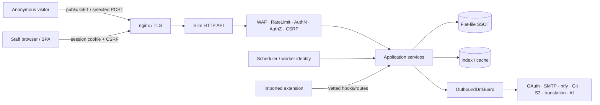

# Príručka bezpečnostného auditu

> **Cieľový dokumentačný snapshot:** `v2.1.0-beta.23`  
> **Publikum:** externí audítori, beta testeri a maintainers.  
> Overuj vždy presný tag alebo commit. Plánované schopnosti It.68–77 netestuj ako implementované, kým ich konkrétny release neoznačí za dodané.

## 1. Príprava izolovaného labu

```bash
git clone https://github.com/techberode/paginiumcms-architecture.git
cd paginiumcms-architecture
git checkout --detach v2.1.0-beta.23
git rev-parse HEAD

export FIRST_ADMIN_EMAIL='auditor@localhost'
export FIRST_ADMIN_PASSWORD='use-a-unique-lab-password'
export FIRST_ADMIN_NAME='Security Auditor'

chmod +x scripts/first-run.sh
./scripts/first-run.sh
docker compose up -d
curl -fsS http://localhost:8080/api/health
```

- Nepoužívaj heslo z dokumentácie na sieťovo dostupnej inštancii.
- Lab nemá obsahovať produkčné `.env`, `APP_KEY`, user JSON ani médiá.
- Pred testom zaznamenaj commit, lockfile hash, PHP/Node verziu a Docker Compose config.
- Po teste znič lab secrets a testovacie dáta.

Quality gate a release pravidlá sú v [TESTING.md](developer/TESTING.md) a [RELEASE.md](developer/RELEASE.md).

## 2. Architektúra a trust boundaries



Kritické hranice:

1. internet → nginx,
2. browser → session/CSRF API,
3. HTTP route → backend authorization,
4. user path/archive → filesystem,
5. extension → Core API,
6. CMS → outbound provider,
7. scheduler/worker → privileged operation,
8. autoritatívny SSOT → index/cache/Git remote,
9. CI/release → produkčný artefakt.

## 3. Auditný workflow

1. **Identifikuj baseline:** tag, SHA, profile, runtime, lockfiles.
2. **Prečítaj threat model:** [developer/SECURITY.md](developer/SECURITY.md).
3. **Spusti quality gate:** zachovaj raw lokálny log mimo repozitára.
4. **Skontroluj manuálne anomálie:** warningy, skips, dependency advisories, network errors, secrets v logu.
5. **Mapuj route inventory:** každá mutácia potrebuje authn/authz/CSRF alebo explicitnú anonymnú výnimku.
6. **Testuj trust boundary:** nie iba happy-path controller.
7. **Vytvor minimálny PoC:** bez produkčných dát a bez perzistencie.
8. **Navrhni regresný test:** nález bez testu sa ľahko vráti.
9. **Reportuj súkromne:** podľa root [SECURITY.md](../SECURITY.md).

## 4. Autentifikácia, session a 2FA

Over:

- Argon2id a password policy,
- `session_regenerate_id()` po login/privilege zmene,
- cookie flags podľa HTTPS profilu,
- generic login/reset odpovede proti enumerácii,
- login lockout a OTP rate limit,
- TOTP seed šifrovaný at rest,
- produkčný response/log bez `debug_code`, seedu, QR a provisioning URI,
- reset token hash, expiry, single-use a timing-safe porovnanie,
- logout a session invalidation.

Negatívne testy:

| Test | Očakávanie |
|---|---|
| 20 nesprávnych loginov | lockout alebo `429` podľa policy |
| reuse reset tokenu | odmietnuté |
| OTP resend nad limit | odmietnuté bez resetu attempts |
| test log po 2FA flow | žiadny seed/QR/OTP |

## 5. Autorizácia, RBAC a Path ACL

Frontend route guard nie je dôkaz autorizácie. Pre každú mutáciu over backend middleware a service-level invariant.

- `USER` nesmie zapisovať content/media,
- `EDITOR` potrebuje explicitné permissions,
- `ADMIN` nemá automaticky `SUPER_ADMIN` schopnosti,
- privileged jobs/deploy potrebujú osobitnú policy,
- Path ACL sa aplikuje po kanonikalizácii logickej cesty,
- worker/API key/AI tool nesmie dediť plné práva interaktívneho admina.

Testuj aj bulk, restore, draft, lock, trash a import endpointy; práve vedľajšie routy bývajú obchádzka hlavného guardu.

## 6. CSRF, CORS a proxy identita

- mutujúci browser request bez `X-CSRF-TOKEN` → `403 csrf_invalid`,
- exempt prefix musí mať boundary, nie iba `starts_with`,
- login/register/contact/comments výnimky majú vlastné rate-limit a abuse kontroly,
- production CORS nesmie používať dev wildcard s credentials,
- `TRUSTED_PROXIES` obsahuje iba proxy hops, nie bežných LAN klientov,
- `X-Forwarded-For` od nedôveryhodného klienta sa ignoruje.

Otestuj middleware poradie reálnym HTTP integračným testom; Slim LIFO môže zmeniť očakávané vykonanie.

## 7. Flat-file storage, uploady a médiá

Povinné scenáre:

- traversal a encoded traversal,
- absolútna cesta a Windows separator,
- symlink/hardlink v importovanom archíve,
- race/OCC konflikt,
- disk-full alebo write failure pred rename,
- poškodený JSON/Markdown a rebuild indexu,
- verejný pokus o `data/`, `logs/`, `backups/`,
- SVG/HTML/XML upload a response headers,
- ZIP bomb limity: count, size, compression ratio,
- private media/Path ACL delivery.

Kritický invariant:

```text
public storage route → allow-listed media only
```

## 8. Extensions, témy a Code Editor

Skontroluj:

- manifest schema a kompatibilitu,
- safe ZIP entry pred extrakciou,
- quarantine/staging pred aktiváciou,
- `include`, `require`, `eval`, `unserialize`, dynamic call a obfuscation bypassy,
- allowed roots Code Editora,
- Developer Mode TOTP/token unlock a TTL,
- explicitnú aktiváciu/deaktiváciu/rollback,
- skutočnosť, že Vite frontend extension je build-time, nie magický runtime import.

Code Policy nie je sandbox. Pri náleze posudzuj aj dostupné secrets, filesystem a sieťové oprávnenia procesu.

## 9. Outbound komunikácia a SSRF

Pre každý admin-configured URL/provider over:

- povolené schémy,
- parsovanie userinfo/port/IPv6,
- DNS resolution a rebinding riziko,
- private, loopback, link-local a metadata IP,
- redirect revalidáciu,
- timeout, response-size a content-type limit,
- proxy policy,
- log redaction URL query a headers.

Fixný allow-listovaný provider host je menšie riziko, ale má stále používať centralizovaný klient a bezpečné timeouty.

## 10. WAF, logging, audit a exporty

- WAF body scan je ohraničený a nečíta nekonečný stream,
- multipart a Code Editor majú explicitnú policy, nie tichý bypass,
- CR/LF/ANSI sa sanitizujú pred logom,
- CSV export chráni formula injection,
- secrets a auth headers sa redigujú,
- access log rozlišuje očakávané `401/404` od serverových `5xx`,
- request/job ID umožňuje koreláciu bez osobných údajov,
- log delete/archive operácie majú autorizáciu a audit.

GitHub CI má zobrazovať iba sanitizovaný log; raw CI output zostáva v `$RUNNER_TEMP` a nesmie sa uploadovať.

## 11. Secrets a encryption at rest

- produkcia vyžaduje ne-placeholder `APP_KEY`,
- encrypted fields používajú jednotný prefix/formát a fail-closed decrypt,
- backup zahŕňa recovery `APP_KEY`, ale nie v rovnakom voľne dostupnom archíve,
- secret sa nezobrazuje po vytvorení/uložení,
- rotácia má migration alebo re-encryption postup,
- settings public endpoint nemôže vrátiť secret ani hash vhodný na offline útok.

Otestuj správanie pri chýbajúcom, nesprávnom a rotovanom kľúči na izolovaných dátach.

## 12. Scheduler, jobs a privileged operations

Worker nie je `SUPER_ADMIN` len preto, že beží cez CLI.

Over:

- actor/service identity,
- handler allowlist,
- payload schema a immutable privileged fields,
- idempotency key,
- overlap lock,
- retries a dead-letter/failure stav,
- audit iniciátora a vykonávateľa,
- zákaz automatického spustenia deploy jobu bez policy.

## 13. Deploy, nginx a supply chain

- docroot je iba `backend/public` a statický frontend,
- `/storage/` sa nealiasuje priamo na celý backend storage,
- security headers sú na static aj API response,
- `expose_php=Off`,
- immutable tag/commit a lockfiles,
- `composer install`/`npm ci`, nie update na serveri,
- checksum artefaktu,
- GitHub CI patrí nasadzovanému SHA,
- backup pred deployom,
- health + auth + public content smoke,
- rollback chráni novší SSOT.

## 14. Hybrid Engine podmienené review

Použi iba pri skutočne implementovanej schopnosti:

| Schopnosť | Hlavný auditný fokus |
|---|---|
| Redis/cache | key namespace, poisoning, stale auth data, fallback |
| Git publish | credential scope, branch/ref injection, conflict, retry |
| S3 media | bucket policy, presigned URL, metadata/MIME, orphaning |
| API keys/JWT | secret display, scope, expiry, revocation, replay |
| Translation | provider data exposure, locale mapping, draft-only apply |
| AI agent | prompt injection, tool schema, permission recheck, publish ban |

Ak feature v tagu neexistuje, výsledok je `NOT_APPLICABLE`, nie `PASS`.

## 15. Verejná a anonymná plocha

Namiesto spoliehania sa na starý zoznam v dokumentácii enumeruj routy konkrétneho tagu. Osobitne prever:

- login/register/reset/OTP,
- contact/comments/newsletter,
- public settings a demo info,
- pages/articles/media/feed/SEO,
- maintenance a debug endpointy,
- `/.well-known/security.txt`,
- storage media delivery.

Každý anonymný POST potrebuje input validation, rate limit, abuse/spam policy a bezpečnú odpoveď bez enumerácie.

## 16. Navrhovaný test checklist

| # | Test | Očakávaný výsledok |
|---:|---|---|
| 1 | `GET /storage/.../data/users/...` | `404` |
| 2 | traversal v storage/media/code editor | odmietnuté |
| 3 | USER `POST /api/pages` | `403` |
| 4 | draft/lock bez `content:edit` | `403` |
| 5 | mutácia bez CSRF | `403 csrf_invalid` |
| 6 | podobný, ale ne-exempt prefix | CSRF stále vyžadované |
| 7 | spoofed XFF mimo trusted proxy | ignorované |
| 8 | opakovaný zlý login | lockout/`429` |
| 9 | OTP resend/verify brute force | limitované |
| 10 | test log po 2FA | bez secrets |
| 11 | plugin ZIP s `../` alebo symlinkom | odmietnuté |
| 12 | plugin s forbidden construct | odmietnuté |
| 13 | OAuth redirect mismatch | auth failure |
| 14 | URL na metadata/private IP | blocked |
| 15 | outbound redirect na private IP | blocked |
| 16 | CSV s `=cmd` a CRLF | bezpečne escapované/sanitizované |
| 17 | poškodený index | rebuild zo SSOT |
| 18 | súbežné editácie | `409`/merge flow |
| 19 | restore bez správneho APP_KEY | fail closed, žiadny silent reset |
| 20 | deploy rollback | aplikácia funkčná, novší SSOT zachovaný |

## 17. Report finding template

```markdown
## SEC-YYYY-NNN — stručný názov

- Affected tag/SHA:
- Severity and rationale:
- Preconditions:
- Reproduction:
- Actual result:
- Expected invariant:
- Impact:
- Evidence after redaction:
- Suggested regression test:
- Suggested remediation:
- Disclosure constraints:
```

Nahlásenie neposiela celý `.env`, user JSON, TOTP seed, cookie ani produkčný dump.

## 18. Reporting

Postupuj podľa root [SECURITY.md](../SECURITY.md). Po oprave a vydaní sa verejný záznam prelinkuje do [ISSUES.md](ISSUES.md) s príčinou, riešením, testom a release podľa dostupnosti.
