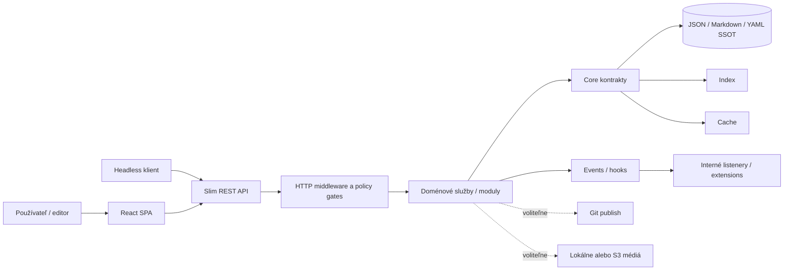

# 🏛️ Architektúra PaginiumCMS

> **Architektonický stav:** Public Beta · dokumentačný checkpoint `v2.1.0-beta.23` · 2. august 2026  
> **Identita:** Hybrid Headless Content Engine  
> **Nemenné pravidlo:** [No-SQL mandát](./NOSQL_MANDATE.md)

Tento dokument je hlavný technický prehľad systému. Vysvetľuje hranice vrstiev, vlastníctvo dát, smer závislostí a rozdiel medzi **aktuálne implementovaným stavom** a **cieľovou architektúrou**. Detailné kontrakty sú rozdelené do dokumentov [CORE.md](./CORE.md), [STORAGE.md](./STORAGE.md), [MODULES.md](./MODULES.md), [EVENTS.md](./EVENTS.md) a [HYBRID_ENGINE.md](./HYBRID_ENGINE.md).

---

## 1. Architektonická identita

PaginiumCMS je **API-first Hybrid Headless Content Engine** s povinným súborovým zdrojom pravdy. Obsah, nastavenia a obnoviteľný prevádzkový stav zostávajú v JSON, Markdown alebo YAML súboroch. Index, cache, Git distribúcia, fronty, APM, externé preklady a AI sú nadstavby; nesmú sa stať jediným miestom, kde existuje primárny obsah.

Projekt sa tým odlišuje od dvoch extrémov:

- nie je to primitívny „blog, ktorý pri každom requeste skenuje adresár“,
- nie je to databázovo závislý monolit, ktorý bez externého clustra nevie obnoviť obsah.

Cieľom je profesionálny content engine s čitateľným dátovým kontraktom, rozumnými defaultmi a možnosťou rásť od jedného servera po headless/Jamstack distribúciu.

---

## 2. Základné princípy

1. **Súbory sú autorita.** SQL ani externá dokumentová databáza nie sú povolené ako CMS source of truth.
2. **Classic profil je baseline.** Systém musí fungovať bez Redis, Git remote, S3, LLM alebo cloud prekladu.
3. **API-first neznamená API-only.** React administrácia používa rovnaké doménové služby ako externí klienti; neobchádza pravidlá.
4. **Bezpečnosť je priečna vlastnosť.** Autentifikácia, autorizácia, validácia, audit, ochrana ciest a rate limiting patria pred doménový zápis.
5. **Core poskytuje platformové kontrakty.** Voliteľná produktová funkcionalita patrí do modulov alebo extensions.
6. **Odvodené vrstvy sú obnoviteľné.** Index a cache musia mať rebuild; queue a publish stav musia mať retry a diagnostiku.
7. **Dokumentácia je súčasť zmeny.** Architektonický kontrakt sa aktualizuje spolu s kódom v SK aj EN.
8. **Rozšírenie nesmie obísť hranice.** Driver, modul, plugin ani AI tool nesmie písať na disk mimo validovaných služieb.

---

## 3. Kontext systému



### Hranice dôvery

| Zóna | Dôvera | Povinné kontroly |
|------|--------|------------------|
| Browser a externý klient | nedôveryhodná | auth, CSRF podľa typu klienta, RBAC/scopes, validácia, rate limit |
| HTTP vrstva | kontrolná hranica | normalizácia requestu, middleware, jednotná chyba |
| Doménová vrstva | čiastočne dôveryhodná | invarianty, permission check, revision/lock check |
| Storage a drivers | privilegovaná | allow-list ciest, atomický zápis, audit, bezpečné oprávnenia |
| Plugin/import/AI obsah | nedôveryhodný kód alebo dáta | code policy, manifest, schema, human Apply, zákaz autonómneho publish |

---

## 4. Logické vrstvy

| Vrstva | Zodpovednosť | Nesmie robiť |
|--------|---------------|--------------|
| **Presentation** | React, formuláre, editor, verejné UI | implementovať autorizačné rozhodnutie ako jedinú ochranu |
| **HTTP/API** | routy, request/response, middleware, error envelope | zapisovať priamo do súborov |
| **Application/Modules** | use-cases, workflow, pravidlá konkrétnej domény | závisieť od interných tried iného modulu |
| **Core** | storage, cache, settings, events, logging, security primitives, queue | obsahovať UI alebo Slim routy |
| **Drivers/Infrastructure** | lokálny disk, cache driver, Git, media driver | meniť doménový význam dokumentu |
| **SSOT** | autoritatívne dokumenty a obnoviteľný stav | byť nahradený cache/indexom |

Smer závislostí je dovnútra:

```text
Presentation → HTTP → Module/Application → Core contracts → drivers → files
```

Core nesmie závisieť od Reactu, Slim controllerov alebo konkrétneho voliteľného modulu. Modul môže používať verejné Core kontrakty. Komunikácia medzi modulmi má ísť cez explicitnú službu, kontrakt alebo udalosť — nie cez priamy import interného repository druhého modulu.

---

## 5. Cesta čítania a zápisu

### Čítanie

```text
request → auth/policy → doménový query service
→ cache lookup → index/repository → SSOT dokument
→ serializer → HTTP validators → response
```

Cache miss nie je chyba. Poškodený index sa nesmie tváriť ako „obsah neexistuje“ bez diagnostiky alebo fallbacku na zdrojové súbory.

### Zápis

```text
authentication → authorization → input/schema validation
→ revision + lock check → atomic SSOT write
→ version/audit → index update → cache invalidation
→ event → optional publish/translation/AI job
```

Primárny dokument sa uloží skôr než odvodené vrstvy. Ak po zápise zlyhá Redis alebo Git push, odpoveď a audit musia rozlíšiť **uložené** od **distribuované**. Zlyhanie odvodenej vrstvy nesmie potichu vrátiť obsah do starého stavu.

---

## 6. Vlastníctvo dát

| Typ dát | Autorita | Poznámka |
|---------|----------|----------|
| Stránky a články | Markdown + front matter | lokality podľa It.73 budú súčasťou kanonického dokumentu alebo jednoznačne vlastneného sidecaru |
| Nastavenia | schema defaults + JSON overrides | tajomstvá sú šifrované; public slice neobsahuje credentials |
| Používatelia a ACL | JSON súbory | prístup len cez Security služby |
| Verzie, drafty, locks, conflicts | JSON | prevádzkový stav chrániaci editáciu; musí byť zálohovateľný podľa policy |
| Index | JSON | odvodený, plne rebuildovateľný |
| Cache | memory/file/voliteľný Redis | zahoditeľná |
| Médiové metadata | flat-file registry | binárny objekt môže byť lokálne alebo cez plánovaný driver It.72 |
| Logy, audit, metriky | append/rotované súbory | nie sú zdrojom obsahu, ale sú bezpečnostne významné |
| Git remote | distribučná kópia | nie je povinnou autoritou lokálnej inštancie |

---

## 7. Aktuálny stav a cieľ

| Schopnosť | Stav k checkpointu | Cieľový smer |
|-----------|--------------------|---------------|
| Slim 4 REST API + React SPA | ✅ implementované | stabilizovať kontrakty a headless použitie |
| Flat-file content a settings | ✅ implementované | zjednotiť cez `StorageInterface` v It.68 |
| Index, memory/file cache | ✅ implementované | jednotná cache + voliteľný Redis v It.69 |
| Session, CSRF, RBAC, TOTP | ✅ implementované | zachovať ako admin model |
| API keys/JWT | ⏳ It.74 | aditívne scopes pre integrácie, nie náhrada session |
| Locks, OCC, drafty, verzie | ✅ implementované | konsolidovať lifecycle a locale-aware verzie |
| HookManager + content hook emitters | ✅ základ implementovaný | oddeliť interné events od plugin hookov |
| Interné moduly | 🟡 zmiešaný stav | jasné ownership boundaries a samostatný Content modul |
| GitHub sync | 🟡 čiastočné | immediate/queued publish v It.70 |
| S3 media driver, APM, AI/preklady | ⏳ plán | voliteľné capabilities so safe fallbackom |

Presný počet testov ani historická release metrika nie sú architektonický kontrakt a preto sem nepatria. Aktuálne čísla majú byť v release reporte alebo CI výstupe.

---

## 8. Režimy nasadenia

Architektúra podporuje tri profily, ktoré zdieľajú rovnaký dátový význam:

- **Classic:** lokálny disk, lokálny index/cache, bez povinných externých služieb.
- **Hybrid:** lokálny SSOT + výkonové a distribučné nadstavby, napríklad Redis alebo okamžitý Git publish.
- **Git-headless:** lokálny zápis zostáva bezpečný; Git a statický build distribuujú výstup externým klientom.

Podrobný capability/fallback kontrakt je v [DEPLOYMENT_MODES.md](./DEPLOYMENT_MODES.md).

---

## 9. Rozšírenia

PaginiumCMS rozlišuje:

1. **Core services** — povinné platformové primitives.
2. **Interné moduly** — dôveryhodné doménové balíky dodané s projektom.
3. **Extensions/plugins** — voliteľný, manifestom registrovaný kód mimo Core.
4. **Themes** — prezentačná vrstva bez vlastníctva doménovej logiky.
5. **Drivers/providers** — vymeniteľné implementácie úzkeho kontraktu.

Plugin hook nie je náhradou interného event modelu a driver nie je modul. Detailné pravidlá sú v [MODULES.md](./MODULES.md), [EVENTS.md](./EVENTS.md), [PLUGINS.md](./PLUGINS.md) a [THEMES.md](./THEMES.md).

---

## 10. Bezpečnostná architektúra

Minimálny request gate pozostáva z bezpečnostných hlavičiek, maintenance/locale politiky, WAF, rate limitu, autentifikácie, autorizácie a doménovej validácie. Poradie middleware musí byť explicitne testované; dokument [CORE_HARDENING.md](./CORE_HARDENING.md) je zdrojom bezpečnostných invariantov.

Nové capability z It.68–77 musia zachovať:

- rovnaké RBAC/scopes pre každý driver,
- SSRF ochranu pre outbound URL,
- šifrovanie credentials cez aplikačný key management,
- redakciu tajomstiev v logoch,
- path validation pred každým lokálnym zápisom,
- oddelenie návrhu od Apply/publish pri AI a preklade.

---

## 11. Architektonický dlh

K checkpointu zostávajú otvorené najmä tieto body:

- content logika je ešte rozdelená medzi `Core/FlatFile` a HTTP vrstvu namiesto samostatného modulu,
- `Core/Security` a `Modules/Security` majú prekrývajúce sa zodpovednosti,
- nie všetky staršie služby používajú jednotné storage/settings/event kontrakty,
- interné events a verejné plugin hooks potrebujú presnejšie typované hranice,
- runtime registrácia externých modulov nie je totožná s existujúcim plugin systémom a nesmie sa dokumentovať ako hotová.

Tieto body sú migračné témy, nie dôvod na veľký jednorazový rewrite. Každá zmena má byť vertikálny rez s rollbackom a Classic regresným testom.

---

## 12. Rozhodovací test pre novú funkcionalitu

Pred pridaním balíka sa položia otázky:

1. Potrebuje ho každá inštancia, aby bezpečne čítala alebo zapisovala? → Core kandidát.
2. Reprezentuje konkrétnu biznis/doménovú schopnosť? → Module.
3. Je vymeniteľnou technickou implementáciou? → Driver/provider.
4. Je voliteľným third-party rozšírením? → Extension/plugin.
5. Mení iba vzhľad? → Theme/presentation.
6. Vytvára jedinú kópiu dát mimo súborov? → Návrh porušuje No-SQL mandát.

---

## 13. Definition of Done pre architektonickú zmenu

- zodpovednosť a owner sú jednoznačné,
- závislosti smerujú správnym smerom,
- Classic profil funguje bez voliteľnej služby,
- write path je atomický a auditovaný,
- odvodené vrstvy majú rebuild/retry,
- bezpečnostné a rollback testy sú zelené,
- SK/EN dokumentácia a changelog sú aktualizované,
- implementovaný a plánovaný stav nie sú zmiešané.

---

## Súvisiace dokumenty

- [HYBRID_ENGINE.md](./HYBRID_ENGINE.md) — cieľový vrstvený model
- [NOSQL_MANDATE.md](./NOSQL_MANDATE.md) — nemenný dátový princíp
- [CORE.md](./CORE.md) — platformové jadro
- [STORAGE.md](./STORAGE.md) — fyzický a logický storage kontrakt
- [MODULES.md](./MODULES.md) — interné doménové balíky
- [EVENTS.md](./EVENTS.md) — events, hooks a failure policy
- [CORE_HARDENING.md](./CORE_HARDENING.md) — bezpečnostné invarianty
