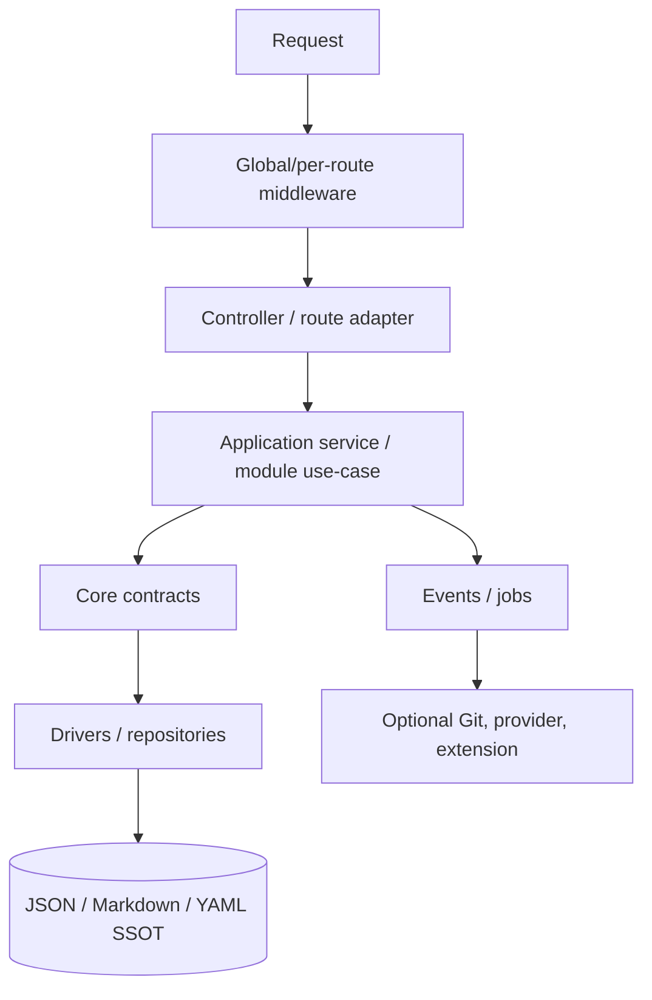

# ⚙️ Backend architektúra

> **Runtime:** PHP 8.4+ · Slim 4 · Composer  
> **Stav:** Public Beta checkpoint `v2.1.0-beta.23`  
> **Dátový princíp:** file SSOT, odvodený index/cache, žiadna SQL databáza v Core

Backend je API aplikácia pre React administráciu, verejný web a budúce headless integrácie. Dnešný strom je funkčný, ale časť content logiky je ešte rozdelená medzi `Core/FlatFile`, HTTP controllery a route closures. Cieľom nie je veľký rewrite; cieľom je inkrementálne presunúť use-case logiku za stabilné aplikačné kontrakty bez zmeny file SSOT.

---

## 1. Vrstvy a smer závislostí



```text
HTTP → application/module → Core contracts → driver → files
```

Zakázané smery:

- Core importuje Slim controller alebo React koncept,
- route closure vlastní storage layout alebo kryptografiu,
- driver rozhoduje o RBAC/publish policy,
- extension zapisuje cez generic filesystem mimo validovaného kontraktu,
- background job beží ako neobmedzený superuser bez actor/service scope.

---

## 2. Orientačný strom

| Oblasť | Typická cesta | Vlastníctvo |
|--------|---------------|-------------|
| bootstrap | `backend/bootstrap/app.php` | environment, container, Slim app, middleware/route registration |
| HTTP | `backend/app/Http/` | controllers, middleware, routes, responder/error mapping |
| Core | `backend/app/Core/` | platformové primitives: storage, settings, cache, logging, security primitives, events |
| Modules | `backend/app/Modules/` | doménové use-cases: users, media, comments, messages, navigation, audit, demo… |
| extensions | `backend/app/Http/Extensions/` | obmedzený manifestom riadený kód; prechodné umiestnenie |
| storage | `backend/storage/`, `data/`, content root podľa config | SSOT, logs, cache/index a prevádzkový stav |
| tests | `backend/tests/` | unit, integration, HTTP/contract/security tests |

Presný počet route súborov, testov alebo tried nie je architektonický invariant. Patrí do CI/release reportu.

---

## 3. Bootstrap lifecycle

Odporúčané poradie bootstrapu:

1. načítať environment bez logovania secretov,
2. validovať povinné paths, permissions a key material,
3. nastaviť production-safe PHP/session defaults,
4. zostaviť DI container a schema/config registry,
5. vytvoriť Slim app,
6. registrovať routes a middleware deterministicky,
7. pripojiť jednotný error handler,
8. vykonať capability probes bez automatického zapnutia voliteľnej služby,
9. emitovať bezpečný startup log s verziou/capabilities, nie credentials.

Bootstrap nesmie pri každom requeste skenovať alebo meniť celý storage strom. Migrácia schémy má byť explicitná, idempotentná a rollback-aware.

---

## 4. Middleware pipeline

Konceptuálne poradie request gate:

```text
trusted proxy / request identity
→ security headers + CORS
→ maintenance + locale
→ WAF / abuse gate
→ rate limit
→ authentication resolver
→ CSRF podľa auth typu
→ authorization / path ACL / 2FA
→ route handler
→ unified error mapping + request log
```

Skutočné Slim LIFO poradie musí byť pokryté testom; zoznam v dokumente nestačí.

Dôležité invarianty:

- WAF môže blokovať pred routingom a vrátiť non-JSON 403,
- session mutácia vyžaduje CSRF,
- Bearer request nepoužíva cookie session ako fallback,
- CORS nie je otvorený automaticky kvôli API keys,
- rate limiter identity je session/user/IP alebo budúci API key ID, nikdy secret,
- maintenance výnimky sú explicitný allow-list.

---

## 5. Routy a controllery

Route vrstva:

- deklaruje method + path,
- priraďuje middleware/policy,
- parsuje normalizovaný request DTO,
- volá jeden aplikačný use-case,
- mapuje typed result/error cez `JsonResponder`.

Nemá:

- otvárať content file cez `file_get_contents`,
- skladať ACL z raw settings,
- generovať hash alebo šifrovať credentials ad hoc,
- obsahovať dlhý workflow save → version → index → Git,
- vracať vlastný nekompatibilný JSON shape.

Auth routes môžu byť dnes registrované osobitne; rovnaká route nesmie byť zaregistrovaná inline aj cez auto-discovery.

---

## 6. Application services a moduly

Aplikačná služba vlastní use-case, napríklad:

```text
UpdateArticle
PublishContent
RestoreVersion
UploadMedia
ModerateComment
RotateApiKey
```

Vstup obsahuje validované DTO + actor context. Výstup je typed result s resource/revision/follow-up stavom. HTTP status a lokalizovaná veta sa mapujú až na hranici.

Modul vlastní doménové pravidlá a smie používať Core kontrakty. Medzimodulová komunikácia používa explicitnú službu alebo typovanú udalosť, nie priamy import interného repository iného modulu.

---

## 7. Dependency injection

DI registrácia má byť rozdelená podľa ownershipu a nesmie závisieť od náhodného poradia globov.

Pravidlá:

- interface → driver binding je explicitný,
- production/test binding sa vyberá konfiguráciou, nie `if` roztrúseným v business kóde,
- secret sa injektuje ako redacted/value object alebo credential provider,
- service locator v doménovej logike je anti-pattern,
- controller dependencies sú konštruktorové a testovateľné,
- optional capability má `CapabilityUnavailable`/safe fallback, nie nullable chaos.

Plán It.68 zavedie jednotnejší `StorageInterface`; It.69 cache kontrakt; It.70 publisher; It.72 media driver.

---

## 8. Storage a write orchestration

```text
validate canonical key/path
→ acquire lock/journal podľa operácie
→ verify base revision
→ write temp file + fsync/rename podľa platform policy
→ create version/audit
→ update/rebuildable index
→ invalidate cache
→ emit after-save event
→ enqueue optional follow-up
```

Ak zlyhá index/cache po úspešnom SSOT write, systém nesmie klamať, že save neprebehol. Musí zaznamenať degraded/rebuild stav a odpoveď rozlíšiť primárny výsledok od follow-upu.

Multi-file operácia potrebuje transaction journal alebo explicitný partial-success model. Pomenovanie „transaction“ bez recovery protokolu je marketing, nie architektúra.

---

## 9. Identity a autorizácia

`ActorContext` má reprezentovať:

- anonymous,
- session user,
- plánovaný API key principal,
- plánovaný delegated JWT principal,
- background service/job identity.

Každý use-case dostane actora a explicitne kontroluje permission/scope + path/resource policy. HTTP middleware môže urobiť hrubý gate, ale doménová služba chráni invariant aj pri CLI, queue, restore alebo extension volaní.

Session admin flow zostáva oddelený od It.74 Bearer resolvera. Neplatný Bearer token sa nesmie preklopiť do session flow.

---

## 10. Validácia a DTO

- request body má size limit pred decode,
- JSON parse chyba je 400,
- schema/domain chyba je 422,
- slug/path/locale/URL/enum sú allow-listované a kanonizované,
- MIME sa overuje z obsahu, nie iba filename,
- SSRF URL pre Git/webhook/provider/stock media prechádza central outbound validatorom,
- unknown write fields sa podľa kontraktu odmietnu alebo explicitne ignorujú,
- server-owned fields sa nikdy nepreberajú z klienta.

Frontend validation je UX optimalizácia; backend schema je autorita.

---

## 11. Error handling a response mapping

Doménové chyby majú stabilnú kategóriu:

| Kategória | HTTP mapovanie |
|-----------|---------------|
| authentication | 401 |
| authorization/scope | 403 |
| not found/masked | 404 |
| revision/lock | 409 |
| validation | 422 |
| rate limit | 429 |
| capability unavailable | 503 iba ak neexistuje bezpečný fallback |
| unexpected | 500 + request ID v logu |

Exception nesmie obsahovať HTML response ani raw secret. `ApiErrorHandler`/responder je jediná HTTP serializačná hranica. Debug detail je environment-gated a produkčne vypnutý.

---

## 12. Events, hooks a queue

Interný event je typovaný fakt po use-case. Verejný plugin hook je stabilizovaný a sanitizovaný extension kontrakt. Nejde o tú istú vec.

Pomalé operácie — Git push, build hook, provider translation, AI, report — patria do queue/job modelu. Job payload nesie canonical ID/revision a referenciu na credentials, nie raw secret/session.

Každý job má:

- actor/service scope,
- idempotency key,
- max attempts/backoff,
- timeout,
- poison/dead-letter/incident stav,
- auditovateľný výsledok.

---

## 13. Cache, index a performance

- index je rebuildovateľný z file SSOT,
- cache miss nie je chyba,
- Redis je voliteľný driver po capability teste,
- cache key zahŕňa locale, scope a permission-relevant variant,
- private response sa neukladá do public cache,
- invalidácia nasleduje po úspešnom write,
- Performance Guard z It.71 meria, ale nemení produkčný driver bez explicitného rozhodnutia.

Fallback z Redis na file/memory cache musí byť bezpečný a observovateľný, nie tichý permanentný downgrade.

---

## 14. Konfigurácia a secrets

Precedence a klasifikáciu vlastní settings engine. Backend musí rozlišovať public, admin, restricted a secret values.

- `.env`/deployment secret sa nevracia cez settings API,
- encrypted at-rest value sa dešifruje iba tesne pred použitím,
- redacted placeholder sa neuloží ako credential,
- trusted proxies, cookie flags a key material sa validujú pri štarte,
- capability enable vyžaduje kompletnú validnú konfiguráciu,
- config export/backup rediguje secrets.

---

## 15. Logging, audit a observability

HTTP access log minimálne: request ID, method, route template, status, duration a redacted client context. Nemá obsahovať raw Authorization, Cookie, CSRF, password, API key, provider token alebo celý content payload.

Audit log zaznamenáva bezpečnostne významnú doménovú akciu: actor, target, action, before/after summary alebo revision, result a timestamp. Audit nenahrádza debug log a nemá ukladať celý citlivý dokument bez retention policy.

It.71 môže pridať APM, ale health/APM endpoint je admin-only a Classic profil funguje bez externého collectora.

---

## 16. Prostredie a deploy hranice

Typické environment classes:

| Trieda | Príklady |
|--------|----------|
| runtime | `APP_ENV`, `APP_DEBUG`, timezone |
| HTTP/security | trusted proxies, session cookie policy, CORS origins |
| crypto | app/encryption/API JWT keys |
| optional drivers | Redis, S3, Git remote, translation/AI providers |
| limits | upload/body/timeouts/rate limits |

Production za nginx musí správne nastaviť proxy trust, HTTPS detection, request size a static/storage deny rules. Backend nesmie slepo dôverovať `X-Forwarded-*` od ľubovoľného klienta.

---

## 17. Testovacia pyramída

1. unit testy value objects, validators, policies a serializers,
2. repository/driver testy na temp filesysteme,
3. application service testy s fake kontraktmi,
4. HTTP integration a response contract testy,
5. security/race/failure injection testy,
6. smoke test cez reálny web server/proxy,
7. Classic profile gate bez externých služieb.

Exact test count nie je dokumentačný invariant. Dôležitý je gate: PHPStan level 8, PHPUnit, audit, route/contract parity a rollback test dotknutej capability.

---

## 18. Inkrementálny refactor

Odporúčaný vertical slice pre Content:

1. zmraziť existujúci API kontrakt testami,
2. vytvoriť `ContentRepository`/application interface nad dnešným flat-file kódom,
3. presunúť jeden use-case z controllera,
4. zachovať route a response shape,
5. doplniť revision/lock/audit failure tests,
6. zopakovať pre ďalší use-case,
7. až potom meniť namespaces alebo route registráciu.

Veľký rewrite, ktorý súčasne mení storage, API, frontend a auth, by zničil schopnosť určiť príčinu regresie.

---

## 19. Súvisiace dokumenty

- [ARCHITECTURE.md](./ARCHITECTURE.md) — systémové vrstvy a ownership
- [CORE.md](./CORE.md) — Core kontrakty
- [MODULES.md](./MODULES.md) — interné moduly a lifecycle
- [API.md](./API.md) — route inventory
- [API_CONTRACT.md](./API_CONTRACT.md) — JSON/error hranica
- [CORE_HARDENING.md](./CORE_HARDENING.md) — security invarianty
- [EVENTS.md](./EVENTS.md) — events/hooks/jobs
