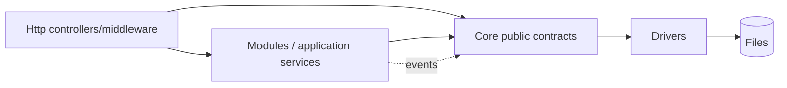
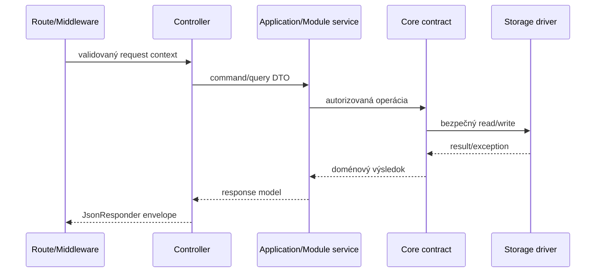

# Core vrstva PaginiumCMS

> **Checkpoint:** `v2.1.0-beta.23` · 2. august 2026  
> **Namespace:** `PaginiumCMS\Core\`  
> **Princíp:** Core je platformové jadro, nie sklad každej feature.

Core poskytuje stabilné primitives, cez ktoré HTTP vrstva, interné moduly a extensions bezpečne pracujú so súbormi, cache, nastaveniami, udalosťami, logmi a workflow. Neobsahuje React komponenty ani Slim routy.

---

## 1. Cieľový rozsah Core

Core má vlastniť schopnosti potrebné prakticky pre každú inštanciu:

- bezpečný file I/O a storage abstraction,
- konfiguráciu a settings schema,
- cache a index primitives,
- event dispatcher a hook bridge,
- logovanie, audit primitives a health contracts,
- validáciu, šifrovanie a bezpečnostné utility,
- locks, revision primitives a atomické operácie,
- scheduler/queue contracts,
- dependency injection a základné error typy.

Core nemá vlastniť konkrétny blog, komentáre, galériu, kontaktné správy, navigačné menu alebo provider-specific produktové UI.

---

## 2. Aktuálna mapa balíkov

| Balík | Úloha | Architektonická klasifikácia |
|-------|-------|------------------------------|
| `FlatFile` | Markdown/JSON read-write, front matter, index, trash | Core; v It.68 sa má rozdeliť kontrakt a lokálny driver |
| `Settings` | schema, defaults, overrides | Core |
| `Cache` | memory/file/chained cache | Core; Redis je voliteľný driver It.69 |
| `Event` | interný dispatcher | Core |
| `Hook` | extension hook registry/emitter | Core bridge, nie doménový modul |
| `Validation`, `Config` | spoločné pravidlá a konfigurácia | Core |
| `Logging`, `AuditTrail` | technické logovanie a audit primitives | Core/cross-cutting; konkrétny audit view môže byť modul |
| `Locking`, `Conflict`, `Drafts`, `Versioning` | ochrana editácie a histórie | platformová schopnosť, ale content-specific orchestration patrí do Content modulu |
| `Security` | firewall, login/security logging primitives | prechodná hranica; user/auth doména je v `Modules/Security` |
| `Scheduler`, `Monitoring`, `Health` | jobs a prevádzkové kontroly | Core primitives |
| `Backup` | export/import/schedule | cross-cutting platform service |
| `Notification`, `Analytics`, `Seo`, `Feeds` | produktové služby | kandidáti na modulárnejšie vlastníctvo; nemení sa jedným rewriteom |
| `CodeEditor`, `CodePolicy`, `Developer` | chránený developer workspace | privilegovaná platformová capability, defaultne uzamknutá |
| `GitHub` | existujúci sync service | integračná služba; cieľový publisher kontrakt patrí do It.70 |
| `Workflow` | OTP approval primitives | Core workflow primitives; konkrétne workflow vlastní modul |

Tabuľka popisuje realitu aj cieľ. Označenie „kandidát na modul“ neznamená, že balík sa má okamžite presúvať bez testov a migračného plánu.

---

## 3. Povolené závislosti



Pravidlá:

- `Core` nesmie importovať `Http` ani interné triedy konkrétneho modulu.
- Controller môže volať application/module service; nesmie používať `file_put_contents()` na doménové dáta.
- Modul môže závisieť od verejného Core interface, nie od private implementačných detailov.
- Driver implementuje úzky kontrakt a nemá rozhodovať o RBAC alebo publish policy.
- Cross-module spolupráca používa explicitný interface, application orchestrator alebo event.

---

## 4. Komunikácia s HTTP vrstvou



Controller je adaptér. Nemá obsahovať storage layout, kryptografiu ani business workflow. Jednotná chyba sa mapuje až na HTTP hranici; Core exception nesmie niesť HTML odpoveď.

---

## 5. Kľúčové kontrakty

| Kontrakt | Aktuálne / cieľové použitie |
|----------|-----------------------------|
| `FileReaderInterface`, `FileWriterInterface` | dnešné validované lokálne I/O |
| `ContentRepositoryInterface` | pages/articles CRUD; neskôr application-facing repository |
| `SettingsRepositoryInterface` | effective settings a overrides |
| `LockManagerInterface` | pesimistické zámky |
| `LoggerInterface` | structured logging |
| `BackupInterface` | export/import orchestration |
| `StorageInterface` | plán It.68: jednotný dokumentový storage kontrakt |
| `CacheInterface` / driver contract | plán It.69: jednotná cache semantics |
| `PublisherInterface` | plán It.70: Git/distribution pipeline |
| `MediaStorageDriverInterface` | plán It.72: binárne médiá, metadata ostávajú flat-file |

Nový interface sa nepridáva iba preto, aby obalil jednu triedu. Musí stabilizovať hranicu, umožniť test double alebo viac bezpečných implementácií.

---

## 6. Core write invariant

Každá mutácia, ktorá používa Core, zachová:

```text
validate path + input → permission/domain gate → lock/revision check
→ write temp file → flush/close → atomic replace
→ version/audit → index/cache maintenance → event
```

Pri viacerých súboroch sa používa explicitný journal alebo idempotentná recovery operácia; „napoly hotový“ stav sa nesmie skryť úspešnou odpoveďou.

---

## 7. Events a hooks

- **EventDispatcher** prenáša interné fakty medzi dôveryhodnými komponentmi.
- **HookManager/HookEmitter** poskytuje kontrolované body pre extensions.
- Event payload má byť immutable alebo sa má meniť iba cez explicitný result contract.
- `before_*` hook môže operáciu odmietnuť validovanou výnimkou, ale nesmie obísť auth alebo prepísať ľubovoľnú cestu.
- `after_*` zlyhanie po úspešnom SSOT zápise sa loguje a retryuje podľa policy; nesmie predstierať rollback, ktorý sa nestal.

Detail: [EVENTS.md](./EVENTS.md).

---

## 8. Bezpečnosť v Core

Core poskytuje mechanizmy, ale authorization context musí prísť z autentifikovanej HTTP/CLI hranice. Kritické pravidlá:

- path validation pred každou diskovou operáciou,
- šifrovanie citlivých settings polí,
- constant-time porovnanie tokenov tam, kde je relevantné,
- žiadne credentials v log payload,
- WAF/rate limit nie sú náhradou doménovej validácie,
- developer/code editor služby sú deny-by-default a vyžadujú unlock,
- test prostredie používa izolované settings/cache/stores.

---

## 9. Error a result model

Odporúčané kategórie:

| Kategória | Príklad | HTTP mapovanie na okraji |
|-----------|---------|--------------------------|
| Validation | neplatná schema alebo slug | 422 |
| Authorization | chýbajúce permission/scope | 403 |
| Not found | dokument neexistuje | 404 |
| Conflict | revision alebo lock mismatch | 409 |
| Capability unavailable | Redis/Git/S3 nie je dostupné | 503 alebo degradovaný úspech podľa operácie |
| Integrity/storage | poškodený dokument, write failure | 500 + incident ID |

Core nemá vracať neštruktúrované `false`, ak volajúci potrebuje rozlíšiť nedostupnosť, konflikt a chybu integrity. It.68 má rozhodnúť typovaný result/exception kontrakt.

---

## 10. Registrácia služieb

DI bindings sú rozdelené podľa vlastníka, napríklad `Core/*/Config/services.php`, `Modules/*/Config/services.php` a `Http/Config/services.php`. Registrácia musí byť deterministická a opakovateľná v testoch; služba nesmie pri konštrukcii vykonať nevratný zápis alebo outbound request.

Voliteľná capability sa registruje iba po capability/config validation. Chýbajúci Redis alebo Git config nesmie rozbiť bootstrap Classic profilu.

---

## 11. Testovacia stratégia

- unit test kontraktu a každej implementácie,
- contract tests pre storage/cache drivers,
- HTTP integračné testy cez reálny bootstrap,
- fault injection pre disk full, neplatné JSON, stale revision a nedostupný driver,
- Classic smoke test bez voliteľných služieb,
- test, že modul ani extension nevie obísť path/RBAC pravidlá,
- PHPStan L8 a frontend gates pre dotknutý vertical slice.

---

## 12. Migračný smer

1. It.68 zavedie storage abstraction bez big-bang presunu všetkých repository.
2. Prvý vertical slice prejde cez nový kontrakt a porovná sa s existujúcim správaním.
3. Content orchestration sa postupne oddelí od `Core/FlatFile` do application/module vrstvy.
4. Prekryv `Core/Security` a `Modules/Security` sa vyrieši cez ownership mapu, nie kopírovaním tried.
5. Staré entry points sa odstránia až po testoch, deprecation okne a rollback variante.

---

## Súvisiace dokumenty

- [ARCHITECTURE.md](./ARCHITECTURE.md)
- [STORAGE.md](./STORAGE.md)
- [SETTINGS.md](./SETTINGS.md)
- [VERSIONING.md](./VERSIONING.md)
- [CORE_HARDENING.md](./CORE_HARDENING.md)
- [MODULES.md](./MODULES.md)
- [EVENTS.md](./EVENTS.md)
