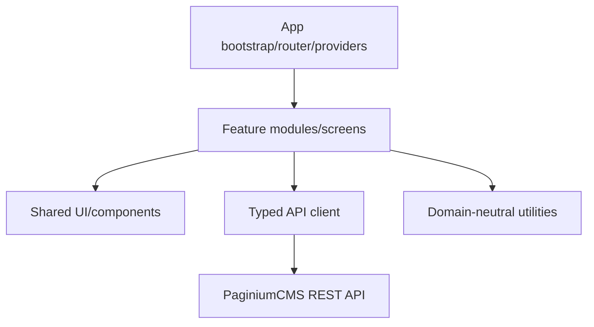

# 🖥️ Frontend architektúra

> **Stack:** React + TypeScript + Vite + Tailwind CSS + TipTap  
> **Úloha:** administrátorská SPA a verejné prezentačné komponenty podľa nasadenia  
> **Bezpečnostné pravidlo:** frontend zlepšuje UX, ale nie je autoritou pre permission, validation ani storage

Pôvodný `FRONTEND.md` bol prázdny. Tento dokument preto definuje cieľový kontrakt a zároveň rešpektuje existujúci klientsky základ: centralizované API moduly, React routovanie, MSW fixtures, editor, admin managers a deep-link helpers.

---

## 1. Zodpovednosť frontendu

Frontend smie:

- renderovať UI podľa serverom vrátených capabilities,
- validovať formulár pre okamžitú spätnú väzbu,
- spravovať query/cache/form/navigation stav,
- koordinovať lock, autosave, conflict, OTP a publish UX,
- bezpečne zobrazovať Markdown/rendered output,
- vytvárať stabilné admin URL.

Frontend nesmie:

- považovať skryté tlačidlo za authorization,
- zapisovať priamo do storage,
- ukladať dlhodobý admin Bearer token do `localStorage`,
- dôverovať route `adminPath` bez backend permission,
- označiť operáciu ako úspešnú iba preto, že modal sa zavrel,
- renderovať nedôveryhodné HTML bez sanitizácie.

---

## 2. Logické vrstvy



Odporúčaný smer importov:

```text
app → feature/screen → shared UI + typed API + utilities
```

Shared komponent nesmie importovať konkrétny page manager. API client nesmie importovať React component. Feature môže skladať shared primitives a vlastné domain komponenty.

---

## 3. Orientačný strom

| Oblasť | Typická cesta | Úloha |
|--------|---------------|------|
| bootstrap | `frontend/src/main.tsx`, app root | providers, router, global error boundary |
| routes/layout | router config, backend/public layouts | route ownership a guards |
| API | `frontend/src/api/` | HTTP client, typed domain clients, error normalization |
| features/screens | components/pages/features | managers, editor, settings, security, media… |
| shared UI | reusable components | button, form, modal, table, toast, a11y primitives |
| hooks | autosave, lock, query sync | lifecycle a reusable orchestration |
| utils | deep links, formatting, sanitization helpers | bez domain ownership |
| mocks | `frontend/src/mocks/` | MSW dev/test contract |
| tests | colocated alebo test dirs | unit/component/integration |

Konkrétny import path sa môže refaktorovať; ownership a dependency rules sú dôležitejšie než dnešný názov priečinka.

---

## 4. App bootstrap a providers

Bootstrap má deterministicky zostaviť:

1. global error boundary,
2. router,
3. session/auth provider,
4. API/query layer,
5. theme/locale/settings provider,
6. toast/notification a modal root,
7. development-only MSW podľa explicitného `VITE_MSW=true`.

Development mock sa nesmie omylom aktivovať v production builde. Chýbajúca environment premenná má mať bezpečný default.

---

## 5. Routovanie a guards

Route guard je UX a navigation gate. Backend stále rozhoduje o prístupe.

- anonymous route nesmie bootstrapom načítať admin secret slice,
- auth loading state sa nesmie zameniť za unauthenticated redirect loop,
- 401 vedie k bezpečnému session recovery/login flow,
- 403 zobrazí nedostatočné oprávnenie bez odhlásenia používateľa,
- 2FA/developer unlock je samostatný capability state,
- deep link sa po úspešnom login môže obnoviť iba cez validovaný interný `returnTo` path.

Open redirect cez absolútny URL alebo `//host` v `returnTo` je zakázaný.

---

## 6. Centralizovaný API client

API client vlastní:

- same-origin credentials/session cookies,
- CSRF token fetch/cache/retry policy,
- JSON/content-type parsing,
- normalizáciu legacy auth envelope,
- typed success/error/validation/conflict model,
- request cancellation a timeout,
- safe telemetry redaction,
- download/blob response.

Nemá automaticky retry-nuť non-idempotent write. CSRF refresh retry je povolený iba kontrolovane a najviac raz, keď je jasné, že pôvodný request neprešiel doménovým zápisom.

Plánované API keys/JWT z It.74 sú pre serverové integrácie; admin SPA zostáva session-based.

---

## 7. Typy stavu

| Stav | Odporúčaný owner |
|------|-------------------|
| server/resource data | query/API cache alebo feature state |
| formulár a dirty fields | form/editor state |
| session/capabilities | auth provider |
| modal/toast | UI provider/local state |
| URL filtre/page/tab | router search params |
| ephemeral lock heartbeat | feature hook |
| unsaved local draft | editor + explicit persistence policy |

Nevytvárať jeden globálny store pre všetko. URL je zdrojom pravdy pre zdieľateľný filter/tab; server je zdrojom pravdy pre content/revision; local editor je dočasný pracovný stav.

---

## 8. Auth, CSRF a 2FA UX

Login flow:

```text
submit credentials → session response
→ optional 2FA challenge → /api/auth/me refresh
→ load capability-safe admin shell
```

Pravidlá:

- password a OTP sa neukladajú do persistent browser storage,
- logout čistí klientsky cache citlivých dát,
- session expiry pri read môže zobraziť login; pri dirty write najprv zachová lokálny draft a vysvetlí stav,
- 403 nie je automaticky „session expired“,
- CSRF token nie je posielaný na cudziu origin,
- API error alebo analytics event neobsahuje cookie/token/form secret.

---

## 9. Content editor lifecycle

```text
open resource → receive revision
→ acquire lock → edit
→ debounced draft autosave
→ explicit save/publish
→ handle OTP/conflict
→ update revision and version state
→ show optional Git publish status
```

UI musí samostatne zobrazovať:

- local dirty,
- autosave pending/saved/failed,
- server save pending/success,
- lock owner/expiry,
- revision conflict,
- OTP pending,
- local storage state,
- distribution/publish state.

Jeden zelený toast „uložené“ pre všetky tieto fázy by bol zavádzajúci.

---

## 10. Autosave, locks a konflikty

- autosave používa debounce a `AbortController`/sequence guard,
- starší response nesmie prepísať novší editor state,
- heartbeat sa zastaví pri unmount/logout a tolerantne rieši krátky výpadok,
- lock loss nezruší lokálny text, ale zablokuje slepý save,
- 409 otvorí conflict resolver s Mine/Theirs/Both/manual,
- merge save používa server revision z conflict response,
- force overwrite je viditeľná privilegovaná operácia.

Browser crash recovery môže používať local persistence iba pre obsah, nie auth secrets. Používateľ musí vedieť, či obnovuje lokálny draft alebo serverový draft.

---

## 11. Editor formáty a bezpečné renderovanie

Podporované formáty podľa API: `markdown`, `html`, `tiptap_json`.

- konverzia medzi formátmi nesmie potichu stratiť unsupported nodes,
- Tiptap JSON sa validuje pred renderom,
- Markdown preview používa bezpečný renderer,
- raw HTML je defaultne zakázané alebo sanitizované allow-listom,
- odkazy používajú bezpečný protocol allow-list a externé linky vhodné `rel`,
- upload vloží iba URL/metadata vrátené backendom.

`dangerouslySetInnerHTML` je povolené iba v izolovanom audited komponente so sanitizovaným vstupom.

---

## 12. Lists, filtre a URL sync

Pages, articles, media, comments a logy majú uložiť zdieľateľný stav do query parametrov:

```text
/pages?q=foo&page=2&status=draft
/media?folder=hero&type=image
/logs?severity=critical
/settings?category=security&group=accessControl
```

Parser:

- validuje enum a bounds,
- ignoruje neznámy parameter bez crashu,
- pri oprave neplatnej hodnoty používa replace, nie nekonečný history spam,
- zachováva browser back/forward,
- nikdy nedáva secret, token alebo celý content do URL.

Kontrakt detailne definuje [ADMIN_DEEP_LINKS.md](./ADMIN_DEEP_LINKS.md).

---

## 13. Settings UI

Settings UI je schema-driven, ale backend schema je autorita. Frontend:

- renderuje field podľa type/label/help/validation/capability,
- rozlišuje public/restricted/secret,
- secret zobrazuje ako „nastavené“, nie plaintext,
- neposiela redacted placeholder ako novú hodnotu,
- pri capability dependency vysvetlí chýbajúcu konfiguráciu,
- po save načíta effective value/reload requirement,
- nepovoľuje SUPER_ADMIN-only group iba na základe role textu v local storage.

---

## 14. Media UX

Upload flow zobrazuje size/type/progress a bezpečne rieši:

- 413/415,
- duplicate alebo rename policy,
- zrušenie requestu,
- private/public status,
- lokálny verzus plánovaný S3 driver bez zmeny resource semantics,
- broken thumbnail/fallback,
- bulk partial failure.

Client filename je display metadata, nie dôveryhodná storage cesta.

---

## 15. Admin command palette a navigation

Ctrl+K search vracia pages/articles/media/routes podľa oprávnenia. `adminPath` sa naviguje cez central helper a musí byť interný canonical path. Palette výsledok nie je permission grant; cieľová screen načíta backend dáta a môže dostať 403.

Sidebar, route catalog, dashboard cards a deep-link helpers musia používať jeden route registry alebo parity test, aby sa nerozišli.

---

## 16. Locale, preklad a AI — plán

It.73–77 pridajú:

- requested/effective/fallback locale indicator,
- locale switch bez straty dirty changes,
- translation proposal → diff → Apply,
- provider quota/error bez leaknutia secretu,
- AI proposal cez allow-listed tools,
- explicitné potvrdenie Apply,
- žiadny autonómny publish.

Prompt/provider output je nedôveryhodný obsah. Renderuje sa ako text/diff, nie executable HTML. Zmena locale počas pending save musí byť blokovaná alebo bezpečne serializovaná.

---

## 17. Error UX

| Stav | UX |
|------|----|
| 400/422 | formulár/global error s field mapou |
| 401 | session recovery/login; zachovať dirty draft |
| 403 | vysvetliť permission, nevymazať lokálnu prácu |
| 404 | not found alebo resource zmenený/deleted |
| 409 | conflict/lock resolver |
| 413/415 | upload-specific pomoc |
| 429 | retry-after bez agresívneho loopu |
| 500 | safe message + request ID, ak je dostupné |
| 503 | maintenance/capability status |
| non-JSON WAF | generic blocked response bez JSON parser stacku |

Toast je vhodný pre krátky výsledok, nie pre jediný nosič kritického konfliktu alebo validačných detailov.

---

## 18. Accessibility a UX minimum

- keyboard navigation a viditeľný focus,
- modal focus trap + restore,
- správne labels/errors/ARIA live pre async stav,
- command palette dostupná klávesnicou aj menu,
- farba nie je jediný status signal,
- reduced motion rešpektovaný,
- tabuľky majú mobilný/overflow fallback,
- editor toolbar má accessible names a shortcut hints.

A11y regresie patria do component testov a manuálneho release checklistu.

---

## 19. Performance

- route-level lazy loading pre veľké admin moduly,
- virtualizácia iba pri meranej potrebe a bez zničenia a11y,
- debounce search/autosave,
- cancel stale request,
- obrázky s dimensions/lazy loading,
- bundle analysis v release gate,
- server pagination namiesto načítania celého obsahu,
- cache nesmie zobraziť dáta predošlého používateľa po logout/login.

Performance Guard z It.71 poskytuje metriky; frontend nemá na základe jednej pomalej odpovede sám prepínať backend driver.

---

## 20. Testovanie

| Vrstva | Príklady |
|--------|----------|
| unit | deep-link parser, formatters, permission-safe helpers |
| component | formulár, modal, table, error states, a11y |
| hook | autosave ordering, lock heartbeat, abort/retry |
| MSW integration | auth, CSRF, 409, 422, WAF non-JSON, OTP |
| route | guard, returnTo, query sync, browser back |
| editor | format round-trip, sanitization, dirty/conflict |
| build | TypeScript, ESLint, Vitest, production build, API barrel parity |

Fixtures sa majú odvodiť od API kontraktu, nie vytvoriť optimistický paralelný backend, ktorý nikdy nevracia chybu.

---

## 21. Environment a build

Vite premenné sú public v browser builde. Preto do `VITE_*` nikdy nepatrí secret. Povolené sú base URL, feature display flag alebo build metadata bez credentials.

Production build má:

- vypnúť dev mocks/debug UI,
- mať explicitný API origin/CSP policy,
- generovať deterministické assets,
- podporiť cache busting,
- zachovať source maps podľa security/deploy policy,
- prejsť dependency audit a license review.

---

## 22. Definition of Done pre nový frontend use-case

- [ ] route/deep link je stabilný a testovaný,
- [ ] API success aj všetky relevantné chyby majú UX,
- [ ] backend permission sa nepredpokladá z UI,
- [ ] loading/empty/error/partial/degraded stav je viditeľný,
- [ ] keyboard/a11y minimum je splnené,
- [ ] secret/PII sa nedostane do URL, local storage ani telemetry,
- [ ] MSW fixture zodpovedá server contract testu,
- [ ] Classic profile funguje bez plánovaného provideru.

---

## 23. Súvisiace dokumenty

- [API.md](./API.md) — endpointy a auth matica
- [API_CONTRACT.md](./API_CONTRACT.md) — parser a error shapes
- [CONTENT_API.md](./CONTENT_API.md) — editor lifecycle
- [ADMIN_DEEP_LINKS.md](./ADMIN_DEEP_LINKS.md) — URL contract
- [SETTINGS.md](./SETTINGS.md) — schema-driven settings
- [CORE_HARDENING.md](./CORE_HARDENING.md) — browser/API security
