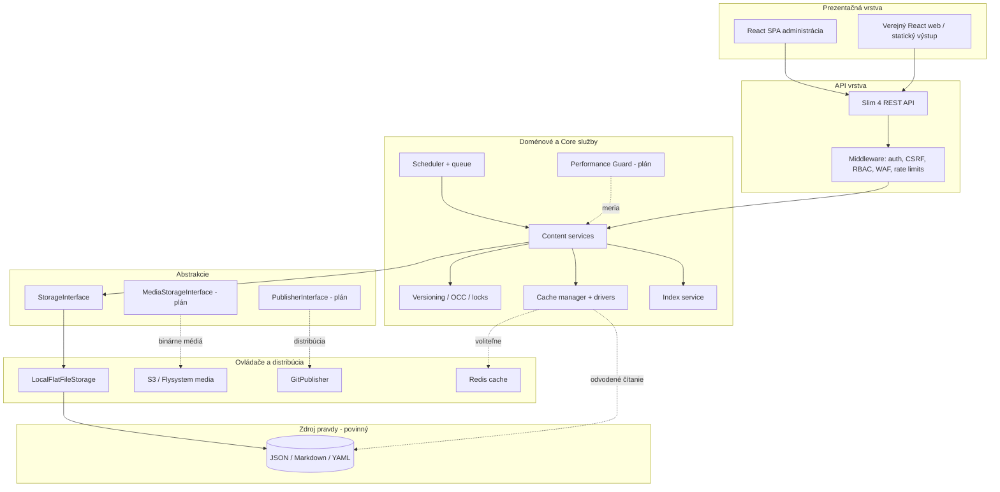

# Hybrid Headless Content Engine — cieľová architektúra

> **Stav:** dokumentačná fáza 0  
> **Účinnosť:** zmena smerovania od augusta 2026 — od Public Beta k enterprise-ready hybridnému enginu  
> **Nemenný základ:** [NOSQL_MANDATE.md](./NOSQL_MANDATE.md)

---

## Definícia

PaginiumCMS sa vyvíja z pokročilého flat-file CMS na **Hybrid Headless Content Engine**:

> API-first správa obsahu s **No-SQL súborovým úložiskom ako jediným zdrojom pravdy**, voliteľným **indexom a cache vrstvami** pre výkon a prepínateľnými **režimami nasadenia** od priameho zápisu na disk až po Git/Jamstack distribúciu.

Skrátený názov používaný v dokumentácii a rozhraní: **Hybrid Engine**.

Tento pivot nemení základný dátový princíp. Mení spôsob, akým sa systém opisuje a kam sa rozvíja:

- z „CMS, ktorý používa súbory“ na **content engine, ktorého kontraktom sú súbory**,
- z jedného spôsobu nasadenia na **konfigurovateľné profily**,
- z lokálneho čítania a zápisu na **vrstvenú architektúru**,
- z administrácie jedného webu na **headless a integračné scenáre**,
- zo základných logov na **merateľnú prevádzku a ochranu výkonu**.

---

## Čím sme a čím nie sme

| Oblasť | Hybrid Engine | Zastaralý model „blog v súbore“ |
|--------|---------------|----------------------------------|
| Verejná prevádzka | React SPA + REST API; neskôr voliteľný statický výstup | Pri každej návšteve priame načítanie rovnakého súboru |
| Súbeh | `flock`, editovacie zámky, OCC, HTTP 409, verzovanie | Predpoklad jedného editora |
| Výkon | JSON index, read-through cache, HTTP cache hlavičky | Skenovanie adresárov pri každom zozname |
| Distribúcia | Voliteľný okamžitý alebo dávkový Git publish | Ručné kopírovanie cez FTP |
| Integrácie | REST API, webhooky, neskôr API kľúče a JWT | UI ako jediný vstup |
| Pozorovateľnosť | APM middleware, monitoring reporty, metriky | Základný aplikačný log |
| Zdroj pravdy | JSON / Markdown / YAML súbory | Súbory, ale bez vrstiev a kontraktov |

PaginiumCMS si **zachováva vlastníctvo dát a No-SQL SSOT**. Pridáva profesionálne vrstvy okolo súborov; nenahrádza ich databázou.

---

## Vrstvový model

### Zodpovednosti vrstiev

| Vrstva | Úloha | Zdroj pravdy? |
|--------|-------|---------------|
| **Dokumenty** | Autoritatívny obsah, nastavenia a súborový prevádzkový stav | ✅ Áno |
| **Storage abstraction** | Čítanie, validovaný zápis, atomické operácie, zámky, cesty | Nie; sprostredkuje SSOT |
| **Index** | Agregované metadáta pre zoznamy, filtre a vyhľadávanie | ❌ Odvodený |
| **Cache** | Horúce čítania, krátkodobé výsledky a HTTP podmienené odpovede | ❌ Odvodená |
| **Doménové služby** | Pravidlá obsahu, workflow, konflikty, verzovanie, udalosti | Nie |
| **API** | Autentifikácia, autorizácia, validácia, odpovede a HTTP kontrakt | Nie |
| **Distribúcia** | Git commit/push, build hook, statický výstup | Pipeline |
| **Pozorovateľnosť** | Latencia, pamäť, I/O, chybovosť, alerty | Logy a metriky |

---

## Základné invarianty

Každá implementačná vlna musí zachovať tieto pravidlá:

1. **Súbory sú autorita.** Index, cache ani externá služba nesmie obsahovať jedinú kópiu primárneho obsahu.
2. **Zápis je atomický.** Nový dokument sa najprv zapíše bezpečne a až potom sa aktualizujú odvodené vrstvy.
3. **Cache je zahoditeľná.** Jej strata nesmie spôsobiť stratu obsahu alebo konfigurácie.
4. **Index je prebudovateľný.** Musí existovať diagnostika a úplný rebuild.
5. **Režim nasadenia nemení dátový kontrakt.** Dokument má rovnaký význam v Classic, Hybrid aj Git-headless režime.
6. **Bezpečnostné brány sa neobchádzajú ovládačom.** Storage a publish ovládače používajú rovnakú validáciu, ACL a audit.
7. **Nové API auth je aditívne.** Session + CSRF administrácie zostávajú; API kľúče a JWT sa pridávajú pre headless klientov.
8. **Výpadok voliteľnej vrstvy má bezpečný fallback.** Bez Redis alebo Git remote musí systém zlyhať kontrolovane alebo pokračovať v podporovanom lokálnom režime.

---

## Režimy nasadenia

Podrobná matica je v [DEPLOYMENT_MODES.md](./DEPLOYMENT_MODES.md).

| Režim | Cesta zápisu | Cesta čítania | Git | Cache |
|-------|--------------|---------------|-----|-------|
| **Classic** | Priamo na disk cez lokálny storage driver | Index + voliteľná súborová/APCu cache | Vypnutý | Súbor / APCu |
| **Hybrid** | Disk + aktualizácia indexu a cache | Index + cache | Voliteľný okamžitý push | APCu / Redis |
| **Git-headless** | Disk + okamžitý alebo dávkový publish | API alebo statický build | Zapnutý | Redis odporúčaný |

Cieľové nastavenia:

- `engine.deploymentMode`
- `engine.cache.driver`
- `engine.git.enabled`
- `engine.git.publishStrategy`
- `site.renderMode`
- `engine.performanceGuard.enabled`

Ak kľúče chýbajú, systém musí zachovať kompatibilné **Classic** správanie.

---

## Mapovanie cieľového plánu na aktuálny kód

| Schopnosť | Stav | Aktuálne miesto / iterácia |
|-----------|------|----------------------------|
| No-SQL SSOT (JSON / Markdown) | ✅ Hotové | `ContentRepository`, `STORAGE.md` |
| Bezpečné zápisy s `flock` | ✅ Hotové | nastavenia, index, zámky, newsletter a ďalšie úložiská |
| Index obsahu `content.json` | ✅ Hotové | `ContentIndexService` |
| Súborová a pamäťová cache | ✅ Hotové | `ChainedDriver`, `ContentCacheService` |
| Jednotná Redis cache | ⏳ Plán | It.49 zlúčená do **It.69** |
| OCC a konflikt HTTP 409 | ✅ Hotové | `ContentRevision`, `ContentConflictException` |
| Pesimistické editovacie zámky | ✅ Hotové | It.1 `LockManager` |
| Šifrovanie citlivých polí | ✅ Hotové | `EncryptionService` |
| GitHub content sync cez API | 🟡 Čiastočné | `GitHubService`; ešte nejde o plný lokálny Git workflow |
| Git commit a dávkový publish | ⏳ Plán | **It.70** |
| Statický / Jamstack výstup | ⏳ Plán | It.48 |
| HTTP `ETag` a `Last-Modified` | ⏳ Plán | **It.69** |
| `StorageInterface` a ovládače | ⏳ Plán | **It.68** |
| Performance Guard APM | ⏳ Plán | **It.71** |
| Flysystem médiá / S3 / CDN | ⏳ Plán | **It.72** |
| Viac jazykov v jednom dokumente | ⏳ Plán | **It.73** |
| API kľúče a JWT | ⏳ Plán | **It.74**; administrátorská session zostáva |
| Enterprise CMS AI agent | ⏳ Plán | **It.75** |
| Asistovaný preklad cez LibreTranslate | ⏳ Plán | **It.76** |
| Asistovaný preklad cez cloud providerov | ⏳ Plán | **It.77** |
| JSON Schema pre všetky Monaco zápisy | ⏳ Plán | registry schém v **It.68** |

---

## Bezpečnostný model

### Aktuálny stav Public Beta

- PHP session pre administráciu,
- synchronizačný CSRF token,
- RBAC a permission middleware,
- TOTP 2FA,
- šifrovanie citlivých polí cez `APP_KEY`,
- WAF a rate limiting,
- validácia ciest, ochrana proti Zip-Slip a SSRF,
- audit a sanitizované logovanie.

### Cieľový stav

Session autentifikácia a CSRF pre administrátorskú SPA zostávajú primárnym modelom. Pre headless integrácie sa pridajú **voliteľné API kľúče a JWT** s obmedzenými scopes, rotáciou, auditom a možnosťou odvolania.

Nové mechanizmy nesmú byť „rýchlou obchádzkou“ okolo existujúcich oprávnení. Každý klient musí prejsť rovnakými doménovými pravidlami a validáciou.

---

## Konzistencia zápisu

Odporúčané poradie úspešnej mutácie:

1. autentifikácia a autorizácia,
2. validácia vstupu a schémy,
3. kontrola revízie / zámku,
4. atomický zápis zdrojového dokumentu,
5. aktualizácia indexu,
6. invalidácia alebo naplnenie cache,
7. vytvorenie auditného záznamu,
8. emitovanie udalosti,
9. voliteľné zaradenie Git publish úlohy.

Ak zlyhá odvodená vrstva po úspešnom zápise dokumentu, systém musí:

- zachovať primárny dokument,
- zapísať incident,
- označiť index/cache ako neaktuálne,
- ponúknuť retry alebo rebuild,
- neposlať používateľovi zavádzajúce potvrdenie o dokončenej distribúcii.

---

## Implementačné vlny

| Vlna | Iterácie | Zameranie |
|------|----------|-----------|
| **Fáza 0** | — | Dvojjazyčná dokumentácia a zjednotenie pojmov |
| **HE-1** | It.68 | Storage abstraction, schema registry, nastavenia enginu |
| **HE-2** | It.69 + It.49 | Jednotná cache, Redis, `ETag`, `Last-Modified` |
| **HE-3** | It.70 + It.48 | Git publish a statický výstup |
| **HE-4** | It.71 + It.46 | APM a hostiteľské metriky |
| **HE-5** | It.72 + It.74 | Ovládače médií a aditívna API autentifikácia |
| **HE-6** | It.73 + It.75–77 | Viacjazyčný dokument, AI agent a oba prekladové smery |

Podrobnosti: [../ITERATION_WAVE_HYBRID_ENGINE.md](../ITERATION_WAVE_HYBRID_ENGINE.md).

---

## Kritériá prijatia pivotu

Nové smerovanie je pripravené na implementáciu, keď:

- slovenská a anglická dokumentácia používajú rovnaké pojmy,
- `README`, filozofia, roadmapa a architektúra si neprotirečia,
- Classic režim je explicitne zachovaný ako predvolený fallback,
- No-SQL mandát je uvedený pri každom novom storage/cache návrhu,
- It.68–77 majú závislosti, bezpečnostné brány a definíciu hotového stavu,
- dokumentácia oddeľuje už implementované funkcie od cieľového návrhu,
- existuje migračná cesta bez SQL migrácie a bez straty obsahu.

---

## Súvisiace dokumenty

- [NOSQL_MANDATE.md](./NOSQL_MANDATE.md) — nemenné pravidlo zdroja pravdy
- [DEPLOYMENT_MODES.md](./DEPLOYMENT_MODES.md) — profily nasadenia
- [ARCHITECTURE.md](./ARCHITECTURE.md) — detailná architektúra, priebežne zjednocovaná s pivotom
- [STORAGE.md](./STORAGE.md) — fyzická štruktúra dát
- [../PHILOSOPHY.md](../PHILOSOPHY.md) — poslanie projektu
- [../ROADMAP.md](../ROADMAP.md) — mapa iterácií
