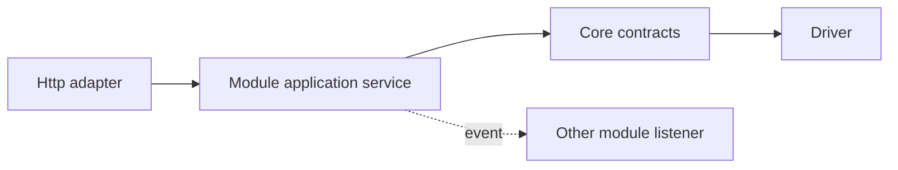

# Modulová architektúra PaginiumCMS

> **Interné moduly:** dôveryhodné balíky dodané s CMS v `backend/app/Modules/`  
> **Nie je to to isté ako:** externé plugins/extensions v `backend/app/Http/Extensions/`

Modul vlastní konkrétnu doménovú schopnosť a jej pravidlá. Core poskytuje platformu; HTTP vrstva adaptuje protokol; modul vykoná use-case. Pôvodný dokument bol prázdny, preto tento kontrakt zároveň pomenúva aktuálny prechodný stav a cieľ bez predstierania, že runtime inštalácia externých modulov je už hotová.

---

## 1. Kedy vytvoriť modul

Funkcionalita patrí do modulu, ak:

- reprezentuje samostatnú doménu alebo produktovú schopnosť,
- nemusí byť aktívna v každej inštancii,
- má vlastné repository/service/policy/use-cases,
- potrebuje vlastné permissions, settings, events alebo UI,
- dá sa testovať cez verejný kontrakt bez znalosti interných detailov iného modulu.

Príklady: Security users/auth, Media, Comments, Messages, Navigation, Audit, Demo, Gallery. Content/pages/articles sú dnes čiastočne v `Core/FlatFile` a HTTP vrstve; cieľom je jednoznačný Content application/module owner.

---

## 2. Typy rozšíriteľnosti

| Typ | Dôvera | Umiestnenie | Úloha |
|-----|--------|-------------|-------|
| Core service | vysoká | `backend/app/Core/` | platformové primitives |
| Internal module | vysoká | `backend/app/Modules/{Name}/` | doménová funkcionalita shipped s CMS |
| HTTP adapter | vysoká | `backend/app/Http/` | routes/controllers/middleware |
| Extension/plugin | obmedzená | `backend/app/Http/Extensions/{id}/` | voliteľný manifestom riadený kód |
| Theme | prezentačná | resources/frontend theme root | vzhľad bez doménového ownershipu |
| Driver/provider | úzky kontrakt | owner package/Infrastructure | technická implementácia storage/cache/providera |

Externý plugin sa nestáva interným modulom iba preto, že má viac súborov. Internal module môže používať plnú projektovú DI a CI dôveru; extension podlieha manifestu a code policy.

---

## 3. Odporúčaná štruktúra

```text
backend/app/Modules/Comments/
├── Contracts/
├── Models/
├── Repositories/
├── Services/
├── Policies/
├── Events/
├── Config/services.php
├── Resources/
├── Tests/              # alebo zrkadlo v backend/tests/Modules/
└── README.md
```

HTTP routes/controllers môžu zostať v centrálnej `Http/` vrstve, ak projekt zachová jasný owner a dependency direction. Alternatívne modul exportuje route registrar contract. Dôležité je, aby doménová logika nebola v route closure.

Frontend zrkadlí feature ownership napríklad v `frontend/src/features/` alebo `modules/`, ale nesmie kopírovať permission logiku ako jediný zdroj pravdy.

---

## 4. Povinnosti modulu

Každý modul má deklarovať:

- účel a hranice,
- verejné contracts/services,
- vlastnené dokumentové typy a storage keys,
- permissions/scopes,
- settings groups/fields,
- events, ktoré emituje alebo počúva,
- routes/API kontrakt,
- migration/versioning pravidlá,
- failure a rollback behavior,
- testy a ownera.

Modul nesmie „vlastniť“ celý `data/` adresár. Vlastní konkrétne logical keys a používa Core storage služby.

---

## 5. Závislosti



Pravidlá:

- modul importuje Core public interfaces,
- modul A neimportuje `ModuleB\Repositories\InternalRepository`,
- synchronná spolupráca používa explicitný public contract v neutrálnej/owning vrstve,
- voľná spolupráca používa event,
- shared model sa nevytvorí automaticky v Core; najprv sa overí, či naozaj ide o platformový koncept,
- circular dependencies sú zakázané.

---

## 6. Aktuálne dokumentované moduly

| Modul | Zodpovednosť | Stav/poznámka |
|-------|---------------|---------------|
| `Security` | users, session/auth, 2FA, OAuth, authorization/path ACL | implementovaný; hranica s `Core/Security` potrebuje konsolidáciu |
| `Media` | upload, registry, DAM/stock integration | implementovaný; storage driver It.72 rozšíri binárnu vrstvu |
| `Comments` | comment repository, moderation/policy | implementovaný podľa content workflow docs |
| `Messages` | contact messages | implementovaný základ |
| `Navigation` | menu tree/repository | implementovaný základ |
| `Audit` | audit/security report views | existuje; oddeliť od Core audit primitives |
| `Demo` | demo fixtures/reset/scheduler | implementovaná deployment-specific capability |
| `Gallery` | gallery repository/validation/public serialization | dodaná v neskoršej vlne podľa iteration docs |
| `Content` | pages/articles workflow | **nie je ešte samostatne extrahovaný**; transitional ownership |

Toto je dokumentačný snapshot, nie automaticky generovaný inventory. Pri finálnom QA sa má porovnať so skutočným stromom repozitára.

---

## 7. Module lifecycle

Interný modul shipped s aplikáciou má lifecycle:

1. code discovery/autoload,
2. deterministic DI registration,
3. route/application adapter registration,
4. settings/event catalog registration,
5. runtime use,
6. test/release upgrade.

Enable/disable interného modulu je bezpečné iba ak sú definované závislosti, public routes, data ownership a fallback. Nie každý interný modul musí byť runtime-toggleable.

**Externá runtime module installation je plánovaná architektonická téma**, odlišná od už existujúceho plugin import/enable flow. Dokumentácia ju nesmie označiť ako hotovú.

---

## 8. Storage ownership

Príklad logical ownership:

```text
content/pages/{id}
content/articles/{id}
comments/{contentId}/{commentId}
media/registry/{assetId}
security/users/{userId}
navigation/menus/{menuId}
```

Fyzická cesta je detail storage drivera. Modul pracuje s typed repository/document key. Pri rename/move/delete rieši referencie cez application workflow, nie regex replace naprieč celým storage rootom.

Module data musí byť zahrnutá do backup/export kontraktu alebo explicitne označená ako rebuildovateľná.

---

## 9. Settings a permissions

Modul registruje vlastnú schema group alebo namespaced fields. Permission catalog je centrálne agregovaný, ale owner definuje význam. Zmena permission názvu je breaking security change a potrebuje migráciu role mappings.

Public settings slice modulu je explicitný allow-list. Disable modulu nesmie nechať aktívne route, listener alebo public secret metadata.

---

## 10. Events

Modul emituje fakt po úspešnom doménovom stave, napríklad `CommentApproved` alebo `MediaUploaded`. Event payload používa ID/revision a minimálne metadata. Priame cross-module side effects sa presúvajú do listenera iba ak failure policy neporuší konzistenciu.

Plugin hook sa emituje cez centralizovaný `HookEmitter`, nie priamo z náhodnej repository. Detail: [EVENTS.md](./EVENTS.md).

---

## 11. HTTP a API

Controller:

- získa autentifikovaný actor/request context,
- mapuje input na command/query,
- zavolá module service,
- mapuje typed result/error na API envelope.

Modul service:

- kontroluje doménové permission/invarianty,
- používa repository/Core contracts,
- vytvára version/audit/event,
- nepozná React komponent ani konkrétny JSON responder.

API route ownership sa dokumentuje v `API.md` a contract tests chránia frontend/headless klientov.

---

## 12. Bezpečnosť

- deny-by-default permission,
- server-side validation,
- path/storage len cez Core,
- outbound cez SSRF policy,
- secrets cez Settings/EncryptionService,
- imports/uploads cez size/MIME/schema policy,
- background jobs s actor/service scope,
- žiadny generic shell alebo container access,
- module developer docs uvádzajú threat surface.

Security modul nie je jediný zodpovedný za bezpečnosť. Každý modul vlastní bezpečnosť svojich use-cases; Core poskytuje primitives a HTTP vrstva identity/gates.

---

## 13. Testing contract

Každý modul potrebuje:

- unit tests services/policies,
- repository contract tests,
- permission matrix,
- API integration tests,
- invalid/corrupt storage fixtures,
- event payload/failure tests,
- migration/rollback test pri schema zmene,
- module disable/unavailable behavior, ak je toggleable,
- frontend tests pre kritické workflow.

Test nesmie závisieť od produkčných settings alebo reálneho outbound providera.

---

## 14. Extrakcia Content modulu

Odporúčaný inkrementálny smer:

1. pomenovať application use-cases pre pages/articles,
2. zachovať existujúci API kontrakt,
3. obaliť `ContentRepositoryInterface` module-facing service,
4. presunúť status/publish/version orchestration mimo controllera,
5. zaviesť events a permissions contract tests,
6. až potom presúvať namespaces/súbory,
7. ponechať adapter/deprecation vrstvu do ďalšieho checkpointu.

Cieľom nie je kozmetický presun priečinkov, ale jasné ownership a testovateľná hranica.

---

## 15. Module Definition of Done

- README/owner/boundary sú jasné,
- žiadny import internals iného modulu,
- storage/settings/permissions sú namespaced a zdokumentované,
- routes volajú module service,
- events majú payload a failure policy,
- backup/migration/rollback sú definované,
- security a contract tests prešli,
- SK/EN dokumentácia je v parite.

---

## Súvisiace dokumenty

- [ARCHITECTURE.md](./ARCHITECTURE.md)
- [CORE.md](./CORE.md)
- [EVENTS.md](./EVENTS.md)
- [PLUGINS.md](./PLUGINS.md)
- [SETTINGS.md](./SETTINGS.md)
- [../developer/EXTENSION_CODE_POLICY.md](../developer/EXTENSION_CODE_POLICY.md)
