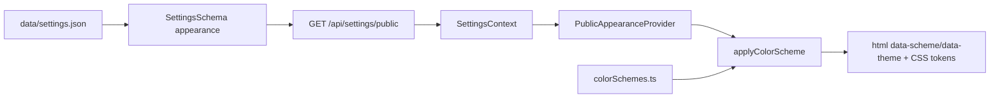

# Architektúra tém a verejného vzhľadu

> **Implementované:** sémantické CSS tokeny, päť farebných schém, light/dark/system režim, admin preview, branding logo/favicon.  
> **Plánované:** importovateľné theme balíky s manifestom, layout slotmi a vlastným lifecycle.

Slovo „téma“ sa v staršej dokumentácii používalo pre tri rozdielne veci. Tento dokument ich oddeľuje, aby farebná schéma nebola zamieňaná za plnohodnotný PHP/React balík.

---

## 1. Tri samostatné vrstvy

| Vrstva | Úloha | Stav |
|--------|-------|------|
| **Admin shell theme** | osobný light/dark vzhľad administrácie | ✅ implementované |
| **Public appearance** | site-wide tokeny, farebná schéma, režim a visitor toggle | ✅ implementované v It.58b |
| **Theme package** | inštalovateľný layout/component/asset balík | ⏳ cieľový kontrakt |

Admin a verejný web nepoužívajú rovnaký localStorage kľúč. Zmena verejnej schémy nesmie potichu zmeniť pracovné prostredie administrátora.

---

## 2. Implementovaný public appearance tok



| Vrstva | Zodpovednosť |
|--------|--------------|
| backend schema | validuje ID schémy a `light|dark|system` |
| public settings API | vystaví iba bezpečný appearance slice |
| `colorSchemes.ts` | zdroj pravdy pre preset tokeny |
| `applyColorScheme.ts` | nastaví atribúty, CSS variables a Tailwind `dark` class |
| `publicUiClasses.ts` | zdieľané sémantické UI triedy |
| admin panel | swatches a izolovaný preview rám |
| public UI | používa tokeny, nie natvrdo vložené farby |

PHP nastavenia ukladajú **ID schémy**, nie hex hodnoty presetov.

---

## 3. Nastavenia

| Kľúč | Predvolené | Význam |
|------|------------|--------|
| `appearance.colorScheme` | `indigo-classic` | ID z allow-list katalógu |
| `appearance.mode` | `system` | `light`, `dark` alebo `system` |
| `appearance.allowUserToggle` | `true` | návštevník môže prepnúť režim |
| `appearance.previewTemplate` | `hero-content` | admin preview profil; nie finálny layout engine |

Neznáma schéma sa odmietne alebo bezpečne fallbackne na default podľa schema policy. Klient nesmie prijať ľubovoľný názov CSS premennej zo servera.

---

## 4. Sémantické tokeny

Minimálny kontrakt:

```css
--color-primary
--color-primary-foreground
--color-secondary
--color-surface
--color-surface-elevated
--color-text
--color-text-muted
--color-accent
--color-border
```

Komponent používa význam tokenu, nie konkrétny preset:

```tsx
<button className="bg-theme-primary text-theme-primary-foreground">
  Uložiť
</button>
```

Nový token sa pridáva kompatibilne: schema/katalóg → defaults všetkých presetov → Tailwind mapping → komponenty → vizuálne a kontrastné testy.

---

## 5. Implementovaný preset katalóg

| ID | Charakter |
|----|-----------|
| `indigo-classic` | predvolená indigo schéma |
| `ocean-slate` | tyrkysová a slate |
| `forest-sage` | zelená a prírodné neutrálne farby |
| `sunset-rose` | ružová/teplá akcentová schéma |
| `mono-zinc` | minimalistická monochromatická schéma |

Kanonické hex hodnoty zostávajú v `frontend/src/theme/colorSchemes.ts`. Dokumentácia môže uvádzať príklady, ale nesmie byť druhým runtime zdrojom pravdy.

---

## 6. Branding nie je theme package

Logo, favicon a názov stránky sú site identity settings. Theme ich spotrebúva cez komponenty/sloty, ale nevlastní ich. Pri zmene schémy alebo budúcej témy sa branding nesmie stratiť.

Oddelené sú aj:

- login background,
- default Open Graph image,
- obsahové médiá,
- admin avatar,
- theme preview screenshot.

Detail: [BRANDING.md](../user/BRANDING.md).

---

## 7. Layout a theme package

Layout Builder z It.58c+ a theme package sú príbuzné, nie identické:

- **layout AST/template ID** určuje štruktúru konkrétnej stránky,
- **theme package** určuje renderer, slots, komponenty, token defaults a assety,
- **color scheme** mení token hodnoty,
- **branding** dodáva site identity assety.

Theme nesmie prepisovať autoritatívny obsah ani vytvoriť druhý content storage model.

---

## 8. Cieľový theme package kontrakt

Odporúčaná štruktúra:

```text
backend/resources/views/themes/{theme-id}/
├── theme.json
├── templates/
├── partials/
├── assets/
├── README.md
└── screenshot.webp

frontend/src/themes/{theme-id}/        # iba pri podporovanom build modeli
data/themes.json                       # plánovaný register
```

Príklad manifestu:

```json
{
  "manifestVersion": 1,
  "id": "clean-journal",
  "name": "Clean Journal",
  "version": "1.0.0",
  "minCmsVersion": "2.1.0",
  "slots": ["header", "main", "sidebar", "footer"],
  "templates": ["default", "article", "landing-page"],
  "supports": ["appearance-tokens", "branding", "navigation"]
}
```

Theme manifest nesmie obsahovať tajomstvá ani svojvoľný remote script URL.

---

## 9. Theme bezpečnostná politika

Budúci import theme balíka používa rovnaký fail-closed základ ako pluginy, ale s užším právomocným profilom:

- canonical path a Zip-Slip kontrola,
- povolené typy assetov a limity,
- template syntax check,
- zákaz `eval`, raw PHP a neobmedzených include ciest v nedôveryhodnej téme,
- HTML sanitizačné pravidlá pre editovateľné templates,
- CSP-compatible assety,
- zákaz tajomstiev a admin-only dát vo verejnom renderi,
- preview v izolovanom kontexte bez možnosti mutovať obsah.

Ak budú PHP templates povolené, téma už nie je „iba vzhľad“ a musí prejsť rovnakou trust review ako plugin. Bezpečnejší cieľ je deklaratívna template/AST vrstva a allow-listované helpery.

---

## 10. Theme lifecycle

Odporúčaný model:

```text
imported_disabled → previewable → active
active → previous_active|disabled
```

Aktivácia musí byť atomická z pohľadu site settings. Pred prepnutím:

1. overiť kompatibilitu a povinné sloty,
2. renderovať preview s testovacími fixtures,
3. skontrolovať branding/navigation/content fallbacks,
4. uložiť predchádzajúcu theme ID,
5. prepnúť aktívnu tému,
6. invalidovať odvodený HTML/cache build,
7. vykonať public smoke test,
8. rollbacknúť pri kritickej chybe.

Theme uninstall nesmie odstrániť aktívny balík bez predchádzajúceho bezpečného prepnutia na fallback.

---

## 11. Accessibility a kvalita

Každá schéma/téma musí overiť:

- kontrast textu a interaktívnych prvkov,
- keyboard focus a skip links,
- reduced motion,
- čitateľnosť pri 200 % zoom,
- obrázky s alt textom alebo dekoratívnym označením,
- správnu heading hierarchy,
- responzívny layout bez horizontálneho overflow,
- dark-mode formuláre, modaly a error states.

Farebný swatch nestačí ako QA. Potrebné sú representative pages a automatizované axe/visual smoke testy.

---

## 12. Cache, Git a Headless režim

Zmena appearance, brandingu, layoutu alebo aktívnej témy invaliduje relevantný render cache/index. V Git-headless režime sa settings/theme manifest a povolené assety publikujú cez rovnaký explicitný publish workflow ako ostatné autoritatívne súbory; zlyhaný push nesmie zrušiť lokálne uloženie.

Headless klient nesmie byť nútený používať React komponenty PaginiumCMS. Musí dostať stabilné theme/appearance metadata alebo vlastný renderer nad content API.

---

## 13. Mimo aktuálneho stavu

Zatiaľ nie je deklarované ako hotové:

- ZIP import a registry theme balíkov,
- theme marketplace,
- runtime načítanie ľubovoľného React theme bundle,
- bezpečný custom PHP theme sandbox,
- automatická migrácia layout AST medzi nekompatibilnými témami,
- vizuálny pixel-perfect builder.

Aktuálne UI pre farebné schémy sa preto nesmie v používateľskej dokumentácii prezentovať ako inštalátor tém.

---

## Súvisiace dokumenty

- [Používateľská príručka tém](../user/THEMES.md)
- [Branding](../user/BRANDING.md)
- [Pluginy](./PLUGINS.md)
- [Frontend](./FRONTEND.md)
- [Nastavenia](./SETTINGS.md)
- [Extension Code Policy](../developer/EXTENSION_CODE_POLICY.md)
