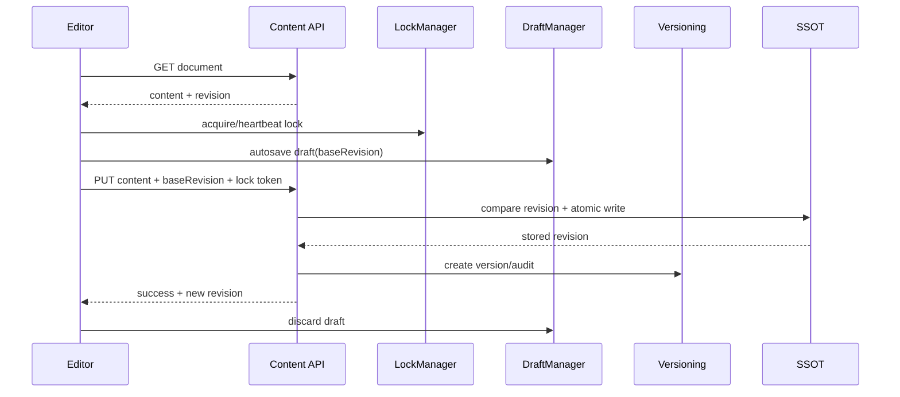

# Verzovanie, koncepty a riešenie konfliktov

> **Model:** Flat-file bez databázy  
> **Rozsah:** obsahový lifecycle od načítania editora po restore a publish

PaginiumCMS používa viac vrstiev ochrany, pretože žiadna samostatná technika nevyrieši súbeh, pád prehliadača, ľudskú chybu aj distribúciu. Locks znižujú pravdepodobnosť súbežnej úpravy, revision ju bezpečne deteguje, draft chráni rozpracovaný text, verzia umožní návrat a 3-way merge zachová obe vetvy zmien.

---

## 1. Kanonické pojmy

| Pojem | Význam |
|-------|--------|
| **Revision** | deterministický odtlačok aktuálneho dokumentu pre optimistic concurrency |
| **Base revision** | revision, z ktorej editor začal |
| **Lock** | dočasná lease na resource s ownerom, tokenom a heartbeat |
| **Draft** | oddelený auto-save pracovného obsahu |
| **Version** | nemenný historický snapshot a metadata zmeny |
| **Conflict** | serverový dokument už nezodpovedá base revision |
| **Merge** | kombinácia base, mine a theirs |
| **Restore** | vytvorenie novej live zmeny zo staršieho snapshotu; história sa nemaže |
| **Publish state** | stav distribúcie; nie je totožný so stavom uloženia dokumentu |

---

## 2. Editačný lifecycle



Lock je UX a coordination vrstva. Server musí revision skontrolovať aj pri platnom locku, pretože lock môže expirovať, klient môže stratiť heartbeat alebo starší klient lock nepoužívať.

---

## 3. Optimistic concurrency

Aktuálny `ContentRevision` kanonizuje front matter a počíta odtlačok z obsahu a metadata. Klient pošle `baseRevision`; nezhoda vyvolá konflikt HTTP 409 s aktuálnou serverovou verziou.

```text
GET /api/pages/o-nas
→ content + revision: "3f1c…"

PUT /api/pages/o-nas
→ baseRevision: "3f1c…"
→ 200, ak revision sedí
→ 409, ak server obsah medzitým zmenil
```

Dôležité:

- SHA-1 v aktuálnom riešení je iba stabilný concurrency fingerprint.
- Nie je to podpis, checksum backupu ani ochrana pred úmyselnou manipuláciou.
- Chýbajúci `baseRevision` je legacy compatibility režim; pre moderných klientov má byť warning/deprecation, nie odporúčaný flow.
- It.73 musí revision počítať nad kanonickým lokalizovaným dokumentom tak, aby zmena jednej locale nestratila zmenu druhej.

---

## 4. Pesimistické locks

Lock resource používa ID napríklad `page:o-nas`, owner ID, display name, secret token, `acquiredAt`, `lastHeartbeat` a `expiresAt`.

Pravidlá:

- registry read-modify-write je pod `flock`,
- expired locks sa čistia pri prístupe,
- token dostane iba owner pri acquire a neobjaví sa v zozname pre iných,
- force unlock je auditovaná admin operácia,
- lock TTL pochádza zo settings a má bezpečné limity,
- lock nikdy neoprávňuje používateľa; RBAC sa kontroluje samostatne.

---

## 5. Auto-save drafty

Draft sa ukladá do `data/drafts/{type}/{slug}.json` a obsahuje aspoň typ, slug, pracovný content, `baseRevision`, ownera a čas. Je oddelený od live/published súboru.

Lifecycle:

1. editor načíta live dokument a prípadný vlastný draft,
2. pri zmene uloží draft v intervale zo settings,
3. po reopen ponúkne restore/diff, nie slepé prepísanie,
4. úspešný live save draft zahodí,
5. konflikt alebo save failure draft ponechá,
6. retention job odstraňuje staré drafty podľa policy a auditu.

Draft iného používateľa sa nesmie sprístupniť iba na základe znalosti slugu.

---

## 6. Version history

História je uložená vo flat-file `data/versions/`. Pri relevantnej mutácii vzniká snapshot s identitou objektu, typom akcie, actorom, časom, revision a voliteľnou správou.

Odporúčané akcie:

- create,
- update,
- status/publish change,
- delete/restore,
- locale Apply,
- AI/translation Apply,
- manual restore.

Samotné otvorenie editora alebo auto-save draftu nemá zaplavovať live version history. Draft môže mať samostatnú obmedzenú históriu, ak sa neskôr pridá.

---

## 7. Diff a 3-way merge

Pri konflikte sú tri vstupy:

- **base** — pôvodne načítaný dokument,
- **mine** — lokálne zmeny používateľa,
- **theirs** — aktuálny serverový dokument.

```text
ak mine == base → použi theirs
ak theirs == base → použi mine
ak mine == theirs → použi jeden výsledok
inak → konfliktný blok na manuálne rozhodnutie
```

Frontend `ConflictResolver` môže ponúknuť Mine, Theirs, Both alebo ručnú úpravu. Po merge sa výsledok uloží voči **serverRevision**, nie starej base revision. Ak server medzitým zmenil obsah znova, vznikne nový 409; klient nesmie force-overwrite bez explicitnej privilegovanej operácie.

YAML/front matter sa nemá spájať iba riadkovým textovým merge, ak schema pozná typy polí. Cieľom je field-aware merge metadata a line/block-aware merge Markdown body.

---

## 8. Restore

Restore nie je prepis histórie. Postup:

1. používateľ zvolí starší snapshot,
2. systém zobrazí diff voči live dokumentu,
3. skontroluje permission, lock a aktuálnu revision,
4. vytvorí nový live zápis z vybraného snapshotu,
5. vytvorí novú verziu typu `restore`, audit a event,
6. invaliduje index/cache,
7. voliteľný publish sa vykoná samostatne.

Takto je možné obnovu znovu vrátiť a audit zostáva úplný.

---

## 9. Delete a trash

Soft delete vytvorí verziu/audit pred presunom do trash. Restore z trash rieši kolíziu cieľového slugu a nesmie prepísať nový dokument bez conflict flow. Permanent purge vyžaduje vyššie oprávnenie, potvrdenie a policy pre súvisiace versions/media references.

---

## 10. Lokalizácia, preklad a AI

Plán It.73–77 pridáva pravidlá:

- translation/AI výsledok je **proposal**, nie live verzia,
- Apply vytvorí normálnu content verziu s provider/tool metadata bez tajomstiev,
- zmena locale zachová ostatné locale a kontroluje revision celého kanonického dokumentu,
- fallback locale sa neukladá ako falošne preložený obsah,
- automatický publish po Apply je mimo základného flow,
- prompt alebo provider response sa neukladá do auditu celý, ak obsahuje citlivé dáta.

---

## 11. Git publish a verzovanie

Content version a Git commit sú dve odlišné osi:

- content version vzniká pri lokálnom SSOT zápise,
- Git commit/push môže prebehnúť okamžite alebo neskôr v queue,
- zlyhaný push nemení úspešný lokálny revision,
- publish job nesie idempotency key a revision, ktorú distribuuje,
- UI rozlišuje `stored`, `pending_publish`, `committed`, `pushed`, `publish_failed`.

Git history nenahrádza interné versioning API, najmä pri draftoch, user ACL a inštanciách bez Gitu.

---

## 12. Retention a integrita

Retention sa nastavuje podľa typu a regulácie. Minimálne pravidlá:

- nikdy neodstrániť poslednú známu dobrú verziu počas failed migration,
- purge robiť pod lockom a auditovať počet odstránených snapshotov,
- version file validovať pred zobrazením alebo restore,
- poškodený snapshot neignorovať tichým fallbackom,
- backup zahŕňa versions podľa deklarovanej policy,
- tajomstvá sa v snapshot metadata redigujú alebo šifrujú.

---

## 13. Testy

Povinné scenáre:

- deterministická revision a zmena pri relevantnom obsahu,
- stale `baseRevision` → 409,
- lock acquire/heartbeat/expiry/force unlock,
- draft ownership a restore po páde,
- auto-merge neprekrývajúcich sa zmien,
- manuálny konflikt a opakovaný server conflict,
- restore vytvorí novú verziu,
- index/cache invalidácia,
- locale-aware zmena bez straty inej locale,
- zlyhaný Git publish nezruší local save.

---

## Súvisiace dokumenty

- [STORAGE.md](./STORAGE.md)
- [CONTENT_API.md](./CONTENT_API.md)
- [CORE_HARDENING.md](./CORE_HARDENING.md)
- [ITERATION_73](../ITERATION_73.md)
- [ITERATION_70](../ITERATION_70.md)
