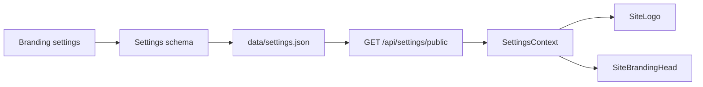

# Logo, favicon a identita stránky

> **Cesta:** **Nastavenia → Stránka → Logo a favicon**  
> Deep link: `/settings?category=site&group=branding`

Branding je identita inštancie PaginiumCMS. Nie je súčasťou konkrétnej farebnej schémy ani budúceho theme balíka, takže má zostať zachovaný pri zmene vzhľadu, layoutu alebo režimu nasadenia.

---

## 1. Polia a použitie

| Pole | Kľúč | Použitie |
|------|------|----------|
| Logo stránky | `branding.logoUrl` | verejný Navbar, admin sidebar a maintenance shell |
| Favicon | `branding.faviconUrl` | `<link rel="icon">` v prehliadači |
| Názov stránky | `general.siteName` | textová identita a fallback vedľa/pod logom |

Súvisiace, ale oddelené nastavenia:

| Asset | Kľúč | Poznámka |
|-------|------|----------|
| Login background | `login.backgroundImageUrl` | pozadie auth obrazoviek |
| Default OG image | `seo.defaultImage` | sociálne siete a preview odkazu |
| Obsahové médiá | media registry | obrázky článkov/stránok, nie branding |

---

## 2. Odporúčaný zdroj assetu

Preferované poradie:

1. asset vybraný z PaginiumCMS Media Library,
2. lokálna verejná cesta spravovaná nasadením,
3. HTTPS URL z dôveryhodného CDN/domény.

Externá URL pridáva závislosť na cudzej dostupnosti, CSP, CORS/referrer pravidlách a ochrane súkromia. `http://` asset na HTTPS stránke môže prehliadač zablokovať ako mixed content.

Do brandingu nevkladaj `file://`, `data:text/html`, `javascript:` ani internú admin URL s tokenom. URL helper musí allow-listovať bezpečné schémy a normalizovať lokálne `media/…` alebo `/storage/…` cesty.

---

## 3. Odporúčané formáty

| Asset | Formát | Odporúčanie |
|-------|--------|-------------|
| Logo | SVG, WebP, PNG | transparentné pozadie; šírka typicky do 512–1024 px |
| Favicon | SVG, PNG, ICO | aspoň 32×32; pripraviť aj 180×180 pre budúci apple-touch profil |

SVG je ostré a malé, ale musí prejsť bezpečným media sanitizačným/serving flow. Neznáme SVG môže obsahovať aktívne prvky alebo externé referencie; neobchádzaj upload validáciu ručným kopírovaním.

Veľký originál sa môže zbytočne načítavať na každej stránke. Logo optimalizuj, odstráň metadata, zachovaj pomer strán a over transparentnosť.

---

## 4. Nastavenie cez administráciu

1. Otvor **Nastavenia → Stránka → Logo a favicon**.
2. Pri požadovanom poli zvoľ:
   - **Vybrať z médií**,
   - **Nahrať z disku**,
   - alebo vlož bezpečnú URL.
3. Skontroluj preview.
4. Ulož zmeny.
5. Over verejný web, administráciu, login a maintenance stránku.
6. Favicon skontroluj aj v novom anonymnom okne.

Media picker alebo upload musí používať existujúce media API a jeho MIME/size/magic-byte pravidlá. Branding field nesmie vytvoriť druhú nevalidovanú upload cestu.

---

## 5. Technický tok

| Vrstva | Zodpovednosť |
|--------|--------------|
| `SettingsSchema` branding group | typ, dĺžka a URL/path validácia |
| `SettingsController::publicSettings()` | safe public slice bez secretov |
| `BrandingImagePicker.tsx` | media picker/upload UI |
| `brandingUrl.ts` | normalizácia podporovaných ciest |
| `SiteLogo.tsx` | logo + textový fallback |
| `SiteBrandingHead.tsx` | runtime favicon update |

Fallback v `frontend/index.html` poskytne ikonu pri prvom paint. Po načítaní settings ju runtime komponent nahradí.

---

## 6. Fallback správanie

Ak asset nie je nastavený alebo sa nenačíta:

- logo použije predvolenú značku/ikonu a `general.siteName`,
- favicon zostane na bezpečnom bundled fallbacku,
- stránka nesmie spadnúť ani zobraziť broken-image layout,
- alt/accessibility text vychádza z názvu stránky, nie z názvu súboru.

Theme alebo plugin nesmie odstrániť fallback iba preto, že očakáva vlastný asset.

---

## 7. Light/dark kompatibilita

Jedno transparentné logo nemusí fungovať na oboch povrchoch. Pred uložením over:

- svetlé logo na tmavom aj svetlom headeri,
- tmavé logo v dark režime,
- monochromatickú verziu,
- malú výšku v mobilnom navbar-e,
- kontrast focus/hover okolo klikateľného loga.

Aktuálny jednoduchý kontrakt používa jedno `logoUrl`. Samostatné `logoLightUrl`/`logoDarkUrl` sú možné budúce rozšírenie schémy, nie dnešná garantovaná funkcionalita.

---

## 8. Cache a favicon

Prehliadače favicon agresívne cachujú. Po zmene:

1. otvor novú súkromnú kartu,
2. skús hard refresh,
3. over response URL cez DevTools Network,
4. skontroluj, či CDN/proxy nevracia starý asset,
5. pri rovnakom názve použi versioned media URL alebo nový asset ID,
6. v static/Git publish profile spusti príslušnú invalidáciu alebo publish.

Nesprávny favicon po minúte nie je automaticky backend bug — občas je to prehliadač, ktorý sa svojej ikonky drží ako sysadmin starého dobrého `vi` 😄.

---

## 9. Bezpečnosť a súkromie

- externý obrázok môže odhaliť IP/referrer návštevníka tretej strane,
- SVG a MIME sa validujú server-side,
- settings API zverejňuje iba URL, nikdy lokálnu private storage cestu,
- URL nesmie obsahovať access token/query secret,
- admin preview nesmie fetchovať internú RFC1918/localhost URL cez backend proxy,
- outbound image import musí používať SSRF policy,
- upload a zmena settings sa auditujú podľa admin policy.

---

## 10. Riešenie problémov

| Symptóm | Kontrola |
|---------|----------|
| logo sa nezobrazí | URL, 404/403, CSP, mixed content, media permission |
| logo funguje v admin, nie public | public settings slice a public asset route |
| favicon zostal starý | browser/CDN cache, rovnaká URL, `SiteBrandingHead` mount |
| relatívna cesta je zlá | `media/…` vs `/storage/…`, base URL a reverse proxy prefix |
| logo je deformované | pomer strán, pevná width/height v theme/plugin komponente |
| SVG bolo odmietnuté | bezpečnostná validácia; použi sanitizované SVG alebo WebP/PNG |
| po zmene vznikla 500 | skontroluj settings JSON validitu a backend log; nepokračuj ručným editom bez zálohy |

---

## Súvisiace dokumenty

- [Vzhľad a farebné schémy](THEMES.md)
- [Architektúra tém](../architecture/THEMES.md)
- [Architektúra nastavení](../architecture/SETTINGS.md)
- [Médiá a administrácia](ADMIN_GUIDE.md)
- [Prvé kroky](FIRST_STEPS.md)
