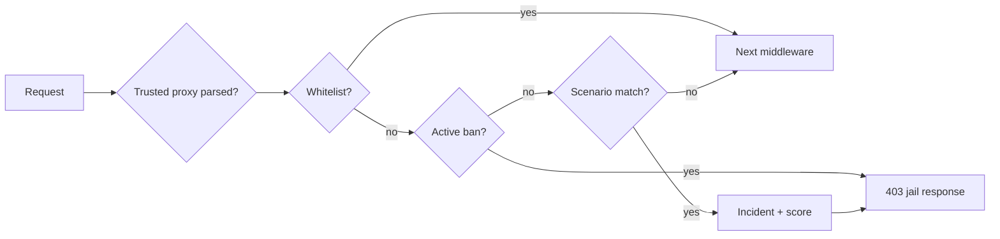

# Firewall (WAF) — príručka administrátora

> Interný PHP WAF je doplnková aplikačná ochrana. Nenahrádza aktualizovaný reverse proxy, TLS, rate limiting, bezpečné uploady, host firewall ani monitoring.

## 1. Rozsah

WAF typicky kontroluje request pred routingom a môže:

- prepustiť dôveryhodnú whitelist IP,
- odmietnuť aktívny jail alebo permanentný ban,
- rozpoznať definovaný probe v URI/query/User-Agent,
- zapísať incident a eskalovať skóre,
- vrátiť 403 ešte pred API JSON handlerom.

Preto frontend nesmie predpokladať, že každá 403 odpoveď je JSON.

## 2. Poradie requestu



Presné middleware poradie over integračným testom, pretože Slim/LIFO registrácia môže byť pri čítaní konfigurácie mätúca.

## 3. Scenáre

Typické built-in scenáre:

| ID | Príklad |
|---|---|
| `wp_probe` | `/wp-admin`, `/wp-login.php`, `/xmlrpc.php` |
| `env_probe` | `/.env`, `/.git/`, backup config názvy |
| `path_traversal` | `../` alebo encoded variant v URL |
| `sql_probe_uri` | očividný SQL probe v URI/query |
| `bad_bot_ua` | prázdny alebo zakázaný User-Agent podľa policy |

Scenár nie je univerzálny detektor útoku. Regex nad telom editorového POST by mohol blokovať legitímny článok obsahujúci bezpečnostný príklad; preto scope musí byť explicitný.

## 4. Jail a eskalácia

| Nastavenie | Účel |
|---|---|
| `jailMinutes` | trvanie dočasného jailu |
| `maxRetries` | incidenty pred jailom v definovanom okne |
| `permanentThreshold` | počet jail cyklov pred permanentným banom |
| `jailMode` | `forbidden`, `empty` alebo obmedzený `tarpit` |
| `tarpitSeconds` | krátke oneskorenie; spotrebúva PHP/FPM worker |
| `logRetention` | limit incident ring bufferu |

Na produkcii preferuj rýchly 403 pred tarpitom v PHP. Tarpit môže lacnému botovi umožniť draho obsadiť tvoje workery — veľmi zlý obchod.

## 5. Whitelist

Whitelist obchádza scenáre a ban, preto:

- pridávaj iba stabilné dôveryhodné adresy,
- dokumentuj vlastníka a dôvod,
- nastav expiry mimo systému, ak UI expiry nepodporuje,
- pravidelne odstraňuj staré VPN/kancelárske IP,
- nepridávaj na whitelist celú CDN iba kvôli jednej false positive.

Pri dynamickej domácej IP je bezpečnejšie upraviť scenár alebo použiť admin VPN než udržiavať široký rozsah.

## 6. Reverse proxy a klientská IP

`TRUSTED_PROXIES` musí obsahovať iba proxy, ktoré skutočne nastavujú klientsku IP. Ak dôveruješ ľubovoľnému requestu s `X-Forwarded-For`, útočník si môže zvoliť adresu alebo obísť ban. Ak nedôveruješ vlastnému proxy, WAF môže banovať proxy a odstaviť všetkých návštevníkov.

Po nasadení over jednu požiadavku v access logu, WAF incidente a aplikačnom kontexte.

## 7. Úložisko a súbežnosť

Flat-file bans/incidents/whitelist musia používať lock a atomický zápis. Poškodený JSON nesmie viesť k tichému fail-open bez alertu. Recovery má zachovať pôvodný súbor, vytvoriť validný nový stav a zapísať audit/event.

Tieto súbory nesmú byť verejne dostupné cez web server ani súčasťou verejného support ZIP-u.

## 8. Admin workflow

Typické obrazovky:

- `/firewall` — incidenty, aktívne a permanentné bany, whitelist,
- Nastavenia → Firewall — master switch a prahy.

Mutácie vyžadujú privilegovanú rolu, 2FA podľa policy a CSRF pri session autentifikácii. Manuálny ban/unban/whitelist musí byť auditovaný.

## 9. API kontrakt

Konkrétny release môže ponúknuť endpointy pre stats, incidents, bans a whitelist. Klient musí zvládnuť:

- stránkovanie a total,
- 404 pri už neexistujúcom bane,
- 409 pri súbežnej zmene podľa kontraktu,
- plain-text alebo prázdnu WAF 403,
- validáciu IP/CIDR formátu.

Presné endpointy over v [API dokumentácii](../architecture/API.md).

## 10. Vzťah k ostatným vrstvám

| Vrstva | Rieši |
|---|---|
| WAF | známe aplikačné probe scenáre a IP jail |
| Rate limit | frekvenciu requestov na route/identity/IP |
| Login lockout | opakované auth zlyhania |
| Host firewall | sieťové porty a zdrojové siete |
| Reverse proxy | TLS, limity, headers, statické cesty |
| Security middleware | CSP/HSTS a ďalšie response policy |
| Audit/logging | dôkazy a diagnostiku |

Jedna vrstva nesmie byť vypnutá s argumentom, že „veď máme WAF“.

## 11. False positive

Pri legitímnom blokovaní:

1. zachovaj incident ID, čas, IP a scenario ID,
2. over skutočnú klientsku IP,
3. unban iba konkrétnu adresu,
4. reprodukuj request na stagingu,
5. uprav najužší scenár alebo limit,
6. pridaj regresný test,
7. whitelist použi až ako poslednú odôvodnenú možnosť.

## 12. Núdzové odblokovanie

Ak je admin zabanovaný:

- preferuj server/VPN prístup z druhej dôveryhodnej cesty,
- zapni maintenance, ak ručne meníš súbory,
- zálohuj bans/whitelist JSON,
- oprav iba konkrétny záznam a validuj JSON,
- reštartuj/reloadni runtime podľa potreby,
- prihlás sa, obnov policy a skontroluj audit.

Nevypínaj firewall natrvalo a nezverejňuj storage súbor cez web ako „dočasnú diagnostiku“.

## 13. Testovanie

Bezpečný smoke test na vlastnej inštancii:

```bash
curl -i https://cms.example.test/wp-login.php
```

Očakávanie závisí od prahu: okamžitý incident alebo 403/jail. Potom over, že bežný `/api/health` a editorový save zostávajú funkčné z nezabanovanej adresy.

## 14. Súvisiace dokumenty

- [Logy](LOGGING.md)
- [Core hardening](../architecture/CORE_HARDENING.md)
- [API kontrakt](../architecture/API_CONTRACT.md)
- [Inštalácia](INSTALLATION.md)
