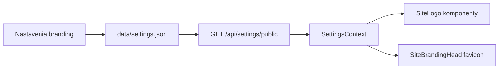

# Logo a favicon

> **Kde v admin paneli:** Nastavenia → kategória **Stránka** → **Logo a favicon** (`/settings?category=site&group=branding`)

Vlastné logo a favicon sa nastavujú cez flat-file nastavenia a zobrazujú sa na verejnom webe aj v administrácii.

---

## Polia

| Pole | Kľúč | Kde sa zobrazí |
|------|------|----------------|
| **Logo stránky** | `branding.logoUrl` | Verejný Navbar, admin sidebar, maintenance stránky (Coming Soon / Údržba) |
| **Favicon** | `branding.faviconUrl` | Ikona v karte prehliadača (`<link rel="icon">`) |

Oba polia akceptujú:

- absolútnu URL (`https://…`)
- cestu z médií (`/storage/app/content/media/…`)
- relatívnu cestu `media/…` (po výbere z knižnice)

---

## Ako nastaviť

1. Otvor **Nastavenia → Stránka → Logo a favicon**.
2. Pri každom poli:
   - **Vybrať z médií** — otvorí `MediaPickerModal`
   - **Nahrať z disku** — upload cez existujúce media API
   - alebo vlož URL ručne
3. **Uložiť zmeny** (tlačidlo hore v Nastaveniach).

Odporúčania:

| Asset | Formát | Veľkosť |
|-------|--------|---------|
| Logo | PNG, SVG, WebP | šírka do ~512 px, transparentné pozadie |
| Favicon | ICO, PNG, SVG | min. 32×32 px |

---

## Technický tok

| Vrstva | Súbor |
|--------|--------|
| Schéma | `backend/app/Core/Settings/SettingsSchema.php` → skupina `branding` |
| Verejné API | `SettingsController::publicSettings()` → `branding.logoUrl`, `branding.faviconUrl` |
| FE picker | `BrandingImagePicker.tsx` |
| Logo UI | `SiteLogo.tsx` — Navbar, AdminSidebar, MaintenanceShell |
| Favicon | `SiteBrandingHead.tsx` — mount v `main.tsx` |
| URL helper | `frontend/src/utils/brandingUrl.ts` |

Ak logo/favicon nie je nastavené, zobrazí sa **predvolená ikona** (gradient + raketa) a názov stránky z **Všeobecné → Názov stránky**.

---

## Fallback v `index.html`

Súbor `frontend/index.html` obsahuje emoji favicon pre prvý paint pred načítaním Reactu. Po načítaní `SettingsContext` ho `SiteBrandingHead` prepíše hodnotou z nastavení.

---

## Súvisiace nastavenia

| Téma | Skupina | Poznámka |
|------|---------|----------|
| Názov webu | `general.siteName` | Text vedľa loga |
| Login pozadie | `login.backgroundImageUrl` | Samostatné od loga |
| OG obrázok | `seo.defaultImage` | Sociálne siete, nie favicon |

---

## Súvisiace dokumenty

- [architecture/SETTINGS.md](../architecture/SETTINGS.md)
- [ADMIN_GUIDE.md](ADMIN_GUIDE.md) — Nastavenia
- [FIRST_STEPS.md](FIRST_STEPS.md) — prvé kroky po inštalácii
