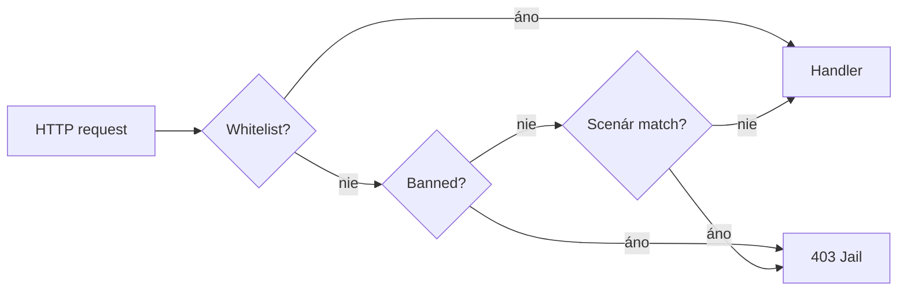

# Firewall (WAF) — príručka administrátora

> **Iterácia 50** — interný Web Application Firewall priamo v PaginiumCMS (PHP), bez externého nginx ModSecurity.

## Čo firewall robí

Firewall beží **pred** Slim routingom a rate limitom. Každá HTTP požiadavka prejde týmito krokmi:

1. Je IP na **whiteliste**? → prepustiť
2. Je IP **zabanovaná** (jail alebo trvalý ban)? → HTTP 403
3. Zodpovedá URI, query alebo User-Agent **známemu scenáru útoku**? → zalogovať incident, eskalovať ban, HTTP 403
4. Inak → normálne spracovanie (Čašník → Kuchár)




## Kde to nájdete v administrácii


| Miesto                     | URL / cesta                             |
| -------------------------- | --------------------------------------- |
| Prehľad incidentov a banov | **Admin → Firewall** (`/firewall`)      |
| Pokročilé parametre        | **Admin → Nastavenia → Firewall (WAF)** |
| Dokumentácia               | tento súbor                             |


Sidebar zobrazuje badge s počtom **aktívnych jailov** (`firewall_jails`).

## Vstavané scenáre

Scenáre sú definované v `backend/config/firewall_scenarios.php` (OPcache, bez I/O per request):


| ID               | Popis                       | Príklad                                     |
| ---------------- | --------------------------- | ------------------------------------------- |
| `wp_probe`       | Sken WordPressu             | `/wp-admin`, `/wp-login.php`, `/xmlrpc.php` |
| `env_probe`      | Únik secrets                | `/.env`, `/.git/`, `/config.php.bak`        |
| `path_traversal` | Directory traversal         | `../`, `%2e%2e/` v URI alebo query          |
| `sql_probe_uri`  | SQLi probe v URL            | `UNION SELECT`, `OR 1=1` v query/URI        |
| `bad_bot_ua`     | Prázdna User-Agent hlavička | bot bez identifikácie                       |


**Dôležité:** regex sa **neaplikuje** na telo POST požiadavky (obsah článkov v editore). Skenuje sa len URI, query string a User-Agent.

## Nastavenia (skupina `firewall`)


| Kľúč                 | Predvolene  | Význam                                           |
| -------------------- | ----------- | ------------------------------------------------ |
| `enabled`            | `true`      | Master prepínač WAF                              |
| `jailMinutes`        | `15`        | Dĺžka dočasného jailu                            |
| `maxRetries`         | `3`         | Počet incidentov v okne pred jailom              |
| `permanentThreshold` | `3`         | Po koľkých jail cykloch → trvalý ban             |
| `jailMode`           | `forbidden` | `forbidden` | `empty` | `tarpit`                 |
| `tarpitSeconds`      | `0`         | Oneskorenie pred 403 (max 2 s, len pri `tarpit`) |
| `logRetention`       | `500`       | Max. incidentov v súbore                         |


Verejný web vidí len `firewall.enabled` (bez IP a ban detailov).

### Režimy jail odpovede


| Režim       | Správanie                                                    |
| ----------- | ------------------------------------------------------------ |
| `forbidden` | HTTP 403 + text „Access denied“ (odporúčané)                 |
| `empty`     | HTTP 403 + prázdne telo                                      |
| `tarpit`    | `sleep(N)` pred 403 — spomaľuje botov, **zaberá FPM worker** |


## Úložisko (flat-file)


| Súbor                                   | Obsah                             |
| --------------------------------------- | --------------------------------- |
| `data/security/firewall/bans.json`      | Bany, sin skóre, recent incidenty |
| `data/security/firewall/incidents.json` | Ring buffer audit logu            |
| `data/security/firewall/whitelist.json` | Trvalá whitelist IP               |


Zápis cez `flock(LOCK_EX)` — rovnaký princíp ako login lockout alebo `settings.json`.

## Admin API

Vyžaduje rolu **ADMIN** alebo **SUPER_ADMIN** + 2FA (ak je zapnuté).


| Metóda | Endpoint                             | Popis                                      |
| ------ | ------------------------------------ | ------------------------------------------ |
| GET    | `/api/admin/firewall/stats`          | Štatistiky (jaily, permanent, 24 h)        |
| GET    | `/api/admin/firewall/incidents`      | Zoznam incidentov (`?limit=&offset=`)      |
| GET    | `/api/admin/firewall/bans`           | Bany (`?all=1` vrátane expirovaných)       |
| POST   | `/api/admin/firewall/bans`           | Manuálny ban `{ ip, permanent?, reason? }` |
| DELETE | `/api/admin/firewall/bans/{ip}`      | Unban                                      |
| GET    | `/api/admin/firewall/whitelist`      | Zoznam whitelist IP                        |
| POST   | `/api/admin/firewall/whitelist`      | Pridať IP `{ ip }`                         |
| DELETE | `/api/admin/firewall/whitelist/{ip}` | Odstrániť z whitelistu                     |


## Odporúčaná prevádzka


### Reverse proxy

Ak bežíte za nginx, nastavte `TRUSTED_PROXIES` v `.env` (rovnako ako pre rate limit). Bez toho sa berie `REMOTE_ADDR` proxy a WAF môže banovať nesprávnu IP.

Príklad:

```env
TRUSTED_PROXIES=127.0.0.1,::1,192.168.1.x # Zmeniť IP podľa vlastnych parametrov siete.
```


### Kancelárska / monitoring IP

Zdieľaná verejná IP (NAT) alebo monitoring bez User-Agent môže spôsobiť false positive pri `bad_bot_ua`. Riešenie:

1. Pridajte IP na **whitelist** v `/firewall`
2. Alebo dočasne zvýšte `maxRetries`
3. Alebo vypnite scenár v `firewall_scenarios.php` (`enabled => false`)


### Vypnutie WAF

**Nastavenia → Firewall → Zapnúť firewall** = OFF, alebo `firewall.enabled = false` v `settings.json`.

Testy (`APP_ENV=testing`) firewall automaticky obchádzajú.

## Vzťah k ostatným vrstvám


| Modul                  | Čo rieši                      | Čo neerieši      |
| ---------------------- | ----------------------------- | ---------------- |
| **Firewall (It.50)**   | Probe URI, traversal, jail IP | Obsah POST body  |
| **Rate limit**         | Počet requestov/min           | Scenáre útokov   |
| **Login lockout**      | Brute-force prihlásenie       | `wp-admin` probe |
| **SecurityMiddleware** | CSP, HSTS hlavičky            | Blok IP          |


## Riešenie problémov


| Problém                                    | Riešenie                                                                               |
| ------------------------------------------ | -------------------------------------------------------------------------------------- |
| Legitímny používateľ blokovaný             | Whitelist IP alebo Unban v `/firewall`                                                 |
| Admin sa nedostane (vlastná IP zabanovaná) | Upraviť `bans.json` / `whitelist.json` na disku alebo dočasne `firewall.enabled=false` |
| Veľa incidentov z jednej CDN IP            | Whitelist edge IP alebo vyšší `maxRetries`                                             |
| FPM pomalý pri tarpit                      | Nastaviť `jailMode=forbidden`, `tarpitSeconds=0`                                       |


## Súvisiace dokumenty

- [ITERATION_50.md](../ITERATION_50.md) — technická špecifikácia
- [CORE_HARDENING.md](../architecture/CORE_HARDENING.md) — It.20 (RBAC, maintenance, login lockout)
- [ADMIN_GUIDE.md](ADMIN_GUIDE.md) — index admin dokumentácie

